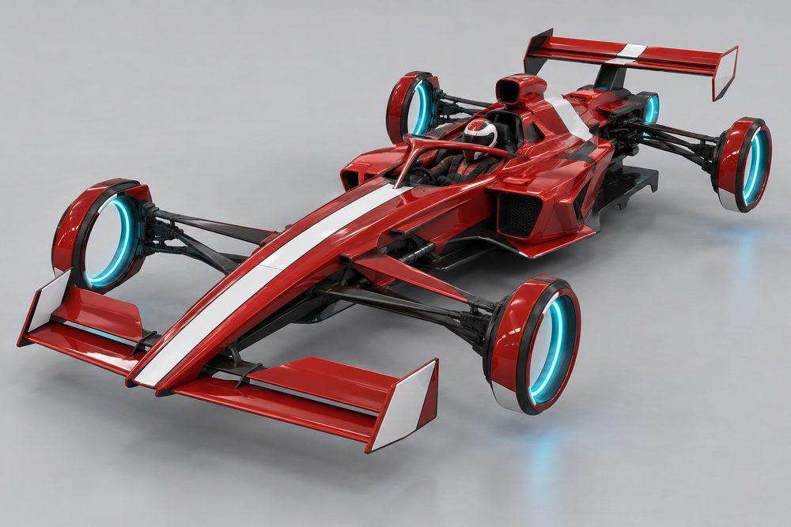
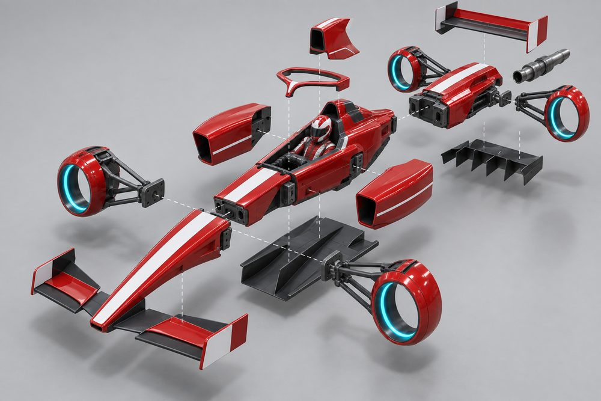
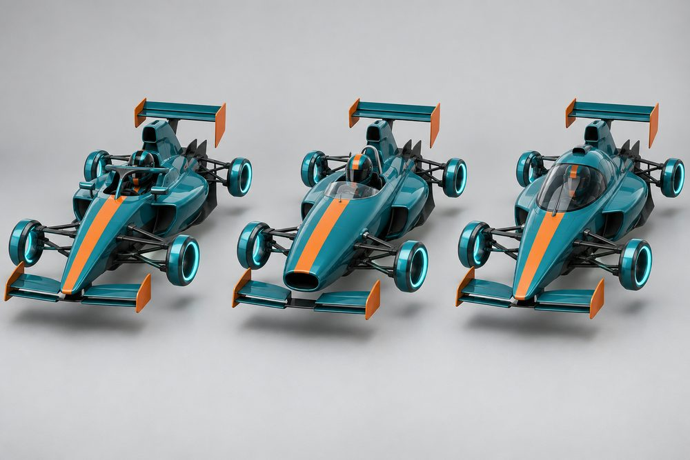
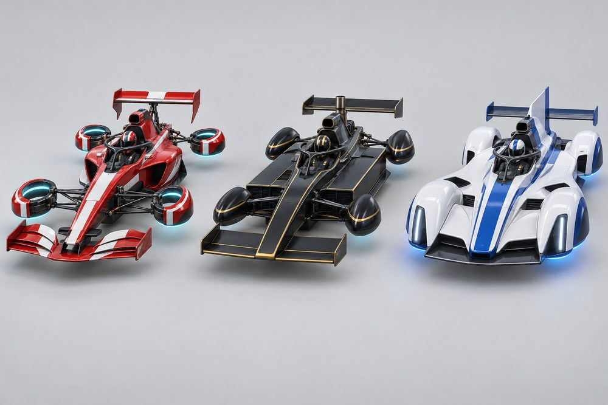
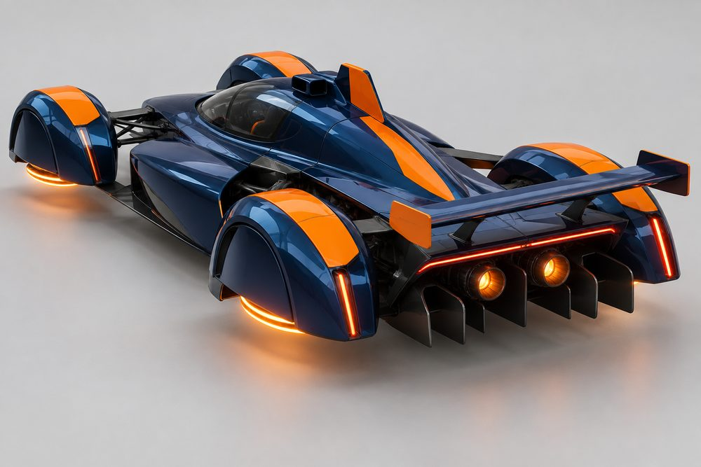
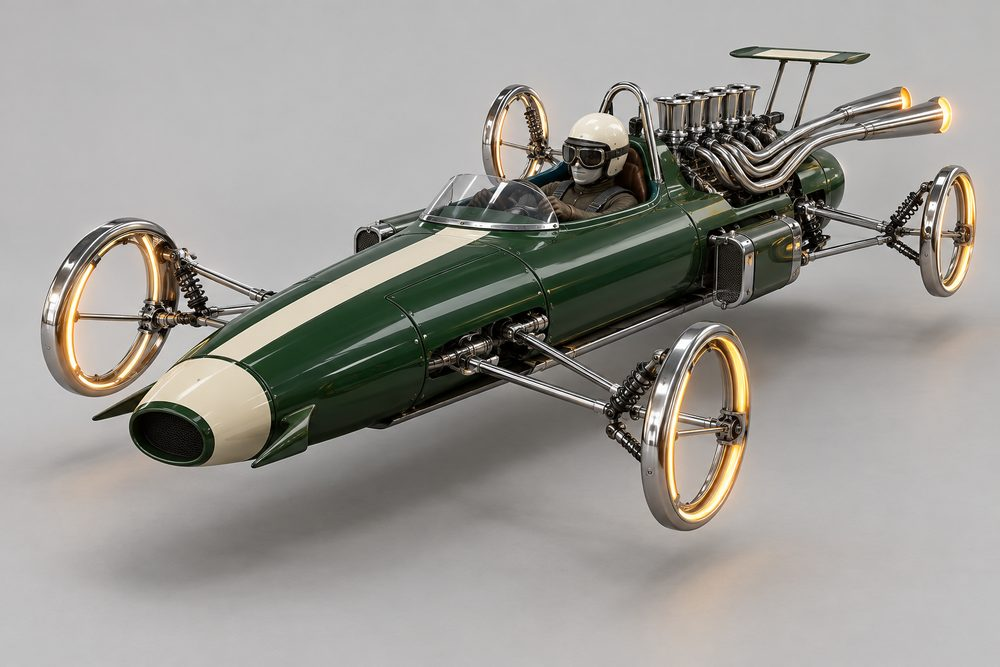
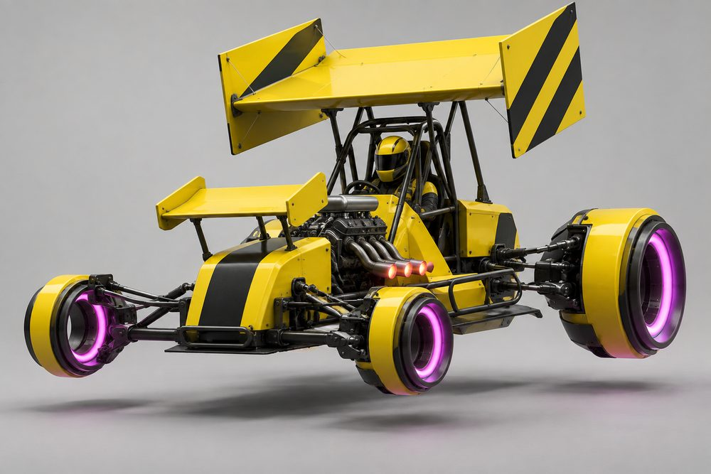
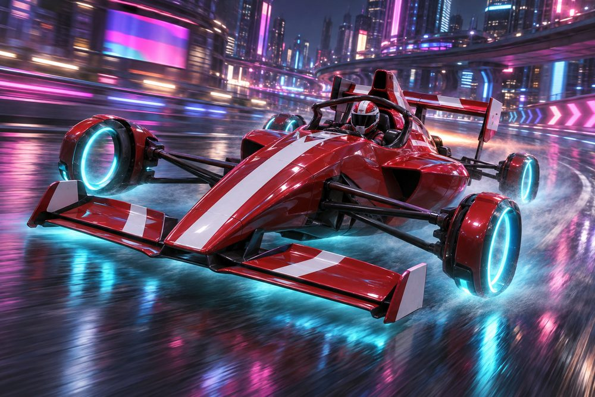

# Apex: class sheet

Status: design exploration, 2026-10-01. Not approved, not game content. Frame rules are in [the exploration contract](../../../scripts/vehicle_blockouts/CONTRACT.md). Proposed `CategoryId`: `apex`.

## Pitch

Circuit racers turned into hover racers. A narrow central tub, four hover pods held out on wishbones where the wheels were, and wings at both ends. About 15 W x 5.5 H x 28 L studs.

**Player fantasy:** you are the one in the proper racing car. You brake later than everyone, carry more speed through the corner and leave on the clean line. The car is light and exposed, so you win with precision, not contact.

## Culture lines

- **Formula:** modern open cockpit with halo, needle nose, complex wings.
- **Vintage Grand Prix:** 60s cigar tube, chrome wishbones, exposed intake stacks.
- **Prototype:** endurance racer with bubble canopy, enclosed pod arches and light clusters.
- **Wing Car:** 80s ground-effect wedge with long skirted sidepods and a turbo stack.
- **Speedway Sprint:** upright roll cage, staggered pods and an enormous top wing.

## Cockpits

| Name | Culture | Silhouette | Tier |
|---|---|---|---|
| Cigar | Vintage Grand Prix | Round tube, tiny windscreen, low roll hoop | E |
| Sprint | Speedway Sprint | Short tub, tall tubular cage, upright driver | D |
| Oval | Speedway Sprint | Low offset tub, high cockpit sides | C |
| Wingcar | Wing Car | Flat wedge tub, driver far forward | B |
| Formula | Formula | Narrow angular tub, driver reclined | A |
| Prototype | Prototype | Wider tub with closed teardrop cabin | S |

## Slots and modules

| Slot id | Player label | Modules (look) |
|---|---|---|
| `Engine1` | Front Pods | **Open Rings** (hubless glowing hoops); **Faired Pods** (smooth teardrops); **Prototype Arches** (pods under fender arches with light strips); **Vintage Wires** (thin chrome hoops with wire stays) |
| `Engine2` | Power Unit | **V-Cover** (slim engine cover, shark fin); **Turbo Stack** (boxy cover, upright turbo pipe); **Prototype Tail** (long tail, light bar); **Sprint Rear** (exposed block, fuel tank tail); **Open Stacks** (bare engine, eight chrome trumpets) |
| `Stabilisers` | Floor | **Flat Floor** (plain plank); **Venturi Tunnels** (two sculpted tunnels); **Bargeboards** (vertical vanes beside the tub); **Skid Rails** (sprint nerf rails) |
| `SidePods` | Sidepods | **Coke Bottle** (wide inlet, tight waist); **Zero Pod** (almost nothing, bare flank); **Radiator Boxes** (small boxes or drums on the flanks); **Skirted** (full-length slab pods with sliding skirts) |
| `Boost` | Exhaust | **Single Exit** (one central pipe); **Twin Megaphone** (two flared chrome cones); **Blown Diffuser** (slots that fire into the diffuser); **Zoomie Headers** (short curved side pipes) |
| `FrontBumper` | Nose and Wing | **Needle Nose** (slim nose, wide wing); **High Nose** (raised nose on pylons); **Snowplough** (broad shovel, full-width wing); **Radiator Nose** (round open mouth, dive fins) |
| `RearBumper` | Diffuser | **Shallow** (short fins); **Deep Tunnel** (tall fins, big tunnels); **Extractor Fan** (round fan in the tail) |
| `RearSpoiler` | Rear Wing | **Low Drag** (thin single blade); **High Downforce** (tall, deep endplates); **Twin Plane** (two stacked blades); **Sprint Top Wing** (huge slab over the cage with side panels) |
| `Hood` | Airbox | **Tall** (periscope intake); **Split** (twin low inlets); **Roll Hoop** (bare hoop, no intake) |
| `Roof` | Halo or Canopy | **Halo** (slim hoop); **Aeroscreen** (wraparound screen with frame); **Bubble Canopy** (closed teardrop glass); **Sprint Cage** (tubular cage) |

Slot ids and labels follow the contract. Added modules: Open Stacks, Skid Rails, Zoomie Headers, Extractor Fan, Sprint Cage.

## Handling intent against Piercer

Design intent only. `++` strong gain, `+` gain, `=` similar, `-` loss, `--` strong loss.

| Stat | Bias | Intent |
|---|---|---|
| TopSpeed | - | Wings cost speed on long straights. |
| Acceleration | + | Light car, strong launch out of corners. |
| Braking | ++ | The class signature. Brakes much later. |
| BoostForce | - | Small engine. Boost is a tool, not a weapon. |
| BoostDuration | = | Similar length, lower peak. |
| DriftControl | -- | Hard to hold a long slide. |
| DriftGrip | + | Snaps back to grip quickly, so drifts stay short. |
| LateralGrip | ++ | Corners on rails. |
| SteeringResponse | + | Quick and precise, less twitchy than a bike. |
| HoverStability | - | Low and stiff. Bumps and kerbs unsettle it. |
| Downforce | ++ | Highest in the game. Grip rises with speed. |
| Drag | + | More drag than Piercer. High Downforce wing adds more. |
| Weight | -- | Lightest car class. Loses every shove. |

Module trade inside the class: Low Drag wing and Zero Pod lean towards TopSpeed. High Downforce, Venturi Tunnels and Deep Tunnel lean towards grip and braking.

## What makes it fun to own

1. **Full-kit names.** Matching culture tags across all ten slots earn a build title: *Works Entry* (Formula), *Garagiste* (Vintage Grand Prix), *All-Nighter* (Prototype), *Ground Effect* (Wing Car), *Dirt Outlaw* (Speedway Sprint). A mixed build is a *Privateer Special*.
2. **Active aero.** The rear wing flap opens while boosting and slams shut under braking. Front wing flaps twitch with steering. This is the class's signature motion.
3. **Pods that work.** Pods lean into corners on their wishbones and the arms visibly travel over bumps. Idle in the garage, the rings spin up one by one.
4. **Plank sparks and diffuser fire.** At top speed the floor throws sparks. Lifting off the throttle pops flame through the Blown Diffuser.
5. **Stripe-first liveries.** Paint presets built for long thin bodies: centre stripe, nose band, endplate blocks, half-and-half split, chequer wing and a bare carbon *test day* scheme. An extra-bright *flow-vis* smear paint is a rare find.
6. **Helmet as a cosmetic.** The driver is visible in every open tub, so helmet colour and pattern are an Apex-only customisation line. The halo takes the Neon channel.
7. **Race-earned parts.** A contact-free win unlocks Low Drag. A lap record gives purple pod glow until the session ends. Winning a night endurance event unlocks Prototype Arches with selectable light colours. Circuit podiums unlock endplate shapes.
8. **Photo moments.** Grid-slot start with lights overhead. A pit-stand pose with the nose off and pods on covers. Kerb-skimming apex shots with sparks. A podium pose after circuit races.

## Gallery

*01 Hero. Formula culture, all ten slots: Needle Nose, Open Rings, Coke Bottle sidepods, Tall airbox, Halo, V-Cover, High Downforce wing, diffuser.*

*02 Exploded. Formula tub with every slot pulled off: Nose and Wing, Front Pods, Sidepods, Halo, Airbox, Power Unit (carrying the rear pods), Exhaust, Rear Wing, Diffuser, Floor.*

*03 One kit, three cockpits. Left Formula, centre Cigar, right Prototype. Same Formula kit and paint. The Halo or Canopy slot follows each cockpit.*

*04 One cockpit, three kits. Formula tub with Halo. Left Formula kit, centre Wing Car kit (Snowplough, Skirted, Faired Pods, Turbo Stack), right Prototype kit (Prototype Arches, Prototype Tail).*

*05 Prototype, rear. Bubble Canopy, Prototype Arches, Prototype Tail with fin, Split airbox, Low Drag wing, Deep Tunnel diffuser, Twin Megaphone exhaust.*

*06 Vintage Grand Prix. Cigar cockpit, Vintage Wires, Radiator Nose, Open Stacks, Twin Megaphone, Radiator Boxes, Roll Hoop.*

*07 Speedway Sprint. Sprint cockpit, Sprint Cage, Sprint Top Wing, Sprint Rear, Zoomie Headers, staggered Open Rings, Skid Rails.*

*08 Action. The hero Formula build at speed in the city at night.*

## Risks and open points

- **Rings can read as wheels.** Upright hoops at the corners look like wheels from a distance. Keep the centre empty, the rim thin and the glow strong. Vintage Wires is the highest risk. Flat-lying rings (image 04, left) are an alternative stance.
- **Who owns the rear pods?** The art puts them on the Power Unit, so `Engine2` changes them. The alternative is one Pods slot for all four. The frame agent should decide.
- **Roof slot against cockpit identity.** Cockpit names assume a roof (halo, bubble, cage). If Halo or Canopy is a free slot, every tub must be an open tub that accepts all four roof modules.
- **Sprint Top Wing height.** It sits far above the 5.5-stud class height. The Rear Wing envelope must reach over the Roof and Airbox envelopes without overlapping them.
- **Thin parts.** Wishbones and wing struts need a minimum thickness to survive low-poly and distance. Collision should use a simple box, not the arms.
- **Width in traffic.** 15 studs wide with a light body. "Fragile" must feel fair: lose shoves, but do not snag pods on scenery.
- **Single seat.** No passenger seat, so passenger jobs need a rule: excluded, or a passenger pod module.
- **Liveries without numbers or sponsors.** Race cars can look bare. Stripe and block presets must carry the look.
- **Stat meanings.** DriftGrip and HoverStability biases assume higher means more grip and more stability. Check against live tuning before use.
- **Art drift.** Image 06 is more realistic than the house style. Image 03's centre car gained a round nose intake that is not in the shared kit.
