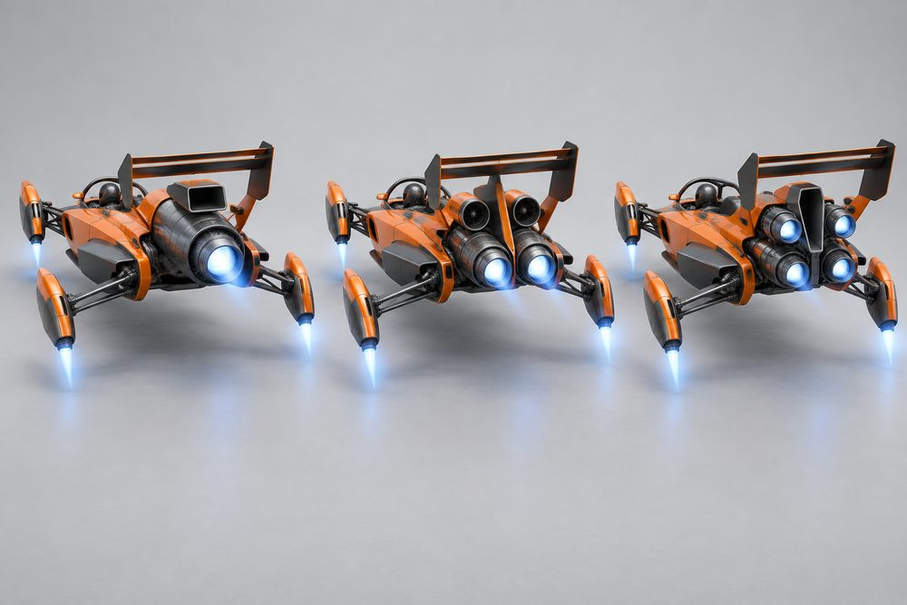
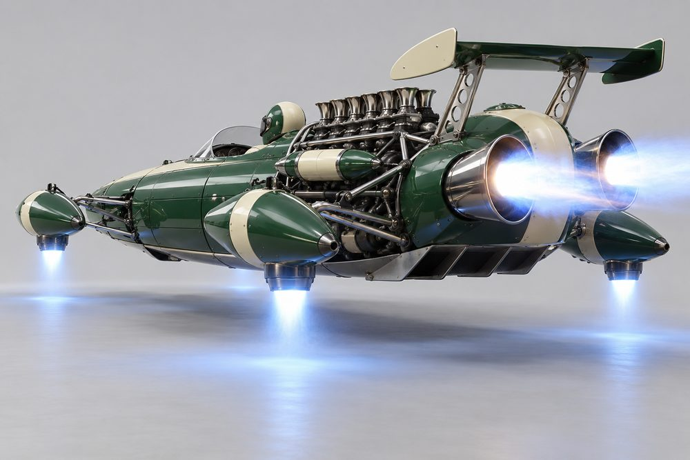
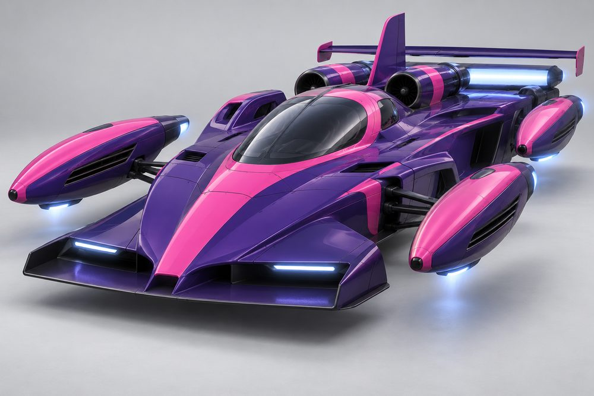

# Apex: class sheet (round 2)

Status: design exploration, round 2, 2026-10-01. Not approved, not game content. Rules are in [the exploration contract](../../../scripts/vehicle_blockouts/CONTRACT.md). The blockout is described in [apex-frame.md](apex-frame.md). Proposed `CategoryId`: `apex`. Round 1 art is kept in `output/vehicle-categories-2026-10-01/apex/v1/`.

## Pitch

Circuit racing cars as hover jets. A narrow central tub with the driver low and reclined. Where the wheels were, four slender thruster nacelles hang on thin wishbone arms. A jet power unit sits behind the driver, with wings at both ends. Nothing is round: every pod is a long bullet with a nozzle. The blockout is about 14 W x 7 to 8 H x 28 L studs.

**Player fantasy:** you are the one in the proper racing car. You brake later than everyone, carry more speed through the corner and leave on the clean line. The car is light and exposed, so you win with precision, not contact.

## Culture lines

- **Formula:** modern open cockpit with halo, needle nose and complex wings.
- **Vintage Grand Prix:** 60s cigar tube, chrome wishbones and exposed intake trumpets.
- **Prototype:** endurance racer with a closed canopy and enclosed teardrop arches.
- **Wing Car:** 80s ground-effect wedge with long skirted sidepods and a turbo slot.
- **Speedway Sprint:** upright roll cage, staggered stacks and an enormous top wing.

## Cockpits

| Name | Culture | Silhouette | Signature kit | Tier |
|---|---|---|---|---|
| Cigar | Vintage Grand Prix | Round tube hull, open cockpit, tiny screen | Garagiste | E |
| Sprint | Speedway Sprint | Upright cage, tall driver, tank tail | Dirt Outlaw | D |
| Oval | Speedway Sprint | Low offset tub, high cockpit sides | None yet (not built) | C |
| Wingcar | Wing Car | Flat wedge, driver far forward, periscope airbox | Ground Effect | B |
| Formula | Formula | Narrow angular tub, halo, reclined driver | Works | A |
| Prototype | Prototype | Wide closed teardrop canopy, long fastback | All-Nighter | S |

## The fundamentals

Every build has all four. Each one is open jet hardware with an intake, a body and a nozzle, visible from the chase camera or from above.

| Slot id | Player label | Where it sits | Options (look) |
|---|---|---|---|
| `Engine1` | Power Unit | On the engine deck behind the driver, nozzle out of the tail | **Works Turbine** (one big barrel, square intake, long nozzle); **Stack Eight** (exposed block, eight chrome trumpets, megaphone nozzles); **Twin Spool** (two slim turbines side by side, tall fin between); **Turbo Slot** (turbo box, flat duct, wide slot nozzle); **Quad Cluster** (four small jets round a tall scoop) |
| `Engine2` | Shoulder Jets | A pair on top of the sidepods, beside the driver | **Shoulder Turbines** (short square-mouth turbines); **Ram Bullets** (bullet jets with pointed intake cones); **Slot Ducts** (flat slot-shaped ducts); **Turbo Stacks** (short upright turbo stacks); **Twin Shorties** (stubby twin jets) |
| `Stabilisers` | Corner Thrusters | Four corners, outboard on wishbones, nozzles down and back | **Vector Pods** (slender nacelles with swivelling nozzles); **Bullet Outriggers** (pointed bullets on chrome wishbones); **Arch Fairings** (closed teardrop fairings, side vent, rear nozzle); **Vane Cascades** (glowing burner sheet under stacked vanes); **Stagger Stacks** (short stacked pods at different heights) |
| `Boost` | Afterburner | On the rear face of the engine deck, under and beside the main nozzle | **Twin Cans** (two cans set high); **Twin Megaphones** (two flared cones, splayed); **Slot Burner** (full-width burning slot); **Staged Triple** (three nozzles in a stepped row); **Zoomie Stacks** (upswept pipes that fire upward) |

## Body and cosmetic slots

| Slot id | Player label | Options (look) |
|---|---|---|
| `FrontBody` | Nose | **Needle Nose** (long slim point); **Radiator Mouth** (round open mouth); **Shovel Nose** (wide scoop); **Chisel Nose** (low flat wedge); **Grille Hood** (blunt, upright grille) |
| `RearBody` | Engine Deck | **Coke Bottle** (very slim waist); **Tube Cradle** (open tube frame); **Long Tail** (long smooth fairing); **Tunnel Deck** (flat deck with tunnels); **Tank Tail** (fat fuel-tank tail) |
| `SidePods` | Sidepods | **Undercut** (wide inlet, tucked underneath); **Pannier Tanks** (small tanks on the flanks); **Sponsons** (slim blade pods); **Skirted** (full-length slabs with skirts); **Nerf Bars** (bare tubular rails) |
| `FrontBumper` | Front Wing | **Cascade Wing** (many-element wing, tall endplates); **Chin Blade** (blade under the nose); **Splitter** (broad flat shelf); **Plank Wing** (one flat plank); **Nerf Bumper** (tube bumper) |
| `RearBumper` | Diffuser | **Strake Diffuser** (short fins); **Belly Pan** (flat pan); **Long Extractor** (long upswept channels); **Venturi Tunnels** (two sculpted tunnels); **Push Bar** (bare bar) |
| `RearSpoiler` | Rear Wing | **High Downforce** (tall two-element, deep endplates); **High Strut** (wing on tall struts); **Low Drag Blade** (thin single blade); **Twin Plane Box** (two stacked planes in a box); **Sprint Top Wing** (huge slab over the cage, side panels) |
| `Roof` | Cabin (reserved) | Not built. The cockpit owns the halo, canopy and cage. Future roof trim would sit in the reserved cabin box. |

## Signature kits

Every kit fits every cockpit. The kit sets the culture; the cockpit sets the cabin.

| Kit | Culture | Native cockpit | What makes it look different |
|---|---|---|---|
| Works | Formula | Formula | One big turbine, needle nose, high twin cans, many-element wings |
| Garagiste | Vintage Grand Prix | Cigar | Eight chrome trumpets, bullet outriggers, splayed megaphones, open tube cradle |
| All-Nighter | Prototype | Prototype | Twin turbines with a fin, closed arch fairings, full-width slot burner, long tail |
| Ground Effect | Wing Car | Wingcar | Flat wedge, skirted slabs, turbo slot, stacked vane cascades, boxy twin-plane wing |
| Dirt Outlaw | Speedway Sprint | Sprint | Quad jet cluster, upswept zoomie stacks, nerf bars and bumpers, huge top wing |

## Handling intent against Piercer

Design intent only. `++` strong gain, `+` gain, `=` similar, `-` loss, `--` strong loss.

| Stat | Bias | Intent |
|---|---|---|
| TopSpeed | - | Wings and small engines cost speed on long straights. |
| Acceleration | + | Light car, strong launch out of corners. |
| Braking | ++ | The class signature. Brakes much later. |
| BoostForce | - | Small engines. Boost is a tool, not a weapon. |
| BoostDuration | = | Similar length, lower peak. |
| DriftControl | -- | Hard to hold a long slide. |
| DriftGrip | + | Snaps back to grip quickly, so drifts stay short. |
| LateralGrip | ++ | Corners on rails. |
| SteeringResponse | + | Quick and precise, less twitchy than a bike. |
| HoverStability | - | Low and stiff. Kerbs and bumps unsettle the thrusters. |
| Downforce | ++ | Highest in the game. Grip rises with speed. |
| Drag | + | More drag than Piercer. A High Downforce wing adds more. |
| Weight | -- | Lightest car class. Loses every shove. |

Module trade inside the class:
- Works Turbine, Low Drag Blade and Slot Burner lean towards TopSpeed and BoostForce.
- Quad Cluster leans towards Acceleration.
- High Downforce, Venturi Tunnels and Long Extractor lean towards grip and braking.
- Vector Pods lean towards SteeringResponse. Vane Cascades lean towards HoverStability.

## What makes it fun to own

1. **Full-kit names.** Matching all ten slots to one kit earns a title: *Works Entry*, *Garagiste*, *All-Nighter*, *Ground Effect*, *Dirt Outlaw*. A mixed build is a *Privateer Special*.
2. **Working thrusters.** Nacelles lean into corners on their wishbones and the arms flex over kerbs. Vector Pod nozzles swing back under braking. In the garage the four thrusters spool up one by one.
3. **Active aero.** The rear wing flap opens while boosting and slams shut under braking. Front wing flaps twitch with steering.
4. **Count your jets.** The chase camera shows your Power Unit: one barrel, two spools or four jets. Rivals read your build from behind.
5. **Boost signatures.** Twin Cans throw shock diamonds, Slot Burner draws a sheet of flame, Zoomie Stacks fire straight up. Lifting off pops flame through Staged Triple.
6. **Stripe-first liveries.** Paint presets for long thin bodies: centre stripe, nose band, endplate blocks, half-and-half split, chequer wing and a bare carbon *test day* scheme. A rare *flow-vis* smear paint. No numbers, no logos.
7. **Helmet as a cosmetic.** The driver is visible in every tub, so helmet colour and pattern are an Apex-only customisation line. The halo takes the Neon channel.
8. **Race-earned parts.** A contact-free win unlocks Low Drag Blade. A lap record gives purple thruster glow until the session ends. A night endurance win unlocks Arch Fairings with selectable light colours.

## Gallery

*01 Hero. Formula cockpit, Works kit: Needle Nose, Cascade Wing, Undercut sidepods, Coke Bottle deck, Works Turbine, Shoulder Turbines, Vector Pods, Twin Cans, Strake Diffuser, High Downforce wing. Crimson and cream.*

*02 Exploded. Formula cockpit with every Works slot pulled away: Nose, Front Wing, Sidepods, Shoulder Jets, four Corner Thrusters on wishbones, Engine Deck, Power Unit, Afterburner, Diffuser, Rear Wing.*

*03 One kit, three cockpits. Left Formula (open, halo), centre Cigar (round tube hull, small screen), right Prototype (closed canopy and fin). All wear the Works kit in the same paint. Only the cabin changes. Regenerated to make the cabins easier to tell apart.*

*04 One cockpit, three kits. Formula cockpit in yellow and black. Left Works kit, centre Ground Effect (Chisel Nose, Plank Wing, Skirted, Tunnel Deck, Turbo Slot, Turbo Stacks, Vane Cascades, Staged Triple, Twin Plane Box), right Dirt Outlaw (Grille Hood, Nerf Bumper, Nerf Bars, Quad Cluster, Stagger Stacks, Zoomie Stacks, Sprint Top Wing). Regenerated so every nacelle is a torpedo shape. The Vane Cascades read here as thin fins on long nacelles, not stacked slats; the Dirt Outlaw nacelles are the short, stubby set.*

*05 Engines. Formula cockpit, Works kit, rear view, orange and graphite. Only `Engine1` changes: Works Turbine (left), Twin Spool (centre), Quad Cluster (right).*

*06 Stabilisers and boost. Cigar cockpit, Garagiste kit: Bullet Outriggers firing down and back, Twin Megaphones firing, Stack Eight, Ram Bullets, Tube Cradle, Pannier Tanks, High Strut wing. Green and cream.*

*07 Prototype. Prototype cockpit, All-Nighter kit: Shovel Nose, Splitter, Sponsons, Slot Ducts, closed Arch Fairings, Twin Spool, Slot Burner, Long Tail, Low Drag Blade. Violet and hot pink.*

*08 Action. The hero Formula and Works build at speed in a neon-lit city at night.*

## Risks and open points

- **Nacelles can read as wheels.** Keep every pod long, pointed and clearly nozzled. Image 04 was regenerated because the first version showed boxy, louvred pods that read as wheels. Check a real mesh from the front, where a pod is seen end-on.
- **Prototype arches are the highest risk.** An enclosed arch invites a wheel. Keep it blanked, louvred and carrying a visible nozzle, as in image 07.
- **Vane Cascades are the least thruster-like.** A glowing burner sheet under vanes. Judge them in game lighting.
- **Cockpit distinctness is at the floor.** The shared tub and pads give every top view the same plan (0.25 against a 0.25 target). The cabin carries the difference, and a softer real mesh could fall under.
- **Oval is not built.** It needs its own kit and a cabin unlike Sprint, or the sixth slot in the tier ladder goes.
- **Decks differ mostly in plan.** Coke Bottle is very slim, so wide sidepods from another kit show a step at the rear bulkhead. Slim tubs show daylight to the sidepods on purpose.
- **Height and width.** The blockout is 7 to 8 studs high, above the 5.5 in the contract. Sprint Top Wing is the tallest part. 14 studs wide in traffic means fragile must feel fair: lose shoves, but do not snag nacelles on scenery.
- **Thin parts.** Wishbones and wing struts need a minimum thickness to survive low poly and distance. Collision should use a simple box, not the arms.
- **Single seat.** No passenger seat, so passenger jobs need a rule: excluded, or a passenger module.
- **Liveries without numbers or sponsors.** Race cars can look bare. Stripe and block presets must carry the look.
- **Stat meanings.** DriftGrip and HoverStability biases assume higher means more grip and more stability. Check against live tuning before use.
- **Art drift.** The images are concepts, not the blockout. Image 06 is more realistic than the house style and is nearer side-on than rear. Image 05 shows no separate afterburner cans. Image 04 shows the Vane Cascades as fins, not stacked slats.
