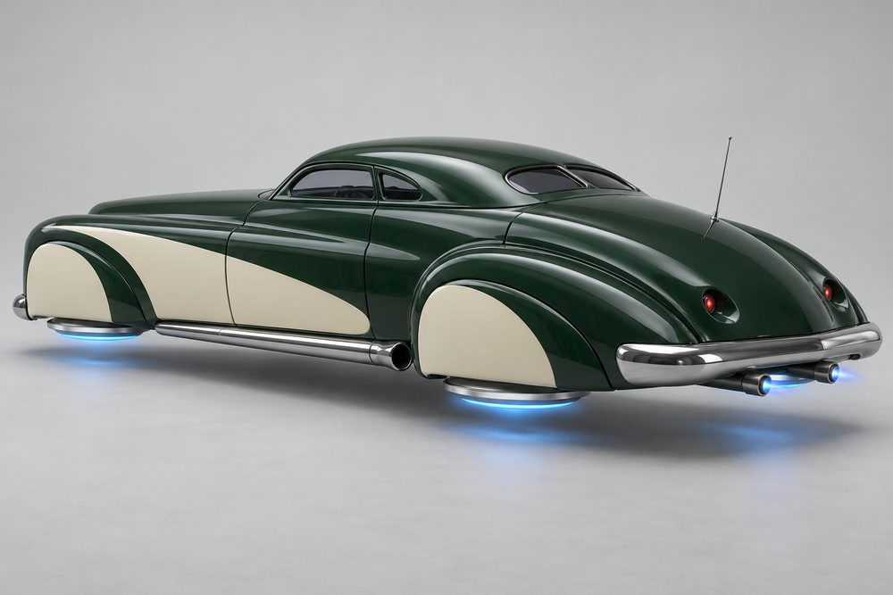
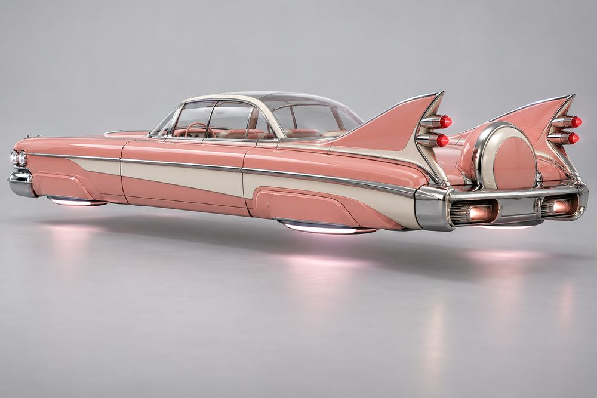

# Cruiser: class sheet

Status: design exploration, 2026-10-01. Not approved, not game content. Brief: [exploration contract](../../../scripts/vehicle_blockouts/CONTRACT.md). Proposed `CategoryId`: `cruiser`.

## Pitch

Long, low land yachts turned into hover cars. A very long bonnet, a low roof and a long boot deck. Four hover rotors lie flat under the body, mostly hidden by fender skirts. They are styled as wire wheels or whitewall discs, and their glow on the road is what tells you the car floats. About 11 W x 6 H x 34 L studs: as long as Rift, much narrower, and lower than Street.

**Player fantasy:** "I am not racing you. I am arriving." Cruiser is the show car. It is heavy, smooth and fast in a straight line. It is the only class that looks its best going slowly, tilted on three corners under a neon sign. The paint, the chrome and the stance are the build.

## Culture lines

- **Lowrider:** 60s pillarless hardtops. Candy and flake paint, gold pinstripes, wire discs, tilted three-corner stance.
- **Lead Sled:** chopped late-40s coupés. Frenched lamps, shaved trim, lake pipes, one smooth heavy shape.
- **Fin Era:** late-50s jet age. Tall tail fins, bullet tail lamps, bubble top, chrome everywhere.
- **VIP:** boxy 90s luxury saloons. Slammed and level, deep-dish discs, black and pale gold.
- **Kaido Racer:** wild 70s coupés. Shark nose, external oil cooler, towering exhaust stacks, huge wing.

## Cockpits

| Name | Culture | Silhouette | Tier |
|---|---|---|---|
| VIP | VIP | Boxy four-door saloon, upright rear window | E |
| Longroof | Lowrider | Long flat wagon roof, thin pillars | D |
| Hardtop | Lowrider | 60s pillarless two-door, thin flat roof | C |
| Sled | Lead Sled | Chopped rounded coupé, slit windows | B |
| Kaido | Kaido Racer | 70s fastback coupé, thin pillars | A |
| Finliner | Fin Era | Clear bubble dome, wraparound glass | S |

## Slots and modules

Slot ids are the canonical ones. Labels are what the player sees. "(added)" marks a module that is not in the contract roster.

| Slot id | Label | Modules |
|---|---|---|
| `Engine1` | Front Clip | **Quad Lamp:** four round lamps in a full-width grille. **Frenched:** lamps sunk into smooth tunnels, no trim. **Stacked Lamp:** square nose, stacked rectangular lamps, upright grille. **Shark Nose:** long point that leans forward, lamps under a brow. |
| `Engine2` | Rear Deck | **Bat Fins:** low horizontal wing fins across the tail. **Bullet Tail:** tapered tail with round rocket-nozzle lamps. **Shaved Deck:** long, flat and smooth. **Boxy Trunk:** square, upright, full-width lamp bar. |
| `Stabilisers` | Hover Rotors | **Wire Discs:** chrome wire-spoke faces. **Whitewall Discs:** white ring, chrome centre cap. **Deep Dish:** polished shallow bowls. **Smoothie Caps (added):** plain painted disc, small chrome cap. |
| `SidePods` | Flanks | **Fender Skirts:** full covers over the rotors. **Lake Pipes:** long chrome pipes along the sills. **Chrome Spears:** full-length trim and contrast side flash. **Overfenders (added):** bolt-on riveted flares, open underneath. |
| `Boost` | Pipes | **Dual Tips:** two chrome tips under the tail. **Bamboo Stacks:** thin pipes rising far above the roof. **Side Exit:** short dumps ahead of the rear skirt. |
| `FrontBumper` | Front Chrome | **Bullet Bumper:** heavy chrome bar with two bullet guards. **Chin Spoiler:** long flat blade close to the road. **Tube Grille:** rows of fine chrome tubes, slim bar below. |
| `RearBumper` | Rear Chrome | **Bumper:** wide chrome bar with built-in outlets. **Continental Spare:** spare hover disc in a round painted cover. **Shaved:** smooth painted roll pan. |
| `RearSpoiler` | Deck Trim | **Tall Fins:** two sharp fins that sweep back. **Kaido Wing:** huge flat wing on tall stays. **Ducktail:** small upturned lip. **Twin Antennas:** two raked chrome whips. |
| `Hood` | Hood | **Ornament:** abstract chrome wing on the bonnet tip. **Louvres:** rows of punched slats. **Oil Cooler:** finned block on the nose, hoses into the bonnet. |
| `Roof` | Roof | **Chop:** lowered roof line, slit glass. **Vinyl:** contrast padded roof skin. **Bubble:** clear dome panel. |
| `Accessory` | Extras | **Spotlights:** chrome lamps by the windscreen pillars. **Sun Visor:** plain strip over the windscreen. **Curb Feelers (added):** sprung chrome whiskers at the sills. |

## Handling intent versus Piercer

Design intent only. Plus means higher than Piercer, minus means lower.

| Stat | Bias | Why |
|---|---|---|
| TopSpeed | + | Fast in a straight line, but not the fastest class. |
| Acceleration | - | Heavy. It builds speed slowly. |
| Braking | -- | A land yacht. Plan stops early. |
| BoostForce | = | A push, not a kick. |
| BoostDuration | ++ | A long smooth burn. Suits boulevards and expressways. |
| DriftControl | + | Slow, lazy slides are easy to hold. |
| DriftGrip | - | The long tail swings wide. |
| LateralGrip | - | Does not change line quickly. |
| SteeringResponse | -- | The class weakness. Long wheelbase feel. |
| HoverStability | ++ | The class strength. Floats over bumps and settles at once. |
| Downforce | - | Flat panels, no aero. The Kaido Wing adds a little. |
| Drag | + | Big frontal chrome. Speed fades off boost. |
| Weight | ++ | Wins contact with light classes. Narrower than Rift, so it still fits lanes. |

## Ideas that make Cruiser fun to own

1. **Hop and tilt.** Below cruise speed the player can pose the car: three-corner tilt, front hop, side-to-side rock, pancake drop. Each rotor lifts on its own. It is cosmetic and levels out under boost.
2. **Stance presets.** A Cruiser-only cosmetic setting: Level, Slammed, Raked, Tail-down, Three-corner park pose. Slammed throws Neon-colour sparks from the skid plate on crests.
3. **Full-kit titles.** Front Clip, Rear Deck and Flanks from one culture earn a title: Boulevard Royalty (Lowrider), Midnight Sled (Lead Sled), Jet Age (Fin Era), The Chairman (VIP), Highway Outlaw (Kaido Racer).
4. **Paint as the canvas.** The long flat bonnet, roof and deck take pattern packs on the Secondary channel: pinstripe scrolls, scallops, flames, lace panels, side flash. Finishes: candy, flake, pearl.
5. **Slow roll.** The only class rewarded for going slowly. Cruising in a line with other Cruisers builds a convoy style bonus, and the underglow pulses in time.
6. **Cruise meets.** Marked kerb spots on the boulevard and the dealership forecourt. Park in a row, pose, and run a hop-off judged on height and rhythm.
7. **Signature moments.** Bamboo Stacks spit flame on boost. Bullet tail lamps flare like afterburners. The bubble top slides back when parked. Frenched lamps light in sequence.
8. **Unlocks and photos.** Disc finishes (chrome, gold, body-colour spokes) unlock by meets attended and distance cruised. Photo spots: full-length side shot, three-corner pose under neon, chrome reflecting the city.

## Gallery

*01 hero. Lowrider. Hardtop cockpit, Quad Lamp front clip, Bullet Bumper, Ornament hood, Fender Skirts, Wire Discs, Shaved Deck, Twin Antennas, Dual Tips. Three-corner tilt.*

*02 exploded. Lowrider. Every slot pulled off the Hardtop: Front Clip, Hood, Front Chrome, Roof, Flanks, Hover Rotors, Rear Deck, Deck Trim, Rear Chrome, Pipes, Extras (spotlights).*

*03 one kit, three cockpits. The same Fin Era kit and paint (Quad Lamp, Bullet Bumper, Bat Fins, Fender Skirts, Whitewall Discs) on Sled (left), Hardtop (centre) and VIP (right). Only the cabin changes.*

*04 one cockpit, three kits. Hardtop cockpit with Lowrider (left), VIP (centre) and Kaido Racer (right) kits. Front Clip, Rear Deck, Flanks, Front Chrome, Deck Trim, Pipes and Hood all change.*

*05 Lead Sled, rear. Sled cockpit, Shaved Deck with frenched lamps, Fender Skirts, Lake Pipes, Whitewall Discs, Dual Tips, Bumper rear chrome, one sunk antenna.*

*06 Fin Era, rear. Finliner bubble-top cockpit, Tall Fins with bullet lamps, Continental Spare, Chrome Spears, Whitewall Discs, exhaust outlets in the rear chrome.*

*07 Kaido Racer. Kaido cockpit, Shark Nose front clip, Chin Spoiler, Oil Cooler and Louvres hood, Overfenders, Side Exit and Bamboo Stacks pipes, Kaido Wing, Deep Dish discs, Sun Visor.*

*08 action. The hero Lowrider build gliding down a wet boulevard at night, tilted, with gold underglow.*

## Risks and open points

- **Length.** 34 studs against 17 for a Piercer cockpit. Check turning room, garage bays, the dealership stage, camera distance and tail swing in traffic.
- **Rotors are hidden.** From the chase camera the discs barely show. The underglow has to carry the "it floats" read. Wire detail only shows when the car tilts.
- **Discs must stay flat.** The first try at image 04 drew Deep Dish as upright wheels in arches. The final models need a clear rule: horizontal, or tilting only with the body.
- **Hop and tilt needs an owner.** It must be a visual body pose only. It must not fight the hover physics owner, and it has to replicate cheaply.
- **Ground clearance.** Slammed stance and skirts sit close to the hover plane. Check ramps, kerbs and crests.
- **Slot overlap in the art.** The images show Fender Skirts with Chrome Spears (both Flanks), and Tube Grille with Bullet Bumper (both Front Chrome). Fins appear on the Rear Deck (Bat Fins) and on Deck Trim (Tall Fins). The frame standard must pick one owner for fins, side trim and the grille.
- **Pipes in two places.** Images 04 and 07 show Side Exit and Bamboo Stacks together. One slot means one or the other.
- **Roof modules repeat cockpits.** Chop and Bubble are also the identity of Sled and Finliner. Either Roof is skins and trim only, or cockpits share a beltline cut so the roof swaps for real.
- **Continental Spare.** It reads as a wheel. It is drawn as a covered spare hover disc. Confirm that is acceptable.
- **Longroof has no culture.** It is tagged Lowrider here. A sixth line (surf wagon) is an option.
- **Stack height.** Bamboo Stacks must stay under the Y 10 limit and clear tunnels and signs.
- **Chrome.** There is no chrome paint channel, and this class is the most trim-heavy. Trim must map to Detail or a fixed material.
- **Pinstripes.** Fine scrollwork will not survive a low-poly build. Use simple Secondary-channel strips or a decal layer.
- **Likeness.** The image model drifts towards familiar 60s shapes, most in 01, 04 (left) and 08. Use the images for layout and mood only. Final models must be original.
- **Living cultures.** Lowrider and Kaido are real communities. Keep the names and details respectful, not caricature.
- **Image notes.** 04 was regenerated once. In the final 04 the VIP kit's discs are hidden, and the left car's tilted front disc reads close to a wheel. 02 shows three of the four rotors. 06 has a blank plate recess. Shadow gaps are clear in 03 and weak in 01, 05, 06 and 08, where the body reads as one piece.
- **Seats and jobs.** The VIP and Longroof cabins suit four seats and taxi jobs. Confirm seat counts per cockpit.
