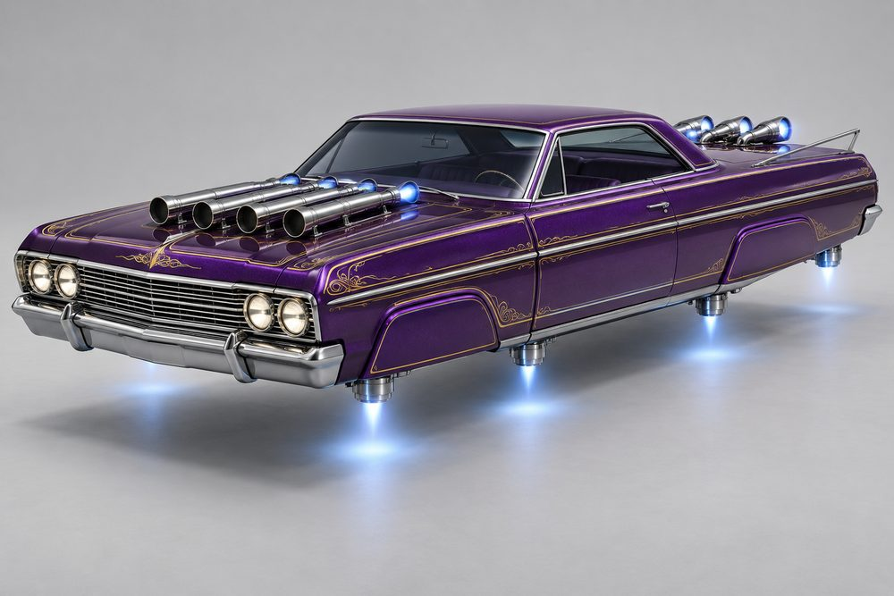
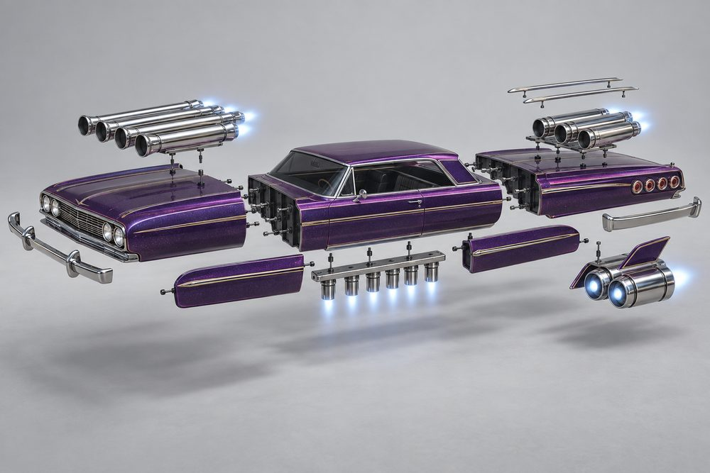
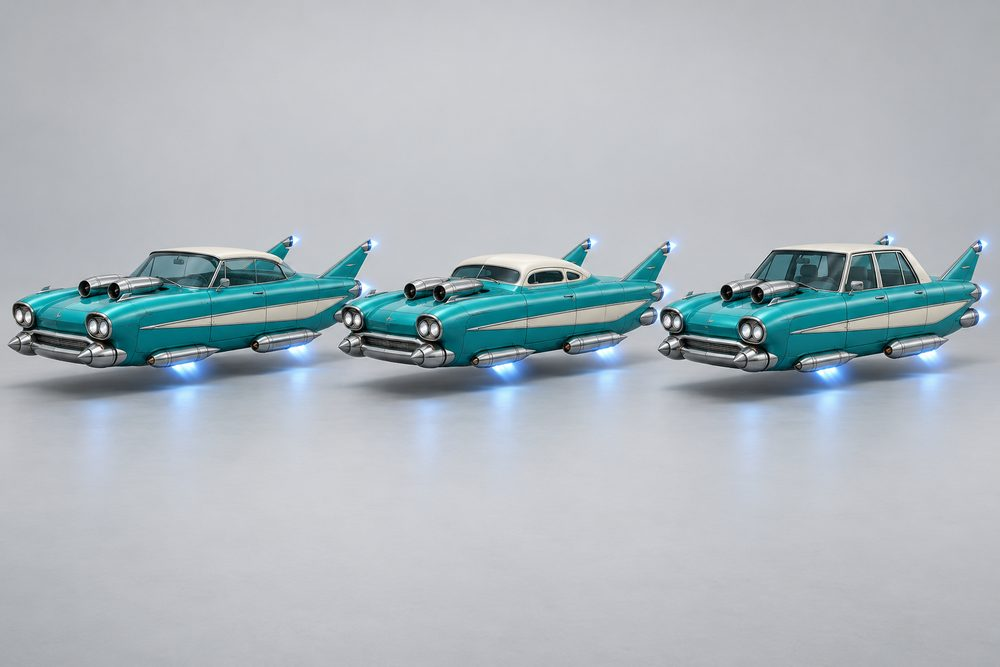
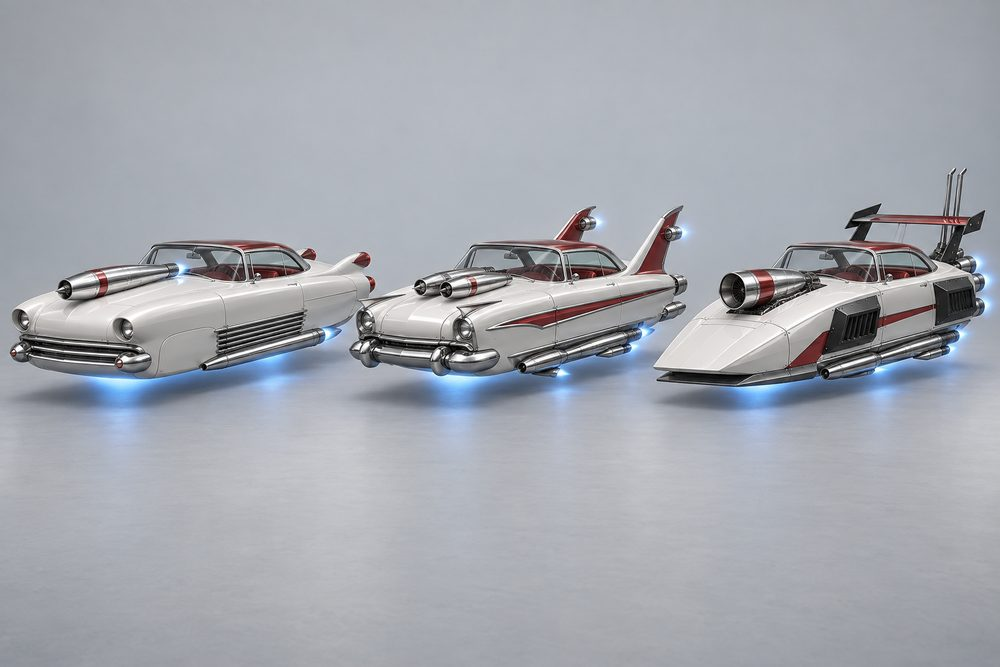
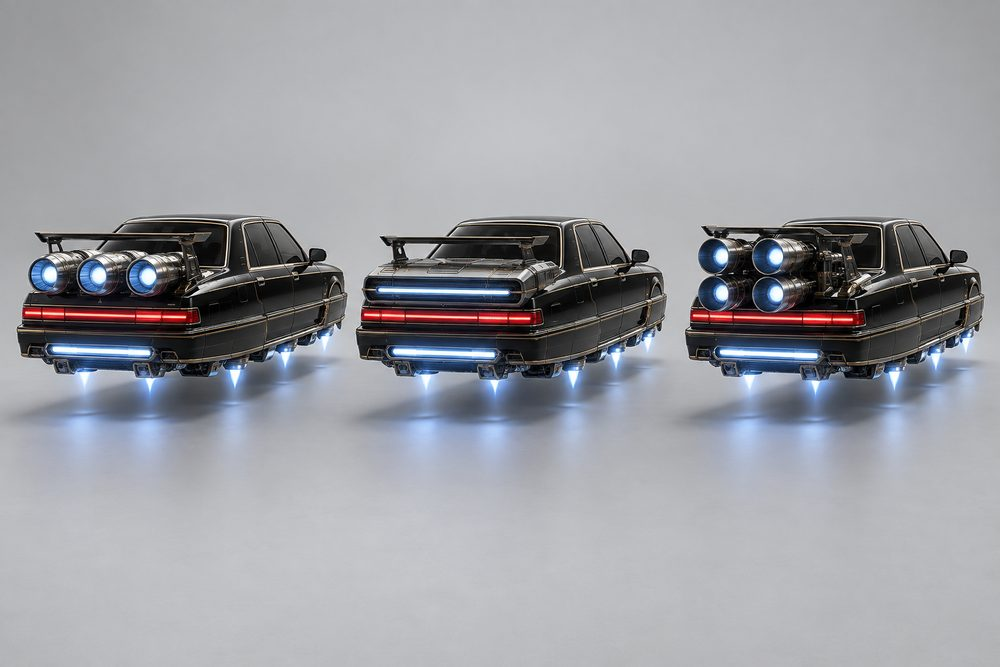
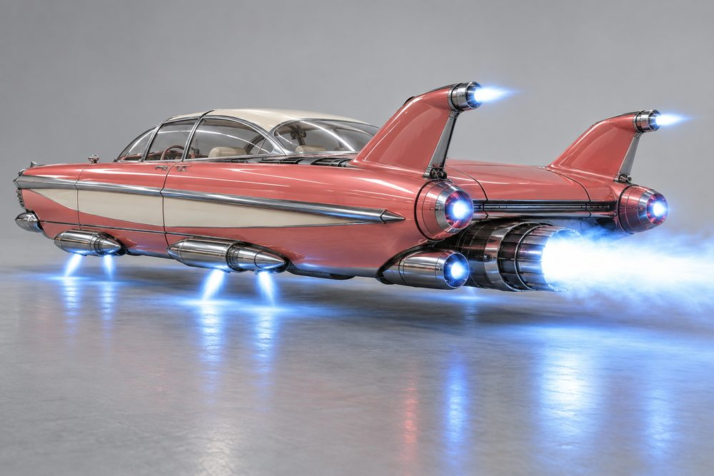
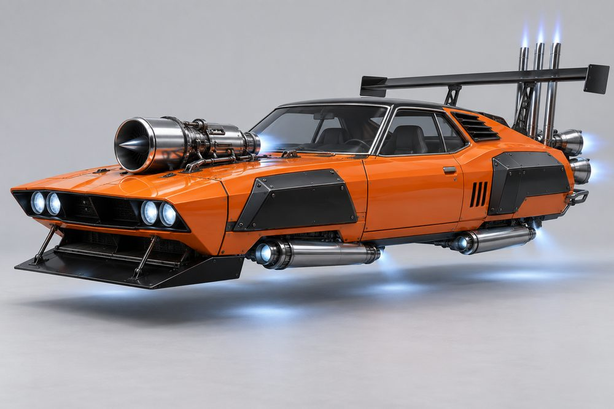
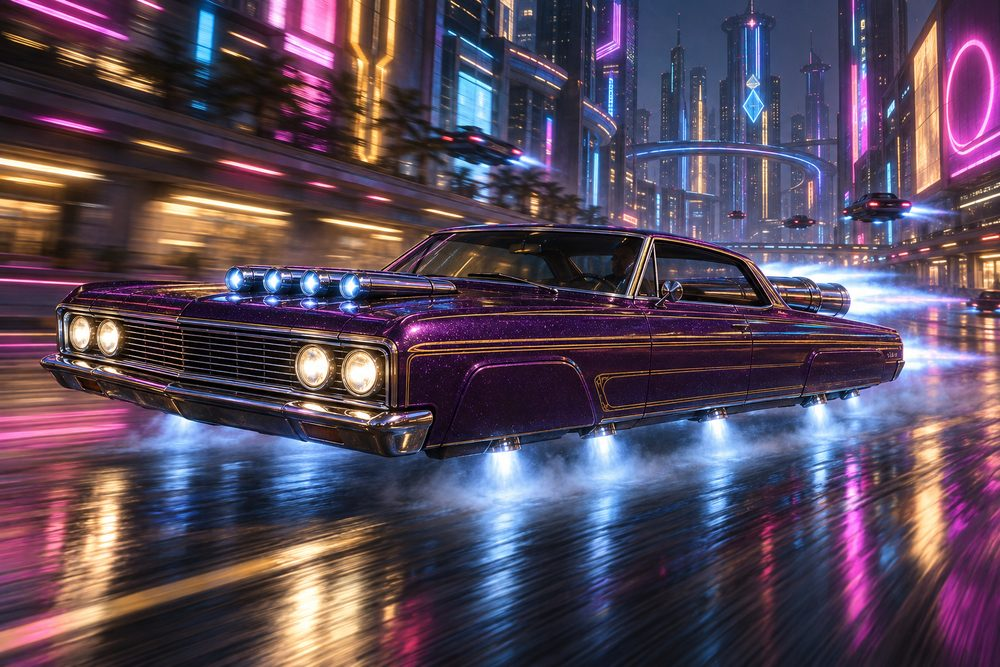

# Cruiser: class sheet (round 2)

Status: design exploration, round 2, 2026-10-01. Not approved, not game content. Brief: [exploration contract](../../../scripts/vehicle_blockouts/CONTRACT.md). Frame standard and blockout: [cruiser-frame.md](cruiser-frame.md). Round 1 art is kept in `output/vehicle-categories-2026-10-01/cruiser/v1/`. Proposed `CategoryId`: `cruiser`.

Round 2 changes: no wheels, discs or rotors. Lift comes from jets in the sills. Engines, stabilisers and boost are real modules on every build. Body halves are their own slots. Names below match the blockout spec.

## Pitch

Long, low land yachts turned into hover jets. A very long bonnet, a low roof and a long boot deck. Where the wheel arches were, the body is blanked off or skirted. Lift jets hang along the sills. A turbine sits on the bonnet and another on the boot. Bullet tail lamps and tail fins double as afterburners.

Built size is about 11 wide, 6.4 to 10.8 tall and 36 long studs. It is as long as Rift and lower than Street.

**Player fantasy:** "I am not racing you. I am arriving." Cruiser is the show car. It is heavy, smooth and fast in a straight line. It looks its best going slowly, tilted on three corners under a neon sign. The paint, the chrome and the stance are the build.

## Culture lines

- **Lowrider:** 60s pillarless hardtop. Candy and flake paint, gold pinstripes, tilted three-corner stance.
- **Lead Sled:** chopped late-40s coupé. Smooth, shaved, drooping fenders, lake pipes.
- **Fin Era:** late-50s jet age. Tall fins, bullet lamps, bubble top, chrome everywhere.
- **VIP:** boxy 90s luxury saloon. Slammed and level, black and pale gold, slot-shaped jets.
- **Kaido Racer:** wild 70s coupé. Shark nose, overfenders, towering stacks, huge wing.

## Cockpits

The cockpit is the cabin only: glass and roofline. Five are built. Tier B is held for Longroof.

| Name | Culture | Silhouette | Signature kit | Tier |
|---|---|---|---|---|
| VIP | VIP | Tall boxy saloon, upright rear glass | VIP | E |
| Hardtop | Lowrider | Pillarless two-door, thin flat roof | Lowrider | D |
| Sled | Lead Sled | Chopped coupé, low rounded roof, slit glass | Lead Sled | C |
| Kaido | Kaido Racer | Louvred fastback coupé, thin pillars | Kaido | A |
| Finliner | Fin Era | Clear wraparound bubble top | Fin Era | S |

## The fundamentals

Every build has all four. Each is real jet hardware with an intake, a body and a glowing nozzle.

| Slot | Player label | Sits | Options |
|---|---|---|---|
| `Engine1` | Bonnet Turbine | On the bonnet, ahead of the windscreen. Reads from the front three-quarter. | **Quad Stacks:** four slim jet tubes side by side. **Torpedo:** one long torpedo jet down the middle. **Twin Bullets:** two chrome bullet pods. **Slot Plenum:** low, wide scoop with a slot nozzle. **Works Turbo:** one big open-intake turbine. |
| `Engine2` | Boot Turbine | On the boot deck, nozzles past the tail. Fills the chase camera. | **Tri-Power:** three short jet barrels in a row. **Deck Slot:** one flat slot jet across the deck. **Fin Rockets:** rocket tubes beside the fins. **Boot Turbine:** one big centred turbine. **Quad Megaphones:** four flared nozzles, two over two. |
| `Stabilisers` | Sill Jets | Under both sills, in and between the blanked arches. Reads from the front and from below. | **Hop Jets:** chunky lift jets at the corners and mid-sill. **Sill Cascade:** stacked vanes with jet tips. **Rocket Sponsons:** slim rocket pods, nozzles down and back. **Curtain Skirt:** smooth full-length skirt, jets behind a dark edge. **Splay Jets:** lift jets angled outwards. |
| `Boost` | Tail Burner | Hung under the tail, firing past the rear chrome. The longest glow in the chase view. | **Twin Cans:** two chrome afterburner cans. **Lake Burners:** long slim burner pipes. **Atomic:** one big finned afterburner nacelle. **Slot Burner:** wide flat burner with a glowing slit. **Bamboo Stacks:** thin pipes rising behind the tail. |

## Body slots

The two body halves meet under the cabin. Cosmetic slots (`Hood`, `Roof`, `Accessory`) are not in the blockout. Paint and pattern cover that job for now.

| Slot id | Player label | Options |
|---|---|---|
| `FrontBody` | Front Half | **Boulevard:** long square nose, quad lamps. **Pontoon:** drooping round fenders, sunk lamps. **Jetliner:** nacelle fenders, gunsight blades. **Formal:** upright grille shell, blister lamps. **Shark Nose:** undercut, forward-leaning prow. |
| `RearBody` | Rear Half | **Long Deck:** square, six round lamps. **Turtle Tail:** drooping, bullet lamps. **Jet Tail:** jet-tube fenders, cut-up. **Formal Trunk:** light bar, blisters. **Works Tail:** bobbed, cut-up. |
| `SidePods` | Flanks | **Fender Skirts:** smooth covers over the arches. **Lake Pipes:** long chrome pipes on the sills. **Side Spears:** full-length chrome flash. **Long Vents:** slim black side vents. **Overfenders:** riveted bolt-on flares. |
| `FrontBumper` | Front Chrome | **Blade and Guards:** thin blade, two bullet guards. **Ripple Bar:** rippled chrome bar. **Bullet Bumper:** heavy bar with bullet guards. **Lip Kit:** slim painted lip. **Chin Spoiler:** long flat blade near the road. |
| `RearBumper` | Rear Chrome | **Chrome Blade:** thin full-width blade. **Roll Pan:** smooth painted pan. **Jet Pods:** chrome pods that glow like afterburners. **Diffuser Valance:** ribbed valance. **Tube Bar:** tube-frame bar. |
| `RearSpoiler` | Fins | **Antenna Rails:** two low raked chrome rails. **Hump Fins:** two low rounded humps. **Tall Fins:** two tall swept fins. **Trunk Wing:** slim wing on outboard stays. **Works Wing:** huge flat wing on tall stays. |

## Signature kits

Every kit fits every cockpit. A cockpit in another cockpit's kit is a swap build.

| Kit | Culture | Native cockpit | What makes it look different |
|---|---|---|---|
| Lowrider | Lowrider | Hardtop | Square nose, four bonnet stacks, three boot tubes, skirted flanks, thin chrome blades. |
| Lead Sled | Lead Sled | Sled | Drooping round fenders, one torpedo jet, smooth shaved lines, lake pipes and burners. |
| Fin Era | Fin Era | Finliner | Nacelle fenders, twin bullet pods, tall fins, rocket sponsons, one big afterburner. |
| VIP | VIP | VIP | Formal grille, red light bar, long vents, slot-shaped jets, trunk wing, diffuser. |
| Kaido | Kaido Racer | Kaido | Shark nose, overfenders, big turbo, four megaphones, bamboo stacks, huge wing. |

## Handling intent versus Piercer

Design intent only. Plus means higher than Piercer, minus means lower.

| Stat | Bias | Why |
|---|---|---|
| TopSpeed | + | Fast in a straight line, but not the fastest class. |
| Acceleration | - | Heavy. It builds speed slowly. |
| Braking | -- | A land yacht. Plan stops early. |
| BoostForce | = | A push, not a kick. |
| BoostDuration | ++ | A long smooth burn. Suits boulevards and expressways. |
| DriftControl | + | Slow, lazy slides are easy to hold. |
| DriftGrip | - | The long tail swings wide. |
| LateralGrip | - | Does not change line quickly. |
| SteeringResponse | -- | The class weakness. Very long body. |
| HoverStability | ++ | The class strength. Sill jets along the whole length settle it at once. |
| Downforce | - | Flat panels, little aero. A Works Wing adds a little. |
| Drag | + | Big frontal chrome. Speed fades off boost. |
| Weight | ++ | Wins contact with light classes. Narrow enough for lanes. |

## Ideas that make Cruiser fun to own

1. **Hop and tilt.** Below cruise speed the player can pose the car: three-corner tilt, front hop, side rock, pancake drop. Each Sill Jet lifts on its own and the glow on the road shows it. Cosmetic only. It levels out under boost.
2. **Stance presets.** Level, Slammed, Raked, Tail-down, Three-corner. Slammed throws neon sparks from the belly on crests.
3. **Full-kit titles.** Front Half, Rear Half and Flanks from one culture earn a title: Boulevard Royalty (Lowrider), Midnight Sled (Lead Sled), Jet Age (Fin Era), The Chairman (VIP), Highway Outlaw (Kaido Racer).
4. **Sleepers.** Put the VIP cabin on the Kaido kit, or the Hardtop on a Works Turbo. Odd mixes earn their own titles and a "sleeper" photo pose.
5. **Signature jet moments.** Bamboo Stacks spit flame on boost. Bullet tail lamps and fin tips flare like afterburners. Lake Burners trail along the sills. The bubble top slides back when parked.
6. **Paint as the canvas.** The long flat bonnet and deck take pattern packs on the Secondary channel: pinstripe scrolls, scallops, flames, side flash. Finishes: candy, flake, pearl. Thrust colour follows the culture, such as gold for Lowrider.
7. **Slow roll.** The only class rewarded for going slowly. Cruising in a line with other Cruisers builds a convoy bonus, and the underglow pulses in time.
8. **Cruise meets.** Marked kerb spots on the boulevard and the dealership forecourt. Park in a row, pose, and run a hop-off judged on height and rhythm.

## Gallery

*01 hero. Hardtop cockpit in its own Lowrider kit: Boulevard, Blade and Guards, Quad Stacks, Fender Skirts, Hop Jets, Antenna Rails, Tri-Power, Twin Cans. Mild three-corner tilt.*

*02 exploded. Lowrider Hardtop pulled apart: Front Half, Rear Half, Quad Stacks, Tri-Power, Hop Jets on their rail, Twin Cans, Flanks, Front Chrome, Rear Chrome, Antenna Rails.*

*03 one kit, three cockpits. The Fin Era kit and paint (Jetliner, Twin Bullets, Rocket Sponsons, Side Spears, Tall Fins, Bullet Bumper, Jet Pods) on Hardtop (left), Sled (centre) and VIP (right). Only the cabin changes.*

*04 one cockpit, three kits. Hardtop cockpit in Lead Sled (left), Fin Era (centre) and Kaido (right) kits. Front Half, Rear Half, Flanks, Fins, bumpers and all four jet slots change. No car has an arch cut-out. Each hangs long jet pods along its sills.*

*05 engines. VIP cockpit and VIP kit from behind, with three Boot Turbine options: Tri-Power (left), Deck Slot (centre), Quad Megaphones (right). Slot Burner, Curtain Skirt, Formal Trunk and Trunk Wing stay the same.*

*06 stabilisers and boost. Finliner cockpit in its Fin Era kit: Rocket Sponsons working, Atomic burning, Tall Fins with Fin Rockets, Jet Pods, Side Spears.*

*07 Kaido Racer. Kaido cockpit in its own kit: Shark Nose, Chin Spoiler, Overfenders, Works Turbo, Splay Jets, Works Tail, Quad Megaphones, Bamboo Stacks, Works Wing, Tube Bar. The Overfenders are flat, straight-edged flares over solid panel with slim vents, with no arch. The Splay Jets are long slim pods under the sills.*

*08 action. The Hardtop in its Lowrider kit at speed down a wet neon boulevard: Quad Stacks, Hop Jets, Tri-Power and Twin Cans firing.*

## Risks and open points

- **Length.** Built 35.8 to 37.0 studs against a 34 target and 17 for a Piercer cockpit. Check turning room, garage bays, the dealership stage, camera distance and tail swing.
- **Body halves look alike.** Front Half and Rear Half score 0.02 to 0.10 for distinctness against a 0.35 target. They share one slab so every pad fits. The noses and tails carry the difference. Owner call, see the frame doc.
- **Five cockpits, not six.** Longroof is not built and needs a sixth kit. Tier B is empty until it is.
- **Jets can read as wheels.** In 02 the Hop Jets are short stubby tubes. The first versions of 04 and 07 had overfender arches that looked like wheel arches with a jet in them. They were regenerated with no arch at all and long slim sill pods. Keep nozzles longer than wide and keep the lower body side straight, with no arch shape, in the models too.
- **Hop and tilt needs an owner.** Body pose only. It must not fight the hover physics owner and has to replicate cheaply.
- **Ground clearance.** Slammed stance and low Sill Jets sit near the hover plane. Check ramps, kerbs and crests.
- **Bonnet turbines and sight lines.** Quad Stacks and Works Turbo rise in front of the windscreen. Check the driver camera and passenger view.
- **Tall stacks.** Bamboo Stacks stand behind the tail and must stay under the Y 10 limit and clear tunnels and signs. Tall Fins and boot turbines overhang drooping tails by up to 1.6 studs.
- **Slot ownership.** Fins live only in the Fins slot. The Fin Era Fin Rockets (`Engine2`) sit beside them, so check that the pair never clip.
- **Cosmetic slots missing.** Hood ornaments, roof skins and accessories from round 1 are parked. Decide whether they return as optional slots.
- **Chrome.** There is no chrome paint channel and this class is trim-heavy. Trim must map to Detail or a fixed material.
- **Pinstripes.** Fine scrollwork will not survive a low-poly build. Use simple Secondary strips or a decal layer.
- **Narrow or dark cabins.** Sled and Kaido are narrower than the deck. Glass renders dark, so the Finliner bubble may read by outline only.
- **Likeness.** Images lean on real body styles (a 64 hardtop, a 49 coupé, a 70s Skyline coupé, a 90s luxury saloon). Likeness is allowed. Keep badges, grille marks and text off the final models. A tiny emblem may appear on the door in 06.
- **Living cultures.** Lowrider and Kaido are real communities. Keep names and details respectful, not caricature.
- **Image notes.** Shadow gaps are clear in 02 and weak in 01 and 08, where the body reads as one piece. Jet counts and exact shapes in the images are art direction, not the blockout. Check each module against the spec.
- **Seats and jobs.** VIP suits four seats and taxi jobs. Confirm seat counts per cockpit.
