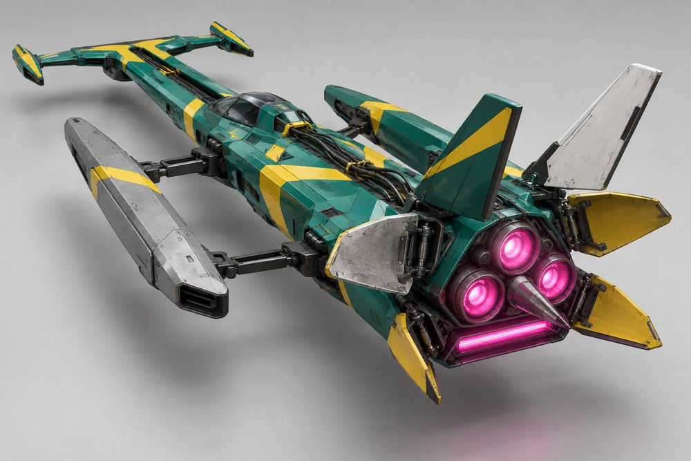
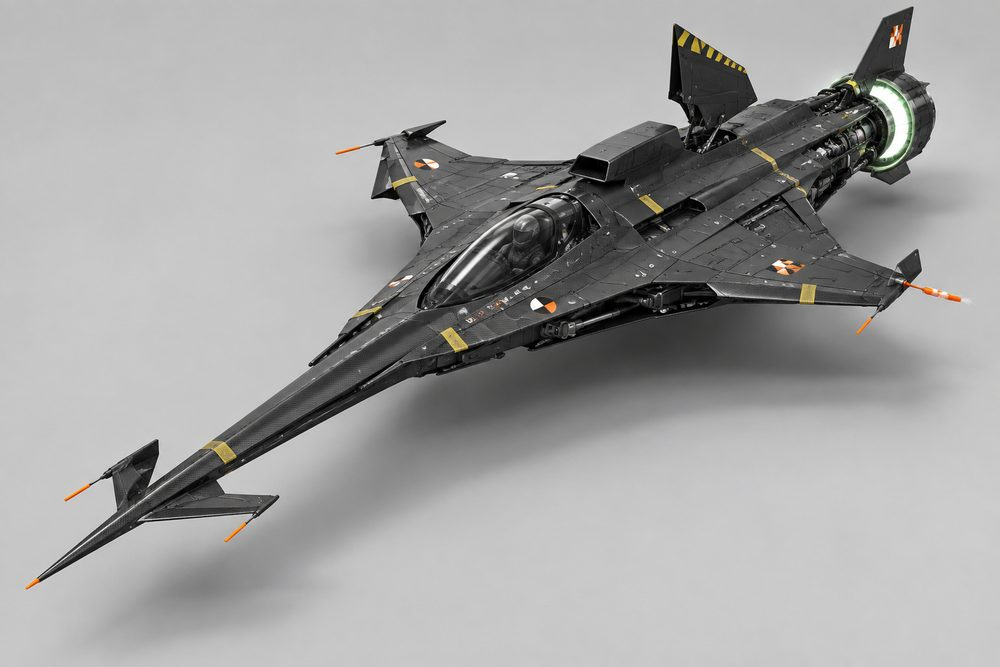
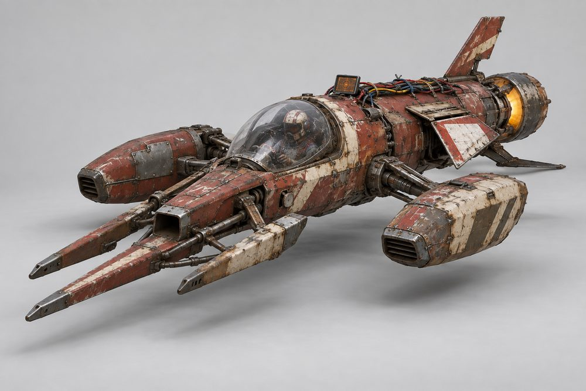

# Dart (`dart`): class sheet

Status: design exploration, 2026-10-01. Nothing here is approved or game content.
Brief: [exploration contract](../../../scripts/vehicle_blockouts/CONTRACT.md). Parent: [vehicle frame classes](../vehicle-frame-classes.md). Geometry: [frame standard](dart-frame.md).

## Pitch

Anti-gravity darts. One long slender fuselage, a prow of forward prongs, stub wings, airbrakes and a drive block at the tail. Low, wide and arrow-shaped. This is the pure science-fiction racer of the game. It carries no car heritage at all.

## Player fantasy

You are a racing pilot, not a driver. You sit under a small canopy at the back of a spear. The craft is the fastest thing in the city and it does not want to turn. You make it turn by throwing an airbrake open. When you get it right it looks and feels like a works pilot on a qualifying lap. When you get it wrong you meet the wall at top speed.

## Culture lines

- **Works Team:** factory entries. Pristine gloss paint, bright two-colour livery, matched parts.
- **Privateer:** self-funded racers. Clean but mismatched panels bought from three different teams.
- **Prototype:** test mules. Bare carbon, tape, checker squares and tracking targets, sensor probes.
- **Salvage:** scrapyard builds. Patch plates, weld repairs, exposed wiring, dented shrouds.

Tags drive shop filters and kit names only. Every part fits every Dart cockpit.

## Cockpits

The cockpit is the fuselage and pilot cabin. The canopy glass is its own slot.

| Name | Culture | Silhouette | Tier |
|---|---|---|---|
| Bubble | Salvage | Short stubby tube, cabin far forward | E |
| Needle | Privateer | Thinnest round tube, pilot at mid length | D |
| Twinboom | Privateer | Two thin booms, low pilot pod between | C |
| Delta | Works Team | Faceted wedge, widening towards the tail | B |
| Manta | Prototype | Wide flat blended body, pilot set rearward | A |
| Arrowhead | Works Team | Sharp flat arrowhead wedge, lowest of all | S |

## Slots and modules

Modules marked (new) are additions to the contract roster. Slot IDs are unchanged.

| Slot ID | Label | Modules and look |
|---|---|---|
| `Engine1` | Prow | **Twin Prong:** two parallel blades, open slot between. **Spear:** one very long central lance. **Trident:** three prongs, centre longest. **Hammerhead:** wide crossbar with two short outboard prongs. |
| `Engine2` | Drive | **Mono Drive:** one large shrouded nozzle. **Twin Drive:** two round nozzles side by side. **Tri Cluster:** three nozzles in a triangle. **Vector Ring:** one open gimballed ring. |
| `Stabilisers` | Airbrakes | **Clamshell:** two flank flaps hinged at the front edge. **Petal:** four flaps that open like a flower round the tail. **Dorsal:** one tall panel behind the canopy. |
| `SidePods` | Wings | **Delta:** swept stub wings with downturned tips. **Forward Swept:** thin blades angled forward. **Pontoons:** long pods on short struts. **Stub Winglets:** tiny fins, the narrowest build. |
| `Boost` | Afterburner | **Ring Burner:** glowing ring round each nozzle. **Slot Burner:** wide flat glowing slot under the drive. **Lance Burner (new):** two thin flame tubes above the drive. |
| `FrontBumper` | Nose Tip | **Pitot Spike:** thin sensor needle. **Canards:** two small vanes near the tip. **Ram Scoop:** blunt open intake. |
| `RearBumper` | Tail Cone | **Skid:** flat ski under the drive. **Stinger:** pointed cone between the nozzles. **Drogue Pod (new):** capped parachute tube. |
| `RearSpoiler` | Tail Fins | **Single Fin:** one tall centre fin. **Twin Fins:** two outward-canted fins. **V-Tail:** two fins in a wide V. |
| `Hood` | Spine | **Dorsal Intake:** raised scoop from canopy to drive. **Cable Run:** exposed wiring and hoses. **Razorback (new):** smooth knife-edge fairing. |
| `Roof` | Canopy | **Teardrop:** small smooth glass drop. **Flat Shield:** low flat-topped panes. **Open Screen:** short windscreen, pilot exposed. A full bubble dome is shown on the Bubble cockpit in images 03 and 07; decide whether it becomes a fourth canopy. |

## Handling intent versus Piercer

Design intent only. No numbers. Bias is relative to a Piercer build of the same tier.

| Stat | Bias | Intent |
|---|---|---|
| TopSpeed | ++ | Highest in the game. This is the reason to own one. |
| Acceleration | - | Slow to wind up. Losing speed is expensive. |
| Braking | + | Airbrakes bite hard at speed. |
| BoostForce | - | Already fast. Boost is a top-up, not a kick. |
| BoostDuration | + | Long, steady afterburner for straights. |
| DriftControl | ++ | The airbrake turn rotates the nose hard. This is how a Dart corners. |
| DriftGrip | - | It keeps sliding along the old line. Open the brake early. |
| LateralGrip | - | Little grip in a plain steered corner. |
| SteeringResponse | - | Lazy at speed. Weakest at low speed in tight streets. |
| HoverStability | - | Long and light. Bumps and kerbs unsettle it. |
| Downforce | - | Slippery body, little load. |
| Drag | -- | Lowest drag of any class. |
| Weight | - | Light. Loses contact fights with every car class. |

Net: unbeatable on motorways and long sweepers, hard work in the dense blocks. The skill is airbrake timing.

## Ideas that make Dart fun to own

1. **Team livery kits.** A Dart livery is a two-colour blocking pattern plus one stripe shape (chevron, slash, split, hoop). Invented teams only, geometric graphics, no text. It maps onto the existing Primary, Secondary and Detail channels, so the player still picks the colours.
2. **Airbrake flare.** The signature expression. Flaps snap open on drift entry with a vapour puff and a light glint, the inside flap wider than the outside one. Each airbrake module flares its own way: Clamshell scissors, Petal blooms, Dorsal stands up like a sail.
3. **Prong count as identity.** One, two or three prongs is readable from far away and on the minimap icon. Players will describe their craft by it ("a trident Manta").
4. **Full kit names.** Fitting every slot from one culture names the build: Works Spec, Privateer Special, Test Mule, Scrap Dart. A small badge on the garage card only, no stat bonus.
5. **Speed-trap unlocks.** Prototype parts unlock by beating speed-trap targets on the motorway. Salvage parts are cheap and sold from the start. Works parts sit at the top of the price ladder.
6. **Afterburner photo moment.** At top speed the thrust trails lengthen and the hover strips under the prongs brighten. Photo mode gets a low nose-on camera that frames the prongs.
7. **Pit pose.** In the garage and when parked, the canopy lifts and the airbrakes rest open, like a craft on its stand between sessions.
8. **Class sound.** A rising turbine whine instead of an engine note, with a sharp air-tear sound when the brakes open.

## Gallery

*01 Hero. Works Team on the Needle cockpit. Prow Twin Prong, Nose Tip Pitot Spike, Wings Delta, Airbrakes Clamshell (part open), Drive Twin Drive, Afterburner Ring Burner, Tail Fins Twin Fins, Spine Dorsal Intake, Canopy Teardrop.*

*02 Exploded. The hero build pulled apart. Fuselage in the centre; Prow, Nose Tip, Wings, Airbrakes, Spine, Canopy, Drive, Afterburner, Tail Cone (Stinger) and Tail Fins each on their own axis.*

*03 One kit, three cockpits. Left Needle, centre Manta, right Bubble. Identical Works Team kit and paint on all three: Twin Prong, Delta wings, Clamshell airbrakes, Twin Drive, Twin Fins.*

*04 One cockpit, three kits. The Arrowhead cockpit three times. Left Works Team (Twin Prong, Delta, Twin Drive, Twin Fins). Centre Prototype (Spear, Forward Swept, Vector Ring, Single Fin). Right Salvage (Trident, Pontoons, Tri Cluster, V-Tail, Cable Run).*

*05 Privateer, rear view. Prow Hammerhead, Wings Pontoons (one in primer), Airbrakes Petal (flared, two bare-metal petals), Drive Tri Cluster, Afterburner Slot Burner, Tail Cone Stinger, Tail Fins V-Tail (one white donor fin), Spine Cable Run. Asked for the Twinboom cockpit; it rendered as a single fuselage.*

*06 Prototype. Manta cockpit in bare carbon. Prow Spear, Nose Tip Canards, Airbrakes Dorsal (open), Drive Vector Ring, Tail Fins Single Fin, Spine Dorsal Intake, Canopy Teardrop. Wings were asked for as Forward Swept and came out swept back.*

*07 Salvage. Bubble cockpit. Prow Trident, Nose Tip Ram Scoop, Wings Pontoons, Airbrakes Clamshell, Drive Mono Drive, Tail Cone Skid, Tail Fins Single Fin, Spine Cable Run, bubble dome canopy.*

*08 Action. The Works Team hero build at speed in the city at night, banking on its airbrakes with Ring Burner trails.*

## Risks and open points

- **Size.** About 34 studs long and 16 wide. It is twice as long as a Piercer. Check street widths, garage bays, the dealership turntable and the camera distance before any build.
- **Thin parts.** Prongs and fins are slender. They need simple collision boxes, and the prongs must not snag on traffic or kerbs.
- **Pilot seat.** A 5-stud avatar under a 5-stud-high craft means a reclined seat. The passenger seat work for Piercer may not carry over; Dart is likely a single-seater.
- **Jobs.** No cargo or passenger space. Decide whether Dart is barred from taxi and parcel jobs or gets its own courier job type.
- **Low-speed play.** The class is weak in dense blocks by design. If it is too weak it will not be fun between races. Needs a play test before the stat intent is fixed.
- **Fuselage variety.** Six cockpits must share one seam set while the fuselage is the main shape. Twinboom and Manta are the hard cases. Image 05 shows the image model could not hold Twinboom either. See the frame standard.
- **Airbrake flare.** It is a visual on existing drift physics. It needs an owner (the drive VFX layer) and must not add a second drift state.
- **Art style.** Images 06 and 07 are grittier and more detailed than a low-poly Roblox build can hold. Treat them as mood, not as a part count target.
- **Originality.** The genre has well-known ships. Keep the prong, fin and livery shapes our own and review them before any public use.
- **Roster gaps.** The Delta cockpit and the Stub Winglets, Open Screen, Lance Burner, Drogue Pod and Razorback modules have no image yet.
