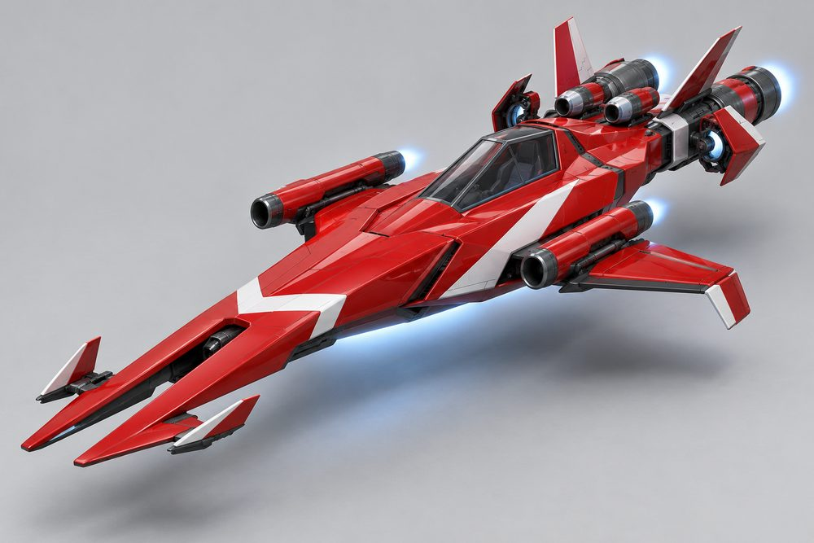
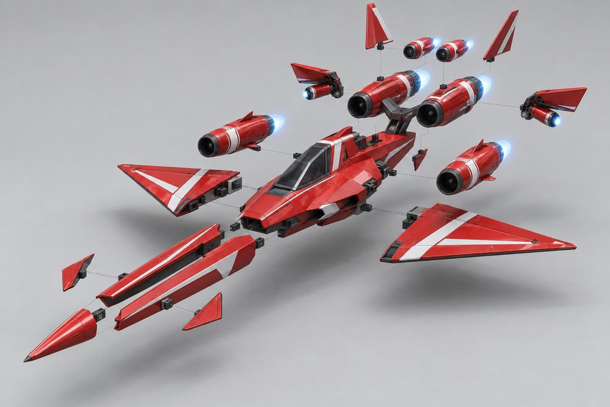
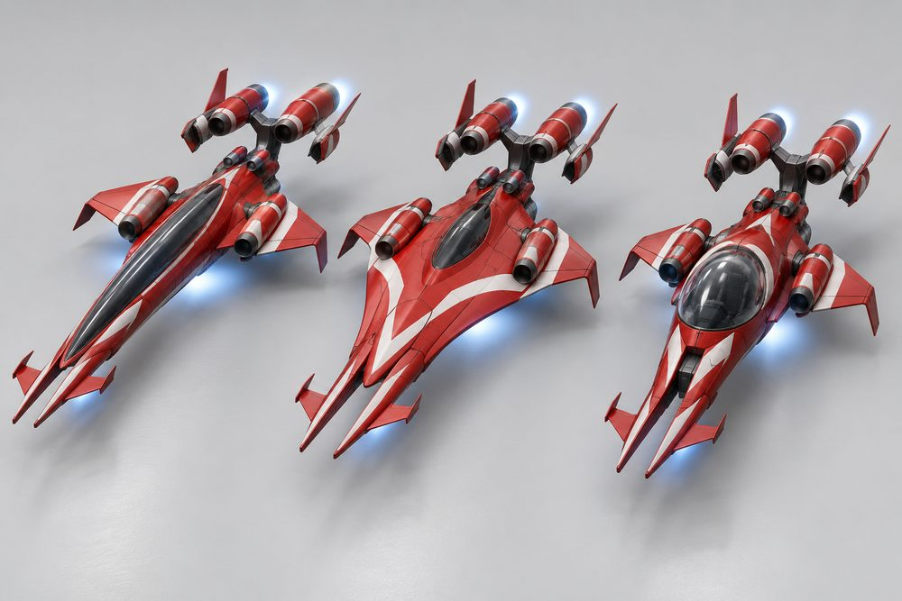
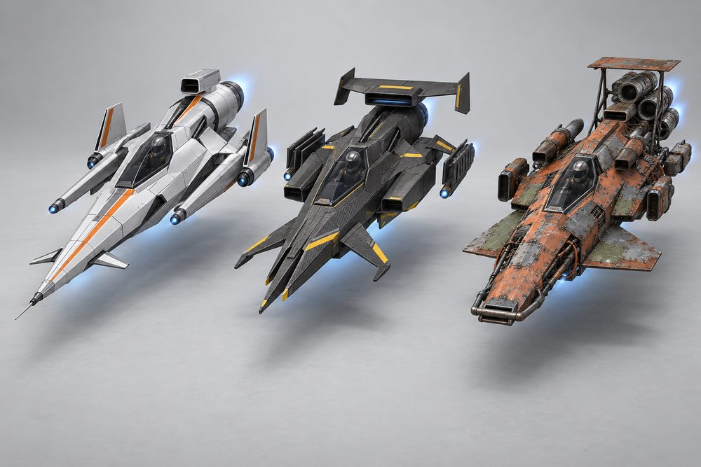
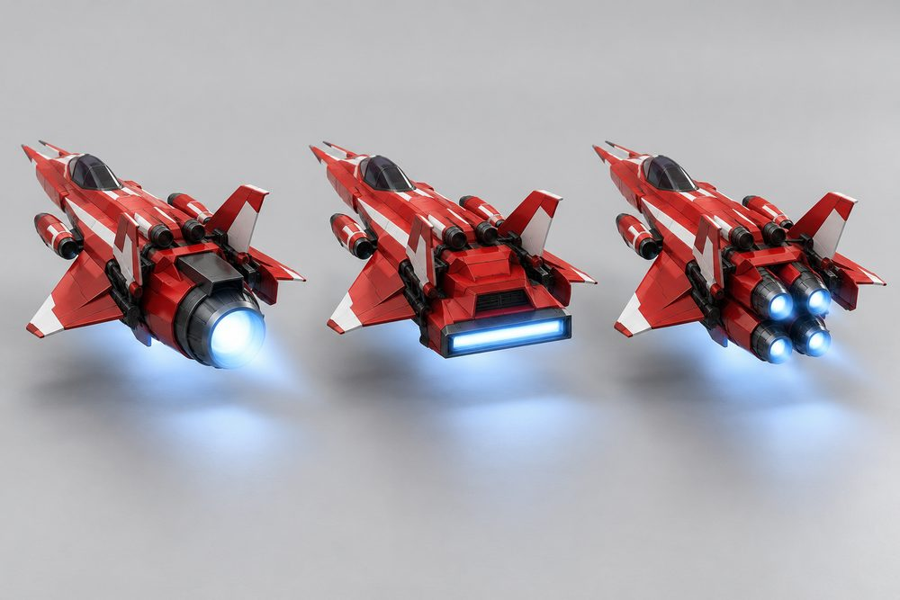
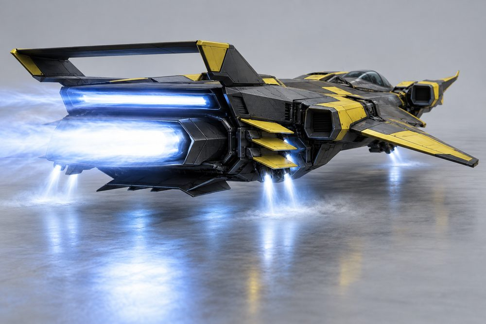
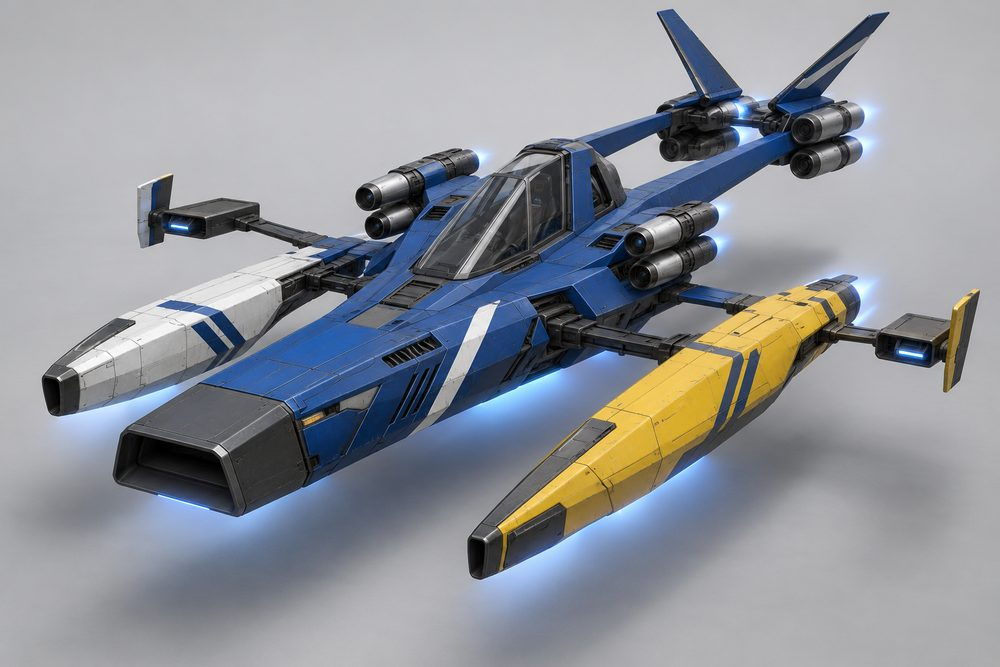
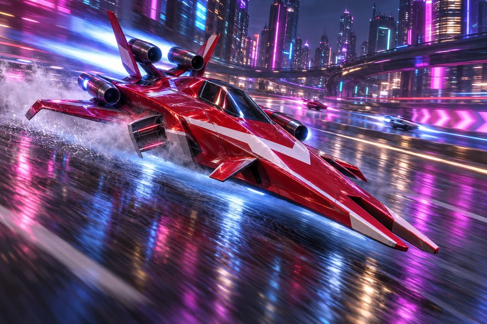

# Dart (`dart`): class sheet, round 2

Status: design exploration, round 2, 2026-10-01. Nothing here is approved or game content.
Brief: [exploration contract](../../../scripts/vehicle_blockouts/CONTRACT.md). Parent: [vehicle frame classes](../vehicle-frame-classes.md). Geometry: [frame standard](dart-frame.md). Round 1 art is kept in `output/vehicle-categories-2026-10-01/dart/v1/`.

What changed from round 1: no wheels or ring parts anywhere, jets only. Engines, stabilisers and boost are real modules again (Main Drive, Wing Engines, Airbrakes, Afterburner). The prow is now a body slot (`FrontBody`), not an engine. Needle, Delta, Manta, Twinboom and Bubble are built. Each cockpit has its own signature kit. Arrowhead is not built yet.

## Pitch

Anti-gravity racing darts. One long slender fuselage, a prow of one to three forward prongs, stub wings, airbrakes and a drive block with glowing thrusters at the tail. Low, wide and arrow-shaped, in bold team colour blocking. This is the pure science-fiction racer of the game. It carries no car heritage at all.

## Player fantasy

You are a racing pilot, not a driver. You sit under a small canopy at the back of a spear. The craft is the fastest thing in the city and it does not want to turn. You make it turn by throwing an airbrake open. When you get it right it looks and feels like a works pilot on a qualifying lap. When you get it wrong you meet the wall at top speed.

## Culture lines

- **Works Team:** factory entries. Pristine gloss paint, bright two-colour livery, matched pairs of everything.
- **Record Breaker:** one-of-everything speed machines. Polished white and silver, one long thin part per slot.
- **Prototype:** test mules. Bare carbon, flat wide jets, sensor blades.
- **Privateer:** self-funded racers. Clean but mismatched panels bought from three different teams.
- **Salvage:** scrapyard builds. Patch plates, weld repairs, exposed wiring, dented shrouds.

Culture tags drive shop filters and kit names only. Every part fits every Dart cockpit.

## Cockpits

The cockpit is the fuselage, the pilot and all the glass. Every cockpit wears its own signature kit.

| Name | Culture | Silhouette | Signature kit | Tier |
|---|---|---|---|---|
| Bubble | Salvage | Glass dome on a bare keel beam | Salvage | E |
| Needle | Record Breaker | Thin round tube, long flush canopy | Record | D |
| Twinboom | Privateer | Upright greenhouse between two thin booms | Privateer | C |
| Delta | Works Team | Faceted wedge, tall wedge screen | Works | B |
| Manta | Prototype | Wide flat head with horns, tapering tail | Prototype | A |

Tier S is held for Arrowhead (a flat arrowhead wedge, lowest of all) if it is built.

## The fundamentals

Every Dart has all four. Each shows a dark intake, a body and a glowing nozzle from outside.

| Slot | Label | Where it sits | Options |
|---|---|---|---|
| `Engine1` | Main Drive | Behind the fuselage, dead astern. The biggest nozzle. | **Mono Turbine:** one big barrel, scoop on top. **Twin Drive:** two big barrels on a Y yoke. **Slot Burner:** flat wide fishtail. **Quad Cluster:** four small short jets. **Rack Triple:** three jets stepped on a ladder frame. |
| `Engine2` | Wing Engines | A pair on the fuselage shoulders, above the wing roots. | **Lance Ramjets:** thin, full length. **Shoulder Turbines:** one round nacelle each side. **Slot Ramjets:** flat boxes. **Stacked Pair:** two small jets, over and under. **Scoop Burners:** square scoop, thin tailpipe. |
| `Stabilisers` | Airbrakes | A pair on the flanks of the main drive, wide at the tail. | **Petal Slabs:** one tall slab, jet on its tail. **Clamshell:** two flaps round a jet. **Vane Cascade:** three louvres, lift jet at the tip. **Outrigger Jets:** a boom with a boxed lift jet and a vane. **Drag Paddles:** square paddle, bottle jet. |
| `Boost` | Afterburner | On top of the main drive, the highest jet on the tail. | **Stinger:** one long thin burner. **Twin Cans:** two short cans. **Slot Afterburner:** flat and wide. **Staged Bell:** three growing stages. **Rocket Bottles:** two bottle burners each side. |

## Body and cosmetic slots

| Slot ID | Label | Options |
|---|---|---|
| `FrontBody` | Prow | **Spear:** one very long lance. **Twin Prong:** two parallel flat blades, open slot between. **Trident:** three prongs, centre longest. **Hammerhead:** wide crossbar, two short outboard pods. **Spade:** one flat broad blade. |
| `FrontBumper` | Nose Tip | **Pitot Spike:** thin sensor needle. **Canards:** two small vanes. **Sensor Blade:** thin upright probe. **Ram Scoop:** blunt open intake. **Bash Bar:** heavy flat bar. |
| `SidePods` | Wings | **Stub Winglets:** tiny fins, the narrowest build. **Delta Wings:** swept stubs, downturned tips. **Forward Swept:** thin blades angled forward. **Pontoons:** long slim pods on short struts. **Plank Wings:** wide flat slabs. |
| `RearBumper` | Keel | **Tail Stinger:** pointed cone. **Keel Fin:** small blade under the tail. **Diffuser:** flat ribbed panel. **Drogue Pod:** capped parachute tube. **Skid:** flat ski. |
| `RearSpoiler` | Tail Fins | **Strake Fins:** low thin strakes. **Twin Fins:** two outward-canted fins. **Box Wing:** a boxed wing between two fins. **V-Tail:** two fins in a wide V. **Plank Spoiler:** one flat wide slab. |

Hood, Roof and Accessory are not used. The canopy belongs to the cockpit.

## Signature kits

| Kit | Culture | Native cockpit | What makes it look different |
|---|---|---|---|
| Record | Record Breaker | Needle | One of everything: spear, mono turbine, stinger. Long, thin, white and silver. |
| Works | Works Team | Delta | Pairs: twin blades, twin barrels, twin cans, twin fins. Symmetrical and pristine. |
| Prototype | Prototype | Manta | Flat and wide: slot burner, slot ramjets, louvre airbrakes, trident. Bare carbon. |
| Privateer | Privateer | Twinboom | Clusters and stages: four small jets, stacked pairs, a three-stage bell. Mismatched panels. |
| Salvage | Salvage | Bubble | Blunt and bolted: spade, planks, a ladder rack of three jets, bottle burners. Patched. |

## Handling intent versus Piercer

Design intent only. No numbers. Bias is relative to a Piercer build of the same tier.

| Stat | Bias | Intent |
|---|---|---|
| TopSpeed | ++ | Highest in the game. This is the reason to own one. |
| Acceleration | - | Slow to wind up. Losing speed is expensive. |
| Braking | + | Airbrakes bite hard at speed. |
| BoostForce | - | Already fast. Boost is a top-up, not a kick. |
| BoostDuration | + | Long, steady afterburner for straights. |
| DriftControl | ++ | The airbrake turn rotates the nose hard. This is how a Dart corners. |
| DriftGrip | - | It keeps sliding along the old line. Open the brake early. |
| LateralGrip | - | Little grip in a plain steered corner. |
| SteeringResponse | - | Lazy at speed. Weakest at low speed in tight streets. |
| HoverStability | - | Long and light. Bumps and kerbs unsettle it. |
| Downforce | - | Slippery body, little load. |
| Drag | -- | Lowest drag of any class. |
| Weight | - | Light. Loses contact fights with every car class. |

Net: unbeatable on motorways and long sweepers, hard work in the dense blocks. The skill is airbrake timing. Main Drive leans on top speed, Wing Engines on acceleration, Airbrakes on braking and drift, Afterburner on boost.

## Ideas that make Dart fun to own

1. **Team livery kits.** A livery is a two-colour blocking pattern plus one stripe shape (chevron, slash, split, bar). Invented teams only, geometric graphics, no text. It maps onto Primary, Secondary and Detail, so the player still picks the colours.
2. **Airbrake flare.** Flaps snap open on drift entry with a vapour puff and a light glint, the inside one wider. Each module flares its own way: Clamshell scissors, Petal Slabs stand up like sails, Vane Cascade fans its louvres one by one, Drag Paddles drop flat.
3. **Prong count as identity.** One, two or three prongs read from far away and on the minimap icon. Players will say "a trident Manta".
4. **Frankenstein builds.** Any kit fits any cockpit. A Salvage rack drive on a Works Delta is a valid hot-rod look, and Privateer culture celebrates mixing.
5. **Full kit names.** Fitting every slot from one kit names the build: Works Spec, Record Special, Test Mule, Privateer Special, Scrap Dart. A badge on the garage card only, no stat bonus.
6. **Afterburner flame shapes.** Stinger is a needle, Twin Cans two plumes, Slot Afterburner a flat sheet, Staged Bell shock diamonds, Rocket Bottles four short roars. Trails lengthen at top speed. Photo mode gets a low nose-on camera that frames the prongs.
7. **Speed-trap unlocks.** Prototype parts unlock by beating speed-trap targets on the motorway. Record parts unlock through long-straight time trials. Salvage parts are cheap from the start. Works parts sit at the top of the price ladder.
8. **Pit pose and sound.** In the garage the canopy lifts and the airbrakes rest open. Class sound is a rising turbine whine, with a sharp air-tear when the brakes open.

## Gallery

*01 Hero. Delta cockpit in the Works kit, red and white. Prow Twin Prong, Nose Tip Canards, Wings Delta Wings, Wing Engines Shoulder Turbines, Main Drive Twin Drive, Airbrakes Clamshell, Afterburner Twin Cans, Tail Fins Twin Fins, Keel Keel Fin.*

*02 Exploded. The hero build pulled apart. Delta fuselage in the centre. Prow, Nose Tip, Wings, Wing Engines, Main Drive, Afterburner, Airbrakes, Tail Fins and Keel each on their own axis. The nose tip came out as a cone plus canards.*

*03 One kit, three cockpits. Left Needle, centre Manta, right Bubble. All wear the identical Works kit and red paint: Twin Prong, Delta Wings, Shoulder Turbines, Twin Drive, Clamshell, Twin Cans, Twin Fins.*

*04 One cockpit, three kits. The Delta cockpit three times. Left Record kit (Spear, Mono Turbine, Lance Ramjets, Petal Slabs). Centre Prototype kit (Trident, Slot Burner, Slot Ramjets, Vane Cascade, Box Wing). Right Salvage kit (Spade, Rack Triple, Scoop Burners, Drag Paddles, Plank Spoiler).*

*05 Main Drive options, rear view. Delta cockpit with Works fittings, identical except Engine1. Left Mono Turbine, centre Slot Burner, right Quad Cluster.*

*06 Airbrakes and afterburner. Manta cockpit in the Prototype kit, bare carbon with yellow. Slot Afterburner firing, Slot Burner main drive, Vane Cascade airbrakes with lift jets, Forward Swept wings, Slot Ramjets, Box Wing, Diffuser. Seen low from the side and behind.*

*07 Privateer. Twinboom cockpit in the Privateer kit with mismatched panels (blue body, white and yellow pods). Ram Scoop, Pontoons, Stacked Pair, Quad Cluster, Outrigger Jets, V-Tail. The pontoons render as long nacelles ahead of the canopy; the Hammerhead crossbar is hard to see.*

*08 Action. The Works hero build on the Delta cockpit, banking at speed in a neon city at night, Clamshell airbrake flared on the inside of the turn, afterburner streaking behind.*

## Risks and open points

- **Size.** About 34 studs long and 16 wide. That is twice the length of a Piercer. Check street widths, garage bays, the dealership turntable and the camera distance before any build.
- **Cockpit variety.** The hull is only 6 studs wide, so cockpits differ mostly in canopy and plan shape. Distinctness is 0.27. Needle and Delta are the closest pair.
- **Missing cockpit.** Arrowhead (tier S) is not built. It needs a sixth kit of nine modules.
- **Thin parts.** Prongs, fins and booms are slender. They need simple collision boxes and must not snag on traffic or kerbs.
- **Wheel look-alikes.** Pontoons, Hammerhead pods and corner lift jets are long tubes at the corners. Keep them slender in the mesh so they never read as wheels.
- **Tail stack.** Keel, drive, afterburner and fins all hang off one drive module. A real mesh needs a strong visual spine there or it looks skeletal from the side.
- **Pilot seat.** A 5-stud avatar in a low craft means a reclined seat. Dart is likely a single-seater. Passenger-seat work for Piercer may not carry over.
- **Jobs.** No cargo or passenger space. Decide whether Dart is barred from taxi and parcel jobs or gets its own courier job.
- **Low-speed play.** The class is weak in dense blocks by design. It needs a play test before the stat intent is fixed.
- **Airbrake flare.** It is a visual on existing drift physics. It needs an owner (the drive VFX layer) and must not add a second drift state.
- **Art style.** The Prototype and Salvage images are grittier than a low-poly Roblox build can hold. Treat them as mood, not part count.
- **Originality.** The genre has well-known ships. Keep prong, fin and livery shapes our own and review them before any public use.
