# Exotic concept art pack: Wedge and Hyper (batch 1)

Status: design exploration, 2026-10-02. Not approved, not game content. For review, then for a 3D artist.

How it was made, the colour code and the rules are in [BRIEF.md](BRIEF.md). Every image was generated from a blockout screenshot taken in Roblox Studio, so the camera, proportions and layout are the blockout's; only the surface design is new.

## How to read these

- **One view per part:** a near-orthographic three-quarter view. Front parts are seen from the front, rear parts and jets from the rear.
- **Colours are paint channels:** red is Primary (body), silver is Secondary (accent), graphite is Detail, dark glass is Glass, cyan-white glow is Neon and Thrust. In game the player recolours them.
- **Take sizes and mounting faces from the blockout,** not from the art. The art shows the surface design. Each part's blockout screenshot is shown under its art.
- **Flat faces matter.** Where a note says a face must stay flat, another part bolts on there.

## Cockpits

### Wedge cockpit

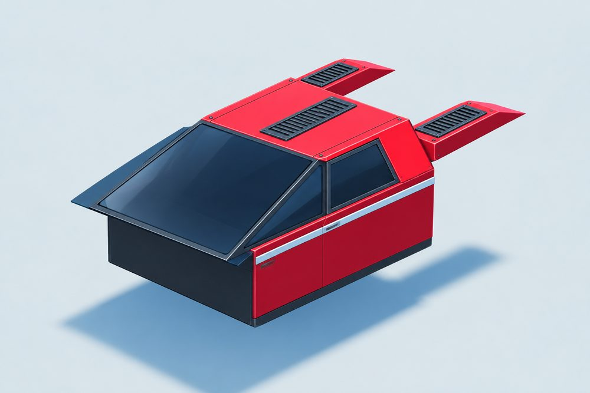

Blockout: 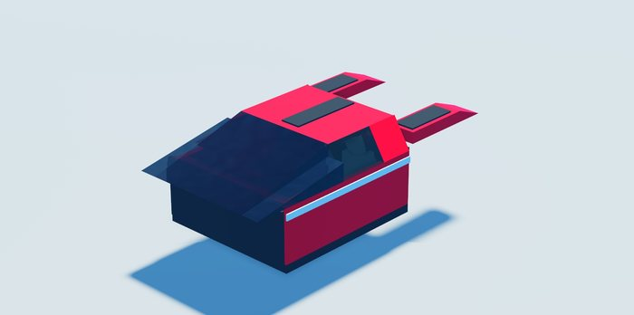

Cabin only, one unit. The flat dark front face is a bulkhead where the Nose bolts on, and the flat dark rear face is a bulkhead where the Engine Deck bolts on, so keep both flat and square-edged. The flat red flank below the silver stripe is the pad where each Side Pod bolts on (this part is mirrored left and right, so model the other side the same); the door shut line and handle drawn on it are shallow surface detail only and must not break the flat pad. The cabin owns all glass and the roofline: one windscreen overhanging the front, its triangular glass flank, one side window per side, the roof vent, and two buttresses with a vent each that run back from the roof either side of the empty engine bay gap. Colours: red body, satin silver stripe, graphite vents, front face, rear face and skirt, dark tinted glass.

### Hyper cockpit

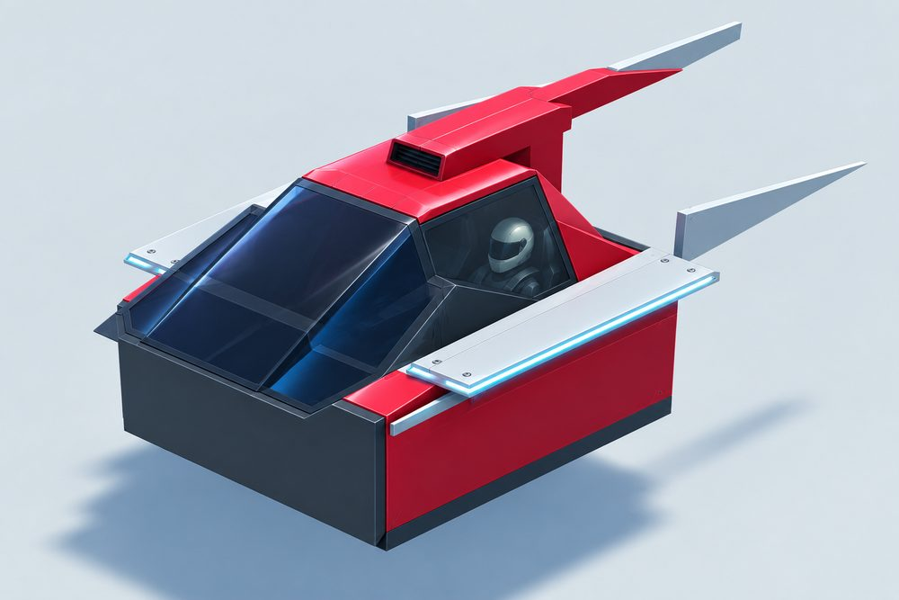

Blockout: 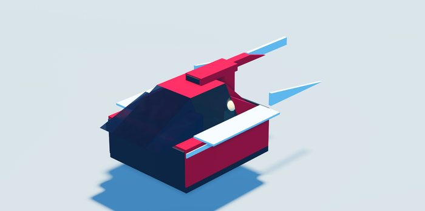

This is the Hyper cabin (Cockpit slot) and it owns all the glass and the roofline. The dark graphite front face and rear face are flat, plain bulkheads, because the nose bolts to the front and the engine deck bolts to the rear. Keep both completely flat, with no lamps, vents or add-ons. The red side wall under each shoulder panel must also stay flat and plain, because the side pod bolts on there; one cabin unit is shown, with a mirrored side on the far side. The roof snorkel and dorsal fin sit on the roof centre line and must not cross the rear bulkhead plane or the engine bay pad behind the cabin. The two silver shoulder panels sit on the top edge of the sides. The two silver blade fins start at the rear shoulder corners and sweep back past the rear face, so keep them clear of the engine bay and the side engine rails. The helmeted driver is separate from the cabin shell, so model it as its own small mesh inside the glass.

## Wedge kit modules

### Nose: Shovel Nose

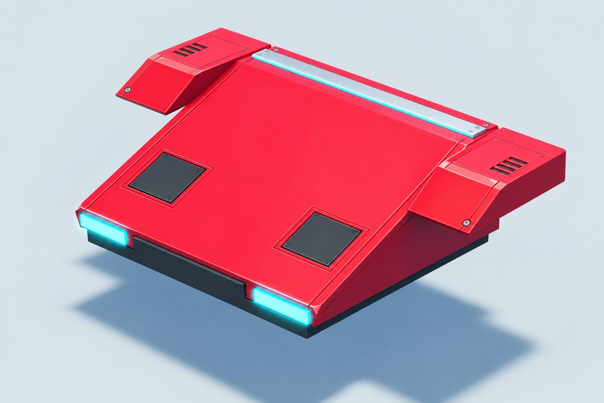

Blockout: 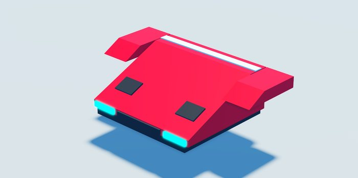

The Shovel Nose bolts to the cabin front bulkhead with its flat, plain rear face, which faces away from the camera and carries no detail, so keep it a clean flat plane. It carries the scuttle strip under the windscreen along the rear top edge (silver, with a cyan glow line), a flat graphite pad underneath for the splitter, and a blanked arch each side for a stabiliser; the arches are not drawn in the art, so model them as shallow closed recesses in the side walls under the fenders, per the brief. One unit only (not paired). The headlamp covers, two corner light strips, chin panel, silver scuttle strip, three louvre slots per fender and bolt heads are surface detail on the red plane; keep the red plane itself smooth.

### Engine Deck: Slab Deck

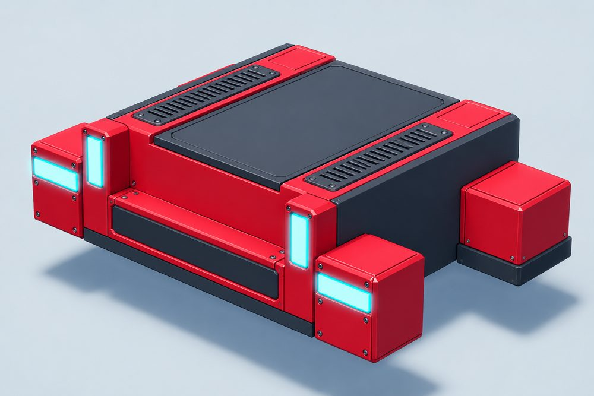

Blockout: 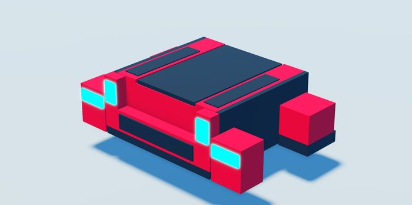

One unit. The deck bolts to the cabin's rear bulkhead, and that far-end face (facing away from the camera) must stay flat and plain. Keep these flat and empty: the graphite engine bay pad on top (main turbine), the recessed tail notch (afterburner), the underside graphite pad (diffuser), the flat top of each tail corner block (wing pads) and the plain graphite flank wall between the haunch and the tail corner (blanked stabiliser arch). The blockout geometry shows two mirrored tail corner blocks with lamp bars, two tall tail lamps, two shoulder louvre panels and a mirrored pair of red haunch blocks on dark plinths (only the right one is visible from this angle, the left one is hidden behind the deck). The side engines mount along the shoulders beside the louvre panels.

### Side Pods: Strake Intakes

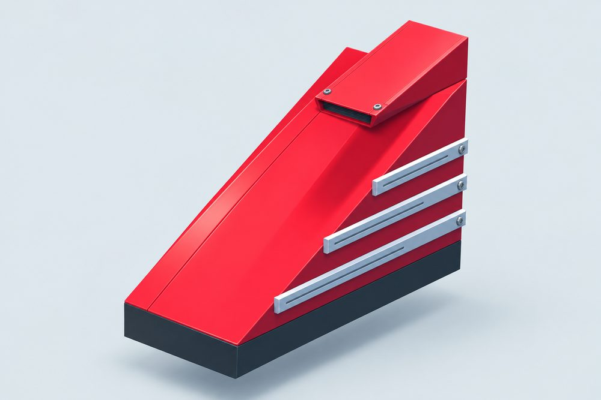

Blockout: 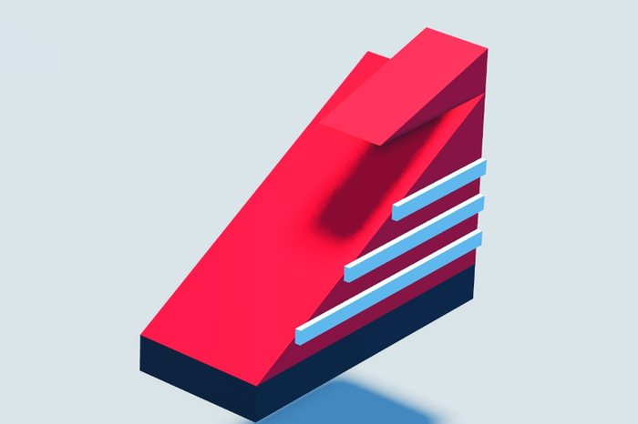

Mirrored pair. One unit shown. Strake Intakes (wedge_SidePods) is one unit of a mirrored pair, one on each side of the cabin; model one and mirror it. The inner face, the side facing away from the camera, must stay completely flat and plain: it bolts to the flat pad on the cabin side between the stabiliser arches. The underside of the graphite sill must also stay flat. The red top, the intake hood and the red outer face are body paint (Primary), the three strake blades are satin silver (Secondary), and the sill and the hood louvres are matte graphite (Detail). The part has no glass and no glowing elements.

### Main Turbine: Mono Turbine

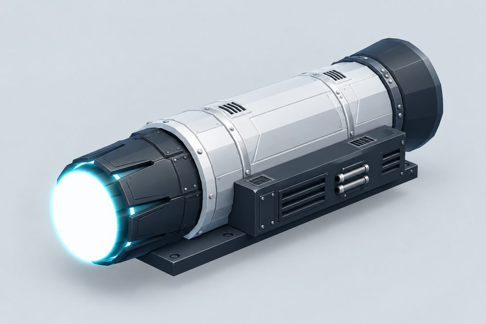

Blockout: 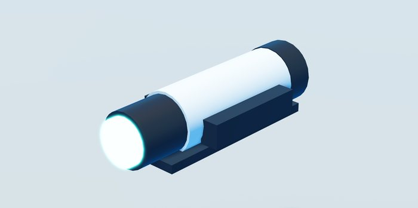

One unit only. The flat cradle plate bolts onto the engine bay pad on the Engine Deck (RearBody), behind the cabin, with the turbine open to the sky: keep the cradle's underside and its top face flat and plain. The glowing nozzle end is the rear and faces back; the dark bellmouth intake is the front and faces the cabin. Casing is the Secondary (silver) channel; nozzle, bellmouth, accessory block and cradle are Detail (graphite); the exhaust face is Neon/Thrust (cyan-white glow).

### Side Engines: Ram Boxes

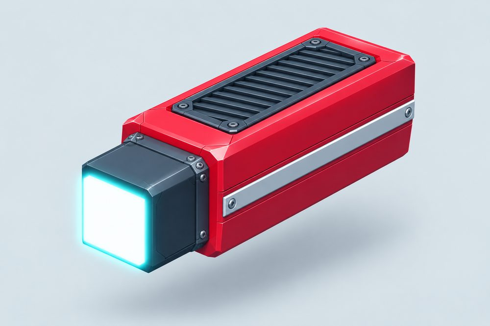

Blockout: 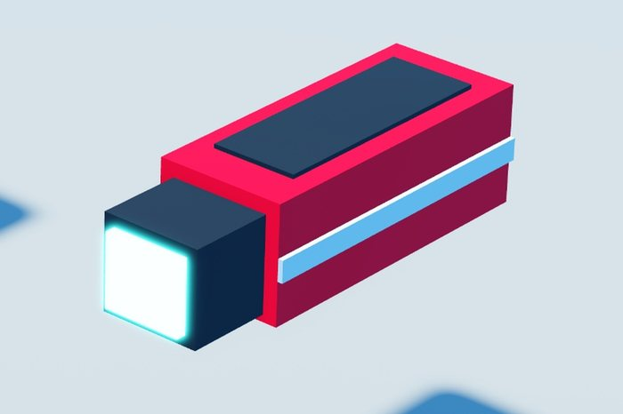

Mirrored pair. One unit shown. One unit shown; the part is a mirrored pair, one on each rear shoulder of the Engine Deck, nozzle pointing back. The inner side (hidden in the view) and the underside must stay flat and plain: they bolt to the deck's shoulder rail, so keep them free of fins, pods or struts. The silver stripe, the graphite top vent and the nozzle block with its square cyan-white exhaust are all on the outer side, top and rear only. Model the exhaust as a flat square, not round. The paint channels are red primary, silver secondary (stripe), graphite detail (vent and nozzle block) and cyan-white neon and thrust (exhaust face).

### Stabilisers: Vector Pods

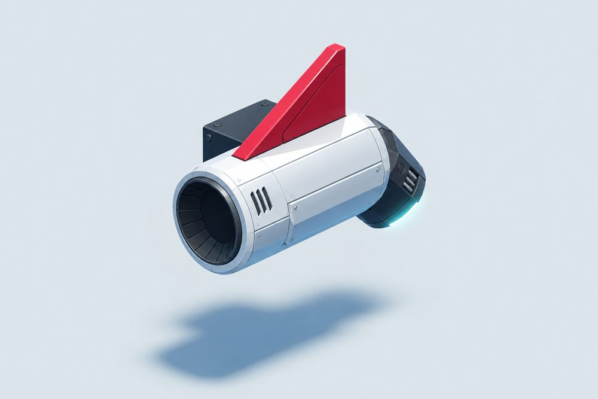

Blockout: 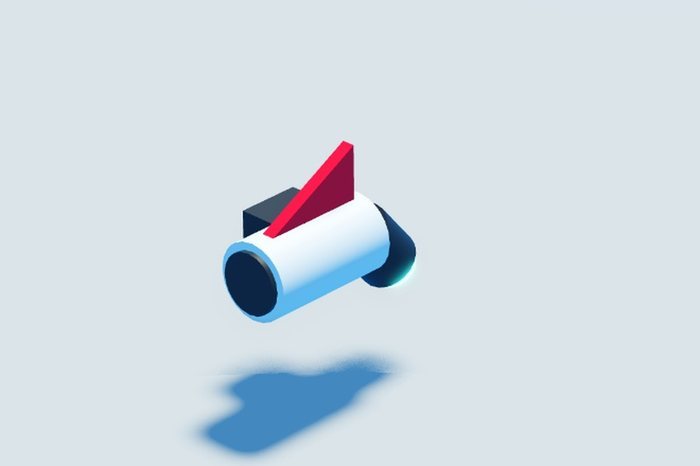

Four units, one per arch. One unit shown. Vector Pod, one unit of four (one per arch, two left and two right, mirrored), the jet pointing down and back. It bolts to the car body by the dark graphite mounting arm on its inboard side, so keep that arm's inboard face flat and plain, with no detail proud of it, because the body's blanked arch pad meets it there. Build the silver pod as a simple faceted cylinder; the red fin on top and the angled graphite nozzle block at the rear are separate shapes, and the cyan glow lives only on the nozzle's lower rear edge. The intake at the front is a recessed dark mouth with blade facets, and the pod must stay longer than it is wide.

### Afterburner: Quad Cans

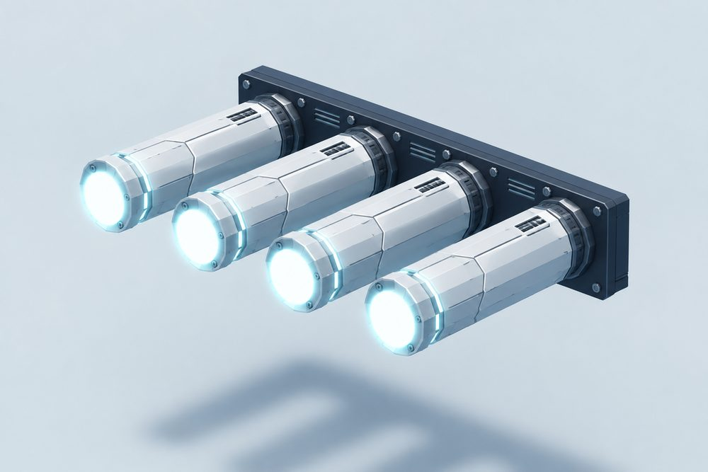

Blockout: 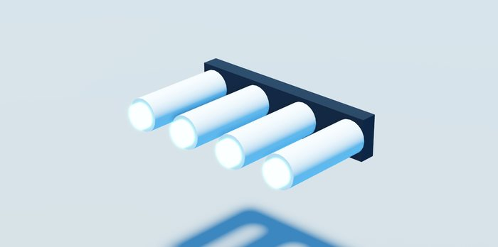

Quad Cans (wedge_Boost, Afterburner) sits in the tail notch of the Engine Deck and bolts to the tail wall by the back face of the single graphite plate. That face and the plate edges must stay flat, plain and unbroken. One unit is shown. It holds four identical silver cans, standing out from the plate at a right angle and pointing straight back, each ending in a glowing nozzle. Model one can and instance it four times at even spacing.

### Splitter: Chin Blade

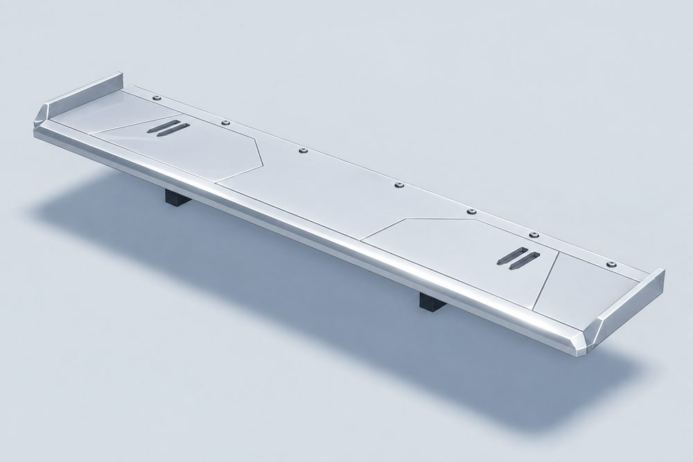

Blockout: 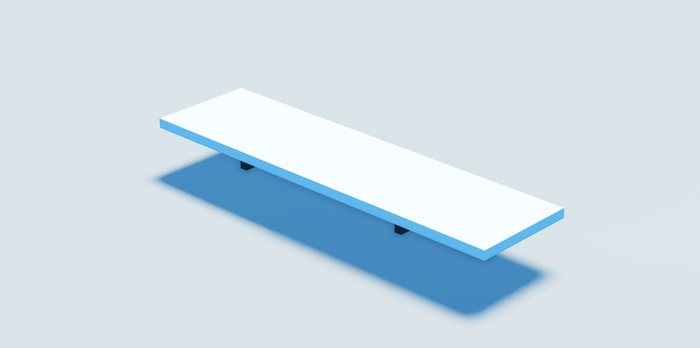

One Chin Blade (wedge_FrontBumper, slot FrontBumper) is shown, a single unit as wide as the car. It bolts under the nose, onto the flat pad that the Nose (FrontBody) carries underneath, through its two graphite posts at about a quarter and three quarters of the blade's width. Keep the top of each post and the underside of the blade around the posts flat and plain so they mate cleanly with the pad. The blade stays thin, flat and wide. Only the leading-edge lip, the two small end fences and the shallow panel and vent detail may be modelled on top. Paint channels: the whole blade is Secondary (satin silver); the two posts are Detail (matte graphite).

### Diffuser: Strake Diffuser

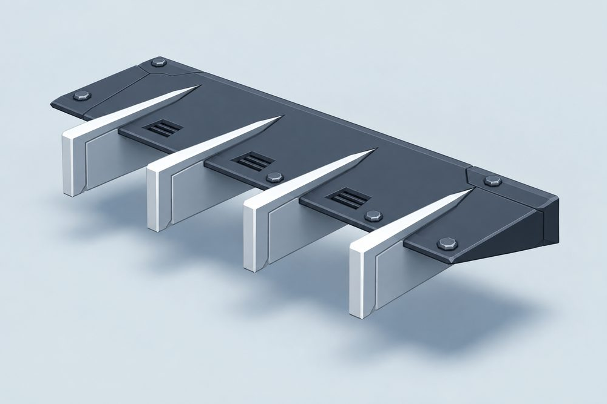

Blockout: 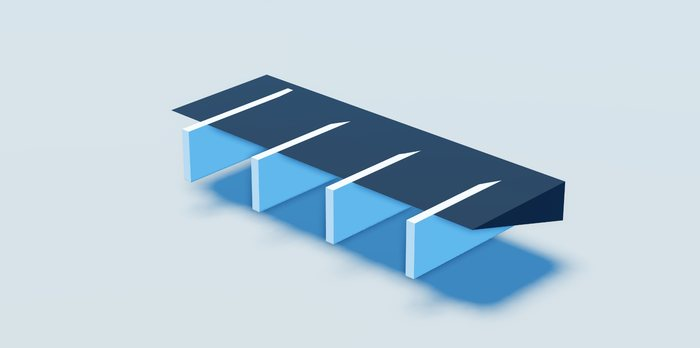

One unit, no pair. The large flat upper face of the graphite undertray plate must stay flat and plain, because it bolts flat onto the pad under the tail of the Engine Deck (RearBody). Keep the rear edge simple. The four silver strakes are vertical blades running front to back, evenly spaced across the width, each tapering to a point at the rear. The right-hand end of the plate (as drawn) is a thicker darker wedge block. All graphite and silver are paint-channel zones (Detail and Secondary).

### Wing: Poster Wing

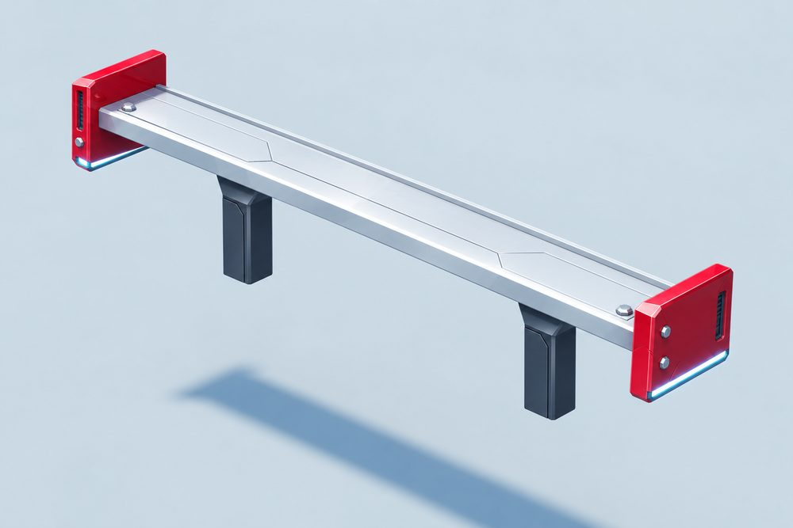

Blockout: 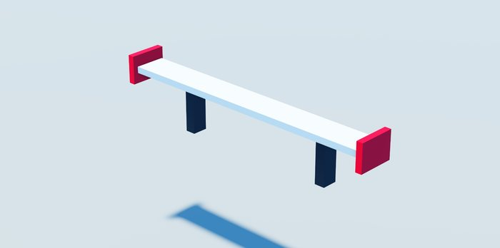

One unit only, the whole wing as a single part. It bolts onto the two wing pads at the tail corners of the Engine Deck (RearBody) through the flat, plain, square bottom faces of its two graphite uprights, which sit about a quarter of the span in from each tip, so keep those two faces flat and unmarked. The red end plates, silver plane and graphite uprights are three separate paint channels (Primary, Secondary, Detail). The thin cyan-white strips on the lower edge of each end plate are the only glow and should be a Neon channel.

## Hyper kit modules

### Nose: Keel Nose

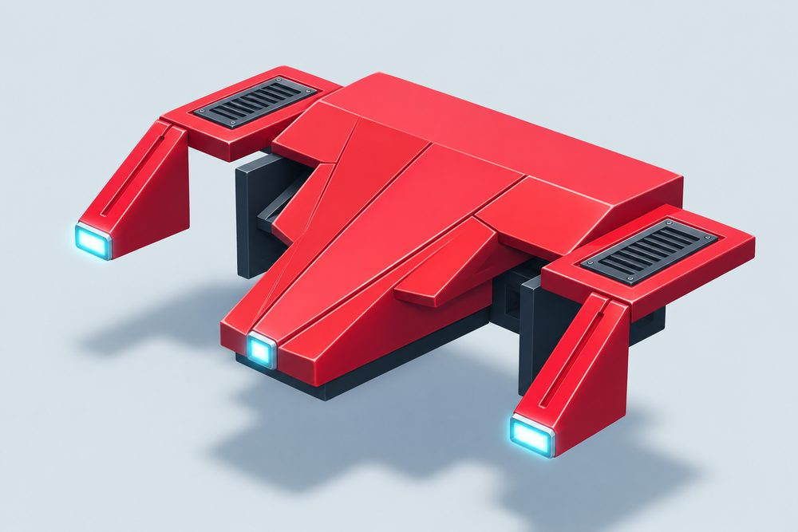

Blockout: 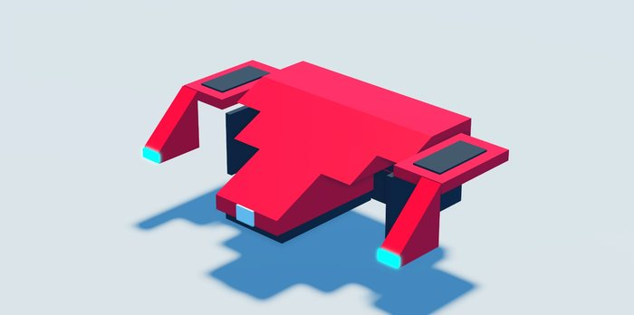

Keel Nose (hyper_FrontBody) is one unit. Its rear edge is a flat, plain bulkhead face at the upper back that bolts to the cabin's flat front bulkhead, so keep that face flat. The flat graphite underside under the keel is the splitter (FrontBumper) pad and must stay flat. The nose also carries the scuttle under the windscreen and a blanked stabiliser arch each side. The two open side channels are the see-through gaps between the keel and the fenders, so model the dark graphite spar behind them. The fenders float, with a slatted graphite vent panel on top of each. The cyan lamps are on the two fender tips and on the front face of the keel tip, three in total.

### Engine Deck: Tunnel Tail

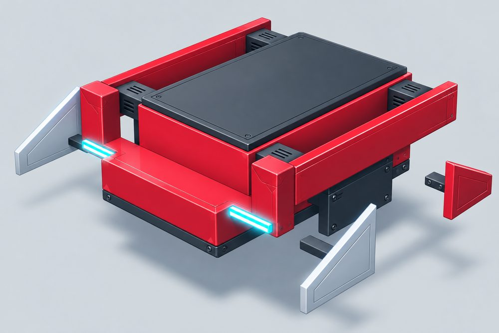

Blockout: 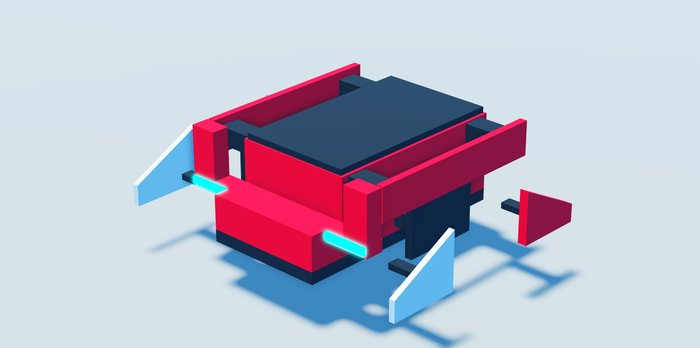

Single part, one unit (the Engine Deck, RearBody slot), bolts to the cabin's rear bulkhead at the far end, which must stay a flat plain face. Keep these faces flat and plain: the big engine bay pad on top (main turbine sits there, open to the sky), the notch in the centre of the tail face (afterburner sits there), the flat tops of the two tail corner posts (wing pads), the underside pad (diffuser) and the blanked arch areas under the rails (stabilisers). The two shoulder rails take the side engines (mirrored pair, nozzles pointing back). The two silver blades and one red end plate (the matching red plate on the other side is hidden in the blockout and was not drawn) are outrigger pieces on short dark struts, three struts in total.

### Side Pods: Floating Blades

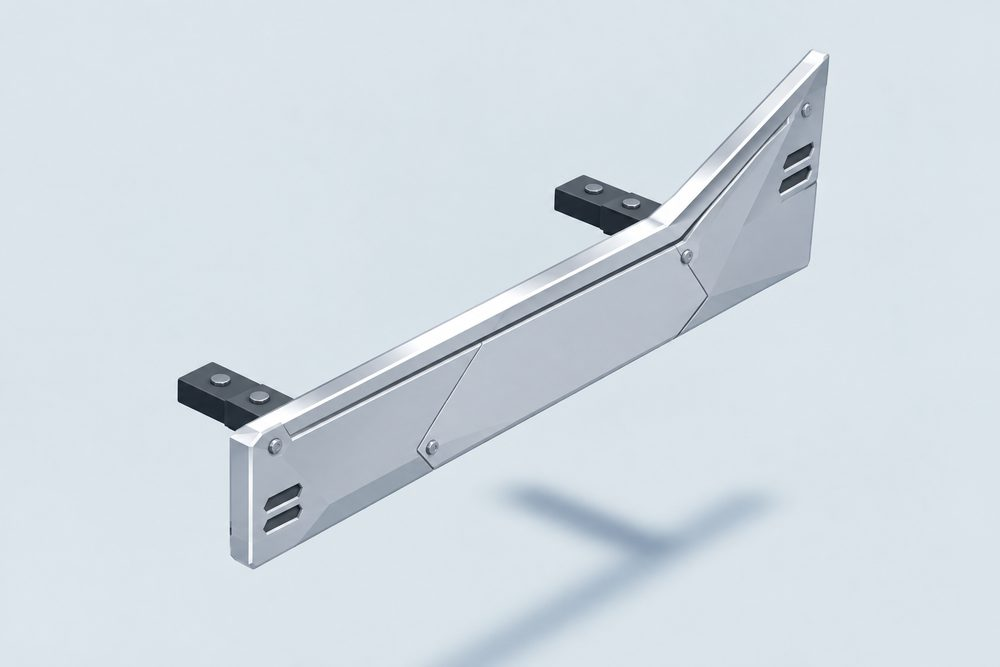

Blockout: 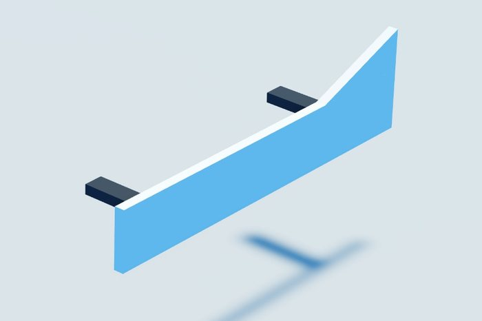

Mirrored pair. One unit shown. Mirrored pair, one unit on each side of the cabin; this image shows one. The two graphite struts stick out from the inboard (far) face of the blade, pointing towards the cabin, and bolt onto the flat side pad of the cabin between the nose and engine-deck arches. Their free end faces must stay flat, plain and square, with nothing sticking out. The blade itself floats clear of the body and is purely decorative aero: it is a thin plate with a straight bottom edge, a gentle rise along the top, then a sharp kick-up over the rear third. Keep the top-edge glow strip as a separate neon material. The silver blade uses the Secondary channel, the struts the Detail channel.

### Main Turbine: Top-Exit Core

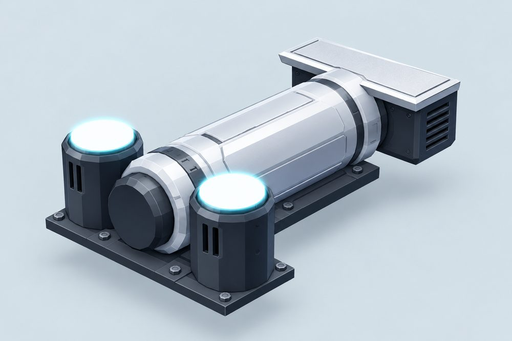

Blockout: 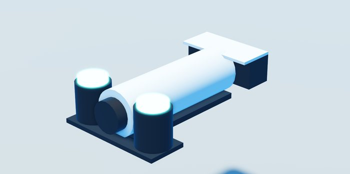

Sits on the engine bay pad of the Engine Deck behind the cabin, open to the sky, with the long axis running front to back. The flat undersides of the graphite cradle and the wide heat-shield plate must stay flat and plain, because they bolt down onto the pad. Keep the area behind the cabin's rear bulkhead clear, since the scoop block and lip face forward toward it. The two vertical stacks fire straight up. Both thrust glows are mirrored left and right of the tail cap. One unit is used per vehicle. Note: the blockout puts the dark round cap at the rear (tail cap, between the stacks) and the ram scoop at the front; the brief text called the cap an intake cap, but the image follows the blockout.

### Side Engines: Stacked Pairs

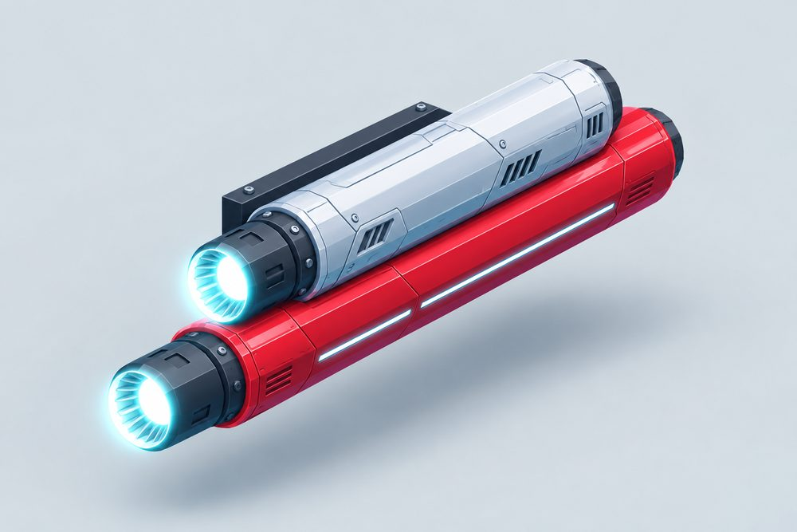

Blockout: 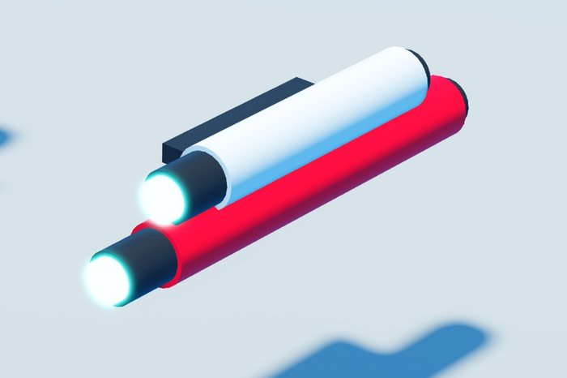

Mirrored pair. One unit shown. Stacked Pairs side engine (Engine2, Hyper kit): a mirrored pair, one unit on each rear shoulder rail of the Engine Deck, nozzles pointing back; ONE unit is shown, so build one and mirror it for the other side. The dark graphite mounting plate on the inboard side is the part that bolts to the shoulder rail, so keep its inboard face flat and plain with nothing protruding. Keep the upper silver tube and lower red tube parallel with the red one slightly longer at both ends, and keep the two nozzle sections and exhaust faces at the rear end only.

### Stabilisers: Aero Blades

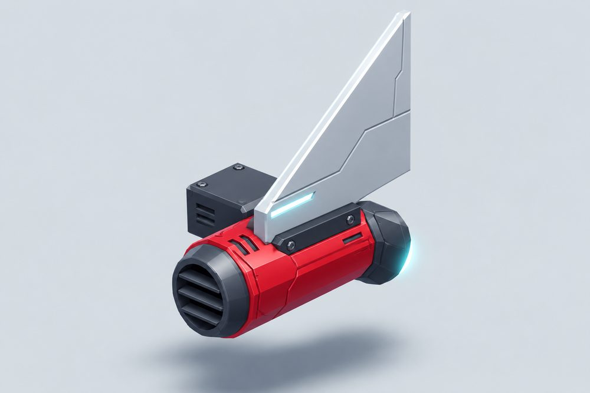

Blockout: 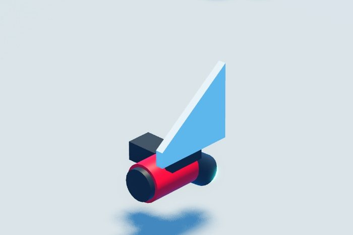

Four units, one per arch. One unit shown. One of four identical Aero Blade stabiliser units, one per arch (two on the nose, two on the engine deck), and one is shown. The dark graphite mount block (flat top and flat back face) is the part that bolts into the blanked arch on the body, so keep those faces flat and plain. The flat pad on top of the pod under the blade is a plain seat and also stays flat. The jet nozzle is at the camera-facing end of the pod and points down and back; the far end is a rounded graphite cap with a thin cyan edge light. The pod is a long jet body with no spokes or rim, so do not model it as a wheel. Paint channels: red body is Primary, the silver blade is Secondary, the graphite is Detail, and the cyan glows are Neon/Thrust.

### Afterburner: Tri Cluster

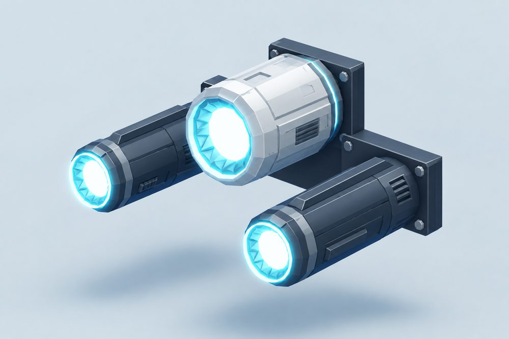

Blockout: 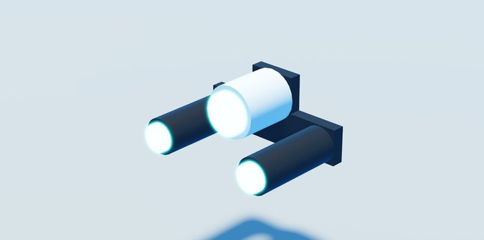

Tri Cluster (hyper_Boost) is a single Boost afterburner unit that sits in the tail notch of the Hyper Engine Deck, with the flat rear faces of its dark back plates bolting flush to the tail wall; keep those plate faces perfectly flat and plain. The nozzles point straight back, away from the tail wall, and the three cans must stay in the triangle with the fat silver can on top and the two slim graphite tubes below, nozzles of the lower pair projecting further back than the silver one. It is one unit (not a pair); the cyan-white glow is the only emissive area (nozzles, nozzle rims and the thin collar strip on the silver can).

### Splitter: Keel Planes

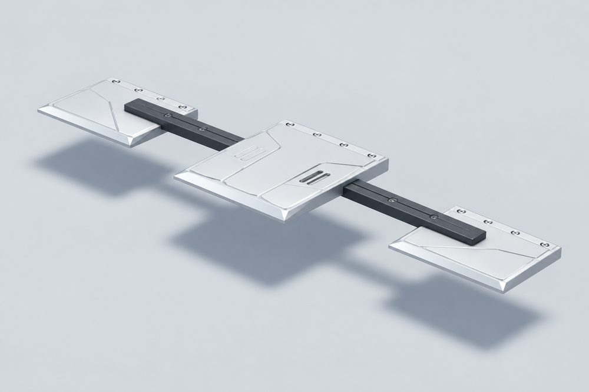

Blockout: 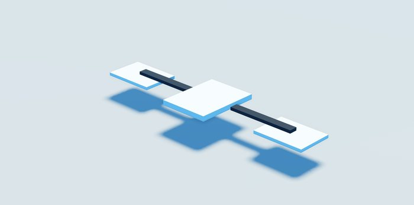

One splitter unit (not paired) that bolts under the Nose (FrontBody) onto its flat underside pad. The top faces of the centre plane and of the graphite bar are the mounting faces, so keep them flat, plain and square-edged with only faint panel lines. The two side planes are identical mirrored copies; model them thin and flat, with no fences or posts. Keep the planes satin silver (Secondary paint) and the bar matte graphite (Detail paint); there is no glow part.

### Diffuser: Venturi

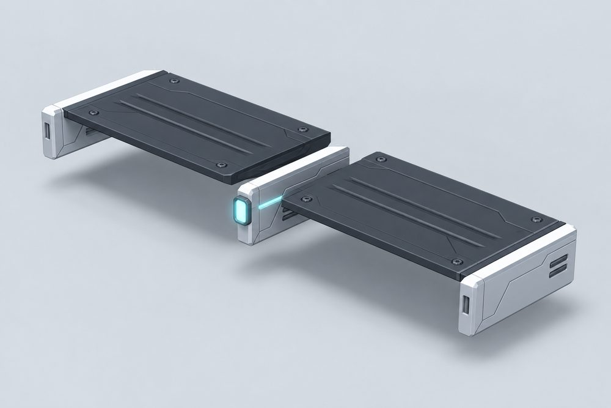

Blockout: 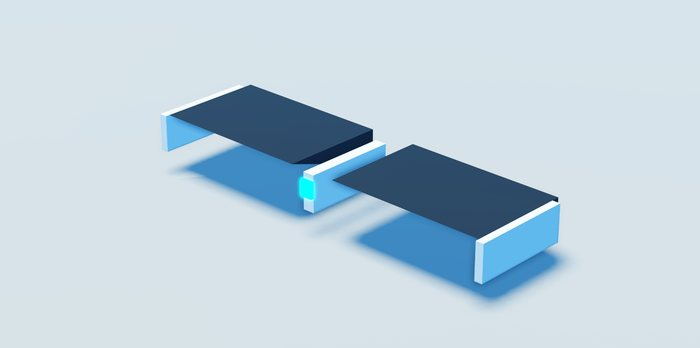

Venturi (hyper_RearBumper, RearBumper slot) is one unit that bolts up under the tail of the Hyper engine deck, onto the deck's flat underside diffuser pad. Keep flat and level: the top edges of all three silver walls (one shared plane) and the upper faces of the two graphite floors, which carry only panel lines and bolt heads. The three walls are tall and thin and hang below the floors; the two floors span between them, one between left and centre wall and one between centre and right wall. Only one cyan lamp exists, on the rear end face of the centre wall. Paint channels: silver walls are Secondary, graphite floors and vents are Detail, cyan lamp and strip are Neon. One unit only, not paired.

### Wing: Active Blade

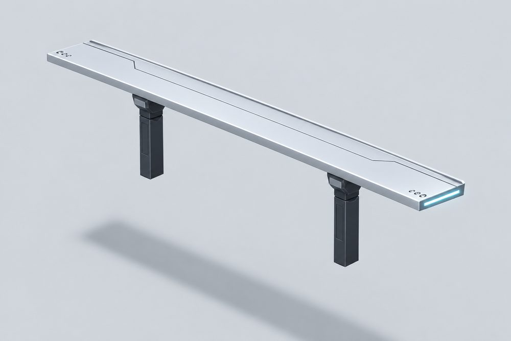

Blockout: 

One unit. The two graphite struts bolt onto the two wing pads at the tail corners of the Engine Deck (RearBody), so keep their bottom faces flat, plain and square, set a quarter in from each end of the blade. The blade is a plain thin full-width plank with bare tips and no end plates. Keep the blade top and underside flat. The glow strips go flush in the two end faces (only the near one is visible in the image).

## Combinations

The same parts assembled. Each vehicle was drawn from its blockout screenshot plus a sheet of the part images above.

### Wedge cockpit, Wedge kit (native)

Nose: Shovel Nose, Engine Deck: Slab Deck, Side Pods: Strake Intakes, Main Turbine: Mono Turbine, Side Engines: Ram Boxes, Stabilisers: Vector Pods, Afterburner: Quad Cans, Splitter: Chin Blade, Diffuser: Strake Diffuser, Wing: Poster Wing.

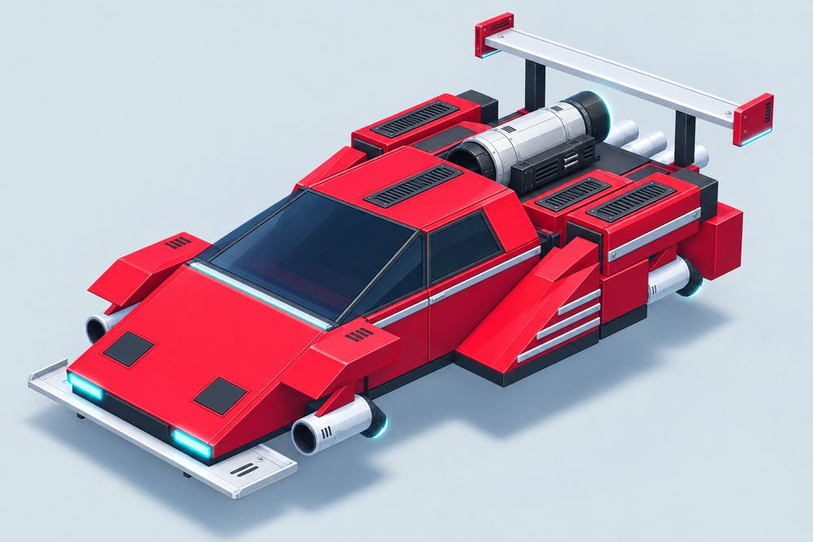

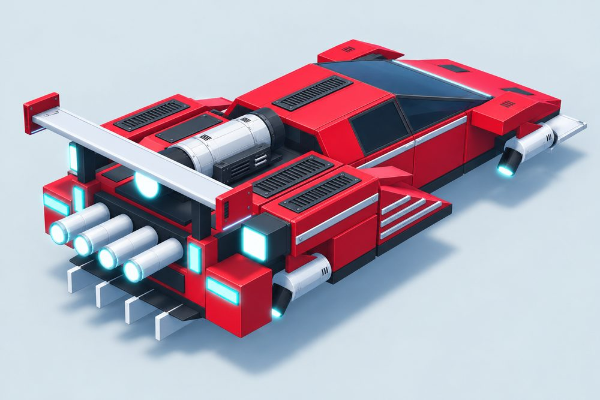

Blockouts: 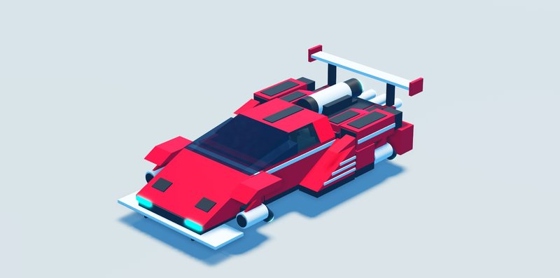 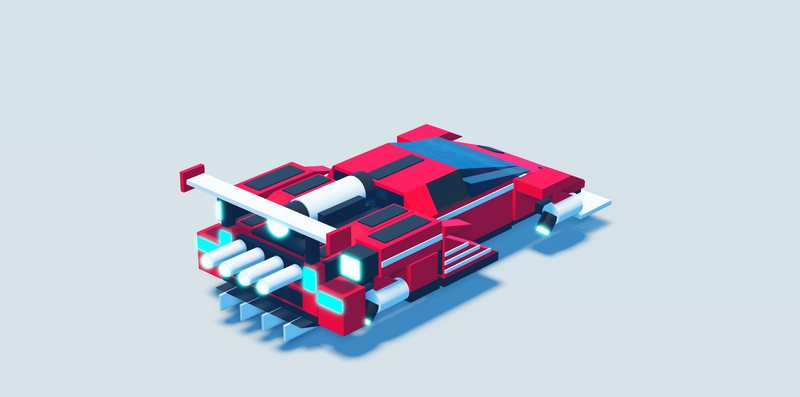

### Hyper cockpit, Hyper kit (native)

Nose: Keel Nose, Engine Deck: Tunnel Tail, Side Pods: Floating Blades, Main Turbine: Top-Exit Core, Side Engines: Stacked Pairs, Stabilisers: Aero Blades, Afterburner: Tri Cluster, Splitter: Keel Planes, Diffuser: Venturi, Wing: Active Blade.

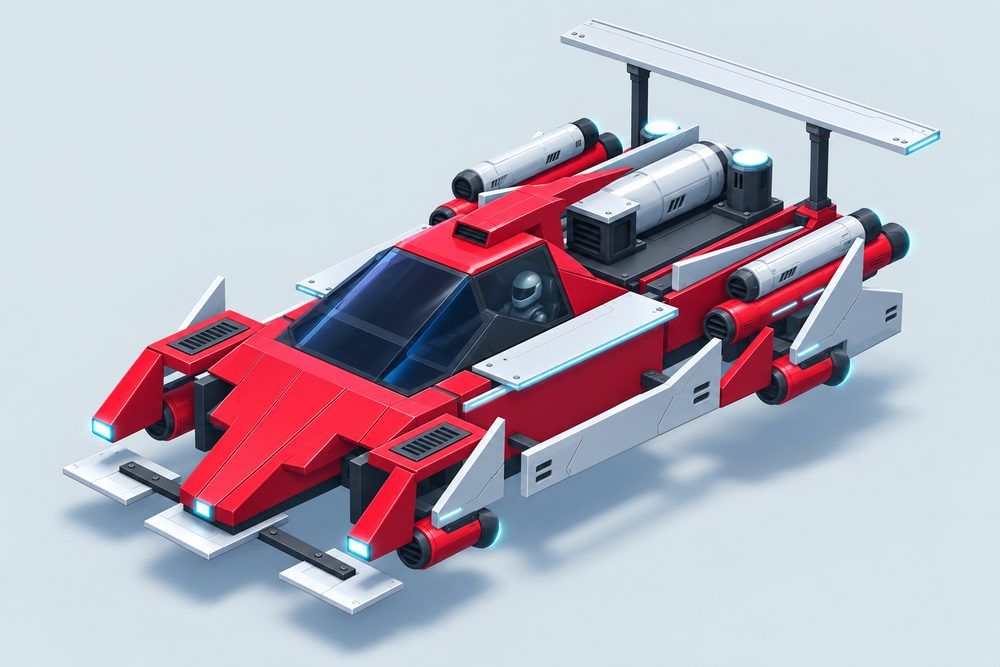

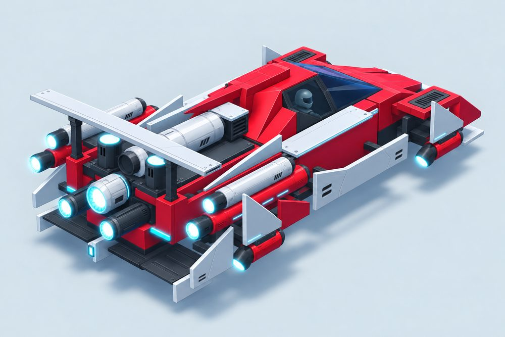

Blockouts: 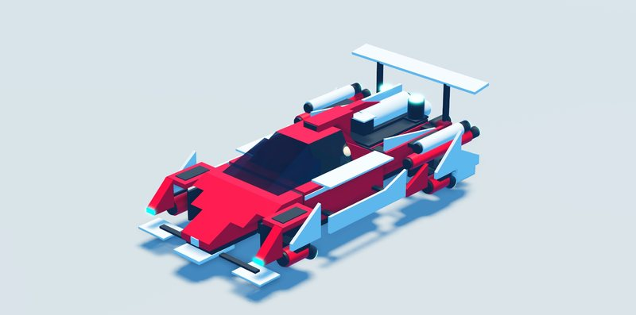 

### Wedge cockpit, Hyper kit (kit swap)

Nose: Keel Nose, Engine Deck: Tunnel Tail, Side Pods: Floating Blades, Main Turbine: Top-Exit Core, Side Engines: Stacked Pairs, Stabilisers: Aero Blades, Afterburner: Tri Cluster, Splitter: Keel Planes, Diffuser: Venturi, Wing: Active Blade.


Blockouts:  

### Hyper cockpit, Wedge kit (kit swap)

Nose: Shovel Nose, Engine Deck: Slab Deck, Side Pods: Strake Intakes, Main Turbine: Mono Turbine, Side Engines: Ram Boxes, Stabilisers: Vector Pods, Afterburner: Quad Cans, Splitter: Chin Blade, Diffuser: Strake Diffuser, Wing: Poster Wing.


Blockouts:  

### Wedge cockpit, Wedge body, Hyper jets (mix)

Nose: Shovel Nose, Engine Deck: Slab Deck, Side Pods: Strake Intakes, Main Turbine: Top-Exit Core, Side Engines: Stacked Pairs, Stabilisers: Aero Blades, Afterburner: Tri Cluster, Splitter: Chin Blade, Diffuser: Strake Diffuser, Wing: Poster Wing.


Blockouts:  

### Hyper cockpit, Hyper body, Wedge jets (mix)

Nose: Keel Nose, Engine Deck: Tunnel Tail, Side Pods: Floating Blades, Main Turbine: Mono Turbine, Side Engines: Ram Boxes, Stabilisers: Vector Pods, Afterburner: Quad Cans, Splitter: Keel Planes, Diffuser: Venturi, Wing: Active Blade.


Blockouts:  

### Wedge cockpit, Hyper front and sides, Wedge rear (mix)

Nose: Keel Nose, Engine Deck: Slab Deck, Side Pods: Floating Blades, Main Turbine: Mono Turbine, Side Engines: Stacked Pairs, Stabilisers: Aero Blades, Afterburner: Quad Cans, Splitter: Keel Planes, Diffuser: Strake Diffuser, Wing: Poster Wing.


Blockouts:  

### Hyper cockpit, Wedge front and sides, Hyper rear (mix)

Nose: Shovel Nose, Engine Deck: Tunnel Tail, Side Pods: Strake Intakes, Main Turbine: Top-Exit Core, Side Engines: Ram Boxes, Stabilisers: Vector Pods, Afterburner: Tri Cluster, Splitter: Chin Blade, Diffuser: Venturi, Wing: Active Blade.


Blockouts:  
