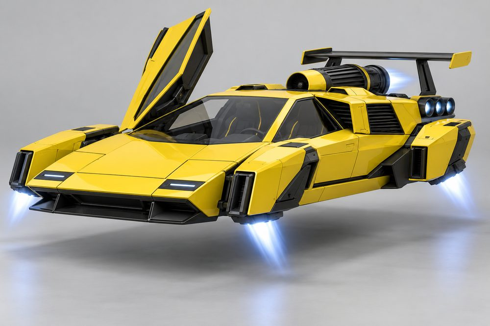
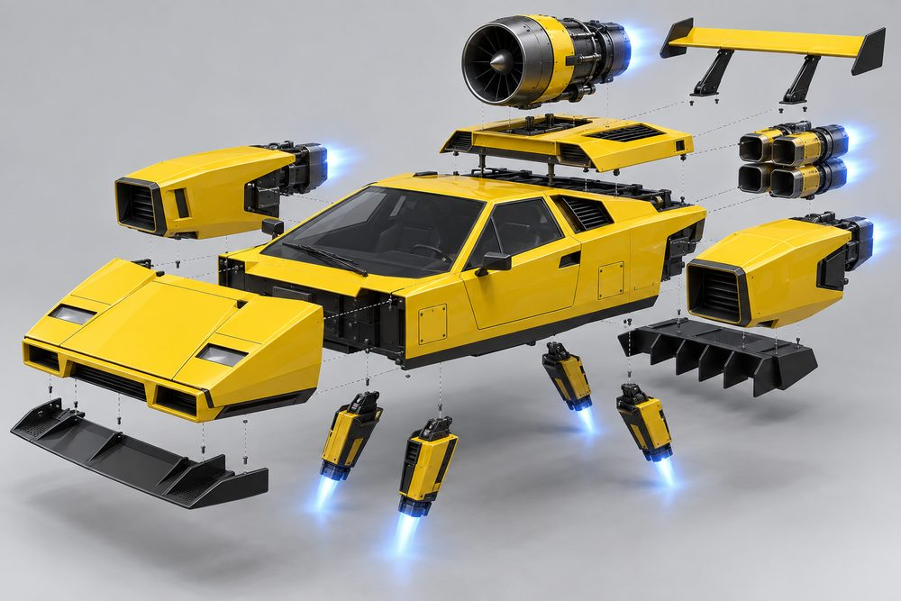
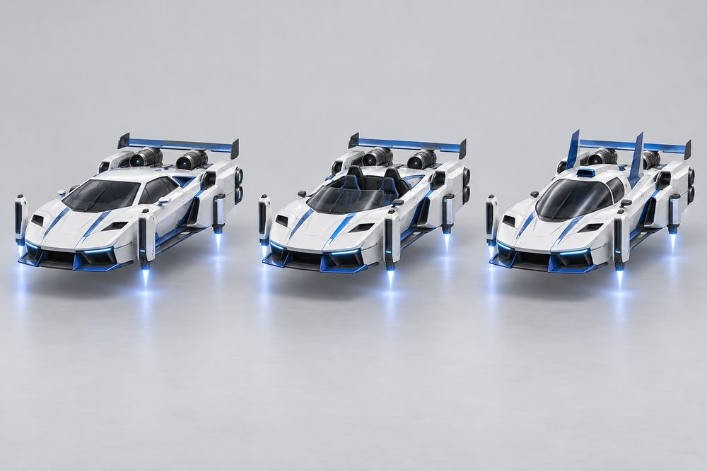
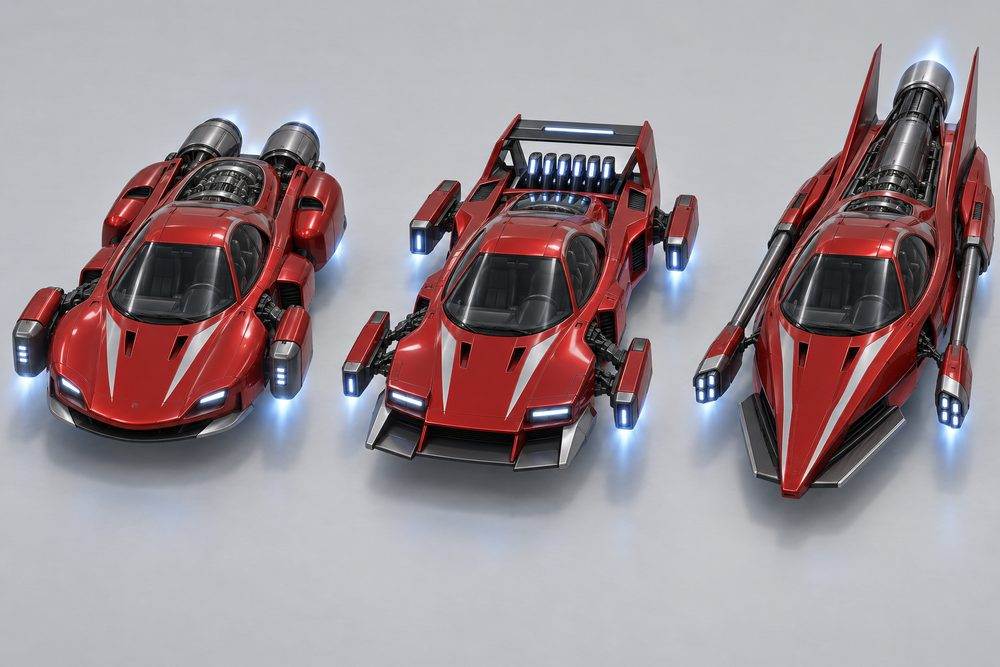
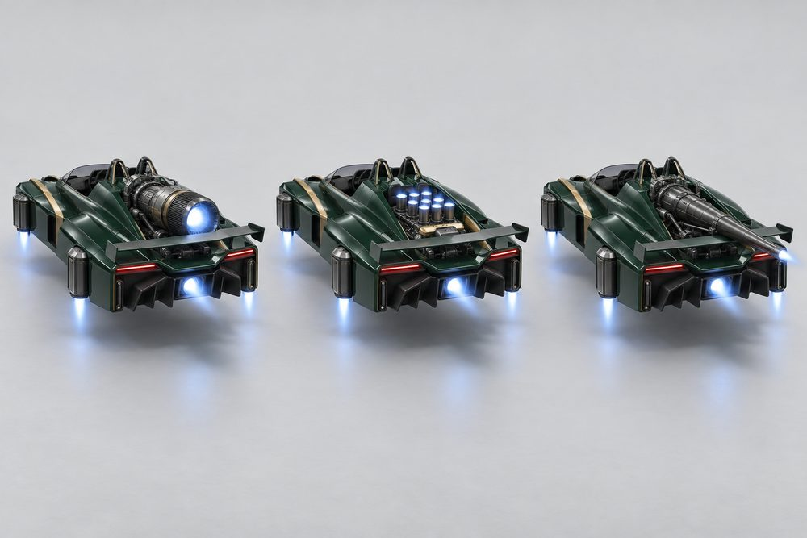
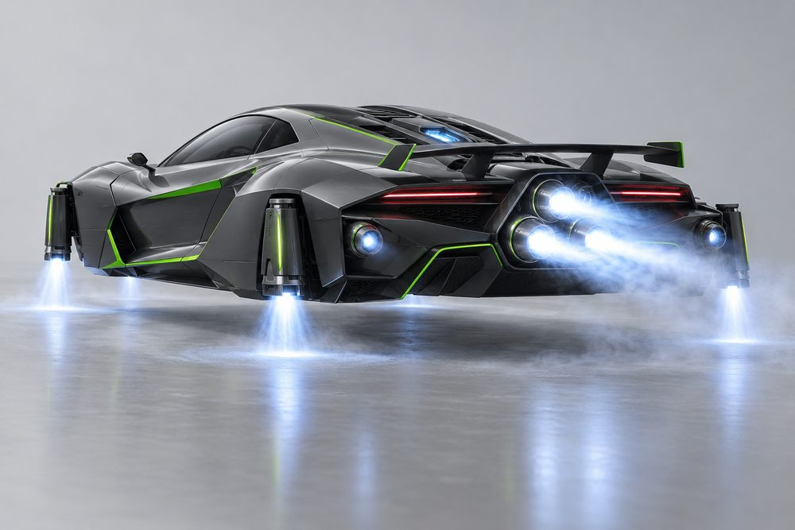
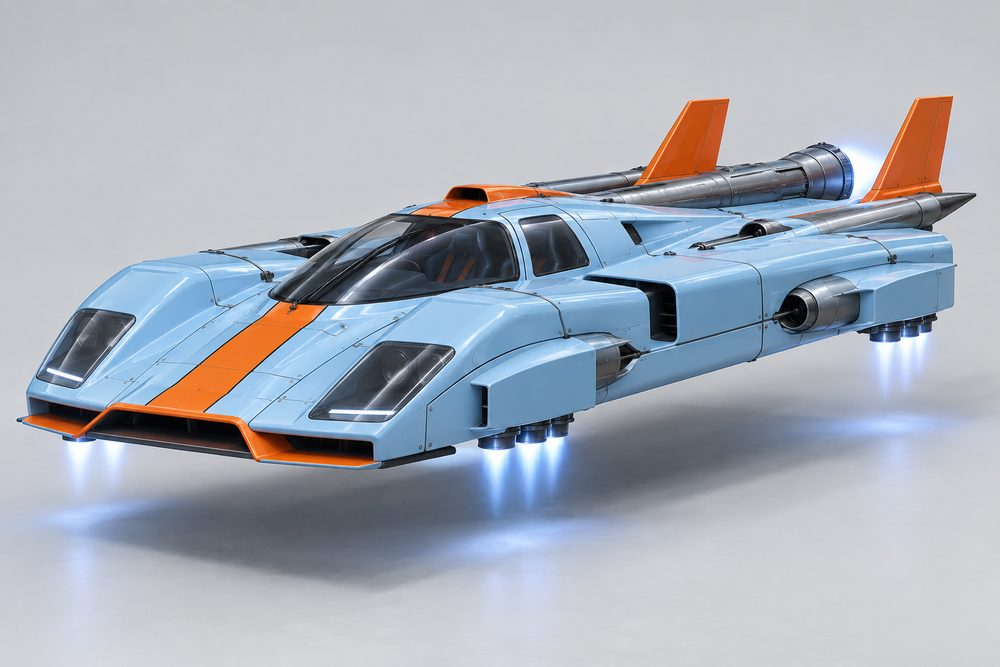
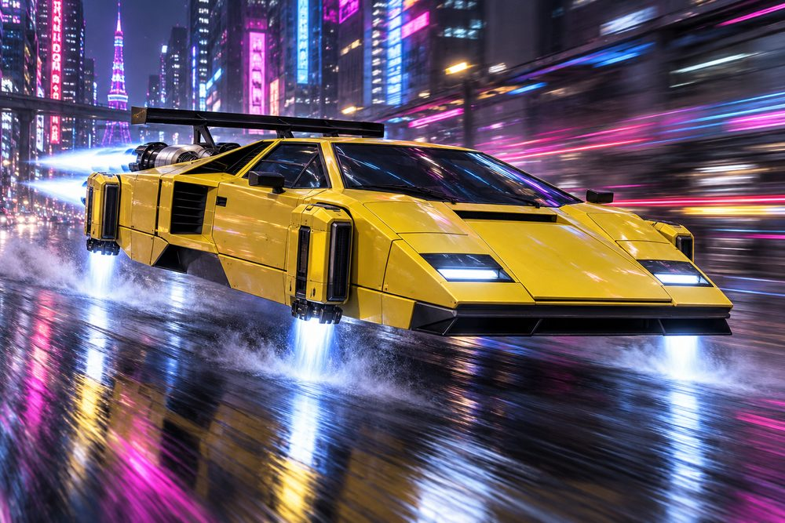

# Exotic (`exotic`): class sheet, round 2

Status: design exploration, round 2, 2026-10-01. Nothing here is approved or game content.
Brief: [exploration contract](../../../scripts/vehicle_blockouts/CONTRACT.md). Parent: [vehicle frame classes](../vehicle-frame-classes.md). Geometry: [frame standard](exotic-frame.md). Prompts and full-size art: `output/vehicle-categories-2026-10-01/exotic/`.

This is a new class in round 2. It follows Oscar's feedback: real cars first, then jets instead of wheels. Engines, stabilisers and boost are real modules on every build.

## Pitch

Real mid-engined supercars and hypercars, turned into hover jets. Low, wide and cab-forward, with the engine behind the cabin. The wheels are gone. The arches are blanked off or hold a lift jet. A big turbine sits on the deck behind the driver. Side engines sit on the haunches. A cluster of afterburner nozzles replaces the exhaust.

## Player fantasy

You own the poster car. It is the loudest, lowest and most expensive thing at the meet. You pick your era: a 70s wedge with scissor doors, a curvy 90s special, a modern hypercar, an open track toy, a Le Mans longtail or a gullwing show car. Then you choose how the engine looks, because in this class the engine is the jewellery. People name the car at a glance and crowd round to see the turbine.

## Culture lines

Real models are body-style references only. There are no badges, no logos and no text.

- **Wedge:** 70s and 80s poster cars. Flat roof, scissor doors, shoulder air boxes. Reference: Lamborghini Countach, Lotus Esprit. Yellow, white, black.
- **Analogue:** 90s curves. Round roof, glass fastback, round pods. Reference: Ferrari F40, McLaren F1, Jaguar XJ220. Red, silver.
- **Hypercar:** modern and extreme. Narrow canopy, floating blades, active wing. Reference: Bugatti Chiron, Koenigsegg Jesko. Pearl, graphite, electric blue.
- **Track Special:** the road-legal race car. Open frame, bare arches, big splitter. Reference: Ariel Atom, McLaren Senna. Racing green, gold.
- **Longtail:** endurance specials. Long smooth body, tail fins, one huge bore. Reference: Porsche 917 long-tail, McLaren 600LT. Pale blue, orange.
- **Concept:** show cars. Gullwing doors, glass engine cover, split slots. Reference: Mercedes C111, SLS. This sixth line is new; the brief lists five. Silver, violet.

## Cockpits

The cockpit is the cabin, the glass and the roofline. Every cockpit wears its own signature kit. All six are built in the blockout.

| Name | Culture | Silhouette | Signature kit | Tier |
|---|---|---|---|---|
| Spider | Track Special | Open top, low screen, two roll humps | Track | E |
| Curve | Analogue | Round teardrop roof band, glass fastback | Analogue | D |
| Wedge | Wedge | Flat razor roof, screen far forward, scissor doors | Wedge | C |
| Longtail | Longtail | Low bubble, roof scoop, rising twin fins | Longtail | B |
| Hyper | Hypercar | Narrow canopy, shoulder wings, snorkel, dorsal fin | Hyper | A |
| Gull | Concept | Wide glasshouse, roof spine, glass turbine cover | Concept | S |

## The fundamentals

Every Exotic has all four. Each shows an intake, a body and a glowing nozzle from outside.

| Slot | Label | Where it sits | Options |
|---|---|---|---|
| `Engine1` | Main Turbine | On the deck behind the cabin, between the buttresses. The mid-engine statement. Open to the sky and the chase camera. | **Mono Turbine:** one fat turbine, bellmouth forward, nozzle out the back. **Twin Spool:** two slim turbines under a flat glass lid. **Top-Exit Core:** short compact core, twin stacks firing straight up. **Eight Stack:** a low block under eight open trumpets, twin megaphones. **Lance Turbine:** slim and low, a long pipe, a flat fishtail nozzle. **Cross Barrel:** one barrel set crossways, a periscope intake, one nozzle. |
| `Engine2` | Side Engines | One on each rear haunch, fed by the side pods. Nozzles point straight back. Replace the side-intake radiators. | **Ram Boxes:** a tall square box per side, big square nozzle. **Round Pods:** one short round pod per side on a pylon. **Stacked Pairs:** two slim tubes per side, one above the other, four nozzles. **Stub Burners:** a short fat burner at the tail, a thin exposed pipe. **Long Lances:** a low fairing along the deck and a long can past the tail. **Ear Scoops:** a tall narrow scoop by the cabin, a small nozzle. |
| `Stabilisers` | Stabilisers | Four units, one in each blanked arch. Read from the front three-quarter and from above. | **Vector Pods:** a fat pod per corner, nozzle vectored down and back. **Twin Lift Cans:** two tall lift cans per corner. **Aero Blades:** a tall blade outboard, a flat slot jet in the arch. **Outriggers:** a slim nacelle on two wishbone arms. **Spat Trios:** a body-colour spat over the arch, three small jets below. **Canard Tip Jets:** a flat canard from each arch, a long jet on its tip. |
| `Boost` | Afterburner | In a notch in the centre of the tail, high, under the turbine nozzle. The last thing the chase camera sees. | **Quad Cans:** four long slim cans in a row. **Twin Cannons:** two big cannons. **Tri Cluster:** three small cans in a tight triangle. **Slot Burner:** one wide flat slot, very short. **Big Bore:** one long big-bore can. **Split Slots:** two tall narrow slots, wide apart. |

## Body and cosmetic slots

`Hood`, `Roof` and `Accessory` are not used. The cockpit owns the roofline and the glass.

| Slot ID | Label | Options |
|---|---|---|
| `FrontBody` | Nose | **Shovel Nose:** one flat plane from a chisel lip to the windscreen. **Droplet Nose:** short rounded bonnet, peaked fenders. **Keel Nose:** needle keel, open air channels, floating fender blades. **Blunt Nose:** short blunt face, big intake, bare arches. **Lowline Nose:** two tall lamp towers, a valley between. **Visor Nose:** flat low platform, full-width light visor. |
| `RearBody` | Engine Deck | **Slab Deck:** boxy, full width, chopped tail. **Boat Tail:** smooth belly, round haunches, narrow rolled tail. **Tunnel Tail:** centre spine, open channels, slim longerons. **Frame Tail:** bare see-through space frame. **Streamer Tail:** swelling haunches, drooping tail corners. **Kamm Tail:** twin hulls, open tunnel, sheer cut-off tail. |
| `SidePods` | Side Pods | **Strake Intakes:** a straked wedge rising from the door. **Torpedo Pods:** a round pod on two pylons, bullet nose. **Floating Blades:** a thin blade off two struts, no pod. **Barge Trays:** wide floor tray, upright barge board. **Full Fairings:** smooth full-height fairing, long stripe. **Waisted Cheeks:** low intake tapering to a pinched waist. |
| `FrontBumper` | Splitter | **Chin Blade:** wide thin blade, one centre fin. **Rolled Lip:** narrow plate, rolled bar on the edge. **Keel Planes:** centre keel with small side planes, widest and flattest. **Plough:** wide plough with end posts, the tallest. **Long Tongue:** narrow plate jutting far forward. **Scoop Bib:** short deep bib, the narrowest. |
| `RearBumper` | Diffuser | **Strake Diffuser:** sloped wedge, two upright strakes. **Rolled Valance:** wide plate, rolled bar on the lower edge. **Venturi:** wedge between tall tunnel walls. **Crash Bar:** thin plate, rail and short posts. **Tail Tray:** the widest and tallest flat tray, tall end plates. **Keel Fin:** narrow tray, one central keel fin. |
| `RearSpoiler` | Wing | **Poster Wing:** one flat plane on two uprights. **Bridge Wing:** narrow plane, sloped trailing flap. **Active Blade:** thin full-width blade on slim struts. **Twin Element:** two stacked planes, big end plates. **Tail Fins:** deep plane, two short upright fins. **Split Winglets:** two separate short planes, tall end plates. |

The splitter, diffuser and wing looks are read from the blockout's sizes and names. Check them against the meshes.

## Signature kits

| Kit | Culture | Native cockpit | What makes it look different |
|---|---|---|---|
| Wedge | Wedge | Wedge | Boxy and sharp: Shovel Nose, Slab Deck, Mono Turbine, Ram Boxes, Vector Pods, Quad Cans, Poster Wing. |
| Analogue | Analogue | Curve | Round and smooth: Droplet Nose, Boat Tail, glass-lid Twin Spool, Round Pods, Torpedo Pods, Twin Cannons. |
| Hyper | Hypercar | Hyper | Open and airy: Keel Nose, Tunnel Tail, Floating Blades, Top-Exit Core, Stacked Pairs, Aero Blades, Tri Cluster. |
| Track | Track Special | Spider | Bare and loud: Blunt Nose, Frame Tail, Eight Stack, Stub Burners, Outriggers, Slot Burner, Plough. |
| Longtail | Longtail | Longtail | Long and low: Lowline Nose, Streamer Tail, Lance Turbine, Long Lances, Spat Trios, Big Bore, Tail Fins. |
| Concept | Concept | Gull | Odd and clean: Visor Nose, Kamm Tail, Cross Barrel, Ear Scoops, Canard Tip Jets, Split Slots. |

Any cockpit takes any kit. The nose and the deck always meet the cockpit at the same seams. Built size is 23.6 to 25.0 long and 10.9 to 11.9 wide.

## Handling intent versus Piercer

Design intent only. No numbers. Bias is relative to a Piercer build of the same tier.

| Stat | Bias | Intent |
|---|---|---|
| TopSpeed | ++ | The class headline. Faster than a Piercer on any long road. |
| Acceleration | + | Light and punchy, with the engine over the drive. |
| Braking | + | Airbrake blades and corner jets bite hard. |
| BoostForce | + | A sharp kick from the afterburner. |
| BoostDuration | - | Short bursts. Spend them well. |
| DriftControl | - | Mid-engine cars snap at the limit. Hard to hold a slide. |
| DriftGrip | 0 | About the same. |
| LateralGrip | + | Low and wide, so it holds a line. |
| SteeringResponse | ++ | Sharp, direct turn-in. The nose points where you look. |
| HoverStability | - | Nervous near the limit. Settles when kept straight. |
| Downforce | + | Real aero. Most on Hyper and Track kits. |
| Drag | - | Slippery body. Longtail is the slipperiest, Track the draggiest. |
| Weight | - | Light. Loses every shove to a Piercer. |

Net: a fast, precise car for a driver who stays tidy. It punishes sloppy slides and rewards clean lines. Main Turbine leans on top speed, Side Engines on acceleration, Stabilisers on grip and braking, Afterburner on boost. Culture nudges it: Wedge quick off the line, Hypercar high downforce, Longtail low drag, Track draggy but grippy.

## Ideas that make Exotic fun to own

1. **The glass lid.** Twin Spool and Cross Barrel sit under glass. You see the turbine spin up in the garage and at red lights. Lifting the cover is the reveal.
2. **Doors as a pose.** Wedge and Gull open upwards. Parked at a meet, doors rise and the engine idles. A free flex for every owner.
3. **Count the cans.** The Afterburner pattern is the tail signature: four needles, two cannons, a triangle, a flat sheet, one plume, two blades. Players will say "tri-cluster" from across the street.
4. **Active aero you can see.** Aero Blades, Active Blade and Canard Tip Jets tilt in turns and flick up on braking. The stabilisers work in view of the camera.
5. **Wolf in a poster.** A Spider with the Longtail kit looks gentle and runs like a Le Mans car. A Wedge in Longtail trim is a 70s poster with an endurance tail.
6. **Heritage paint.** Era colourways with invented names: signal yellow and black, rosso and silver, pearl and blue, racing green and gold. Geometric stripes only, no text.
7. **Open-top exposure.** The Spider shows driver and engine. Hair and scarf move at speed. The roof cannot close, which is the joke.
8. **Spool-up notes.** Each Main Turbine has its own start sequence: Eight Stack barks, Twin Spool whines, Lance Turbine hums low. Hearing it from the next lane is part of owning it.

## Gallery

*01 Hero. Wedge cockpit in the Wedge kit, yellow and black. Shovel Nose, Slab Deck, Strake Intakes, Mono Turbine, Ram Boxes, Vector Pods, Quad Cans, Poster Wing. Scissor door raised. The diffuser and splitter are low in shot.*

*02 Exploded. The hero build pulled apart. Wedge cabin in the centre. Mono Turbine lifts straight up, Ram Boxes slide out, four Vector Pods drop from the lower corners, Quad Cans pull back, with Shovel Nose, Slab Deck, splitter, diffuser and Poster Wing on their own axes. The cabin has flat mounting plates and no wheel arches.*

*03 One kit, three cockpits. Left Wedge, centre Spider, right Longtail. All wear the Hyper kit in pearl and electric blue: Keel Nose, Tunnel Tail, Top-Exit Core, Stacked Pairs, Aero Blades, Active Blade. Only the cabin changes. The Tri Cluster is hidden at this angle.*

*04 One cockpit, three kits. Curve three times in deep red and silver. Left Analogue kit (Droplet Nose, Twin Spool, Round Pods, Twin Lift Cans, Twin Cannons). Centre Track kit (Blunt Nose, Frame Tail, Eight Stack, Outriggers, Plough, Slot Burner). Right Longtail kit (Lowline Nose, Lance Turbine, Long Lances, Spat Trios, Big Bore, Tail Fins).*

*05 Main Turbine options, rear three-quarter. Spider cockpit in racing green and gold, identical except Engine1. Left Mono Turbine, centre Eight Stack, right Lance Turbine.*

*06 Stabilisers and boost. Hyper cockpit in the Hyper kit, graphite and lime. Tri Cluster firing three long flames, Top-Exit Core under the glass engine cover, Aero Blades pushing thrust at the floor. Seen low from behind. The Stacked Pairs are not clearly shown in this render.*

*07 Longtail. Longtail cockpit in the Longtail kit, pale blue and orange. Lowline Nose, Streamer Tail, Long Tongue, Lance Turbine, Long Lances, Spat Trios, Tail Fins. The Big Bore is hidden at this angle.*

*08 Action. The Wedge hero build at speed in a neon city at night. Mono Turbine and Quad Cans streaming behind, Vector Pods blowing mist off the wet road.*

## Risks and open points

- **Body look-alikes.** Nose and deck pairs score 0.12 to 0.38 against a 0.35 target, cockpits 0.20 to 0.30 against 0.25. The shared tub, pads and arches make up most of each outline. Reaching the target needs a smaller shared core. Owner decision.
- **Size.** Builds are 23.6 to 25.0 long against a 23 target, and up to 11.9 wide. Check lanes, garage bays and the camera.
- **Wheel look-alikes.** The first two renders of image 03 showed a dark round shape in the arches that read as a tyre. Prompts now say no curved arch cut-outs. Image 02 was regenerated because its cabin showed empty dark arches that read as wheel wells. Round Pods, Twin Lift Cans and Spat Trios must stay long and slim in the mesh, never round or short.
- **Concept art is not the blockout.** The images approximate the modules and do not match them part for part. Use the blockout previews for fit, the art for mood. Image 06 was regenerated after the first render read as a spaceship; it now reads as a supercar.
- **Open decks.** Tunnel, Frame and Kamm decks are see-through. Check they look designed, not broken, in game lighting. The Curve roof is one cylinder and needs a real mesh to read as a teardrop.
- **Hidden turbine.** From a low side view the side engines and buttresses hide part of the Main Turbine. The chase camera sees it.
- **Real-car likeness.** The Wedge hero is close to a Countach and the Longtail to a 917. No badges or logos appear. Oscar has accepted likeness. A trademark check before shipping is cheap.
- **Not built in Studio.** Only the blockout renderer and the concept images have seen these parts.
