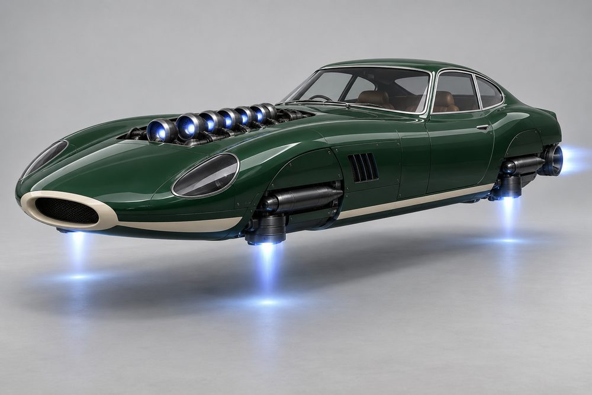
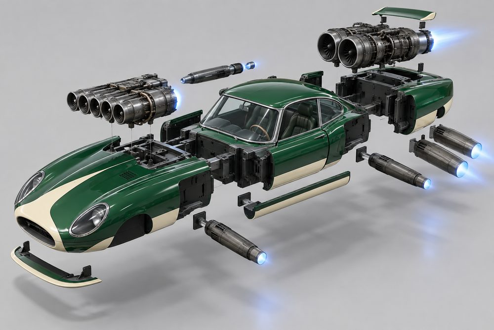
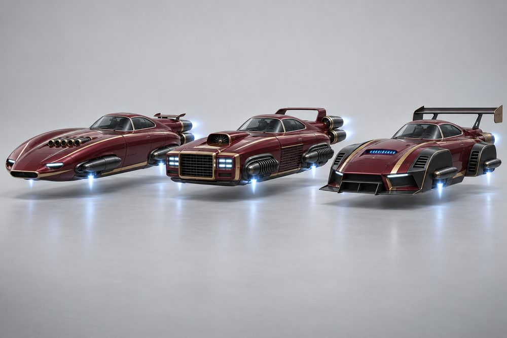
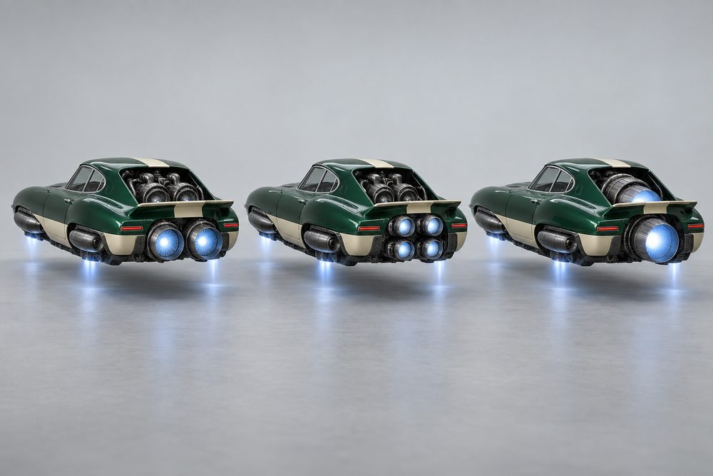
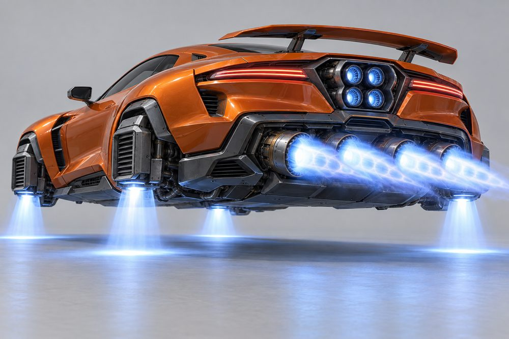
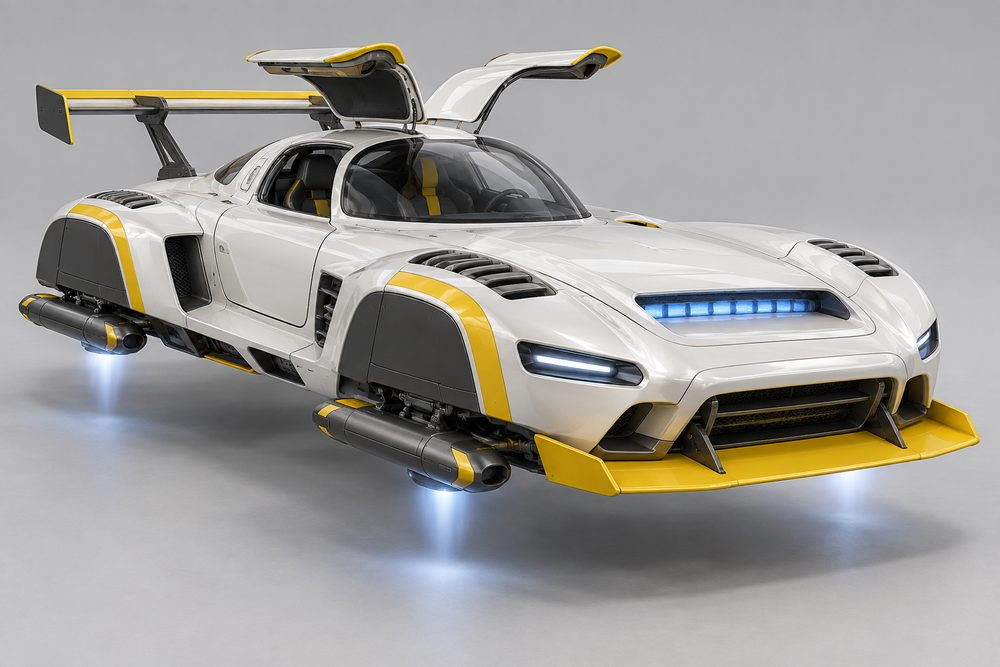
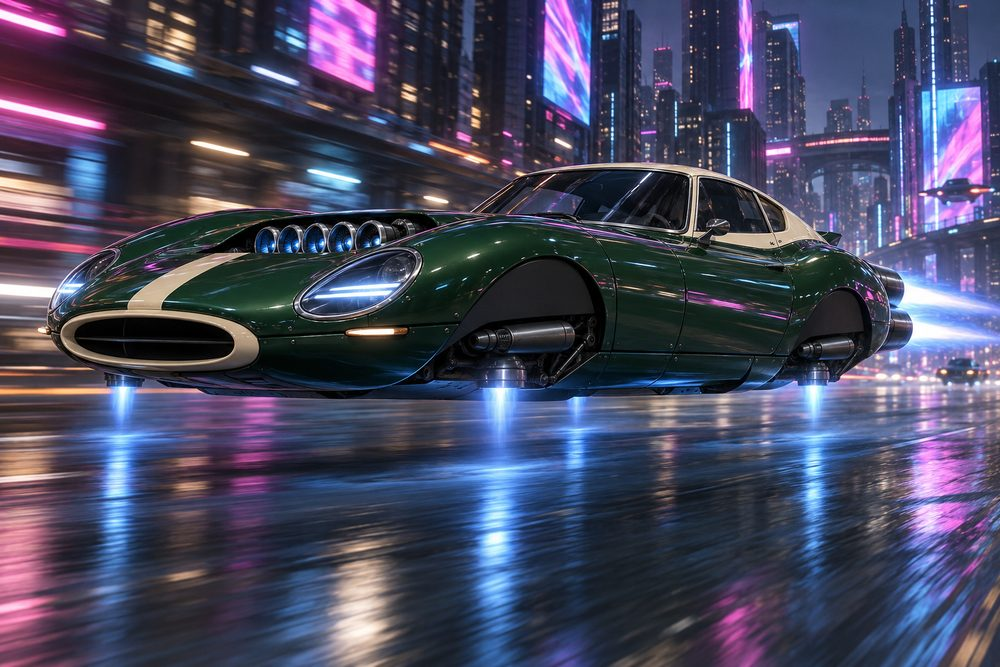

# GT (`gt`): class sheet, round 2

Status: design exploration, round 2 after the critic's fix pass, 2026-10-02. Nothing here is approved or game content.
Brief: [exploration contract](../../../scripts/vehicle_blockouts/CONTRACT.md). Parent: [vehicle frame classes](../vehicle-frame-classes.md). Geometry: [frame standard](gt-frame.md). Prompts and full-size art: `output/vehicle-categories-2026-10-01/gt/`.

This is a new class in round 2. It follows Oscar's feedback: real cars first, then jets instead of wheels. Engines, stabilisers and boost are real modules on every build.

## Pitch

Real front-engined sports cars and grand tourers, turned into hover jets. A long bonnet, a small cabin, a short tail. The wheels are gone. The arches are blanked off and hold a lift jet. The grille feeds a front jet engine in the bonnet, with vents behind the front arches. Jet nozzles sit where the exhausts were. The rear-engined sports coupé is in the class too.

## Player fantasy

You own the car from the poster on the bedroom wall. It is fast, beautiful and a little bit practical. You pick your era: a 60s long-bonnet coupé, a rear-engined teardrop, a modern muscle GT, a roadster, a shooting brake or a GT3 racer. Then you lift the bonnet and fit the jet you want. You arrive at a meet and people name the car at a glance.

## Culture lines

Real models are body-style references only. There are no badges, no logos and no text.

- **Classic GT:** 60s long bonnet, small cabin, Kamm tail. Reference: Jaguar E-Type, Ferrari 250 GT. Racing green, cream, chrome trim.
- **Rear-Engine Sports:** the teardrop coupé. Reference: Porsche 911. Frog-eye lamps, round hips, ducktail.
- **Modern GT:** wide, low and muscular. Reference: Aston Martin Vantage, Mercedes-AMG GT. Shark nose, flared haunches, active spoiler.
- **GT3 Racer:** the track car. Reference: Mercedes-AMG GT3, 300 SL gullwing. Box arches, big splitter, swan-neck wing.
- **Roadster:** light and open. Reference: Mazda MX-5, Lotus Elan. Narrow nose, open driver, small pipes.
- **Shooting Brake:** the fast estate. Reference: Volvo P1800 ES. Upright nose, long flat roof, tall tailgate.

## Cockpits

The cockpit is the cabin, the glass and the roofline. Every cockpit wears its own signature kit. All six are built in the blockout.

| Name | Culture | Silhouette | Signature kit | Tier |
|---|---|---|---|---|
| Roadster | Roadster | Open two-seater, low screen, head fairings | Clubman | E |
| Longnose | Classic GT | Small cabin set back, steep fastback | Classic | D |
| Brake | Shooting Brake | Longest roof, flat line, open tailgate frame | Estate | C |
| Teardrop | Rear-Engine Sports | Screen at the cowl, one curve down | Sports | B |
| Bruiser | Modern GT | Lowest roof, wrap-round screen, low deck rails | Modern | A |
| Gullwing | GT3 Racer | Narrow leaning canopy, proud door frames, roof fin | GT3 | S |

## The fundamentals

Every GT has all four. Each shows an intake, a body and a glowing nozzle from outside.

| Slot | Label | Where it sits | Options |
|---|---|---|---|
| `Engine1` | Front Engine | In an open bay in the bonnet, between the wings, with side exits in a cove behind each front arch. Reads from the front three-quarter and from above. | **Inline Stack:** six slim intakes over one long turbine. **Twin Ram:** two short fat turbines, nozzles turned up, flush with the bonnet. **Big Single:** one big turbine under a power dome. **Quad Throttle:** four small jets, two by two. **Ram Scoop:** a turbine under a tall narrow scoop. **Bonnet Slot:** a low flat duct with a slot jet. |
| `Engine2` | Rear Engine | Stands through an open hatch in the tail deck, just above the deck. Nozzles run out through the open tail. Faces the chase camera. | **Tail Twin:** two slim turbines, wide apart. **Fat Single:** one fat turbine, one big nozzle. **Quad Square:** a square housing, four short nozzles. **Triple Tube:** three tubes in a row, set high. **Splay Vee:** a compact block, two nozzles splayed out. **Slot Vector:** one wide flat vectoring nozzle with a paddle each side. |
| `Stabilisers` | Lift Jets | Four units, one in each blanked arch, hung from the arch wall. | **Torpedo Lifts:** one slim torpedo per corner. **Twin Columns:** two upright lift tubes per corner. **Vane Boxes:** a flat louvred box, one wide sheet of thrust. **Slant Jets:** one long nozzle canted hard back. **Comb Jets:** a tank with three small jets. **Outriggers:** one large nacelle per corner, on an outboard spar. |
| `Boost` | Afterburner | Sits outboard under the tail lamps, where the exhaust tips were. The centre line is left to the rear engine. Each has a dark collar and a small glowing core. | **Twin Megaphones:** two slim megaphones, far apart. **Stacked Twins:** two short cans, one over the other, each side. **Quad Tips:** four squared tips. **Single Cannon:** one long dark cannon, right side only. **Staged Pairs:** a long pipe with a short slim pipe outboard, each side. **Blade Burners:** one tall thin upright slot at each tail corner. |

## Body and cosmetic slots

`Hood`, `Roof` and `Accessory` are not used. The bonnet belongs to the front engine and the cockpit owns the roofline.

| Slot ID | Label | Options |
|---|---|---|
| `FrontBody` | Nose and Bonnet | **Torpedo Nose:** longest, lowest, pointed. **Frogeye Nose:** shortest, round lamp pods, wings peaking over the arch. **Shark Nose:** long and blunt, humped wings. **Clubman Nose:** narrow low cone, open corners, lamps on posts. **Square Nose:** upright, full bonnet height. **Works Nose:** low and short, louvred box arches. |
| `RearBody` | Tail | **Kamm Tail:** shortest, high square cut. **Wide Hips:** round hips, sloping low edge. **Muscle Haunch:** tall haunch, undercut edge. **Boat Tail:** open corners, pointed stern. **Square Tail:** longest box, tall rails and lamp columns. **Works Tail:** louvred box arches, stripped tail. |
| `SidePods` | Sills | **Bright Sill:** slim bright strip. **Scoop Rocker:** rocker with a small scoop. **Blade Skirt:** sharp blade skirt. **Nerf Rail:** round rail along the sill. **Gill Cladding:** ribbed cladding. **Flat Floor:** flat race floor. |
| `FrontBumper` | Chin | **Nerf Bar:** thin bar. **Valance:** deep low panel. **Lip:** thin lip. **Skid Nubs:** two small nubs. **Air Dam:** tall dam. **Splitter:** wide flat splitter. |
| `RearBumper` | Rear Valance | **Quarter Bumpers:** two slim corner bars. **Rounded Corners:** wrap-around curve. **Diffuser:** ribbed diffuser. **Overriders:** two bullet guards. **Blade Bumper:** flat blade. **Race Diffuser:** tall ribbed diffuser. |
| `RearSpoiler` | Spoiler | **Kamm Lip:** small lip on the deck. **Ducktail:** upturned tail. **Active Blade:** flat blade on two struts. **Twin Fins:** two small fins. **Boot Rack:** a bright rack on posts, with a low lip. It needs no roof. **Swan-Neck Wing:** tall wing on swan-neck struts. |

## Signature kits

| Kit | Culture | Native cockpit | What makes it look different |
|---|---|---|---|
| Classic | Classic GT | Longnose | Slim and long: torpedo nose, inline stack, torpedo lifts, two megaphones. Chrome trim. |
| Sports | Rear-Engine Sports | Teardrop | Short and round: frog-eye nose, flush twin ram, fat single, round hips, stacked twin burners. |
| Modern | Modern GT | Bruiser | One big single and four tips. Shark nose, flared haunches, louvred lift boxes. |
| Clubman | Roadster | Roadster | Open and light: narrow nose, open corners, quad throttle, one cannon. |
| Estate | Shooting Brake | Brake | Upright and boxy: square nose, ram scoop, splay vee, comb jets, staged pairs of pipes, boot rack. |
| GT3 | GT3 Racer | Gullwing | Wide and flat: box arches, bonnet slot, outriggers, blade burners, swan-neck wing. |

Any cockpit takes any kit. The nose and tail always meet the cockpit at the same seam.

## Handling intent versus Piercer

Design intent only. No numbers. Bias is relative to a Piercer build of the same tier.

| Stat | Bias | Intent |
|---|---|---|
| TopSpeed | + | Faster on long roads than a Piercer. |
| Acceleration | + | Light and quick off the line. |
| Braking | 0 | About the same. Stable under braking. |
| BoostForce | 0 | A clean kick, not a shove. |
| BoostDuration | - | Shorter bursts. Use them on exits. |
| DriftControl | 0 | Easy to hold a slide, not made for it. |
| DriftGrip | + | Bites back once the slide ends. |
| LateralGrip | ++ | The best grip in a corner. This is the class. |
| SteeringResponse | ++ | Sharp, direct turn-in. |
| HoverStability | + | Low and wide. Settles quickly after a kerb. |
| Downforce | + | More load at speed, most on GT3 and Modern. |
| Drag | - | Slippery body. Estate and GT3 add drag. |
| Weight | - | Lighter. Loses shoves to a Piercer. |

Net: a precise point-to-point car for a driver who likes clean lines. Front Engine leans on top speed, Rear Engine on acceleration, Lift Jets on grip and stability, Afterburner on boost. Culture nudges it: Classic lighter, Modern grippier, Estate draggier, GT3 downforce-heavy.

## Ideas that make GT fun to own

1. **Under the bonnet.** The front engine stands open in the bonnet. Fitting a new one is the proud moment, with a lift-the-bonnet pose in the garage and a turbine spin-up.
2. **Engine notes.** Each Front Engine has its own sound: Inline Stack a smooth rising whine, Twin Ram a flat burble, Big Single a deep roar, Quad Throttle a four-note buzz, Bonnet Slot a sharp hiss.
3. **Sleepers.** An Estate with the Bonnet Slot and Blade Burners looks like a family car and goes like a racer. The Brake is the class's wolf in sheep's clothing.
4. **Count the nozzles.** Rear engine and boost make a pattern from behind: twin and twin, quad and quad, one and one. Players will say "quad-quad" or "single-cannon".
5. **Heritage paint.** Era colourways with invented names: racing green and cream, signal orange and grey, pearl white and yellow. Geometric stripes only, no text.
6. **Arch glow.** The lift jets sit where the wheels were, so each tells you its look through its glow: pale sheet for Vane Boxes, a row of thin points for Comb Jets.
7. **Open-top touring.** The Roadster shows driver and passenger. A scarf and hair move at speed. The roof cannot close, which is the joke.
8. **Spec badge.** Fit all ten modules from one kit and the garage card names it: Classic Spec, GT3 Spec. A card badge only, no stat bonus.

## Gallery

*01 Hero. Longnose cockpit in the Classic kit, racing green and cream. Torpedo Nose, Inline Stack, Tail Twin, Torpedo Lifts, Twin Megaphones, Kamm Tail, Bright Sill. The rear nozzle shows at the tail; the megaphones are hidden at this angle.*

*02 Exploded. The hero build pulled apart. Longnose cabin in the centre. Inline Stack lifts out of the bonnet, Tail Twin out of the tail, four Torpedo Lifts out sideways, with Twin Megaphones, Torpedo Nose, Kamm Tail, sills, chin and spoiler on their own axes.*

*03 One kit, three cockpits. Left Teardrop, centre Brake, right Roadster. All wear the Modern kit in grey and orange: Shark Nose, Muscle Haunch, Big Single, Quad Square, Vane Boxes, Quad Tips, Blade Skirt, Active Blade.*

*04 One cockpit, three kits. Longnose three times in burgundy and gold, with the same sloping coupé roof and glass on each. Left Classic kit. Centre Estate kit (Square Nose, Ram Scoop, Comb Jets, Staged Pairs, Boot Rack). Right GT3 kit (Works Nose, Bonnet Slot, Outriggers, Blade Burners, Splitter, Swan-Neck Wing). The kits change the nose, sides and tail only.*

*05 Rear Engine options, rear three-quarter. Longnose with Classic fittings, identical except Engine2. Left Tail Twin, centre Quad Square, right Fat Single.*

*06 Lift jets and afterburner. Bruiser cockpit in the Modern kit, orange and grey. Quad Tips firing, Quad Square rear engine, Vane Boxes pushing thrust at the floor, Muscle Haunch, Active Blade. Seen very low from behind.*

*07 GT3 racer. Gullwing cockpit in the GT3 kit, pearl white and signal yellow. Works Nose, Bonnet Slot, Outriggers, Slot Vector, Blade Burners, Splitter, Race Diffuser, Swan-Neck Wing. The Outriggers show as slim lengthways pods under blanked arches. The tail burner is hidden at this angle.*

*08 Action. The Longnose hero build in the Classic kit at speed in a neon city at night, Inline Stack glowing in the bonnet, Torpedo Lifts under the arches, Twin Megaphones streaming behind.*

## Risks and open points

- **Body look-alikes.** Whole-outline scores are 0.06 to 0.15 for bodies, engines and cockpits. Shared pads and bays make up most of each outline. With the shared area removed, the scores pass the 0.35 target (0.25 for cockpits), two of them exactly on the line. A higher whole score needs longer overhangs or a smaller shared core. Owner decision.
- **Size.** Builds are 23.5 to 25.2 long against a 23 target, and 10.6 to 11.7 wide against 10. The GT3 kit is the widest at 11.7. Check lanes, garage bays and the camera.
- **Wheel look-alikes.** The first hero render hung upright slabs under the arches and they read as wheels. Lift jets must stay slim and lengthways. The 07 and 04 outriggers were regenerated as slim lengthways pods, so keep them narrow in the mesh.
- **Concept art is mood, not geometry.** The renders vary the blockout shapes: lift jets are rounder or taller, and rear nozzles face the camera as plain rounds. Use the blockout for shape.
- **Real-car likeness.** The art leans on a Jaguar E-Type, a Porsche 911 and a Mercedes gullwing. No badges, but a legal check is wise before any model ships.
- **Open engine bays.** Both engines sit in open bays. Real meshes may want covers that keep the intake and nozzle in view.
- **Chase camera.** Longnose and Gullwing leave the tail bay open from above. Check the rear engine does not hide the afterburner.
- **Body slot looks.** Sills, chin and rear valance notes above come from option names. Confirm them against the blockout before art is final.
