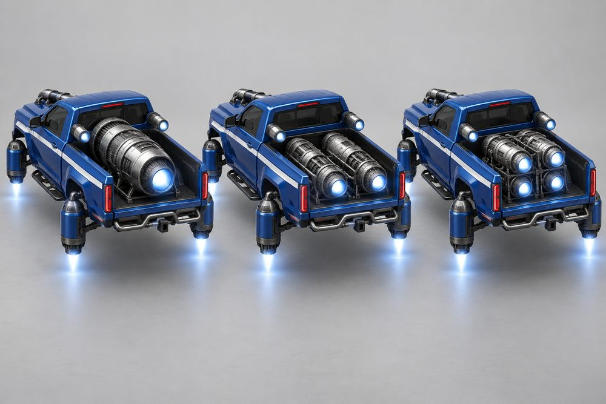
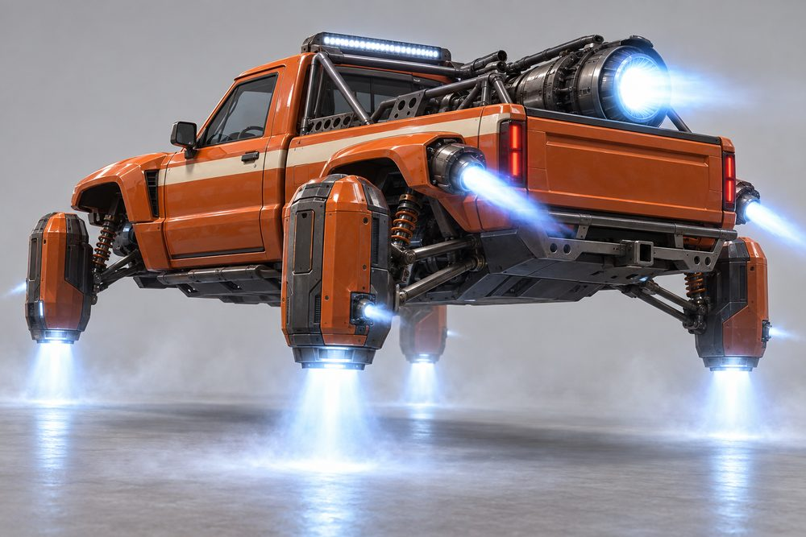
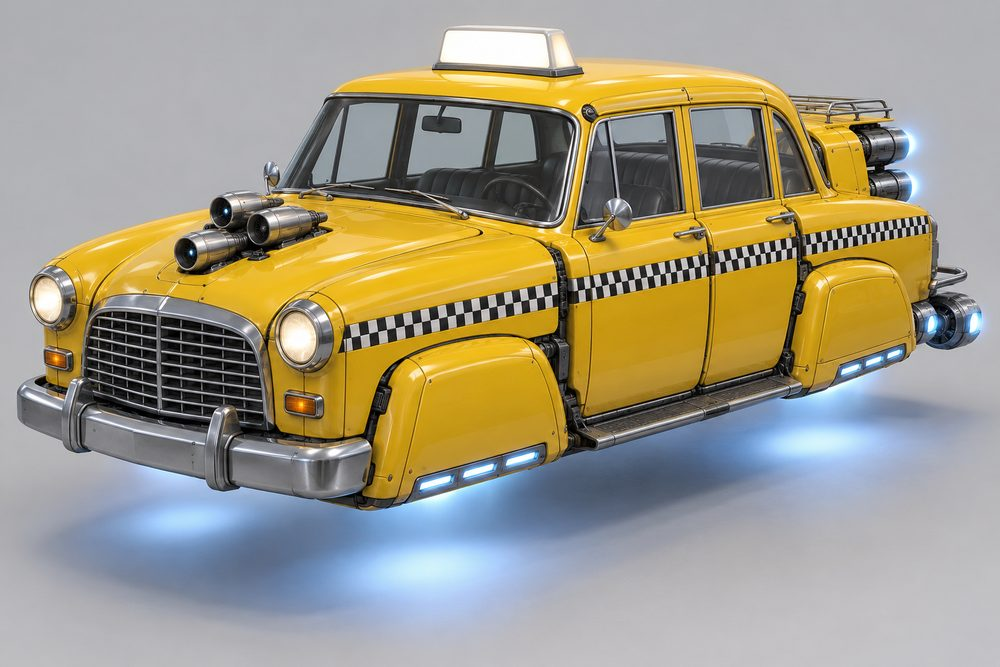

# Hauler: class sheet (round 2)

Status: design exploration, round 2, 2026-10-01. Not approved, not game content. `CategoryId` proposal: `hauler`. Blockout: [hauler-frame.md](hauler-frame.md). Shared rules: [exploration contract](../../../scripts/vehicle_blockouts/CONTRACT.md). Images are AI concept art, not built to the frame standard. Round 1 art is kept in `output/vehicle-categories-2026-10-01/hauler/v1/`.

## Pitch

Truck and van culture as hover jets. A tall cab, a front clip, a cargo bed behind, and four chunky jet pods low at the corners where the wheels would be. Each pod is a long thruster capsule on an arm, nozzle pointing down. About 13 W x 12 H x 31 L studs with the jets, in the blockout. The tallest class in the game.

Round 2 has no wheels and nothing wheel-shaped. A turbine sits on the bonnet and a bigger one can sit in the bed. Real pickup, van and taxi body styles are welcome.

**Player fantasy:** "I drive the biggest thing on the road, and it works for a living." You win contact, you sit above traffic, and your truck shows your trade: racer, show-off, courier or cabbie.

## Culture lines

- **Prerunner:** desert race truck. Flared fenders, long-travel jet pods, chase rack, light bar.
- **Lifted:** sky-high show-off. Tall thruster legs, winch bumper, roll bar, twin turbines.
- **Minitruck:** slammed small pickup. Tucked slot jets, smooth bed, roll pan, candy paint.
- **Show Truck:** decorated cab-over. Chrome, rows of lights, tall stacks, jets in blocks.
- **Courier:** working box van. Stub nose, parcel box, top box, grab rails.
- **Cab:** checker-striped hover taxi. Upright cab, blank glowing roof sign, chrome caps.

## Cockpits

| Name | Culture | Silhouette | Signature kit | Tier |
|---|---|---|---|---|
| Kei Cab | Minitruck | Tiny, narrow, upright micro cab | Laid Out | E |
| Single Cab | Prerunner | Boxy two-seat cab, upright screen | Dune Runner | D |
| Van Nose | Courier | One-box van, raked screen, high roof, blank sides | Last Mile | C |
| Checker Cab | Cab | Tall rounded four-door, high roof | Checker Line | B |
| Crew Cab | Lifted | Long four-door cab, two seat rows | Sky High | A |
| Cab-Over | Show Truck | Flat face, driver over the nose | Chrome Palace | S |

The blockout builds all six cabs and all six kits.

## The fundamentals

Every build has all four. Each shows an intake, a body and a glowing nozzle.

| Slot | Player label | Where it sits | Options (look) |
|---|---|---|---|
| Engine1 | Hood Engine | On top of the bonnet, in an open trench. No cab roofs it. Jets fire up or outboard | **Ram Single** (one long turbine). **Twin Ram** (two turbines and a scoop). **Slot Scoop** (flat slot burner). **Six Pack** (six small jets in a block). **Trio** (arrowhead of three). **Doghouse** (tall cover by the cab, jets in the lid). |
| Engine2 | Bed Engine | Lying in the bed, nozzle at the open tail. Faces the chase camera | **Bed Turbine** (one huge turbine). **Twin Barrels** (two low, wide apart). **Deck Burner** (flat, full-width slot). **Quad Chrome** (four in a 2 x 2 block). **Over-Under** (two stacked). **Tail Three** (three side by side on the tail deck). |
| Stabilisers | Lift Jets | Four corners, where the wheels would be, nozzles down | **Long Travel** (long pods on A-arms). **Stilts** (tall thruster legs). **Tucked Slots** (flat slot pods under the body). **Dually Vectors** (twin tilted nozzles). **Jet Racks** (vented housing, three nozzles below). **Box Lifts** (square lift ducts). |
| Boost | Stacks | Upright behind the cab, low beside it, or on the bed tail corners | **Side Dumps** (two cans a side). **Shorty Stacks** (four stepped pipes). **Tail Slots** (two upright slot burners). **Chrome Stacks** (two tall stacks). **Tail Cans** (two cans in square shrouds). **Fishtails** (riser pipes into flat blades). |

## Body and cosmetic slots

| Slot id | Player label | Options (look) |
|---|---|---|
| FrontBody | Front Clip | **Flare Nose** (bulged fenders, mesh grille). **Square Body** (upright slab grille). **Smoothie** (shaved, no grille). **Flat Face** (flat chrome slab). **Round Nose** (rounded, tall chrome grille). **Stub Nose** (short, blunt van nose). |
| RearBody | Bed | **Chase Tub** (open tub, flared sides). **Flatbed** (flat deck, headboard). **Laid Bed** (low, smooth short tub). **Show Deck** (decorated deck, fenders). **Fare Canopy** (short covered boot). **Parcel Box** (cab roofline runs back, tail deck open). |
| SidePods | Side Gear | **Rock Sliders** (tube steps). **Toolboxes** (flank lockers). **Ground Skirts** (low smooth skirts). **Saddle Tanks** (chrome tanks). **Running Boards** (plate steps). **Kerb Steps** (low door steps). |
| FrontBumper | Front Bar | **Bull Bar** (tube guard, skid plate). **Winch Bumper** (heavy plate, winch). **Air Dam** (low smooth lip). **Chrome Blade** (wide blade, lamp edge). **Push Bar** (square pusher bar). **Front Rack** (flat carrier rack). |
| RearBumper | Rear Bar | **Hitch** (step bar, tow ball). **Step Bar** (wide plate step). **Roll Pan** (smooth, no bumper). **Lamp Board** (stacked tail lamps). **Taxi Rail** (slim chrome rail). **Dock Step** (wide loading step). |
| RearSpoiler | Bed Rig | **Chase Rack** (tube rack over the bed). **Roll Bar** (bar with lamps). **Whale Tail** (small flat wing). **Marker Arch** (arch of marker lights). **Luggage Rack** (flat rack, strapped cases). **Top Box** (cargo box over the bed). |
| Roof | Roof Rig | **Light Bar** (wide lamp strip). **Roof Rack** (basket with lamps). **Roof Spoiler** (slim lip over the screen). **Crown** (chrome lamp tiara). **Taxi Sign** (blank glowing box). **Aerials** (cluster of tall radio masts). |
| Accessory | Extras | **Whip Flags** (tall aerials with flags). **Tow Mirrors** (long-arm mirrors). **Slim Mirrors** (small flush mirrors). **Air Canisters** (chrome tanks on the side). **Fare Lamps** (small amber roof lamps). **Grab Rails** (door-side hand rails). |

## Signature kits

| Kit | Culture | Native cockpit | What makes it look different |
|---|---|---|---|
| Dune Runner | Prerunner | Single Cab | Flared fenders, one long bonnet turbine, one huge bed turbine, long pods on A-arms, tube bars |
| Sky High | Lifted | Crew Cab | Tall on thruster legs, twin turbines up front and in the bed, four stepped stacks, flatbed |
| Laid Out | Minitruck | Kei Cab | Sits on the floor. Flat slot burners front and back, flat pods, slot burners on the tail corners, smooth shaved body |
| Chrome Palace | Show Truck | Cab-Over | Chrome slab face, jets in blocks of six and four, twin tall stacks, rows of lights |
| Checker Line | Cab | Checker Cab | Rounded nose, covered boot, jets in a trio and a stacked pair, vented jet racks at the corners |
| Last Mile | Courier | Van Nose | Stub nose, parcel box, tall doghouse engine, three tail jets, square lift ducts, fishtail stacks |

## Handling intent versus Piercer

Design intent only. `+` means more than Piercer, `-` less, `0` about the same.

| Stat | Bias | Why |
|---|---|---|
| TopSpeed | - | Tall and blunt. Not the straight-line class. |
| Acceleration | - | Mass takes time to move. |
| Braking | - | Long stops. Plan ahead. |
| BoostForce | 0 | Strong shove, but it moves a lot of weight. |
| BoostDuration | + | Long, steady burn from the stacks. |
| DriftControl | - | Slides are slow to start and slow to catch. |
| DriftGrip | + | Stays planted. Short, heavy slides. |
| LateralGrip | + | Hard to push off line. |
| SteeringResponse | - - | Slowest turn-in in the game. The class trade-off. |
| HoverStability | + + | Flattest ride. Shrugs off bumps and landings. |
| Downforce | 0 | Weight does the work, not aero. |
| Drag | + | Tall cab and bed. More drag is the cost. |
| Weight | + + | Heaviest class. Wins contact. |

Modules move this inside the class. Tucked Slots give back steering and lose stability. Stilts add stability and drag. Bed Turbine trades grip for boost. Quad Chrome adds weight. Slot burners (Slot Scoop, Deck Burner) trade top speed for acceleration. Jet Racks cut drag.

## What makes it fun to own

1. **Two engines, two voices.** A turbine on the bonnet and another in the bed. Mix a Six Pack up front with a Bed Turbine behind. The look and the sound both change, and the chase camera always sees the bed engine.
2. **Ride height is the personality.** Lift Jets set the stance. Laid Out sinks to the floor when parked. Sky High rises on its thruster legs. Long Travel shows its A-arms working over bumps.
3. **Light show.** Chrome Palace, Crown, Marker Arch and Lamp Board use the Neon channel. A parked horn press runs a chase pattern along every lamp row.
4. **For-hire sign.** The Taxi Sign glows when you are free and dims when a fare is on board. Fare Lamps flash on pickup. Crew Cab and Checker Cab seat the fare in the back row.
5. **Stacks you can read.** Chrome Stacks fire straight up. Side Dumps fire low and sideways. Tail Slots lay two flat sheets of flame. Tail Cans throw two cones. Fishtails fan out flat. You can tell the boost from behind.
6. **Full-kit names.** Dune Runner, Sky High, Laid Out, Chrome Palace, Checker Line and Last Mile show on the garage card when every slot matches.
7. **Trade unlocks.** Cosmetic parts earned by the job: Taxi Sign and the checker band after a number of fares, Luggage Rack and Fare Lamps after a number of parcels, Crown at a high Driver Rank. Cash buys everything else.
8. **Photo moments.** Slammed and lifted trucks side by side at the east car-meet lot. A Show Truck light show on the waterfront at night. A taxi rank outside the Dealership.

## Gallery

*01 hero. Single Cab, Dune Runner kit: Flare Nose, Ram Single, Chase Tub, Bed Turbine, Long Travel, Side Dumps, Bull Bar, Chase Rack, Light Bar, Rock Sliders, Whip Flags.*

*02 exploded. The same Single Cab and Dune Runner build. Front Clip, Front Bar and Hood Engine ahead. Bed, Rear Bar, Bed Rig and Bed Engine behind. Roof Rig above, Side Gear and Stacks beside, four Long Travel Lift Jets out at the corners.*

*03 one kit, three cockpits. Left Single Cab, centre Crew Cab, right Kei Cab. Identical Dune Runner kit and teal paint on all three.*

*04 one cockpit, three kits. Single Cab each time, red paint. Left Laid Out (Smoothie, Laid Bed, Roof Spoiler). Its jets are drawn as a slim bonnet turbine, tail nozzles and long sill lift pods with blanked arches, because flat slot burners alone did not read as jet hardware. Centre Sky High (Square Body, Flatbed, Twin Ram, Twin Barrels, Stilts, Shorty Stacks, Winch Bumper, Roll Bar, Roof Rack). Right Chrome Palace (Flat Face, Show Deck, Six Pack, Quad Chrome, Dually Vectors, Chrome Stacks, Chrome Blade, Crown).*

*05 engines, rear three-quarter. Single Cab, Chase Tub, blue paint. Only the Bed Engine changes: Bed Turbine on the left, Twin Barrels in the centre, Quad Chrome on the right. Long Travel Lift Jets and Side Dumps on all three.*

*06 stabilisers and boost. Single Cab, Dune Runner kit, low rear three-quarter. Side Dumps firing, Bed Turbine glowing, four Long Travel Lift Jets throwing thrust at the floor.*

*07 Cab. Checker Cab, Checker Line kit: Round Nose, Trio, Fare Canopy, Over-Under, Jet Racks, Tail Cans, Taxi Sign, Luggage Rack, Running Boards, chrome front bar. The checker band lines up across the gaps.*

*08 action. The hero Single Cab, Dune Runner kit, at night in the city. Side Dumps boosting, Light Bar on, Long Travel Lift Jets throwing spray.*

## Risks and open points

- **Height.** The blockout is 12 studs tall with the jets, against a 9 stud target. Check camera framing, skybridge and tunnel clearance, garage preview and the minimap icon.
- **No Courier art.** Van Nose and Last Mile are in the blockout, but the gallery has no image of them. Draw them before approval.
- **Look-alike scores.** Front Clip, Bed and Cab pairs sit under the validator targets, because every part must fill the same hull and reach the same pads. Real meshes may need looser hulls.
- **Forward pods and nose sails.** Cab-Over pods and Van Nose sails stand on the cowl deck. On low clips it is a thin shelf with daylight under it. Real meshes need a clean underside.
- **Hood Engine nozzle.** The trench stays open on every cab. Jets must fire up or outboard, never at the screen. Check Doghouse and the Stub Nose, where the Front Bar stands well ahead of the nose.
- **Bed Engine and cargo.** The engine takes the bed. Parcels need another place to show: Luggage Rack, Roof Rack, Fare Canopy or Parcel Box. Decide before the job tie-ins.
- **Pods must not read as wheels.** Keep pods as long capsules with the nozzle down, or as blanked arches with slot vents. Never upright round faces. Checked in every image here.
- **Ride height.** Laid Out and Sky High imply different body heights, but there is one hover plane. Stance comes from pod and leg length only, unless that changes.
- **Kei Cab width.** A narrow cab on a full-width frame. It works in image 03. Check it in the blockout.
- **Checker band.** Paint channels recolour whole parts. A checker pattern needs a texture or decal route.
- **Taxi sign.** No text by rule. Use a blank box or an icon.
- **Lamp rows and part count.** Show Truck lamps should be neon strips or textures, not one part per lamp.
- **Job tie-ins and economy.** Visible parcels, the for-hire sign and trade unlocks are cosmetic. Any pay or capacity bonus needs the ECON-01 review first.
- **Contact.** The heaviest class can bully others. Check the contact rules before tuning Weight.
- **Seats.** Fares sit inside the cockpit today. Confirm passenger seating per cab.
