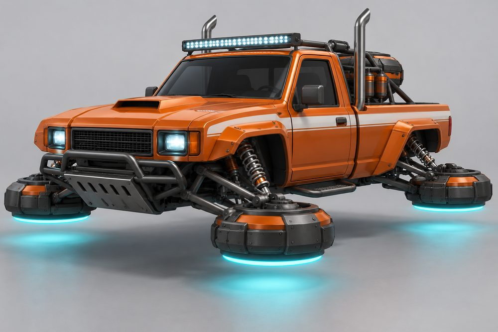
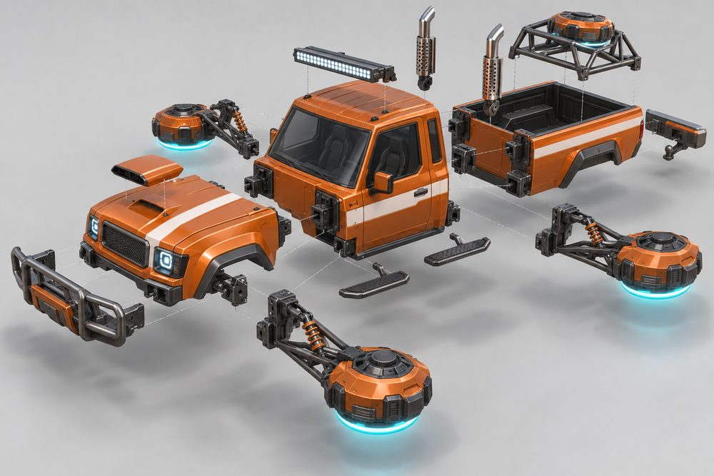
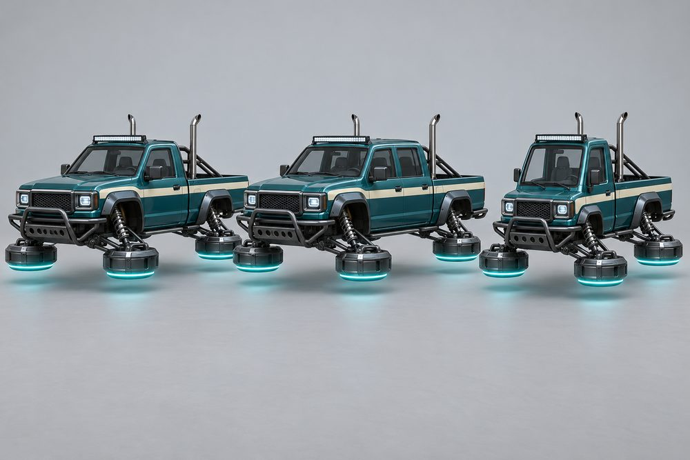
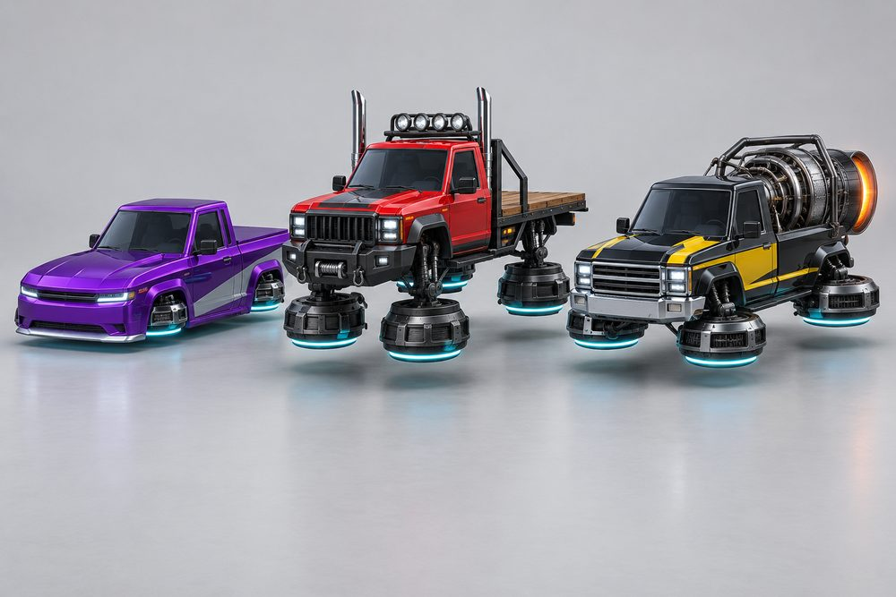
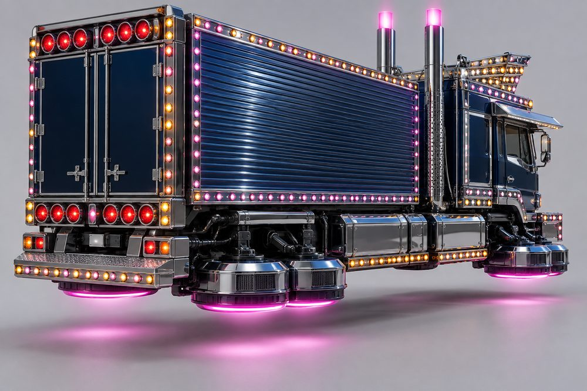
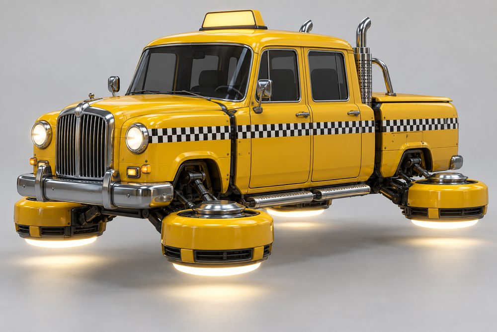
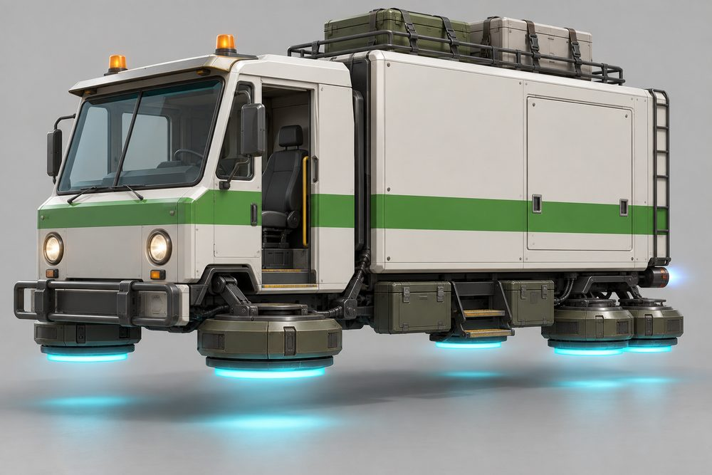
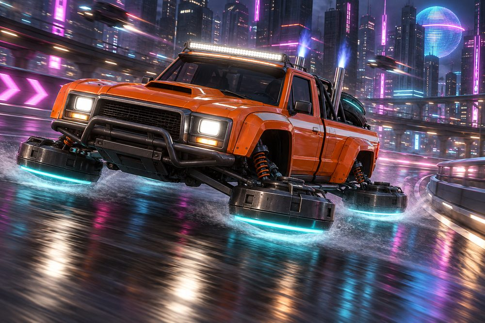

# Hauler: class sheet

Status: design exploration, 2026-10-01. Not approved, not game content. `CategoryId` proposal: `hauler`. Shared rules are in the [exploration contract](../../../scripts/vehicle_blockouts/CONTRACT.md). Images are AI concept art, not built to the frame standard.

## Pitch

Truck and van culture turned into hover vehicles. A tall cab, a front clip, a cargo bed behind, and four big hover pods low at the corners where the wheels were. About 13 W x 9 H x 30 L studs: the tallest class in the game.

**Player fantasy:** "I drive the biggest thing on the road, and it works for a living." You win contact, you sit above traffic, and your truck shows your trade: racer, shower, courier or cabbie.

## Culture lines

- **Prerunner:** desert race truck. Flared front, long-travel pods, chase rack, light bar.
- **Lifted:** sky-high show-off. Huge pods on tall struts, winch bumper, roll bar.
- **Minitruck:** slammed small pickup. Tucked pods, smooth bed, roll pan, candy paint.
- **Show Truck:** decorated cab-over. Chrome everywhere, rows of marker lights, tall stacks.
- **Courier:** working box van. Snub nose, cargo box, ladder rack, toolboxes.
- **Cab:** checker-striped hover taxi. Upright cab, blank glowing roof sign, chrome caps.

## Cockpits

| Name | Culture | Silhouette | Tier |
|---|---|---|---|
| Kei Cab | Minitruck | Tiny, narrow, upright micro cab | E |
| Single Cab | Prerunner | Boxy two-seat cab, upright screen | D |
| Van Nose | Courier | Snub nose, huge screen, sliding door | C |
| Checker Cab | Cab | Tall rounded four-door, high roof | B |
| Crew Cab | Lifted | Long four-door cab, two seat rows | A |
| Cab-Over | Show Truck | Flat face, driver over the nose | S |

## Slots and modules

Slot IDs are the canonical ones. Modules marked * are additions to the contract roster.

| Slot id | Player label | Modules (look) |
|---|---|---|
| Engine1 | Front Clip | **Square Body** (upright grille, square lamps). **Prerunner Flare** (bulged wings, mesh grille). **Flat Face** (smooth, slim lamps). **Show Chrome** (chrome grille, lamp rows). **Round Nose*** (tall chrome grille, round lamps, taxi look). |
| Engine2 | Bed | **Tub Bed** (open pickup tub). **Flatbed** (wood deck, headboard). **Box Van** (tall cargo box, roll-up shutter). **Turbine Bed** (one huge exposed jet engine). **Camper** (shell with side windows). |
| Stabilisers | Hover Pods | **Long Travel** (pods far out on arms and coil-overs). **Monster** (huge pods on tall struts). **Slammed** (slim pods tucked in the arches). **Dually** (twin drums at the rear). |
| SidePods | Side Gear | **Steps** (tube or plate steps). **Fuel Tanks** (chrome saddle tanks). **Toolboxes** (flank lockers). **Lamp Skirts*** (chrome skirt with lamp row). |
| Boost | Stacks | **Twin Stacks** (tall chrome pipes behind the cab). **Bed Burner** (big nozzle out of the bed). **Under-bed Dump** (short side exit, low glow). |
| FrontBumper | Front Bar | **Bull Bar** (tube hoop, skid plate). **Winch Bumper** (heavy plate, winch drum). **Plough** (square pusher bar). **Chrome Bumper** (wide blade, lamp edge). |
| RearBumper | Rear Bar | **Hitch** (step bar with tow ball). **Step** (wide plate step). **Roll Pan** (smooth, no bumper). **Lamp Board*** (stacked round tail lamps). |
| RearSpoiler | Bed Rig | **Chase Rack** (tube rack, spare hover disc). **Roll Bar** (single hoop with lamps). **Ladder Rack** (flat rack, strapped crates). |
| Hood | Hood | **Scoop** (raised intake). **Snorkel** (side intake pipe up the pillar). **Louvres*** (flat vented panel). |
| Roof | Roof Rig | **Light Bar** (wide lamp strip). **Rack** (basket with lamps). **Taxi Sign** (blank glowing box). **Visor** (chrome sun visor). **Crown*** (chrome lamp tiara, show trucks). |
| Accessory | Extras | **Whip Aerial*** (tall lit aerial). **Mud Flaps*** (hanging flaps behind pods). **Beacons*** (amber roof lamps). **Mirrors*** (long-arm tow mirrors). |

## Handling intent versus Piercer

Design intent only. `+` means more than Piercer, `-` less, `0` about the same.

| Stat | Bias | Why |
|---|---|---|
| TopSpeed | - | Tall and blunt. Not the straight-line class. |
| Acceleration | - | Mass takes time to move. |
| Braking | - | Long stops. Plan ahead. |
| BoostForce | 0 | Strong shove, but it moves a lot of weight. |
| BoostDuration | + | Long, steady burn from the stacks. |
| DriftControl | - | Slides are slow to start and slow to catch. |
| DriftGrip | + | Stays planted. Short, heavy slides. |
| LateralGrip | + | Hard to push off line. |
| SteeringResponse | - - | Slowest turn-in in the game. The class trade-off. |
| HoverStability | + + | Flattest ride. Shrugs off bumps and landings. |
| Downforce | 0 | Weight does the work, not aero. |
| Drag | + | Tall cab and box. More drag is the cost. |
| Weight | + + | Heaviest class. Wins contact. |

Modules move this inside the class. Slammed pods give back steering and lose stability. Monster pods add stability and drag. Turbine Bed trades grip for boost. Box Van adds weight.

## What makes it fun to own

1. **The bed is a stage.** The bed is the biggest visible module in any class. Tub, flatbed, box and turbine change the whole truck. On a parcel job the parcels show in the bed (strapped on a Flatbed, stacked in a Tub, hidden in a Box Van).
2. **Ride height is the personality.** Hover Pods set the stance. A Slammed truck "lays out" and sinks to the floor when parked. A Monster truck rises on its struts. Both are free expression moments at meets.
3. **Light show.** Show Chrome, Lamp Skirts, Crown and Lamp Board all use the Neon channel. A parked horn press runs a chase pattern along every lamp row. More lamp modules, longer show.
4. **For-hire sign.** The Taxi Sign glows when you are free and dims when a fare is on board. Other players can see who is working. Crew Cab and Checker Cab seat the fare in the back row.
5. **Full-kit names.** Dune Runner (Prerunner), Sky High (Lifted), Laid Out (Minitruck), Chrome Palace (Show Truck), Last Mile (Courier), Checker Line (Cab). A full kit shows its name on the garage card.
6. **Trade unlocks.** Cosmetic parts earned by doing the job: Taxi Sign and the checker band after a set number of fares, Ladder Rack and Beacons after a set number of parcels, Crown at a high Driver Rank. Cash still buys everything else.
7. **Stacks boost.** Boost fires straight up from Twin Stacks in the thrust colour. The Bed Burner lights the whole turbine. Easy to read from behind and good in photos.
8. **Photo moments.** Tailgate line-up at the east car-meet lot. Slammed and Monster side by side. A Show Truck light show on the waterfront at night. A taxi rank outside the Dealership.

## Gallery

*01 hero. Prerunner. Single Cab, Prerunner Flare, Tub Bed, Long Travel pods, Bull Bar, Twin Stacks, Chase Rack, Scoop, Light Bar, Steps.*

*02 exploded. Same Prerunner build. Front Clip, Front Bar and Hood ahead; Bed, Rear Bar (Hitch), Bed Rig and Stacks behind; Roof Rig above; Side Gear and Hover Pods out to the sides. Only three of the four pods are drawn.*

*03 one kit, three cockpits. Left Single Cab, centre Crew Cab, right Kei Cab. Identical Prerunner kit and teal paint on all three.*

*04 one cockpit, three kits. Single Cab each time. Left Minitruck (Flat Face, smooth Tub Bed, Slammed, Roll Pan). Centre Lifted (Square Body, Flatbed, Monster, Winch Bumper, Roll Bar, Rack). Right mixed turbine build (Show Chrome clip, Turbine Bed, Bed Burner).*

*05 Show Truck, rear three-quarter. Cab-Over, Box Van, Dually pods, Twin Stacks, Lamp Board, Fuel Tanks and Lamp Skirts, Visor and Crown.*

*06 Cab. Checker Cab, Round Nose, short covered Tub Bed, Chrome Bumper, Steps, Twin Stacks, Roll Bar, blank Taxi Sign. Checker band lines up across the gaps.*

*07 Courier. Van Nose, Box Van, Dually pods, Plough, Toolboxes, Under-bed Dump, Ladder Rack with crates, Visor and Beacons.*

*08 action. The hero Prerunner at night in the city, stacks boosting, light bar on.*

## Risks and open points

- **Height.** 9 studs tall is the tallest class. Check camera framing, skybridge and tunnel clearance, garage preview and the minimap icon.
- **No-bonnet cabs.** Cab-Over and Van Nose have no bonnet, yet every cockpit must take every Front Clip and Hood. Images 05 and 07 show no separate front clip. The frame standard needs an answer: a short "face" clip under the screen, or a Front Clip envelope that reads right on both.
- **Bed length.** The show truck and courier boxes in the art are longer than a 30-stud vehicle allows. The Bed envelope is one size for all cockpits. Crew Cab must fit the same cockpit envelope as Single Cab.
- **Ride height.** Slammed and Monster imply different body heights, but the class has one hover plane datum. Decide: stance is a visual body offset, or it comes from pod and strut length only.
- **Pods must not read as wheels.** Keep them flat and horizontal with the glow underneath. An upright disc looks like a tyre at a distance.
- **Kei Cab width.** A narrow cab on a full-width frame. It works in image 03, but check it in blockout.
- **Checker band.** Paint channels recolour whole parts. A checker pattern needs a texture or decal route. Open.
- **Taxi sign.** No text by rule. Use a blank box or an icon.
- **Lamp rows and part count.** Show Truck lamps should be neon strips or textures, not one part per lamp. Builds stay under 160 parts.
- **Job tie-ins and economy.** Visible parcels, the for-hire sign and trade unlocks are cosmetic. Any pay or capacity bonus for Haulers needs the ECON-01 review first.
- **Contact.** The heaviest class can bully others. Check the contact rules before tuning Weight.
- **Seats.** Fares sit inside the cockpit today. Single Cab and Kei Cab have one spare seat; confirm passenger seating per cockpit.
