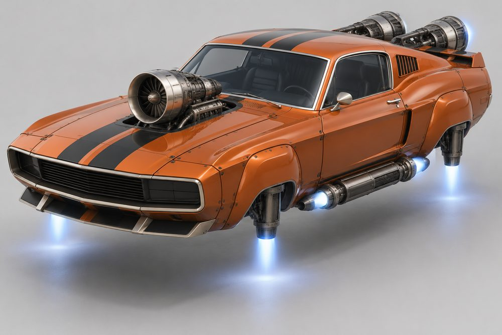
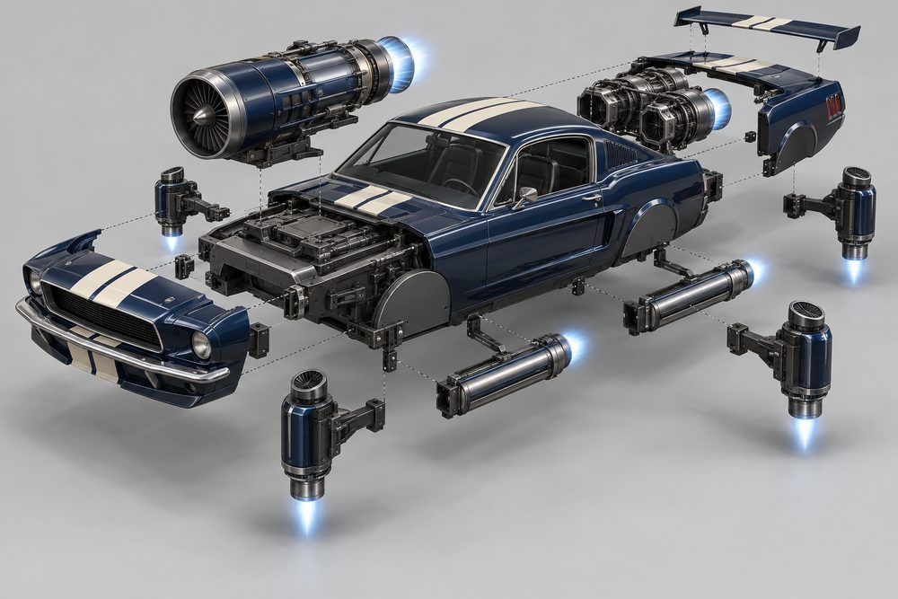
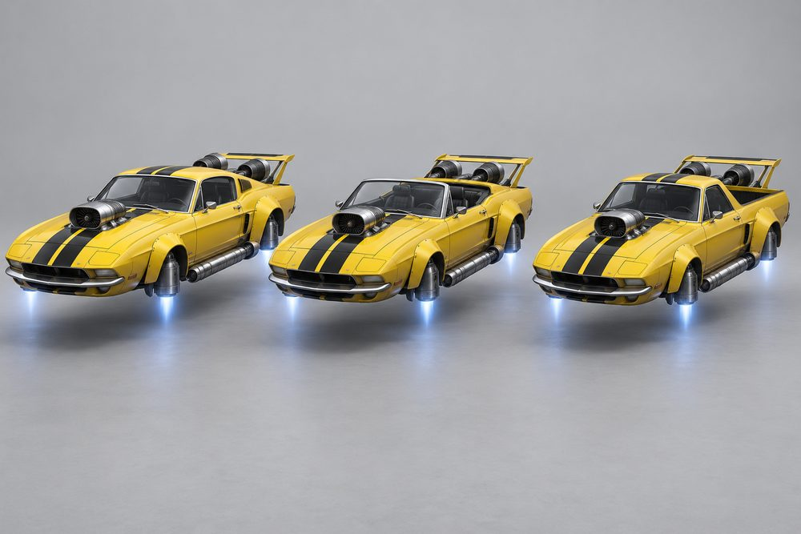
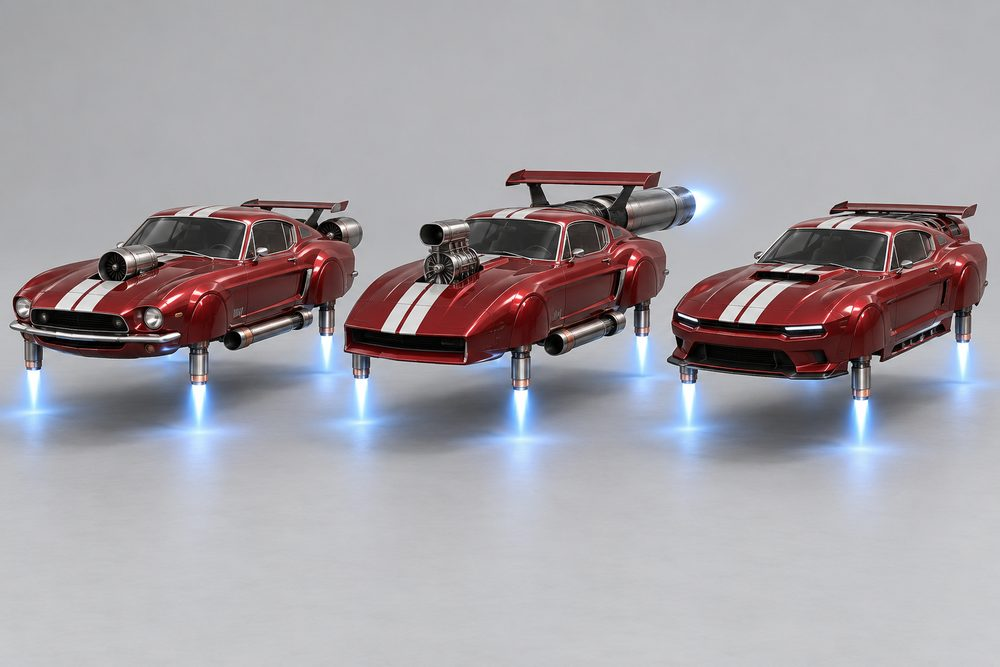
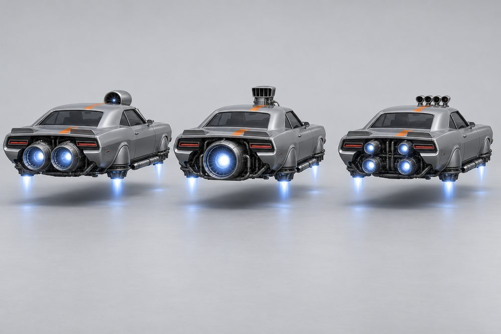
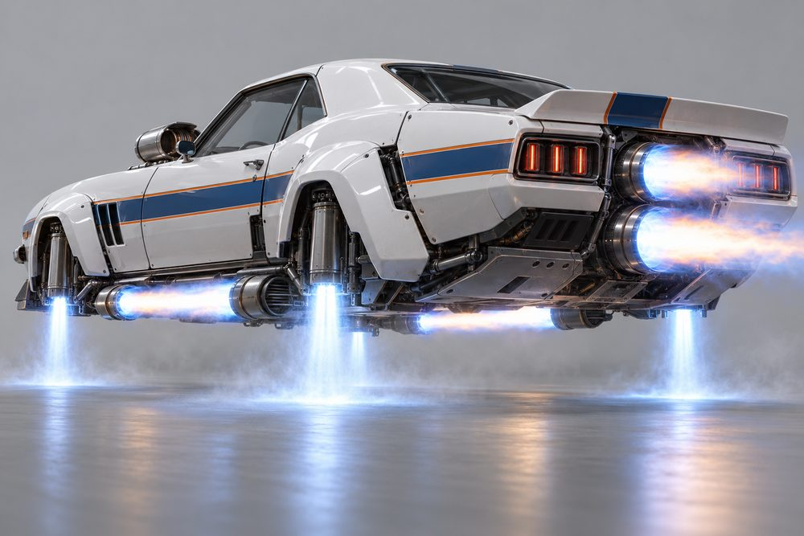
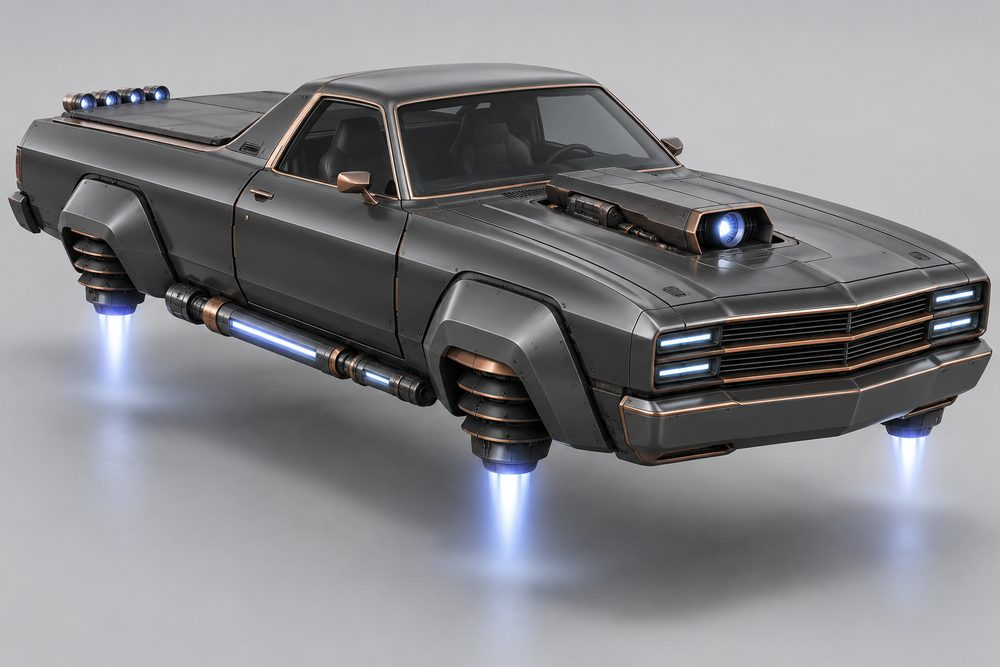
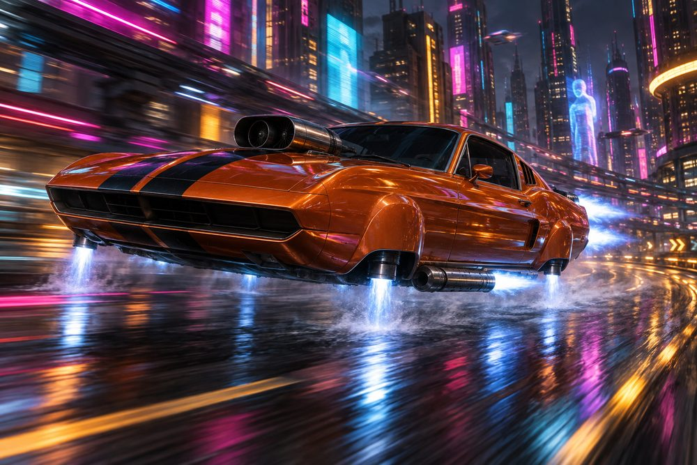

# Muscle: class sheet (round 2)

Status: concept exploration, 2026-10-01. Words and concept art only. Not game content and not approved.
Frame standard and blockout notes: [muscle-frame.md](muscle-frame.md). Prompts: `output/vehicle-categories-2026-10-01/muscle/prompts/`.

## Pitch and player fantasy

Muscle is the American muscle car with the wheels taken off. It keeps the long bonnet, the short deck, the wide haunches and the stripes. A turbine bursts through the bonnet where the supercharger was. Lift jets sit in the blanked arches. Afterburners sit where the side pipes ran.

The fantasy is the garage build. You pick a shell, then you build the noise. You roll up to the meet with the loudest engine in the street, then you win with it. Every part is something you can see, hear and show off.

## Cultures

| Culture | Line |
|---|---|
| Classic Muscle | Late-60s showroom heroes: shark noses, Coke-bottle hips, side pipes, stripes. |
| Pony | Light and stylish: V beak, quad engines, slim paddles and lake pipes. |
| Modern Muscle | Retro shape, sharp edges: slots, splitters, blade wings, flush jets. |
| Pro Street | Drag-strip show cars: tilted nose, tall blower stack, fat bazookas. |
| Restomod | Old shell, new guts: split grille, tunnel ram, quiet skirted jets. |
| Trans-Am racer | Track-spec 60s coupés: flat nose, stacked engines, megaphones, ducktail. |

## Cockpits

Tiers are suggestions only. They follow the E, D, C, B, A, S spread of the existing class.

| Cockpit | Culture | Silhouette | Signature kit | Tier |
|---|---|---|---|---|
| Notch | Trans-Am racer | Upright notchback roof, short step to the boot | Trans-Am | E |
| Ute | Restomod | Coupé cab with an open cargo bed behind | Restomod | D |
| Ragtop | Pony | Open top, low screen, folded hood behind seats | Pony | C |
| Hardtop | Pro Street | Coke-bottle waist, formal roof, flat rear glass | Pro Street | B |
| Fastback | Classic Muscle | Long sloping roof, small quarter window | Classic | A |
| Modern | Modern Muscle | Low retro-modern coupé, slim glass, high shoulders | Modern | S |

## Fundamentals

Every build has all four. Each one shows an intake, a body and a glowing nozzle from outside.

| Slot | Player label | Where it sits | Options |
|---|---|---|---|
| `Engine1` | Hood Engine | On the bonnet, where the blower burst through | **Shaker Turbine**: one round turbine in a scoop. **Blower Stack**: tall chunky stack of intake trumpets. **Cross-Ram Twins**: two long ram barrels side by side. **Cowl Slot Turbine**: low flat twin-rotor body with a slot nozzle. **Quad Pack**: four small trumpets in a row. **Tunnel Ram**: long boxy intake with one nozzle. |
| `Engine2` | Tail Engine | In the open bay between the haunch tails, where the boot was | **Twin Barrel**: two big barrels side by side. **Mono Turbine**: one huge central turbine. **Over-Under**: two engines stacked. **Slot Burner**: one wide flat slot across the tail. **Quad Corners**: four small nozzles at the bay corners. **Inline Four**: four small nozzles in a straight line. |
| `Stabilisers` | Lift Jets | One in each blanked wheel arch | **Corner Turbines**: slim turbine cans, one per arch. **Big 'n' Little**: mismatched jets, big at the back, little at the front. **Outriggers**: long jets on struts, standing proud. **Vector Cans**: angular nozzle cans that tilt. **Glide Paddles**: flat thrust paddles on struts. **Skirted Triples**: half skirt over a scoop and three short cans. |
| `Boost` | Side Burners | Under the sills, where the side pipes ran | **Side Pipes**: long chrome afterburner cans. **Bazookas**: short fat tubes with a big bore. **Megaphones**: flared nozzles that throw long flames. **Sill Slots**: flat slot burners flush in the sill. **Lake Trios**: three slim pipes grouped each side. **Underslung Twins**: two slim tubes slung under each sill. |

## Body and cosmetic slots

`Hood`, `Roof` and `Accessory` are not used in this class.

| Slot | Player label | Options |
|---|---|---|
| `FrontBody` | Nose Clip | **Shark Nose**: rounded, hidden lamps. **Tilt Nose**: forward-tilted wedge. **Raked Nose**: flat grille, raked back. **Bluff Nose**: blunt, with bonnet crowns and a dome. **Pony Beak**: V-shaped prow. **Stacked Blades**: split grille of stacked blades. |
| `RearBody` | Tail and Haunches | **Coke Hips**: curved Coke-bottle hips. **Tubbed Tail**: wide, boxed-in back end. **Flared Kamm**: flared hips, chopped tail. **High Deck**: tall flat deck. **Slant Deck**: deck that falls away. **Square Tail**: flat, square-cut end. |
| `SidePods` | Rockers | **Rocker and Scoop**, **Heat Shield**, **Exit Vent**, **Blade Skirt**, **Side Cove**, **Rocker Tube** (a slim tube along the sill). |
| `FrontBumper` | Front Bumper | **Chrome Blade**: thin chrome bar. **Chin Scoop**: deep scoop under the nose. **Air Dam**: low dam. **Splitter**: flat blade. **Bumperettes**: two small guards. **Roll Pan**: smooth body-colour panel. |
| `RearBumper` | Rear Bumper | **Chrome Quarters**: quarter bumpers. **Skid Bars and Chutes**: bars with chute pods. **Jack Valance**: plain valance. **Diffuser**: finned diffuser. **Rolled Valance**: smooth rolled edge. **Tucked Pan**: smooth pan tucked under the tail. |
| `RearSpoiler` | Spoiler | **Winged Warrior**: tall wing on struts. **Drag Wing**: big flat wing. **Ducktail**: small lip. **Blade Wing**: thin blade. **Deck Rack**: luggage rack. **Fin Bar**: two low fins joined by a light bar. |

## Signature kits

| Kit | Culture | Native cockpit | What makes it look different |
|---|---|---|---|
| Classic | Classic Muscle | Fastback | Round turbine scoop, shark nose, chrome blade, twin barrels, long side pipes. |
| Pro Street | Pro Street | Hardtop | Tall blower stack, wedge nose with chin scoop, fat bazookas, big drag wing. |
| Trans-Am | Trans-Am racer | Notch | Flat raked nose, twin hood engines, stacked tail engines, megaphones, ducktail. |
| Modern | Modern Muscle | Modern | Flat slot turbine on the cowl, slot burner at the tail, bluff crowned nose, splitter, blade wing. |
| Pony | Pony | Ragtop | V beak, four-trumpet pack, four corner nozzles, paddles, slanted deck. |
| Restomod | Restomod | Ute | Split blade grille, boxy tunnel ram, inline nozzle bank, skirted triples, square tail. |

## Handling intent versus Piercer

Design intent only. Piercer's real numbers set the size of each step.

| Stat | Bias | Why |
|---|---|---|
| TopSpeed | + | Long straight-line power. |
| Acceleration | ++ | The class promise: big thrust off the line. |
| Braking | - | Heavy nose, big power. |
| BoostForce | ++ | Afterburners are the signature. |
| BoostDuration | - | Big bursts that burn out fast. |
| DriftControl | - | The tail steps out easily and is hard to hold. |
| DriftGrip | - | Slides readily. |
| LateralGrip | - | Wide, bluff body. |
| SteeringResponse | - | Lazy turn-in from a long nose. |
| HoverStability | - | Nose-heavy, with a turbine on the bonnet. |
| Downforce | - | Old shapes are not aero. Modern and Trans-Am kits win some back. |
| Drag | + | Bluff nose and a big intake. Flush Modern jets cut it. |
| Weight | = | Similar to Piercer, but nose-heavy. |

## Ideas for customising and owning

1. **Stripes that survive swaps.** Every body part carries the belt stripe. Change the nose and the stripe still runs on.
2. **Idle shudder.** Each Hood Engine rocks the car at idle in its own way: a Shaker shakes, a Quad Pack chatters, a Blower Stack whines.
3. **Burnout launch.** Hold brake and throttle. Lift jets flare and kick up spray, the Tail Engine builds, and releasing the brake slings you forward.
4. **Overrun pops.** Lifting off the throttle crackles the Side Burners. Megaphones spit long flames. Sill Slots only flick.
5. **Sleeper or show car.** The Modern kit hides its jets in flush slots. The Pro Street kit stands them up. Same speed, opposite attitude.
6. **Era sets.** Fit all six modules from one culture and it unlocks that era's paint and thrust colour, such as Trans-Am white and blue.
7. **Visible rake.** Lift-jet strength tilts the car nose-down or tail-up, so a Big 'n' Little pair gives the drag-car stance. Cosmetic only.
8. **Two-tone thrust.** Paint the lift jets one thrust colour and the afterburners another, so a mixed build still reads as yours.

## Gallery

*Fastback cockpit, Classic kit. Shaker Turbine, Twin Barrel, Corner Turbines, Side Pipes, Shark Nose, Coke Hips. Burnt orange with black stripes.*

*Fastback, Classic kit pulled apart. Shaker Turbine up, Twin Barrel back, four Corner Turbines out, Side Pipes under, Shark Nose forward, Coke Hips and Winged Warrior back. Midnight blue.*

*Fastback, Ragtop and Ute (left to right), all in the Classic kit and the same yellow and black paint.*

*Fastback in the Classic, Pro Street and Modern kits (left to right). Same red and white paint. The arches are blanked and each corner has a slim lift-jet tube hanging below the fender. The Pro Street tail reads as a long barrel, not a squat turbine.*

*Hardtop cockpit from behind in silver and orange, identical except for the engines. Left to right: Shaker Turbine with Twin Barrel, Blower Stack with Mono Turbine, Quad Pack with Quad Corners.*

*Notch cockpit, Trans-Am kit, low rear view. Outriggers on the floor, Megaphones and Over-Under firing, Ducktail. White, blue and orange.*

*Ute cockpit, Restomod kit: Stacked Blades, Tunnel Ram, Inline Four, Skirted Triples, Underslung Twins, Roll Pan, Tucked Pan. Graphite and copper.*

*The hero build (Fastback, Classic kit) at speed in a neon city at night.*

## Risks and open points

- The Modern cockpit is not shown on its own in the art. Only the Modern kit appears (image 04).
- Option descriptions come from the module names, the frame notes and the images, not from the blockout part lists. Check them against the blockout previews.
- Real-car likeness is welcome, but the prompts name real models only as body-style references. In game, use no brand names, badges or licensed grille shapes.
- Lift jets in the arches can read as wheels at small size. Keep every nozzle longer than wide and keep the glow bright. Image 04 was regenerated for this: its first version had dark round ribbed cans inside the arches that looked like wheels. In the final version the arches are blanked and the jets are slim tubes below the fender.
- Glide Paddles and Skirted Triples read the least like jets. They may need more visible nozzles.
- Fin Bar must stay square-edged: two low fins and a straight bar. A rounded hoop would break the no-rings rule.
- Cabin differences in image 03 are subtle at thumbnail size. Ragtop and Ute read clearly. Fastback against Hardtop and Notch is mostly the roof.
- The blockout notes that noses, tails and cockpits score low on silhouette because they share pads. A redesign of the shared pads needs a decision.
- Image 05 is almost dead astern, not three-quarter. Image 04's centre tail came out as a long barrel after a regeneration.
- Handling bias depends on Piercer's real numbers. Tiers are suggestions.
