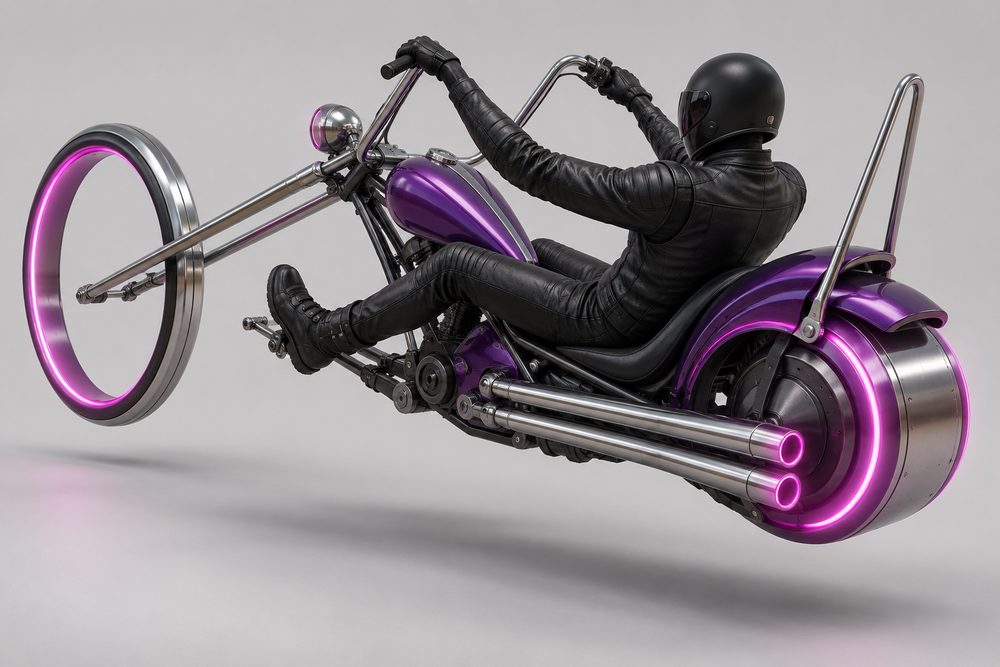
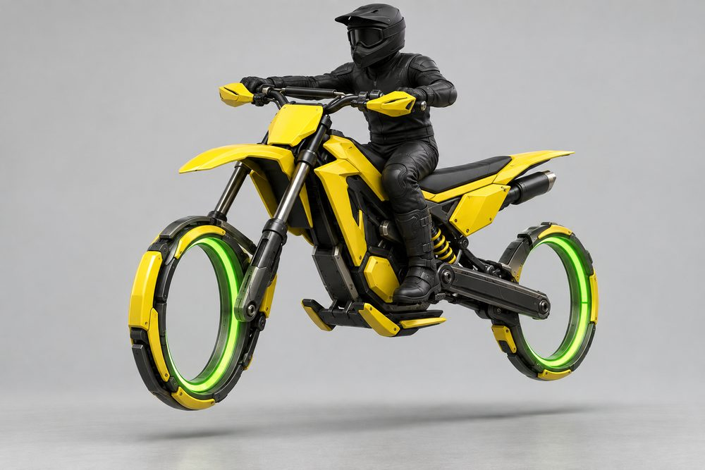

# Rider: hoverbike frame class

Status: design exploration, 2026-10-01. Not approved, not game content. Class id `rider`. Shared rules are in the [exploration contract](../../../scripts/vehicle_blockouts/CONTRACT.md). Concept images are AI-generated mood pieces, not model sheets.

## Pitch

Motorcycle culture turned into hoverbikes. A slim spine, a seat and a rider you can always see. Where each wheel was there is a hover unit: a glowing hubless ring, a fat drum, a blade vane or a thruster. About 6 W x 6 H x 14 L studs, the smallest class in the game.

**Player fantasy:** you are the vehicle. Your avatar is on show, not hidden in a cabin. You thread gaps cars cannot, lift the nose on boost and lean through corners. You are fast and fragile, and everyone can see what you are wearing.

## Culture lines

- **Supersport:** full fairing, bubble screen, crouched rider, race tail.
- **Café Racer:** round lamp, long tank, humped seat, clip-ons.
- **Chopper:** long raked fork, ape-hanger bars, sissy bar, feet forward.
- **Motocross:** tall, high beak fender, blank front plate, wide braced bars.
- **Streetfighter:** naked frame, angry mask headlight, stubby tail.
- **Speeder:** sci-fi sled, twin forward vanes, twin thrusters.

## Cockpits

The cockpit is the spine, power core, seat base, footpegs and the rider's pose. Everything else is a module.

| Cockpit | Culture | Silhouette and rider pose | Tier |
|---|---|---|---|
| Scrambler | Motocross | Tall spine, high flat seat, rider bolt upright | E |
| Café | Café Racer | Level spine, flat seat, slight forward lean | D |
| Streetfighter | Streetfighter | Hunched naked frame, upright and elbows out | C |
| Chopper | Chopper | Long low spine, feet forward, leaning back | B |
| Supersport | Supersport | Steep compact spine, deep racing crouch | A |
| Speeder | Speeder | Long flat sled, rider stretched forward at rear | S |

## Slots and modules

Eight performance slots plus three cosmetic slots (`Hood`, `Roof`, `Accessory`). Everything fits every cockpit.

| Slot id | Player label | Modules |
|---|---|---|
| `Engine1` | Front End | **Sport Fork** short upside-down fork, slim ring. **Chopper Rake** very long chrome fork, tall thin ring. **Girder Fork** vintage linked girder, slim ring. **Hubless Ring** wide glowing hoop on a one-sided arm. **Speeder Vane** twin booms with blade vanes. |
| `Engine2` | Rear End | **Sport Swingarm** one-sided arm, glowing ring. **Fat Drum** short wide hover drum. **Hardtail** rigid triangle frame, slim ring. **Twin Thruster** two nozzles side by side. |
| `Stabilisers` | Winglets | **Aero Winglets** small wings on the nose flanks. **Outrigger Skids** flat glowing skids under the pegs. **Crash Sliders** stubby bobbins on the frame. |
| `SidePods` | Body Panels | **Full Fairing** flank panels with gill vents. **Tank Shrouds** short angular shoulder panels. **Saddlebags** boxy panniers by the tail. **Number Boards** blank oval side boards. |
| `Boost` | Exhaust | **Under-tail** short can under the seat. **Shotgun Pipes** two long straight low pipes. **Megaphone** one upswept flared cone. **Stubby** short side-exit can. |
| `FrontBumper` | Fairing | **Race Nose** pointed nose, slit lamps. **Bikini Fairing** small half cowl. **Round Lamp** one big bare headlamp. **Number Plate** blank flat front board. **Fighter Mask** angular angry twin-slit mask. |
| `RearBumper` | Tail Kit | **Sissy Bar** tall chrome hoop behind the seat. **Tail Tidy** tiny light strip, nothing else. **Luggage Rack** flat tube rack. |
| `RearSpoiler` | Seat Unit | **Race Cowl** sharp single-seat tail. **Café Hump** rounded bum-stop. **Bobber Fender** short curved fender. **MX Fender** long kicked-up fender. |
| `Hood` | Tank | **Sculpted** angular with knee cut-outs. **Peanut** small and rounded. **Teardrop** long and slim. |
| `Roof` | Screen | **Bubble** low race bubble. **Flyscreen** small flat tinted plate. **Tall Tourer** upright tall screen. |
| `Accessory` | Bars | **Clip-ons** low and narrow. **Apes** tall ape-hangers. **MX Bars** wide with crossbrace and hand guards. **Drag Bars** flat and straight. |

Suggested additions for later: Front End **Blade Vane** (single vertical blade), Winglets **Knee Vanes**, Tail Kit **Pillion Pad**.

## Handling intent versus Piercer

Design intent only. No numbers.

| Stat | Bias | Why |
|---|---|---|
| TopSpeed | = | Level with Piercer. Speed is not the point. |
| Acceleration | ++ | Lightest class. Fastest off the line. |
| Braking | + | Little mass to stop. |
| BoostForce | + | Hard kick that lifts the nose. |
| BoostDuration | - | Short bursts, used often. |
| DriftControl | - | Bikes lean, they do not slide for long. |
| DriftGrip | - | A drift lets go quickly. |
| LateralGrip | + | Holds a tight line when leaned over. |
| SteeringResponse | ++ | Sharpest turn-in in the game. |
| HoverStability | -- | Bumps and landings unsettle it. |
| Downforce | - | Light over crests, floaty at top speed. |
| Drag | - | Small frontal area. Supersport lowest, Scrambler highest. |
| Weight | -- | Loses every contact. Pushed around by cars. |

## What makes it fun to own

1. **Boost wheelie.** Boost lifts the front hover unit. A Chopper Rake with a Fat Drum lifts highest. Track "longest wheelie" as a class stat.
2. **Lean and knee-down.** The bike banks into corners and the rider hangs off. At full lean the knee slider throws sparks. This is the class photo moment.
3. **Rider gear garage.** Helmet shape, leathers, gloves and boots as a second customisation layer. Always plain and unbranded. Gear takes the bike's paint channels so rider and bike match.
4. **Full-kit names.** Wear every module of one culture and the build earns a name: Paddock (Supersport), Clubman (Café Racer), Long Haul (Chopper), Holeshot (Motocross), Bare Knuckle (Streetfighter), Outrider (Speeder). A full kit unlocks a matching idle pose.
5. **Ring glow as rims.** Hover rings and drums take the Neon channel and a glow pattern (solid, chase, pulse). This is the bike's version of wheels.
6. **Parked poses.** A parked bike settles onto a side skid. The rider can sit side-saddle, lean on the bars or flip the visor. Bars change the pose: Apes look relaxed, Clip-ons look hunched.
7. **Filtering bonus.** Passing between two vehicles at speed gives a small boost refill. Only this class is narrow enough to earn it.
8. **Stoppie and ring burnout.** Hard braking tips the tail up. Holding brake and throttle spins the rear unit and leaves a glowing ring on the road.

## Gallery

*01 hero. Supersport full kit, three-quarter front. Shows Front End (Sport Fork), Rear End (Sport Swingarm), Fairing (Race Nose), Screen (Bubble), Body Panels (Full Fairing), Tank (Sculpted), Seat Unit (Race Cowl), Exhaust (Under-tail), Bars (Clip-ons), Winglets.*

*02 exploded. Supersport. Cockpit (spine, core, seat base, rider) in the centre. Pulled away: Front End, Rear End, Fairing, Screen, Bars, Tank, Seat Unit, Exhaust, Body Panels, Winglets.*

*03 one kit, three cockpits. Streetfighter kit (Fighter Mask, Hubless Ring, Fat Drum, Stubby, Sculpted tank) in the same orange on Supersport (left), Chopper (centre) and Scrambler (right) cockpits. Only the spine, seat and pose change.*

*04 one cockpit, three kits. Café cockpit and the same rider, in the same green and cream. Left: Café Racer kit. Centre: Supersport kit. Right: Chopper kit. Front End, Rear End, Fairing, Tank, Seat Unit, Tail Kit, Exhaust and Bars all change.*

*05 chopper. Three-quarter rear. Shows Exhaust (Shotgun Pipes), Tail Kit (Sissy Bar), Seat Unit (Bobber Fender), Rear End (Fat Drum), Front End (Chopper Rake), Bars (Apes), Tank (Teardrop).*

*06 motocross. Scrambler cockpit. Shows Fairing (blank Number Plate with beak fender), Bars (MX Bars), Seat Unit (MX Fender), Body Panels (Tank Shrouds, Number Boards), Winglets (Outrigger Skids), Exhaust (Stubby).*

*07 speeder. Speeder cockpit. Shows Front End (Speeder Vane), Rear End (Twin Thruster), Screen (Flyscreen), Body Panels (Saddlebags), Winglets, Bars (Drag Bars).*

*08 action. The Supersport hero leaning through a night-city corner on boost. Shows the lean, the knee-down pose and the Exhaust boost trail.*

## Risks and open points

- **Seat animation.** The astride pose is new. Six cockpits mean six seated poses. The Bars slot moves the hands, so hands need IK targets on the bar module, or Bars must share one grip point.
- **Avatar fit.** The rider is the player's avatar. Body scale, tall hats, wings and back accessories will clip the tank and Seat Unit. Decide whether the class hides some accessories.
- **Shared mounts.** Modules are authored in cockpit-root space. Tank, Seat Unit, Bars and Screen must sit at the same height on every cockpit. "Tall" and "low" must come from the spine below the beltline, the pegs and the pose. Image 03 shows this limit: the three frames look closer than the brief suggests.
- **Front End length.** Chopper Rake is far longer than Sport Fork. The Front End envelope must hold both. Fairing and Screen must not depend on fork length.
- **Tight envelopes.** At 6 studs wide, Body Panels, Winglets and side Exhausts compete for the same space. Seat Unit, Tail Kit and Rear End stack at the tail.
- **Passengers.** The current passenger system seats people inside a cockpit. A bike has one pillion at most. Race Cowl and Café Hump leave no pillion space. Taxi jobs may need to exclude this class.
- **Collisions.** A small hitbox is the appeal and the problem. Decide a minimum collision width. Decide what heavy contact does. Recommend no rider ejection at first.
- **Lean and wheelie.** These should be visual roll and pitch on the model only. They must not add a second owner for vehicle physics or camera.
- **Rings reading as wheels.** At a distance a ring looks like a wheel. Keep rings thin, hubless and clear of the floor. Image 04 drifts towards dark tyre-like bands. Do not copy that.
- **Speeder originality.** Twin forward vanes sit close to a well-known film vehicle. Push the shape language further before production.
- **Cosmetic slots.** Tank, Screen and Bars carry no stats. Confirm players accept that the most visible parts are cosmetic.
- **Blank boards.** Number Plate and Number Boards are blank. A player-chosen number is a possible later feature and needs text filtering.
