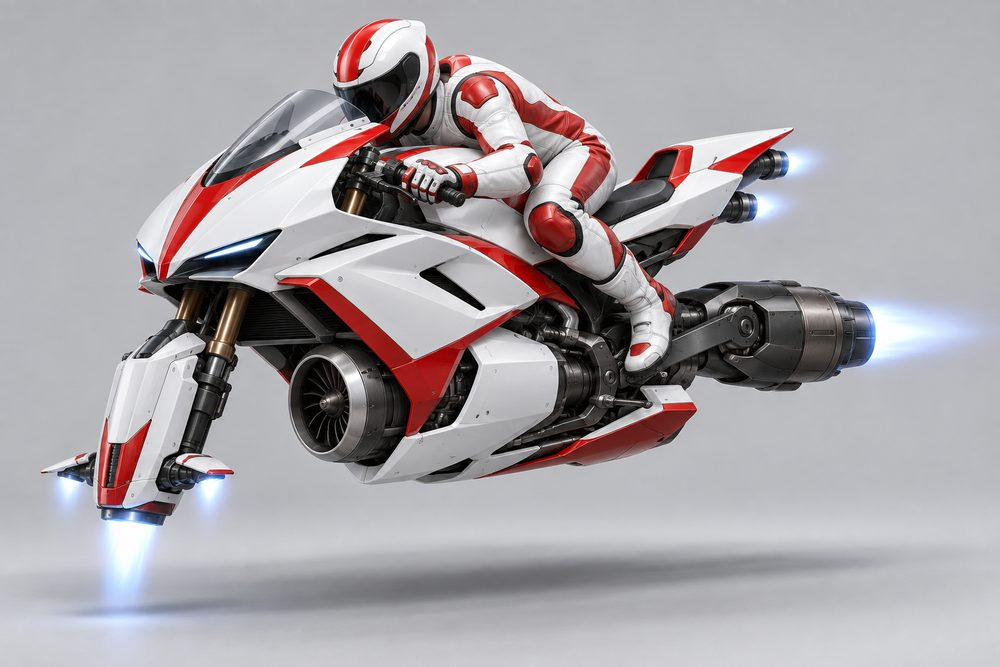
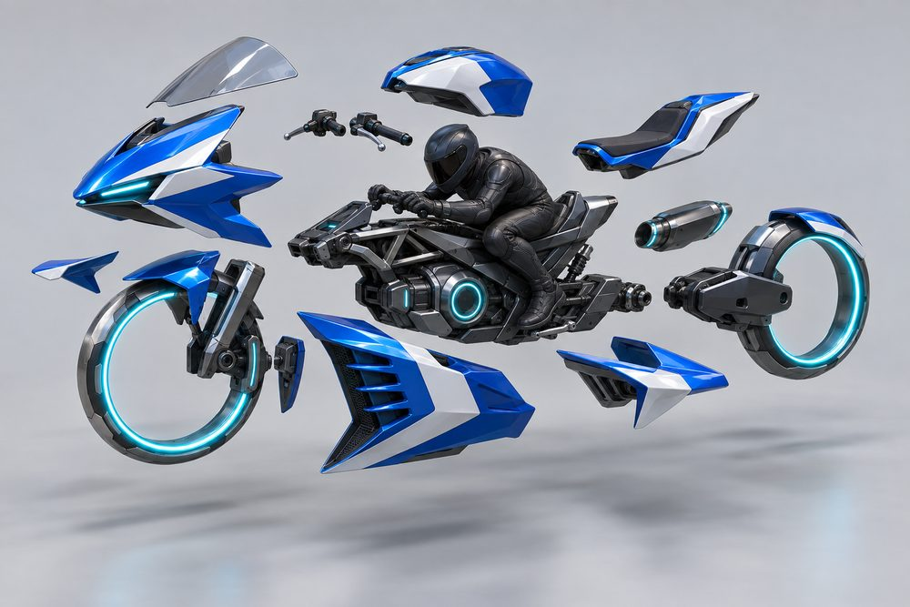
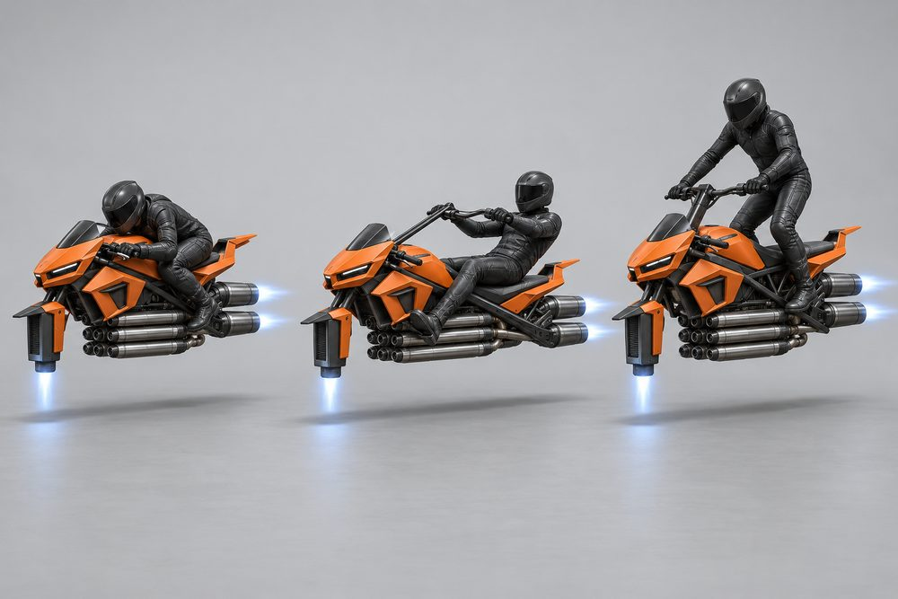
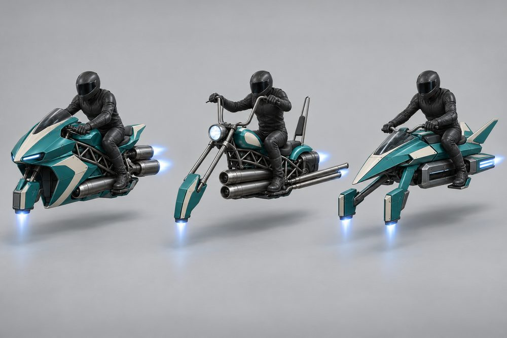
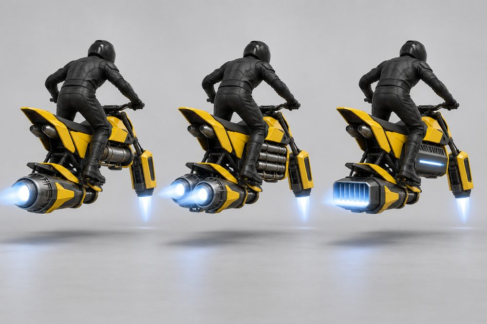
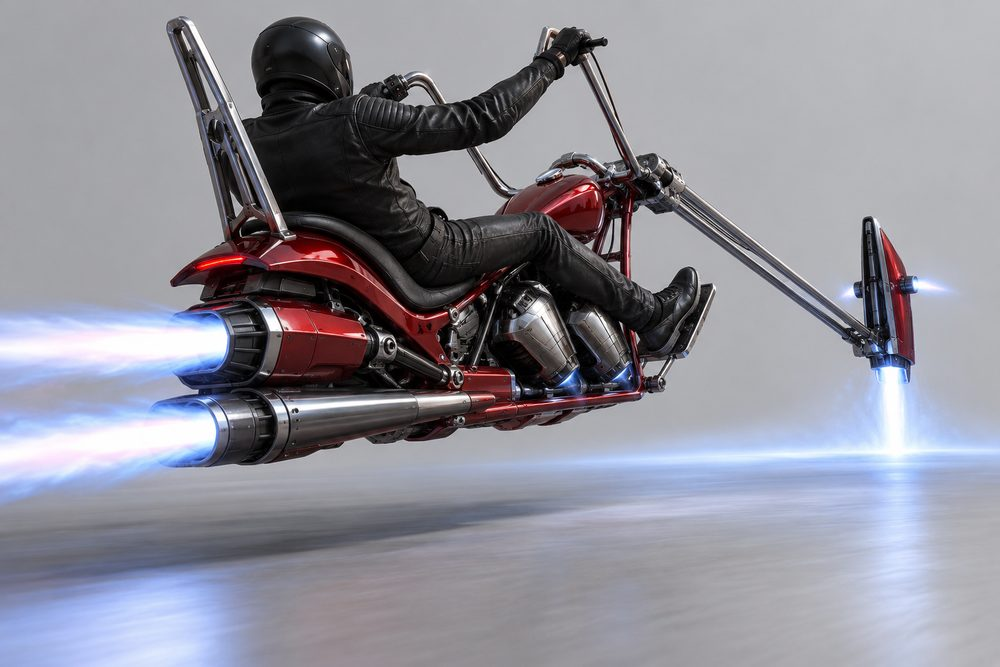
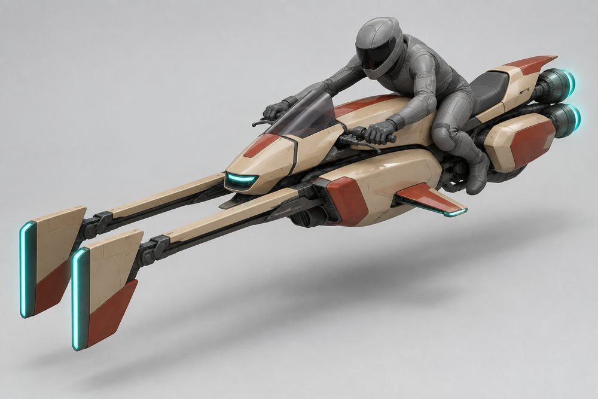
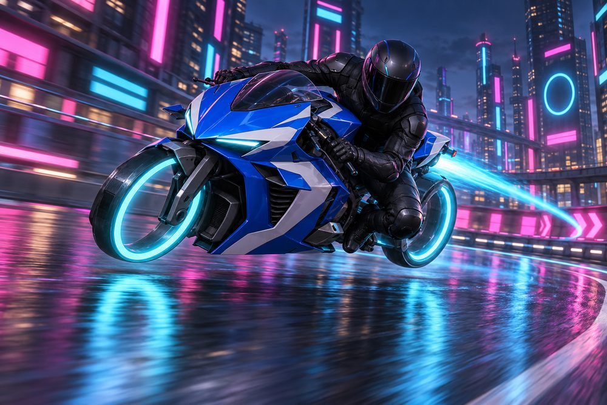

# Rider: jet hoverbike frame class (round 2)

Status: design exploration, round 2, 2026-10-01. Updated 2026-10-02 to match the reviewed blockout spec. Not approved, not game content. Class id `rider`. Shared rules: [exploration contract](../../../scripts/vehicle_blockouts/CONTRACT.md). Geometry and fit: [rider frame standard](rider-frame.md). Concept images are AI-generated mood pieces, not model sheets, so details may not match the modules exactly.

Round 2 change: no wheels and nothing wheel-like. The front fork holds a lift-jet pod. The swingarm ends in a long thruster nozzle. A turbine sits under the tank. Round 1 images are in `output/vehicle-categories-2026-10-01/rider/v1/`.

## Pitch

Motorcycle culture as jet hoverbikes. A slim spine, a seat and a rider you can always see. A helmeted rider in plain leathers sits astride. Every jet is longer than it is wide. About 6 W x 6 H x 14 L studs, the smallest class in the game.

**Player fantasy:** you are the vehicle. Your avatar is on show, not hidden in a cabin. You thread gaps cars cannot, lift the nose on boost and lean through corners. You are fast and fragile, and everyone can see what you are wearing.

## Culture lines

- **Supersport:** full fairing, bubble screen, crouched rider, race tail.
- **Cafe Racer:** dolphin nose, long tank, round dome hump, solo seat, clubmans bars.
- **Chopper:** long raked fork, wide pullbacks, short sissy bar, feet forward.
- **Motocross:** tall frame, high fender, blank front plate, wide braced bars.
- **Streetfighter:** naked frame, angry mask, stubby tail.
- **Speeder:** sci-fi sled, forward booms, flat slot engine, prone rider.

## Cockpits

The cockpit is the spine, seat, frame and the rider's pose. Everything else is a module.

| Cockpit | Culture | Silhouette | Signature kit | Tier |
|---|---|---|---|---|
| Scrambler | Motocross | Tall frame, high bench, rider standing on pegs | Holeshot | E |
| Cafe | Cafe Racer | Round dome hump, slim solo seat, crouched rider | Ton-Up | D |
| Streetfighter | Streetfighter | Triangular frame panel, upright rider, elbows out | Bare Knuckle | C |
| Chopper | Chopper | Long low spine, feet forward, rider leaning back | Long Haul | B |
| Supersport | Supersport | Steep compact spine, rider in full tuck | Paddock | A |
| Speeder | Speeder | Long flat sled tub, rider lying prone | Outrider | S |

All six cockpits are in the blockout.

## The four fundamentals

Every build has all four. Each is visible jet hardware with a glowing nozzle. Swapping one changes the outline, not a detail.

| Slot | Player label | Where it sits | Options |
|---|---|---|---|
| `Engine1` | Main Turbine | Under the tank, between the rider's legs. Every option ends in a rear glow under the swingarm. | **Inline Turbine** one slim barrel, long centre tailpipe. **Flat Twin** two flat barrels with megaphone tails. **V-Twin Jets** two slim cans in a V, twin tailpipes. **Big Single** one tall canted can, single stinger. **Four-Poster** four lift posts and a rear collector nozzle. **Slot Burner** wide flat body, glowing slit exhaust. |
| `Engine2` | Rear Thruster | On the swingarm behind the seat, where the rear wheel was. Set high, so the main turbine's exhaust shows below. | **Mono Thruster** one long barrel. **Trident** three barrels. **Fat Block** tall narrow block, side scoops, stepped nozzle. **Over-Under** two barrels, one stacked above the other. **Twin Barrels** two barrels side by side. **Fan Tail** wide flat slot with thin vanes. |
| `Stabilisers` | Lift Fork | On the fork, where the front wheel was. | **Sport Fork** short fork, boxy lift pod, winglet tip jets. **Torpedo Fork** three torpedoes on a straight axle. **Long Rake** very long fork, wide pod with an open intake. **Lift Cans** two upright lift cans. **Girder Twin** twin pods under a small canard. **Twin Boom** two booms reaching forward, vane jets. |
| `Boost` | Afterburner | On the flanks beside and behind the rear thruster. | **Twin Cans** two short cans. **Reverse Cones** two slim cones that narrow to the rear. **Shotgun Pipes** two long straight low pipes. **High Megaphone** one upswept flared cone. **Quad Stubs** four short stub pipes. **Slot Blades** flat glowing slits along the flanks. |

## Body and cosmetic slots

| Slot id | Player label | Options |
|---|---|---|
| `FrontBumper` | Fairing | **Race Nose** pointed, slit lamps. **Dolphin Nose** smooth, rounded, low snout. **Round Lamp** one big bare headlamp. **Number Plate** blank flat front board. **Fighter Mask** angular twin-slit mask. **Spear Prow** long spear-shaped nose. |
| `SidePods` | Side Panels | **Race Flanks** full flank panels with gill vents. **Side Covers** small smooth oval covers. **Saddlebags** boxy panniers. **Shrouds** short angular tank shrouds. **Ram Scoops** open-mouthed angular scoops. **Delta Strakes** thin swept strakes. |
| `RearSpoiler` | Seat Unit | **Race Cowl** sharp single-seat tail. **Bullet Tail** short, round-nosed tail hump. **Bobber Fender** short curved fender. **MX Fender** long kicked-up fender. **Stub Tail** short and abrupt. **Boat Tail** long tapered tail. |
| `RearBumper` | Tail Kit | **Tail Tidy** tiny light strip. **Bullet Lamp** one small round-nosed lamp. **Short Sissy** short backrest. **Rack and Roll** flat tube luggage rack. **Tail Wing** small wing. **V-Tail** twin canted fins. |
| `Hood` | Tank | **Sculpted** angular, knee cut-outs. **Long Alloy** long, low teardrop. **Peanut** small and rounded. **Slab** flat-sided and wide. **Muscle** bulky, high shoulders. **Sled Deck** flat low deck. |
| `Roof` | Screen | **Bubble** low race bubble. **Aero Screen** small swept-back screen. **Tourer** tall upright screen. **Rally Tower** tall flat tower. **Flyscreen** small flat tinted plate. **Canopy** low glass canopy over the nose. |
| `Accessory` | Bars | **Clip-ons** low and narrow. **Clubmans** low bars swept gently back. **Pullbacks** wide, swept-back bars. **MX Bars** wide, crossbrace. **Drag Bars** flat and straight. **Flight Yoke** swept yoke. |

## Signature kits

Each kit has one module for every slot, 11 in all. Every kit fits every cockpit.

| Kit | Culture | Native cockpit | What makes it look different |
|---|---|---|---|
| Paddock | Supersport | Supersport | Full fairing, bubble, one long rear barrel, low clip-ons |
| Ton-Up | Cafe Racer | Cafe | Dolphin nose, flat twin, torpedo fork, reverse cones, Clubmans |
| Long Haul | Chopper | Chopper | Very long raked fork, round lamp, wide pullbacks, long low pipes |
| Holeshot | Motocross | Scrambler | Tall and bare, big single turbine, lift cans, high megaphone |
| Bare Knuckle | Streetfighter | Streetfighter | Naked, four-barrel turbine, twin pods under a canard, mask |
| Outrider | Speeder | Speeder | Flat sled, forward booms, slot burner, fan tail, V-tail |

## Handling intent versus Piercer

Design intent only. No numbers.

| Stat | Bias | Why |
|---|---|---|
| TopSpeed | = | Level with Piercer. Speed is not the point. |
| Acceleration | ++ | Lightest class. Fastest off the line. |
| Braking | + | Little mass to stop. |
| BoostForce | + | Hard kick that lifts the nose. |
| BoostDuration | - | Short bursts, used often. |
| DriftControl | - | Bikes lean, they do not slide for long. |
| DriftGrip | - | A drift lets go quickly. |
| LateralGrip | + | Holds a tight line when leaned over. |
| SteeringResponse | ++ | Sharpest turn-in in the game. |
| HoverStability | -- | One front lift jet. Bumps and landings unsettle it. |
| Downforce | - | Light over crests, floaty at top speed. |
| Drag | - | Small frontal area. Supersport lowest, Scrambler highest. |
| Weight | -- | Loses every contact. Pushed around by cars. |

## What makes it fun to own

1. **Nose lift on boost.** Boost tips the lift fork up and the nozzles glow. A Long Rake with a Fat Block lifts highest. Track "longest nose lift" as a class stat.
2. **Lean and knee-down.** The bike banks into corners and the rider hangs off. At full lean the knee slider throws sparks. This is the class photo moment.
3. **Rider gear garage.** Helmet shape, leathers, gloves and boots as a second customisation layer. Plain and unbranded. Gear takes the bike's paint channels so rider and bike match.
4. **Full-kit names.** Wear all 11 modules of one kit and the build earns its name: Paddock, Ton-Up, Long Haul, Holeshot, Bare Knuckle or Outrider. A full kit unlocks a matching idle pose.
5. **Flame as signature.** The four jets take the thrust colour and a flame shape (clean cone, sparking, pulsing). Pick a different flame for each jet. This is the bike's paint-shop signature.
6. **Parked poses.** A parked bike settles onto a side skid. The rider can sit side-saddle, lean on the bars or flip the visor. Bars change the pose: Pullbacks look relaxed, Clip-ons look hunched.
7. **Filtering bonus.** Passing between two vehicles at speed gives a small boost refill. Only this class is narrow enough to earn it.
8. **Stoppie and burnout.** Hard braking tips the tail up. Holding brake and throttle fires the rear thruster down and scorches two glowing lines on the road.

## Gallery

*01 hero. Supersport cockpit, Paddock kit, three-quarter front. Shows Lift Fork (Sport Fork), Main Turbine (Inline Turbine), Rear Thruster (Mono Thruster), Afterburner (Twin Cans), Fairing (Race Nose), Screen (Bubble), Tank (Sculpted), Seat Unit (Race Cowl), Bars (Clip-ons).*

*02 exploded. Supersport cockpit, Paddock kit. Frame, seat and rider in the centre. Pulled away: Fairing, Screen, Bars, Tank, Seat Unit, Side Panels, Main Turbine, Rear Thruster, Lift Fork and two Afterburner cans.*

*03 one kit, three cockpits. Bare Knuckle kit in matte orange on Supersport (left), Chopper (centre) and Scrambler (right). Fighter Mask, Flyscreen, Drag Bars, Four-Poster (four long turbine tubes under the tank), Twin Barrels, Girder Twin and Quad Stubs are the same on all three. Only the frame, seat and rider pose change: the Chopper is longest and lowest with its legs forward, and the Scrambler is tallest with the rider standing.*

*04 one cockpit, three kits. Streetfighter cockpit, same rider, same teal and cream. Left: Paddock kit. Centre: Long Haul kit. Right: Outrider kit. Fairing, Screen, Bars, Tank, Seat Unit, Tail Kit and all four fundamentals change. Each engine is a long tube under the tank.*

*05 engines. Scrambler cockpit, low rear three-quarter, yellow and black. Main Turbine and Rear Thruster change together. Left: Inline Turbine and Mono Thruster. Centre: Four-Poster and Twin Barrels. Right: Slot Burner and Fan Tail. Lift Fork and Afterburner are the same.*

*06 stabilisers and boost. Chopper cockpit, Long Haul kit, low rear three-quarter. Boost firing from the Shotgun Pipes. The Long Rake blade pod throws a jet down at the floor. Also shows V-Twin Jets, Fat Block, Pullbacks, Short Sissy, Peanut tank and Bobber Fender.*

*07 speeder. Speeder cockpit, Outrider kit, three-quarter front. Spear Prow, Canopy, Flight Yoke, Sled Deck, V-Tail, Boat Tail, Slot Burner, Fan Tail, Twin Boom lift jets and Slot Blades.*

*08 action. The Supersport hero (Paddock kit) leaning through a night-city corner on boost. Shows the lean, the knee-out pose, the Afterburner trail and the Lift Fork downwash.*

## Risks and open points

- **Streetfighter under a foreign kit.** It is the weakest cockpit. Its frame panel sits low and Side Panels can cover it.
- **Cockpits look close.** A bike cockpit is mostly the rider, so the pose carries it. Image 03 shows the limit: with one kit fitted, the three frames differ only in length, height and rider pose. Real meshes must keep the six poses and the cockpit bodywork.
- **Hidden engine.** Every Main Turbine ends in a rear glow under the swingarm. From a high chase camera the legs still hide half of the body. Wide engines (V-Twin Jets, Four-Poster, Slot Burner) read best. Inline Turbine is the weakest.
- **Jets reading as wheels.** Round intake faces and lift-pod nozzles can look like discs. Keep every jet deep, with a visible body, and longer than it is wide.
- **Seat animation.** The astride pose is new, and the prone Speeder pose is different again. Hands need one grip point shared by all Bars, or IK targets on each Bars module.
- **Avatar fit.** The rider is the player's avatar. Tall hats, wings and back accessories will clip the tank and Seat Unit. Decide whether the class hides some accessories. A real R15 avatar is untested.
- **Size.** The blockout is 14.1 to 15.0 studs long and 6.8 to 8.0 high, over the brief's 14 and 6. The Lift Fork, Rear Thruster and Tail Kit set the length. A 5-stud rider above the hover gap sets the height.
- **Tight envelopes.** At about 6 studs wide, Side Panels and side Afterburners compete for space. Seat Unit, Tail Kit and Rear Thruster stack at the tail.
- **Weak mixes.** Legal but poor: a prone Speeder rider behind a tall Tourer screen; a Tail Wing on the short Stub Tail; Saddlebags under the Speeder gunwales.
- **Passengers.** The passenger system seats people inside a cockpit. A bike has one pillion at most. Taxi jobs may need to exclude this class.
- **Collisions.** A small hitbox is the appeal and the problem. Decide a minimum collision width. Recommend no rider ejection at first.
- **Lean and nose lift.** These should be visual roll and pitch on the model only. They must not add a second owner for vehicle physics or camera.
- **Speeder originality.** Forward vane booms sit near a well-known film vehicle. Push the shape language further before production.
- **Cosmetic slots.** Tank, Screen and Bars carry no stats. Confirm players accept that the most visible parts are cosmetic.
- **Blank boards.** Number Plate is blank. A player-chosen number is a possible later feature and needs text filtering.
