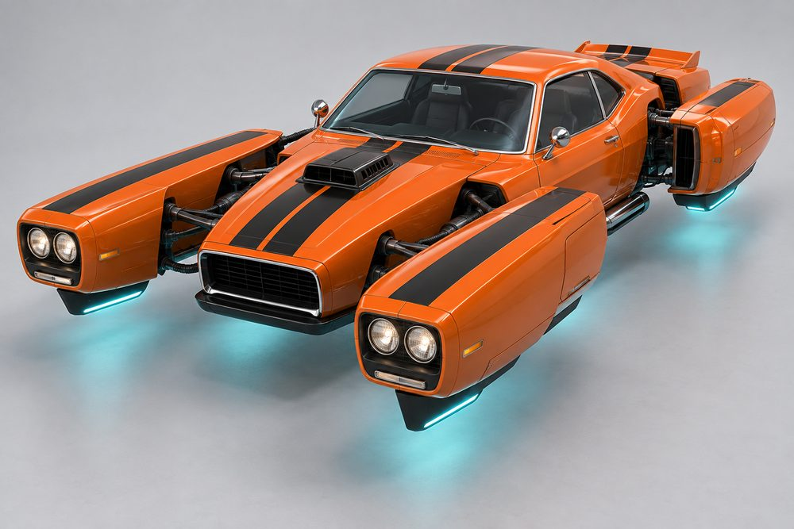
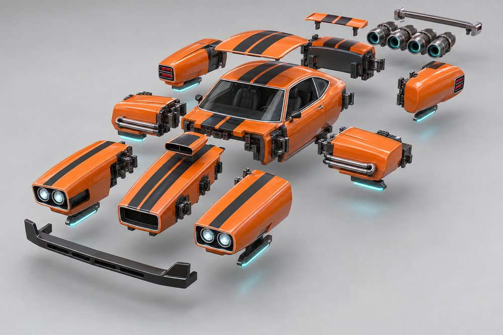
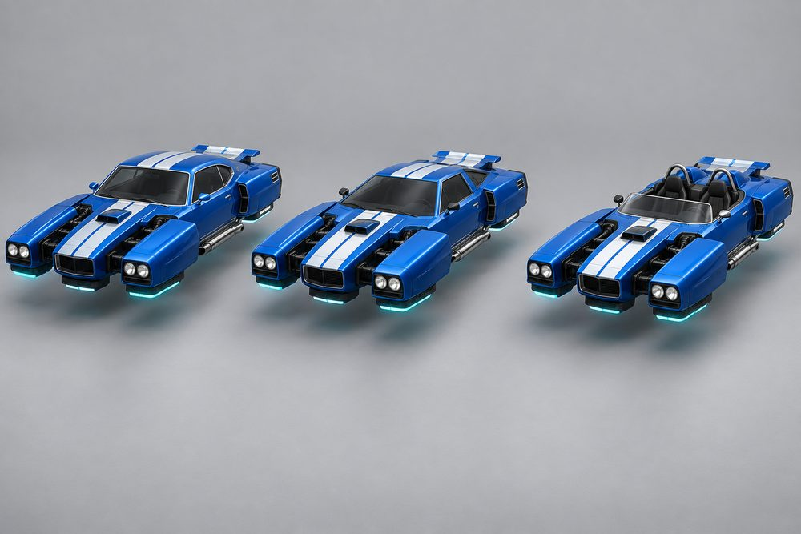
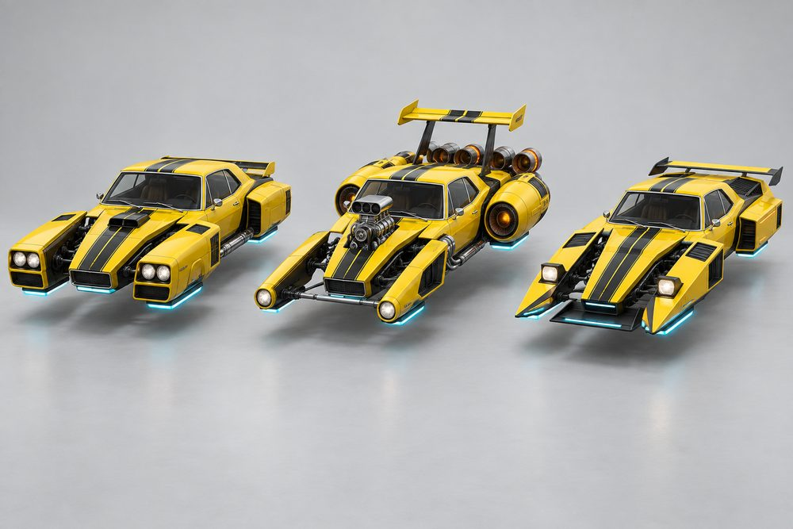
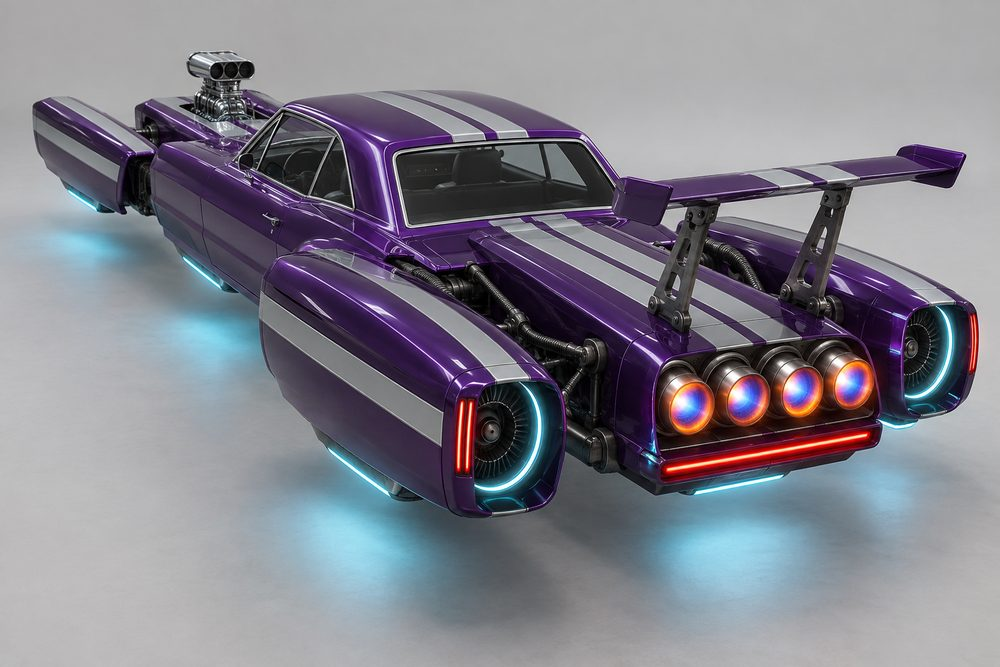
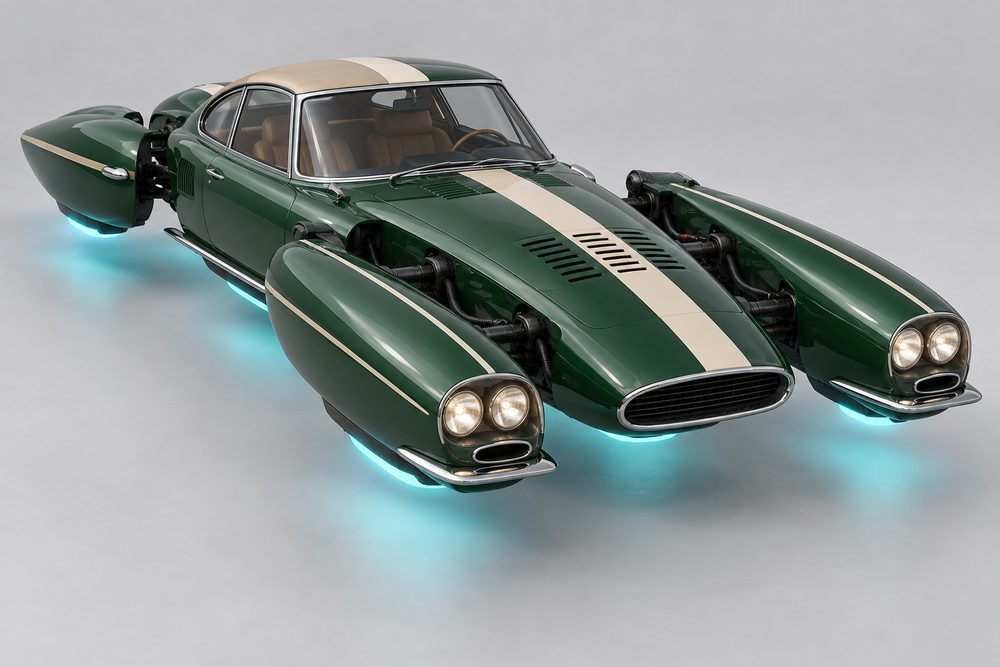
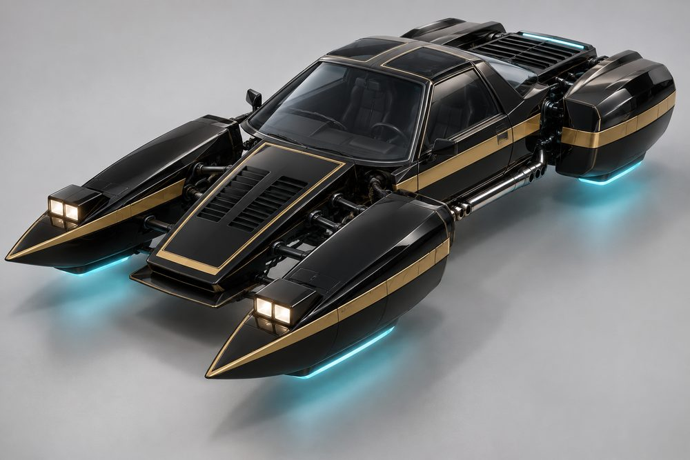
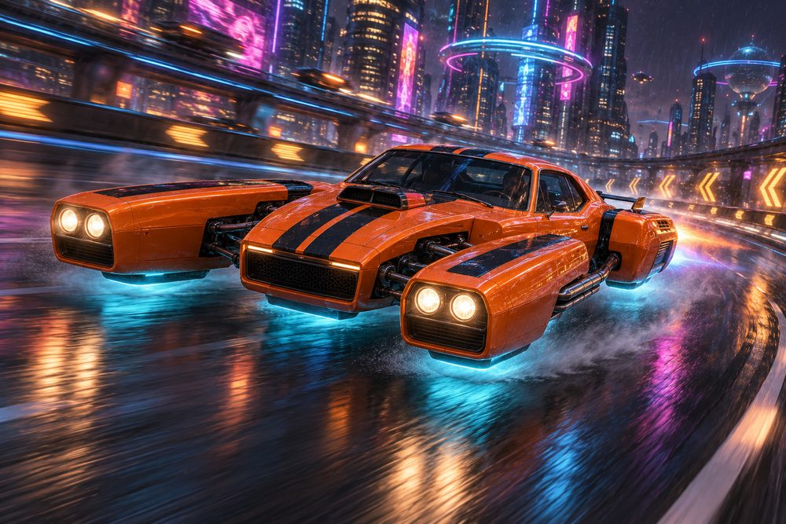

# Rift: class sheet

Status: design exploration, 2026-10-01. Not approved, not game content. Brief: [exploration contract](../../../scripts/vehicle_blockouts/CONTRACT.md). Proposed `CategoryId`: `rift`.

## Pitch

A classic 60s-70s coupé cut into floating sections. Two long front nacelles carry the headlights either side of a centre nose. Rear-quarter pods float beside the tail. The cabin is a normal two-door greenhouse. Dark linkages cross every gap. It is a catamaran made from a muscle car.

**Player fantasy:** "I own the loudest car on the boulevard, and I built it from pieces." Rift is the heavy hitter. It is wide, long and fast in a straight line. It takes corners in long, held drifts. Every swap is visible from across the street, because the big pieces are the modules.

## Culture lines

- **Muscle:** 70s fastbacks. Square jaws, shaker scoops, twin stripes.
- **Pony:** shorter and lighter coupés. Side scoops, hockey-stick stripes, T-tops.
- **Pro Street:** drag-strip street machines. Blower through the hood, fat rear pods, nose-up rake.
- **Euro GT:** 60s grand tourers. Rounded nacelles, covered lamps, chrome blades, one off-centre stripe.
- **Wedge Exotic:** 70s folded-paper wedges. Knife-edge prongs, pop-up lamps, louvres.
- **Roadster:** open two-seaters. Low screen, twin humps, side pipes.

## Cockpits

| Name | Culture | Silhouette | Tier |
|---|---|---|---|
| Outlaw | Pro Street | 60s notchback, upright squared roof | E |
| Nightshift | Pony | Angular 80s coupé with T-top | D |
| Brawler | Muscle | 70s fastback, long sloping roof | C |
| Mamba | Roadster | Open two-seater, low screen, twin humps | B |
| Regent | Euro GT | Thin-pillar grand tourer, curved roof | A |
| Stiletto | Wedge Exotic | Low 70s wedge, flat raked windscreen | S |

## Slots and modules

Slot ids are the canonical ones. Labels are what the player sees. "(added)" marks a module that is not in the contract roster.

| Slot id | Label | Modules |
|---|---|---|
| `Engine1` | Front Half | **Twin Longhorn:** long square nacelles, twin round lamps, egg-crate grilles. **Shark Nose:** forward-leaning nacelles, pointed centre nose. **Pop-Up Prongs:** knife-edge wedges, pop-up lamps. **Grand Quad:** slim rounded nacelles, four covered lamps. **Blower Rail:** narrow rails, single lamps, bare plumbing. **Shorthorn (added):** short nacelles, single round lamps, mesh grille (Pony). |
| `Engine2` | Rear Half | **Fastback Quarters:** muscular haunch pods, bar tail-lights. **Kammback:** chopped flat tail, short square pods. **Turbine Quarters:** swollen pods with glowing turbine drums. **Boat Tail:** pods taper inward to a point. |
| `SidePods` | Mid Section | **Side Pipes:** chrome pipes under the doors. **Door Pods:** slim pontoons bridging front and rear. **Intake Scoops:** angular scoops behind the doors. **Rocker Blades:** thin blade fins along the sill. |
| `Stabilisers` | Hover Fins | **Keel Blades:** short glowing fins under each nacelle. **Vane Plate:** flat louvred plate under the cabin. **Outrigger Skids:** ski-like skids set out wide. |
| `Boost` | Afterburner | **Quad Cannon:** four round cannons in the tail. **Slot Burner:** one thin full-width slot. **Twin Stack:** two stacked nozzles. |
| `FrontBumper` | Front Bumper | **Chin Bar:** black bar under the centre nose. **Splitter:** flat blade jutting forward. **Chrome Blade:** thin chrome blade on each nacelle. **Ram Bar:** tube push bar bridging the nacelles. |
| `RearBumper` | Rear Bumper | **Chrome Bar:** plain polished bar. **Diffuser:** black finned undertray. **Light Bar:** thin full-width red strip. |
| `RearSpoiler` | Spoiler | **Ducktail:** small upturned lip. **Pedestal Wing:** tall wing on two uprights. **GT Wing:** wide low wing with end plates. **Louvre Deck:** black slats over the rear glass. |
| `Hood` | Hood | **Shaker:** scoop poking through the bonnet. **Cowl Induction:** raised rear-facing bulge. **Heat Vents:** twin slatted panels. **Blower:** tall polished supercharger and scoop. |
| `Roof` | Roof | **Vinyl Top:** contrast-colour roof skin. **Louvres:** slats over the rear window. **Roof Scoop:** central intake. **T-Top:** twin smoked-glass panels. **Tonneau Fairing (added):** hard cover and head fairing for the open Mamba. |

## Handling intent versus Piercer

Design intent only. Plus means higher than Piercer, minus means lower.

| Stat | Bias | Why |
|---|---|---|
| TopSpeed | ++ | The class reason to exist. |
| Acceleration | - | Heavy. Slow to build, hard to stop. |
| Braking | - | Brake early or drift it off. |
| BoostForce | ++ | Afterburner is the signature. |
| BoostDuration | + | Long straights reward a long burn. |
| DriftControl | + | Long drifts are easy to hold. |
| DriftGrip | - | The drift runs wide. |
| LateralGrip | - | Does not change line quickly. |
| SteeringResponse | - | Slow turn-in from width and mass. |
| HoverStability | + | Wide stance, settles after bumps. |
| Downforce | = | Neutral. Wings shift it a little. |
| Drag | + | Speed bleeds off boost, so boost timing matters. |
| Weight | ++ | Wins contact with lighter classes. |

## Ideas that make Rift fun to own

1. **Full-kit titles.** Front Half, Rear Half and Mid Section from one culture earn a title: Boulevard Brawler (Muscle), Stampede (Pony), Quarter-Mile King (Pro Street), Grand Tour (Euro GT), Folded Edge (Wedge Exotic), Sunday Best (Roadster).
2. **Cut and Shut.** Three or more cultures on one car earns its own title. Mixing is rewarded, not penalised.
3. **Stripes across the gaps.** Stripe packs (twin stripe, hockey stick, off-centre GT stripe, pinstripe outline) use the Secondary channel and line up on the beltline across every section.
4. **The rift opens.** Under boost the nacelles and rear pods ease outward a little and the linkages glow in the Neon colour. They close up when parked.
5. **Idle character.** The shaker or blower shudders at idle. Each nacelle bobs on its own hover pad. Pop-up lamps rise at night.
6. **Launch rake.** With a Pro Street kit the nose lifts on a standing boost start. Afterburner pops when the boost ends.
7. **Linkage finish.** A Rift-only cosmetic: black, polished, brass or painted linkages. Unlocked by distance driven in a full kit.
8. **Photo moments.** The exploded view plays as the purchase animation, parts flying in and locking. A top-down "catamaran shot" in the garage. Four headlights through rain at night.

## Gallery

*01 hero. Muscle. Brawler cockpit, Twin Longhorn front half, Shaker hood, Chin Bar, Side Pipes, Fastback Quarters, Ducktail, Keel Blades.*

*02 exploded. Muscle. Every slot pulled off the Brawler: Front Half (two nacelles and centre nose), Hood, Front Bumper, Roof, Mid Section, Rear Half (two pods and tail), Spoiler, Afterburner, Rear Bumper, Hover Fins.*

*03 one kit, three cockpits. The same Muscle kit and paint on Brawler (left), Stiletto (centre) and Mamba (right). Only the cabin changes.*

*04 one cockpit, three kits. Outlaw cockpit with Muscle (left), Pro Street (centre) and Wedge Exotic (right) kits. Front Half, Rear Half, Hood, Spoiler and Afterburner all change.*

*05 Pro Street, rear. Outlaw cockpit, Turbine Quarters, Quad Cannon afterburner, Pedestal Wing, Light Bar rear bumper, Blower hood, Blower Rail front half.*

*06 Euro GT. Regent cockpit, Grand Quad front half, Chrome Blade bumpers, Heat Vents hood, Vinyl Top roof, Rocker Blades, Boat Tail.*

*07 mixed. Nightshift cockpit with T-Top, Wedge Exotic Pop-Up Prongs and Heat Vents, Muscle Side Pipes, Pro Street style Kammback with Louvre Deck and Slot Burner. One gold stripe ties it together.*

*08 action. The hero Muscle build drifting on a city expressway at night.*

## Risks and open points

- **Width.** About 17 studs against 8 for Piercer. Check lanes, gates, garage bays, the dealership stage and camera distance before committing.
- **Collision.** Use one simple hull. The gaps are visual only. Players may expect to thread obstacles through them.
- **Who owns the centre nose.** The art shows it as part of Front Half, with the Hood module on top. Image 02 leaves a short bonnet stub on the cabin. The frame standard must pick one owner.
- **Roof on the open Mamba.** Standard roof modules need a hard-top reading on a roadster, or Mamba only takes Tonneau Fairing. T-Top on Nightshift repeats what the cockpit already has.
- **Likeness.** The image model drifts towards familiar 60s and 70s shapes, most in 01 and 06. Use the images for layout and mood only. Final models must be original.
- **Detail level.** The renders are far finer than a low-poly build under 160 parts. Linkages need a simple repeatable piece.
- **Stripes.** Continuity across modules needs separate Secondary-channel parts on a shared datum, not per-part textures.
- **Chrome.** There is no chrome paint channel. Trim must map to Detail or a fixed material.
- **Image notes.** In 04 the centre kit puts turbine drums beside the cabin, which reads as Mid Section as well as Rear Half. In 03 the wedge cabin is milder than intended. In 07 the rear pods are less muscular than the prompt asked.
- **Passengers and jobs.** A two-door cabin suits two seats. Confirm how taxi jobs seat a passenger.
