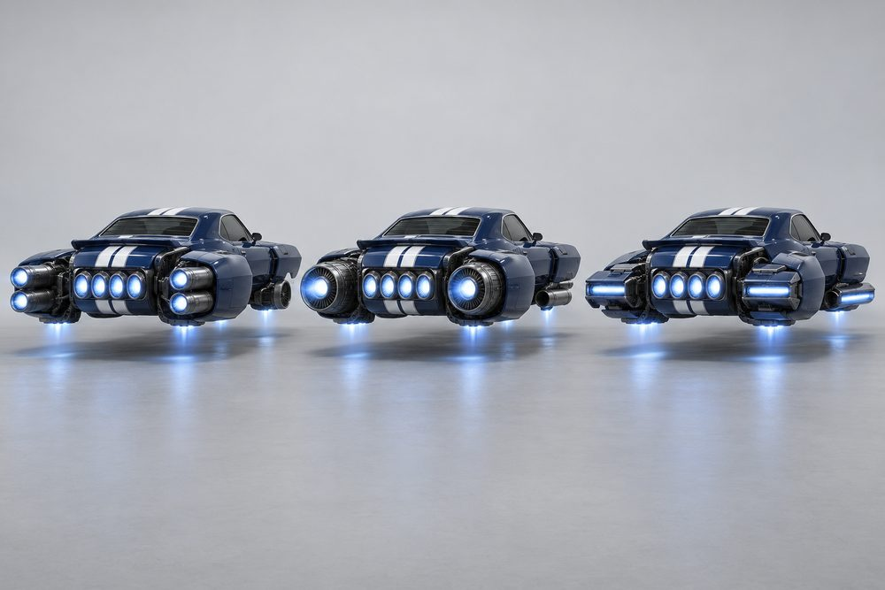
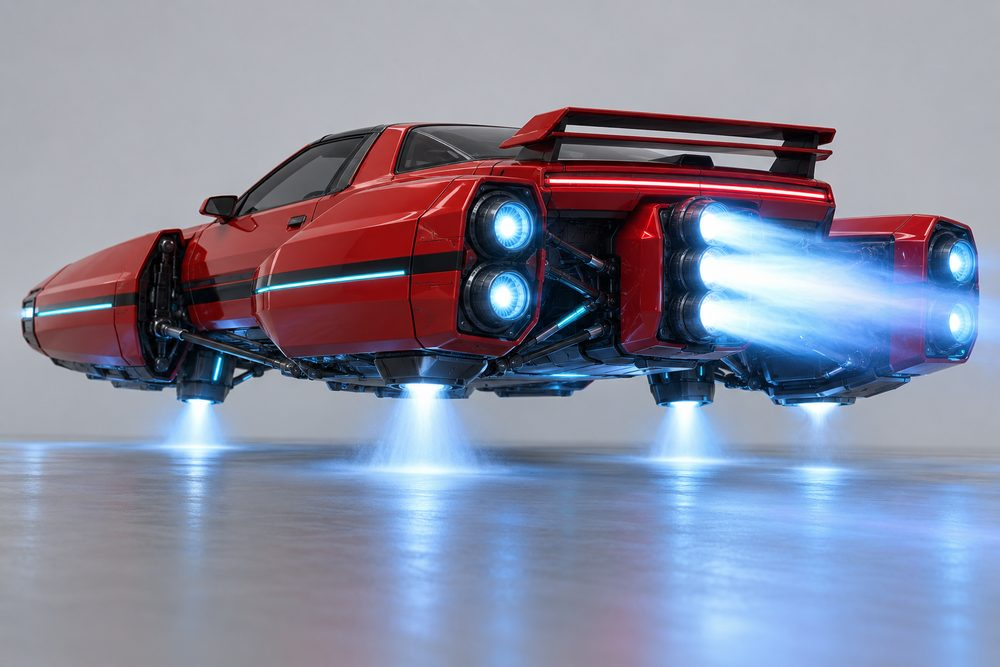
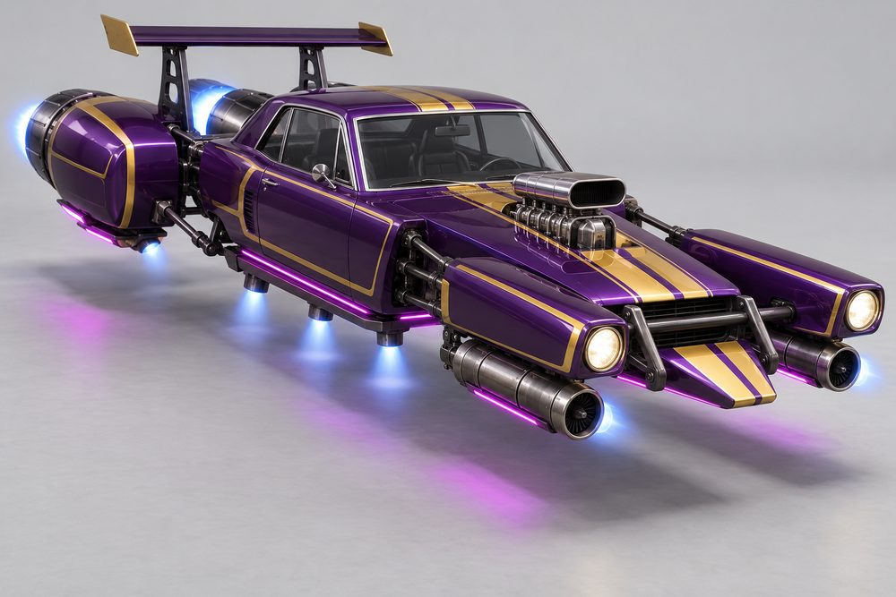

# Rift: class sheet (round 2)

Status: design exploration, round 2, 2026-10-01. Not approved, not game content. Proposed `CategoryId`: `rift`.
Briefs and data: [exploration contract](../../../scripts/vehicle_blockouts/CONTRACT.md), [frame standard](rift-frame.md), [blockout spec](../../../scripts/vehicle_blockouts/specs/rift.json). Round 1 art is kept in `output/vehicle-categories-2026-10-01/rift/v1/`.

What changed since round 1: no wheels or wheel-like parts, real jet hardware on every build, engines, stabilisers and boost are proper modules, and the old Hood and Roof slots are gone for now.

## Pitch

A classic 60s-70s coupé cut into floating sections. Two long nacelles carry the headlights either side of a centre nose. Rear-quarter pods float beside the tail. The cabin is a normal two-door greenhouse. Dark linkages cross every gap. It is a catamaran made from a muscle car, now slung with real jets.

Turbines hang under the nacelles. Jet cans burn behind the pods. Lift jets sit under the cabin. An afterburner fires from the centre tail.

**Player fantasy:** "I own the loudest car on the boulevard, and I built it from pieces." Rift is the heavy hitter. It is wide, long and fast in a straight line, and it takes corners in long, held drifts. Every swap shows from across the street, because the big pieces are the modules.

## Culture lines

- **Muscle:** 70s fastbacks. Square jaws, shaker scoops, twin stripes, four-barrel afterburner.
- **Pro Street:** drag-strip street machines. Blower through the bonnet, deep tubs, nose-down rake.
- **Wedge Exotic:** 70s folded-paper wedges. Knife-edge prongs, pop-up lamps, slot jets.
- **Roadster:** open two-seaters. Torpedo nacelles, boat tail, flared megaphone pipes.
- **Turbo Pony:** 80s T-top coupés. Flip-up lamps, box intercooler, stacked cans, light strips.
- **Euro GT:** 60s grand tourers. Planned, but not in the blockout (see risks).

## Cockpits

| Name | Culture | Silhouette | Signature kit | Tier |
|---|---|---|---|---|
| Outlaw | Pro Street | Tall upright 60s notchback, squared roof | Quarter Mile | E |
| Nightshift | Turbo Pony | Wide 80s T-top coupé, lowest roof | Night Shift | D |
| Brawler | Muscle | 70s fastback, one long slope to the tail | Boulevard | C |
| Mamba | Roadster | Open two-seater, twin aero screens | Riviera | B |
| Stiletto | Wedge Exotic | Narrow 70s arrowhead wedge, raked glass | Folded Edge | S |

Tier A is free. A grand-tourer cockpit (Regent in round 1) would take it.

## The fundamentals

Every build has all four. Each shows an intake, a body and a glowing nozzle from outside.

| Slot | Player label | Sits | Options |
|---|---|---|---|
| `Engine1` | Front Engines | Slung under each nacelle on a pylon. Intake at the nacelle tip, nozzle beside the cabin. | **Ram Turbine:** one big turbine, square chin scoop. **Zoomie Rails:** two wide-set open tubes with short stacks. **Slot Ramjet:** flat slab, thin slot nozzle. **Quad Cluster:** four small jets in a bundle. **Turbo Cassette:** box with twin barrels and a side dump. |
| `Engine2` | Rear Engines | Bolted behind each rear-quarter pod. Nozzles point straight back. | **Thunder Twins:** two long slim cans, top intake. **Big Bertha:** one huge fat turbine, banded. **Vector Slab:** low flat slab, slot nozzle, ramps. **Bullet:** one chrome-banded tapered bullet. **Over-Under:** two stacked cans on a web. |
| `Stabilisers` | Stabilisers | On a plate under the cabin floor, with outriggers into the open bay between nacelle and pod. | **Outrigger Cans:** four slim upright lift cans. **Strake Rails:** one long rail, three lift nozzles. **Canard Vanes:** swept vanes with tip jets. **Float Pods:** one pod per side, keel jet strip. **Fin Stacks:** tall fin, jet pod at its foot. |
| `Boost` | Afterburner | Centre tail, between the rear engines. The middle of the chase view. | **Quad Cannon:** four cannons in a row. **Big Bell:** one bell nozzle, top fin. **Slot Burner:** full-width slot with vanes. **Megaphones:** two flared stages, swept up. **Tri-Stack:** three stacked cans behind a fence. |

## Body and cosmetic slots

Front Clip and Rear Clip are the big visible parts. Hood, Roof and Accessory are not used in round 2.

| Slot | Player label | Options |
|---|---|---|
| `FrontBody` | Front Clip | **Twin Longhorn:** long square nacelles, twin round lamps, egg-crate grille, shaker scoop. **Blower Rail:** narrow rail nacelles, single lamps, bare frame, blower scoop. **Pop-Up Prongs:** knife-edge wedge prongs, pop-up lamps. **Grand Quad:** slim torpedo nacelles, bullet noses, cigar centre nose. **Flip Nose:** slab nacelles, flip-up lamps, wide flat nose. |
| `RearBody` | Rear Clip | **Fastback Quarters:** muscular pods, sail panels, bar tail-lamp. **Tubbed:** bare frame rails, deep tubs, fuel cell, roll-hoop posts. **Kamm Tail:** delta spine, chopped tail, blade fins. **Boat Tail:** cigar tail, round pods, bullet lamp. **Slab Hatch:** slab tail, deep valance, louvred deck. |
| `SidePods` | Rockers | **Door Pods:** slim pontoons with side pipes. **Fuel Tanks:** slung tanks in cradles. **Intake Scoops:** ramp blades with intake blocks. **Rocker Blades:** thin blades with slim pipes. **Strake Box:** fenced strakes with a sill light. |
| `FrontBumper` | Front Bumper | **Chin Bar:** black bar under the nose. **Push Bars:** upright tube push bars. **Splitter:** flat blade with end plates. **Chrome Blades:** thin blade on each nacelle. **Air Dam:** dam with a light bar. |
| `RearBumper` | Rear Bumper | **Chrome Bar:** plain polished bar. **Drag Skids:** skid bar and plate. **Diffuser:** finned black tray. **Nerf Pair:** two small bumperettes. **Light Strip:** valance with a thin light strip. |
| `RearSpoiler` | Spoiler | **Ducktail:** small upturned lip. **Pedestal Wing:** tall wing on uprights. **GT Wing:** wide low wing, end plates. **Twin Fins:** two upright fins. **Biplane:** two stacked blades. |

## Signature kits

Every kit fits every cockpit. The kit supplies one option for each slot above.

| Kit | Culture | Native cockpit | What makes it look different |
|---|---|---|---|
| Boulevard | Muscle | Brawler | Wide square nacelles, one turbine each, four cans and a four-barrel afterburner. Door Pods, Ducktail. |
| Quarter Mile | Pro Street | Outlaw | Narrow rails, blower scoop, open zoomie tubes, deep tubs, one huge turbine, one big bell. Pedestal Wing. |
| Folded Edge | Wedge Exotic | Stiletto | Knife-edge prongs, flat slab jets, chopped tail, vane tips, one full-width slot burner. GT Wing. |
| Riviera | Roadster | Mamba | Torpedo nacelles, four small jets each side, bullet engines, boat tail, two megaphones. Twin Fins. |
| Night Shift | Turbo Pony | Nightshift | Flip-up lamps, box cassette, stacked cans, tall fins, three-can afterburner, light strips. Biplane. |

## Handling intent versus Piercer

Design intent only. Plus means higher than Piercer, minus means lower.

| Stat | Bias | Why |
|---|---|---|
| TopSpeed | ++ | The class reason to exist. |
| Acceleration | - | Heavy. Slow to build. |
| Braking | - | Brake early or drift it off. |
| BoostForce | ++ | The afterburner is the signature. |
| BoostDuration | + | Long straights reward a long burn. |
| DriftControl | + | Long drifts are easy to hold. |
| DriftGrip | - | The drift runs wide. |
| LateralGrip | - | Does not change line quickly. |
| SteeringResponse | - | Slow turn-in from width and mass. |
| HoverStability | + | Wide stance, lift jets in the bay. |
| Downforce | = | Neutral. Wings shift it a little. |
| Drag | + | Wide and blocky. Speed bleeds, so boost timing matters. |
| Weight | ++ | Wins contact with lighter classes. |

## Ideas that make Rift fun to own

1. **Full-kit titles.** Front Clip, Rear Clip and Rockers from one culture earn a title: Boulevard Brawler (Muscle), Quarter-Mile King (Pro Street), Folded Edge (Wedge Exotic), Sunday Best (Roadster), Midnight Run (Turbo Pony).
2. **Cut and Shut.** Three or more cultures on one car earns its own title. Mixing is rewarded, not penalised.
3. **Stripes across the gaps.** Stripe packs (twin stripe, hockey stick, off-centre, pinstripe outline) use the Secondary channel and line up on the belt stripe across every section.
4. **The rift opens.** Under boost the nacelles and pods ease outward and the linkages glow in the Neon colour. They close when parked.
5. **Every engine has its own flame.** Thunder Twins burn four thin jets, Big Bertha one fat plume, Vector Slab a flat sheet. Rivals can tell your kit by the flame alone.
6. **Idle character.** Turbines spool and whine at the lights. Pop-up and flip-up lamps rise at night. Each nacelle bobs on its own lift jets.
7. **Launch rake and pops.** A Quarter Mile kit lifts its nose on a standing boost start. Quad Cannon and Tri-Stack crackle when the boost ends.
8. **Linkage finish and photo moments.** A Rift-only cosmetic: black, polished, brass or painted linkages, unlocked by distance in a full kit. The exploded view plays as the purchase animation. A top-down "catamaran shot" in the garage.

## Gallery

*01 hero. Brawler cockpit, Boulevard kit: Twin Longhorn, Ram Turbine, Door Pods, Fastback Quarters, Thunder Twins, Outrigger Cans, Quad Cannon, Chin Bar, Ducktail. Hot orange, black stripes.*

*02 exploded. Brawler cockpit, Boulevard kit. Front Clip, Front Engines, Front Bumper, Rear Clip, Rear Engines, Afterburner, Rear Bumper, Spoiler, Rockers and Stabilisers pulled apart. The jets read as separate pieces.*

*03 one kit, three cockpits. The Boulevard kit and paint on Outlaw (left), Stiletto (centre) and Mamba (right). Only the cabin changes.*

*04 one cockpit, three kits. Brawler cockpit with Boulevard (left), Quarter Mile (centre) and Folded Edge (right). Same teal paint. Front Clip, Rear Clip, both engines, Stabilisers, Afterburner and Spoiler all change.*

*05 engines. Brawler cockpit and Boulevard body, seen from behind. Thunder Twins with Ram Turbine (left), Big Bertha with Zoomie Rails (centre), Vector Slab with Slot Ramjet (right). Only Engine1 and Engine2 change.*

*06 stabilisers and boost. Nightshift cockpit, Night Shift kit: Tri-Stack firing, Over-Under, Fin Stacks throwing lift light onto the floor, Slab Hatch, Light Strip, Biplane. Low rear three-quarter.*

*07 Pro Street. Outlaw cockpit, Quarter Mile kit: Blower Rail, Zoomie Rails, Tubbed, Big Bertha, Strake Rails, Big Bell, Push Bars, Pedestal Wing. Purple and gold. The flanks under the cabin are closed panels with a strake rail and lift jets; no arch or suspension shows.*

*08 action. The hero Brawler in the Boulevard kit at speed on a wet neon expressway at night. Ram Turbines under the nacelles, one long jet can behind each rear pod, four lift jets spraying the road. The Quad Cannon tail row is not visible from this front angle.*

## Risks and open points

- **Width.** About 17 studs against 8 for Piercer, and about 35 long. Check lanes, gates, garage bays, the dealership stage and camera distance before committing.
- **Collision.** Use one simple hull. The gaps are visual only. Players may expect to thread obstacles through them.
- **Only five cockpits.** The blockout has no grand tourer. Euro GT has no cockpit or kit, and tier A is empty. It needs a new roofline and its own kit.
- **Cockpit distinctness.** The shared chassis fills most of each outline. Four pairs score 0.21 to 0.22 against a target of 0.25. The cabin has to carry the difference.
- **Weakest swap.** Mamba between the wide Flip Nose and Slab Hatch has a narrow waist in plan. Narrow cabins leave a gap of about 1.2 to the Rockers, bridged by two brackets.
- **Wheel look.** Float Pods, Boat Tail pods and Big Bertha can read as wheels from the side. Keep every barrel and pod longer than it is wide. In 05 and 07 the end-on nozzles are round from behind, so check the side view.
- **Engines from the chase camera.** Front engines hang under the nacelles. They show from the front and side but only partly from behind. Rear engines and the afterburner carry the chase view.
- **Stabilisers.** They sit in the bay under the cabin, not at the nacelle tips as first suggested. They read from the front three-quarter and from above.
- **Image notes.** In 03 the Stiletto wedge cabin is milder than asked. In 05 the camera is nearly straight behind. In 04 the Folded Edge kit (right) shows mostly lift jets and slim control jets; its main intakes and rear nozzles are hidden from that angle. The images follow the kit descriptions, not the exact part lists. Use them for mood and layout.
- **Likeness.** The prompts name real 60s to 80s coupés as body-style references, as the owner allowed. No badges or text appear. Final models should still keep logos off.
- **Detail level.** The renders are far finer than a low-poly build. Quad Cluster is 44 primitives; a real mesh should merge them. Linkages need one simple repeatable piece.
- **Chrome and stripes.** There is no chrome paint channel, so trim maps to Detail or a fixed material. Stripe continuity needs separate Secondary-channel parts on a shared datum.
- **Slot IDs.** `FrontBody` and `RearBody` are new. The live game has eight slots. Dropping Hood and Roof loses the Shaker, T-Top and Vinyl Top ideas from round 1. Decide whether they return.
- **Passengers and jobs.** A two-door cabin suits two seats. Confirm how taxi jobs seat a passenger.
