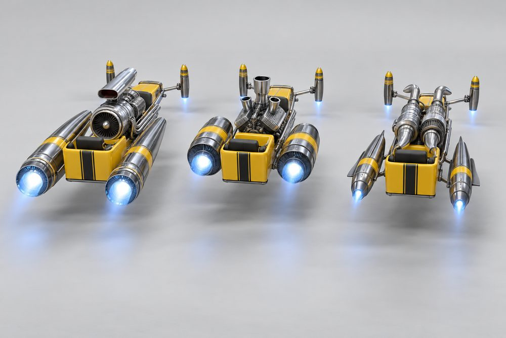
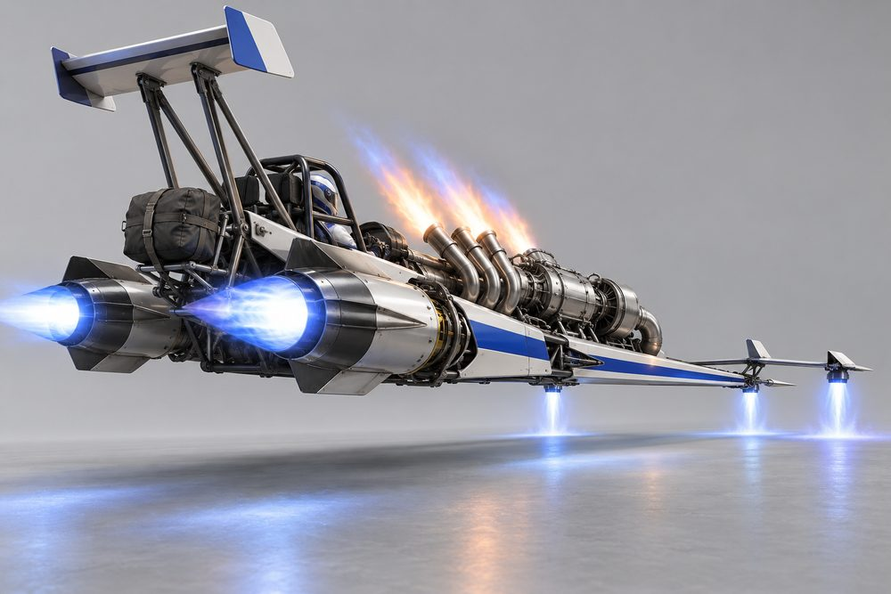

# Rodder (`rodder`): class sheet, round 2

Status: design exploration, round 2, 2026-10-01. Nothing here is approved or game content. Briefs: [exploration contract](../../../scripts/vehicle_blockouts/CONTRACT.md) and [frame standard](rodder-frame.md). Round 1 art is kept in `output/vehicle-categories-2026-10-01/rodder/v1/`. Likeness to real hot-rod body styles (1932 coupé, T-bucket, belly-tank lakester) is welcome. No logos or badges.

## Pitch

A hot rod or drag rail on jet thrust. A narrow chopped cab sits at the back. A big exposed engine sits ahead of it on two bare frame rails behind an upright grille shell. The engine is rebuilt as jet hardware: a turbine intake where the blower was, header nozzles where the pipes were. Two long jet barrels sit beside the cab where the rear slicks were, like a jet dragster. Slim lift jets hang on a beam axle at the front. The whole car rakes nose-down. There are no wheels, drums, discs or rings anywhere.

**Player fantasy:** "I built this in a shed and it is the loudest thing on the grid." You stage, the side jets spool up, the nose lifts, the headers spit flame and you are gone. Corners are a problem for later.

## Culture lines

| Culture | One line |
|---|---|
| Highboy | 1932-style coupé, no fenders, gloss black, flames, chrome. The show car. |
| Rat Rod | Rust, bare steel, welds, mismatched parts. Looks unsafe on purpose. |
| T-Bucket | Tiny open tub, tall windscreen, engine bigger than the body. |
| Gasser | 1960s strip coupé with the front axle jacked high. Not built yet. |
| Slingshot Drag | Long thin rail. Driver sits in a cage at the very back. |
| Salt Flat | Belly-tank lakester. Bare aluminium, slot jets, built for one long straight. |

## Cockpits

Five are built. Tier B is held for the Altered (Gasser) if it is added.

| Name | Culture | Silhouette | Signature kit | Tier |
|---|---|---|---|---|
| Rat Cab | Rat Rod | Tall chopped pickup cab, stub bed behind | Rat Rod | E |
| Bucket | T-Bucket | Open tub, tall flat windscreen, no roof | T-Bucket | D |
| Deuce | Highboy | Chopped three-window coupé, slit windows, low roof | Highboy | C |
| Lakester | Salt Flat | Riveted teardrop tank, tiny wrap bubble screen | Salt Flat | A |
| Slingshot | Slingshot Drag | Open roll cage, driver far back | Slingshot Drag | S |

## The fundamentals

Every build has all four. Every option has an intake, a body and a glowing nozzle. Looks are from the frame standard; where it gives none they come from the module name and round 1.

| Slot id | Player label | Where it sits | Options (look) |
|---|---|---|---|
| Engine1 | Front Engine | Level on the rails between grille shell and firewall, fully exposed | **Blown Turbine** (fat barrel, blower scoop); **Tunnel Ram** (short V block, tall tower, twin stacks); **Flat Trio** (long, low, wide, three short stacks); **Twin Mill** (two slim turbines in tandem, ram horns); **Turbine Swap** (one big turbine carried high, sloping pipe) |
| Engine2 | Side Jets | A long barrel each side of the cab, where the slicks were | **Long Barrels** (very long and slim); **Stub Ramjets** (short, fat, carried high); **Over-Unders** (stacked pairs); **Lances** (slim, finned); **Slab Pods** (flat, slot nozzle) |
| Stabilisers | Axle Jets | Beam axle under the front rails, pods at the outer corners | **Beam Lifters** (two upright cans); **Torpedoes** (long pods, twin down-jets); **Quad Cans** (two small cans a side); **Canard Vanes** (small vanes, jet at each tip); **Faired Spats** (teardrop covers, slot lift jets) |
| Boost | Headers | Bolted to the engine's port rail on each side | **Lake Pipes** (long straight pipes low along the rails); **Staged Stacks** (tall stepped stacks); **Side Dumps** (short fat outlets); **Zoomies** (upswept pipes); **Slot Burners** (flat slot nozzles) |

## Body slots

`Hood`, `Roof` and `Accessory` are not used. The engine stays bare and the cab owns its roof.

| Slot id | Player label | Options (look) |
|---|---|---|
| FrontBody | Frame and Shell | **Deuce Shell** (tall upright grille shell); **Track Nose** (short radiator nose); **Rat Frame** (open welded tubes, no shell); **Sling Rails** (long thin rails, pointed); **Salt Nose** (needle-thin nose cone) |
| RearBody | Tail | **Turtle Deck** (rounded deck behind the cab); **Strapped Trunk** (trunk strapped on a rack); **Bobber Bed** (short flat bed); **Chute Tail** (slim tail with a chute housing); **Boat Tail** (long pointed tail) |
| SidePods | Rail Dress | **Nerf Rails** (slim chrome rails); **Running Boards** (flat step along each rail); **Saddle Tanks** (fuel tank each side); **Delta Strakes** (triangular strakes); **Belly Skirts** (smooth skirt under the rails) |
| FrontBumper | Nose Gear | **Spreader Bar** (chrome bar across the front); **Lantern Bar** (bar with lamps); **Cow Catcher** (angled bars); **Stage Prong** (one forward prong); **Needle Nose** (thin spike) |
| RearBumper | Launch Gear | **Nerf Bar** (small chrome bar); **Tail Lantern** (one lamp on a bracket); **Hitch** (tow bracket); **Skid Bars** (long bars with skid tips); **Chute Pack** (packed parachute bag) |
| RearSpoiler | Rear Rig | **Roll Bar** (slim chrome bar over the cab); **Twin Fins** (two upright fins); **Headache Rack** (tube rack behind the cab); **Dragster Wing** (tall narrow wing on struts); **Tail Fin** (one fin) |

## Signature kits

| Kit | Culture | Native cockpit | What makes it look different |
|---|---|---|---|
| Highboy | Highboy | Deuce | Tall grille shell, chrome turbine with scoop, two very long barrels, upright cans. |
| T-Bucket | T-Bucket | Bucket | Tall tower engine, fat short ramjets high up, long torpedo pods, trunk on a rack. |
| Rat Rod | Rat Rod | Rat Cab | Open tube frame, low flat engine, stacked jet pairs, four small cans, bare rust. |
| Slingshot Drag | Slingshot Drag | Slingshot | Pointed rails, two turbines in tandem, finned lances, canard vanes, tall wing. |
| Salt Flat | Salt Flat | Lakester | Needle nose, one big raised turbine, flat slab pods, faired spats, riveted tank. |

Any cockpit takes any kit. [rodder-frame.md](rodder-frame.md) holds the pads that make that safe.

## Handling intent versus Piercer

Design intent only. No numbers.

| Stat | Bias | Why |
|---|---|---|
| TopSpeed | level | Fast, but not the class point. Salt Flat parts push it up. |
| Acceleration | ++ | The class identity. Best launch in the game. |
| Braking | - | Light nose, little to stop with. The chute is the joke. |
| BoostForce | ++ | Boost is a violent kick, not a cruise. |
| BoostDuration | - | Short burn. Time it; do not hold it. |
| DriftControl | - | It slides, but it is hard to place. |
| DriftGrip | - | Long side jets push wide once sliding. |
| LateralGrip | -- | Slim axle jets. Weakest sideways grip of any car class. |
| SteeringResponse | - | Long rails, slow to point. |
| HoverStability | - | Nose lifts under boost; pitches over crests. |
| Downforce | - | No aero unless you fit the Dragster Wing. |
| Drag | + | Upright grille and a bare engine in the wind. |
| Weight | - | Light. Loses contact fights. |

Module bias inside the class: Front Engine and Headers carry acceleration and boost. Side Jets carry stability and top speed. Axle Jets carry steering and lateral grip. Faired Spats, Needle Nose and Belly Skirts are the low-drag set.

## What makes it fun to own

1. **Nose-up launch.** Boost from a standstill lifts the nose and drops the tail. Skid Bars throw sparks when they touch. Visual pitch only; see risks.
2. **Spool-up burnout.** Holding brake and throttle spools the Side Jets. The nozzles flare and the road gets two glowing scorch strips in the car's neon colour.
3. **Header flames.** Headers are the boost, so each pipe set has its own flame. Zoomies fire eight short jets, Lake Pipes shoot two long ones, Side Dumps pop on lift-off, Slot Burners lay down a flat sheet. Flame takes the thrust colour.
4. **Chute pop.** With a Chute Pack fitted, hard braking from high speed throws a small parachute. It repacks after a few seconds. Pure show.
5. **Living engine.** The exposed engine rocks at idle and the scoop or stacks flutter with throttle. The garage gets an engine-side camera for this class.
6. **Full-kit names.** Wearing one kit across every slot earns a title: *Deuce Wild* (Highboy), *Junkyard Saint* (Rat Rod), *Bucket List* (T-Bucket), *Quarter Master* (Slingshot Drag), *White Line* (Salt Flat).
7. **Timeslip unlocks.** Standing-start sprints on a straight give a timeslip. Beating class target times unlocks the Dragster Wing, Twin Mill and Turbine Swap. Rat Rod parts come from scrap found in the world instead.
8. **Flame and patina skins.** Flames, pinstripes and rust are a pattern layer on top of paint. Rat Rod rust can be earned by driving, not bought.

## Gallery

*01 Hero. Deuce cockpit, Highboy kit: Blown Turbine, Long Barrels, Beam Lifters, Lake Pipes, Deuce Shell, Roll Bar.*

*02 Exploded. Deuce cockpit, Highboy kit. Front Engine lifted off. Side Jets, Axle Jets, Headers, Frame and Shell (Deuce Shell), Rail Dress (Nerf Rails), Nose Gear, Tail, Launch Gear and Rear Rig pulled away from the cab and rails. The cab shell has smooth blanked rear fenders, with no open arches.*

*03 One kit, three cockpits. Left Deuce, centre Bucket, right Rat Cab. All wear the Highboy kit in candy red.*

*04 One cockpit, three kits. Deuce three times. Left Highboy kit. Centre Rat Rod kit (Flat Trio, Over-Unders, Quad Cans, Side Dumps, Rat Frame, Cow Catcher, Bobber Bed). Right Slingshot Drag kit (Twin Mill, Lances, Canard Vanes, Zoomies, Sling Rails, Stage Prong, Dragster Wing).*

*05 Engines, seen from behind and above. Bucket cockpit shown as a plain open tub, with Beam Lifters and Lake Pipes. Left Blown Turbine with Long Barrels. Centre Tunnel Ram with Stub Ramjets. Right Twin Mill with Lances.*

*06 Stabilisers and boost. Slingshot cockpit, Slingshot Drag kit: Zoomies firing, Canard Vanes with tip jets working, Twin Mill, Lances, Dragster Wing, Chute Pack.*

*07 Salt Flat. Lakester cockpit, Salt Flat kit: Turbine Swap, Slab Pods, Faired Spats, Slot Burners, Salt Nose, Boat Tail, Tail Fin, Chute Pack.*

*08 Action. Deuce cockpit, Highboy kit at speed in a neon city at night: Beam Lifters throwing sparks, Lake Pipes firing, Long Barrels blazing.*

## Risks and open points

- **Front jets can read as wheels.** In 08 the axle jets are squat and bell-shaped, and in 03 they are short cans. Keep them long, narrow and taller than wide, with a visible nozzle, as in 01, 02 and 05.
- **Side Jet length varies.** The blockout makes them 9 to 12 studs long. 01, 02 and the left of 05 show that; 03, 04 and the centre of 05 show short fat ones. Art direction needs one length rule.
- **Five cockpits, not six.** The Altered and a Gasser kit are not built or illustrated. A Gasser can be a mixed build: tall Axle Jets on a Deuce. It fights the nose-down rake, so do not tilt the cab.
- **Lakester drifts towards Dart.** 07 shows a long skin. It stays a Rodder only while the engine, rails and nose stay exposed.
- **Slingshot sits far back.** The driver must sit at the back of the cab envelope (Z 1 to 10), behind the Side Jet pads.
- **Cab and nose distinctness is on the limit.** The validator scores both exactly at target. The shared rails fill most of each outline.
- **Flames, scallops and patina are not paint channels.** The game recolours Primary, Secondary, Detail, Glass and Neon. The art needs a pattern layer or shaped Secondary parts.
- **Nose lift must be visual.** A real pitch change would upset hover and steering. It must belong to the existing vehicle visual owner, not a new one.
- **Detail budget.** The renders carry far more engine detail than a low-poly module can. Each engine needs one strong shape: scoop, tower, tandem pair, cone.
- **Thrust effects may merge.** Tunnel Ram with Staged Stacks, and Twin Mill with Zoomies, put many pipes close together. Side Jet exhaust needs clearance from wing end plates and Skid Bars.
- **Size.** Builds run 30.8 to 32.9 studs long against a 30 target, up to 11.6 high with the Dragster Wing.
- **Weak lateral grip in an open world.** Fun on a strip, tiring in city traffic. Needs a tuning pass first.
- **Image notes.** In 05 the cabs are plain tubs with a seat and no windscreen, and the Bucket looks more boxy than a T-bucket. In 04 the centre cab looks boxier than the Deuce because the Bobber Bed adds a pickup bed. 08 has one small vehicle and blurred abstract signs in the background; nothing is readable.
