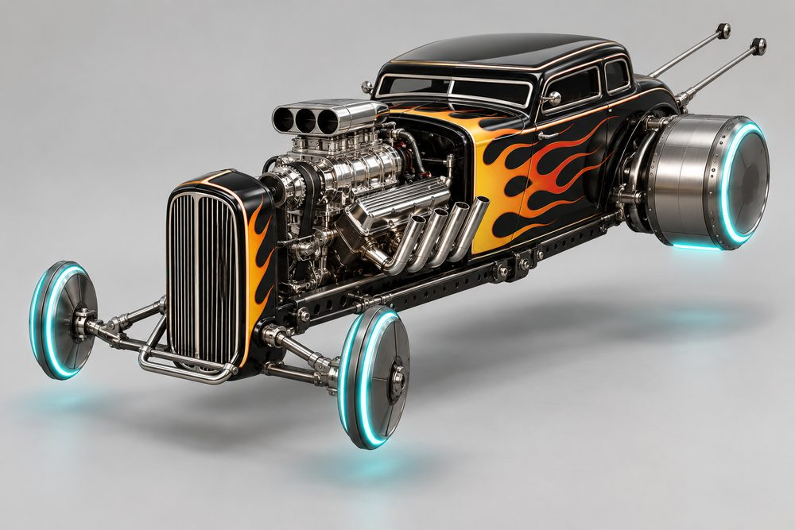
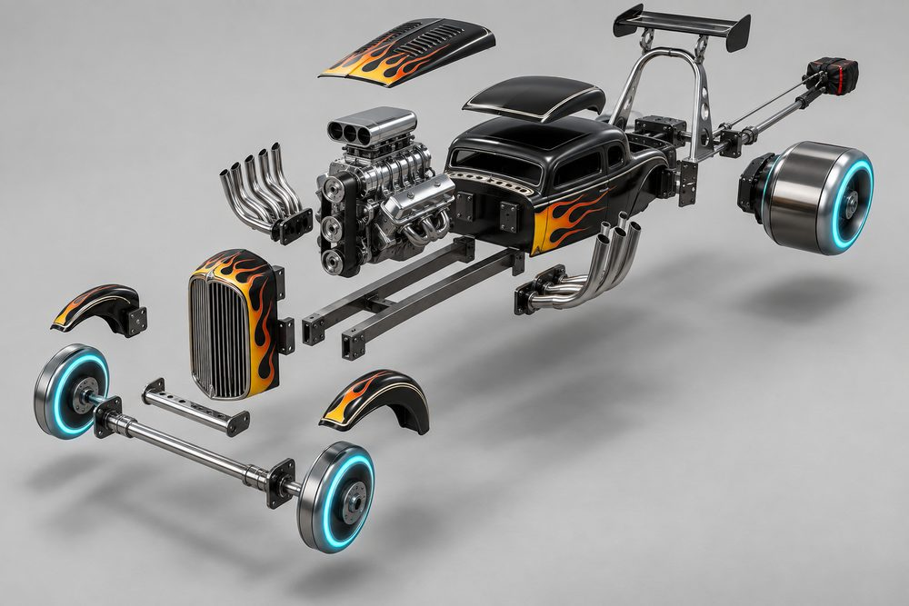
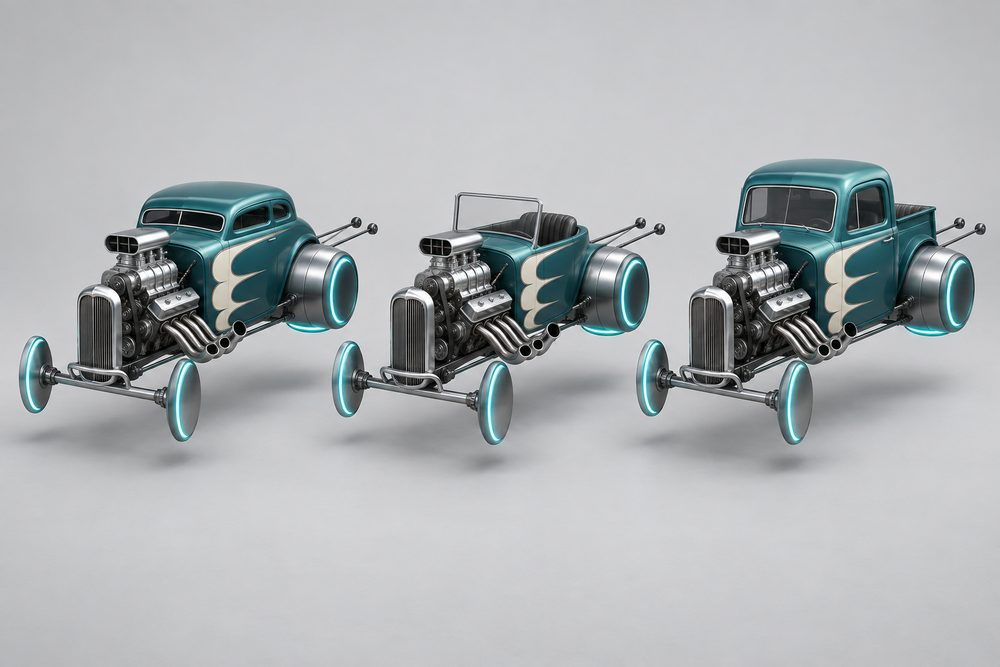
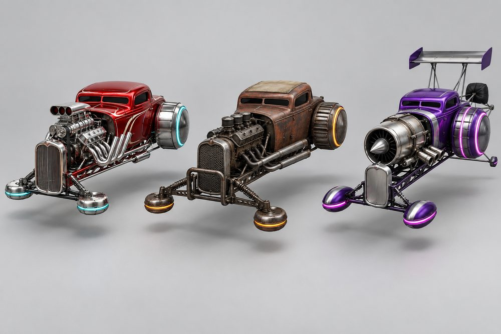
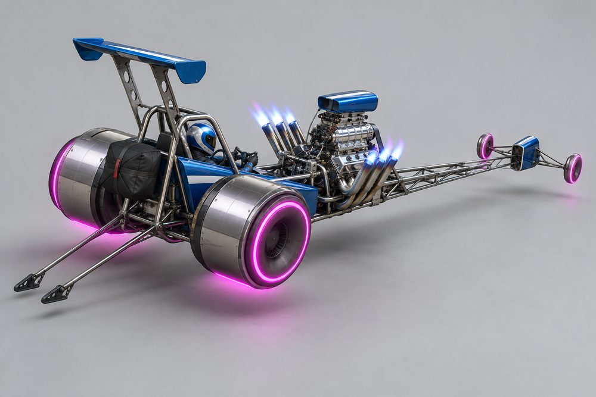
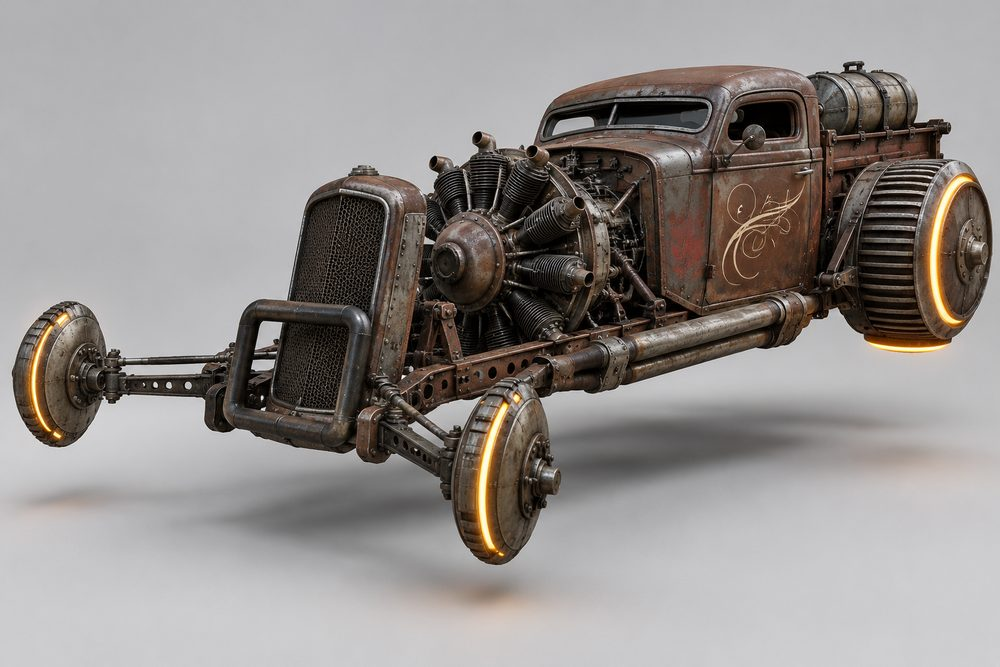
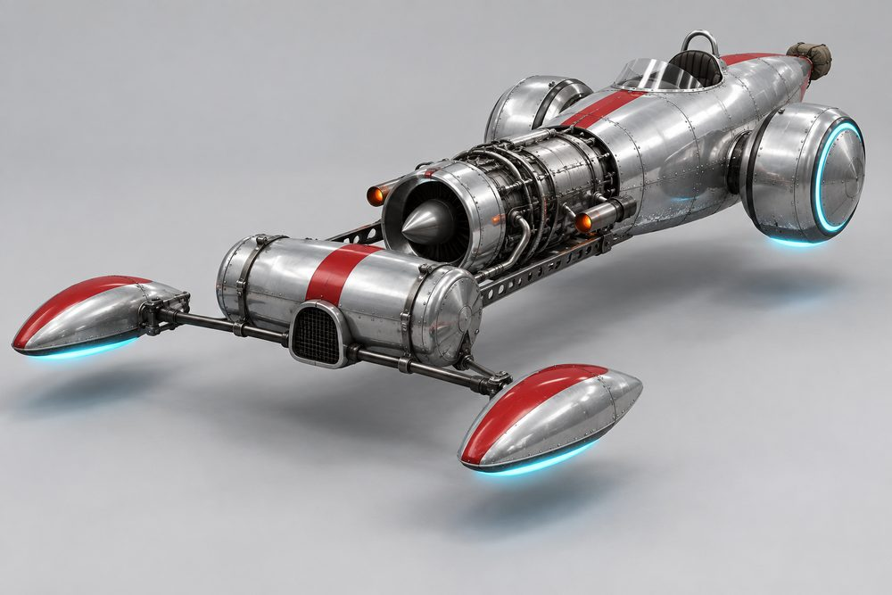

# Rodder (`rodder`): class sheet

Status: design exploration, 2026-10-01. Nothing here is approved or game content. Brief: [exploration contract](../../../scripts/vehicle_blockouts/CONTRACT.md). No real makes or models; eras and genres only.

## Pitch

Hot rods and drag rails turned into hover vehicles. A narrow chopped cab sits at the back. A big exposed engine sits ahead of it on two bare frame rails behind an upright grille shell. Skinny hover pods ride a beam axle far forward. Fat glowing hover drums sit where the rear slicks were. The whole car rakes nose-down.

**Player fantasy:** "I built this in a shed and it is the loudest thing on the grid." You stage, the drums spin up, the nose lifts, the pipes spit flame and you are gone. Corners are a problem for later.

## Culture lines

| Culture | One line |
|---|---|
| Highboy | 1930s coupé, no fenders, gloss paint, flames, chrome. The show car. |
| Rat Rod | Rust, bare steel, welds, mismatched parts. Looks unsafe on purpose. |
| T-Bucket | Tiny open tub, tall windscreen, engine bigger than the body. |
| Gasser | 1960s strip coupé. Front axle jacked high, scoop through the bonnet. |
| Slingshot Drag | Long thin rail. Driver sits in a cage at the very back. |
| Salt Flat | Belly-tank streamliner. Bare aluminium, faired pods, built for one long straight. |

## Cockpits

| Name | Culture | Silhouette | Tier |
|---|---|---|---|
| Rat Cab | Rat Rod | Chopped pickup cab with a stub bed | E |
| Bucket | T-Bucket | Open tub, upright flat windscreen | D |
| Deuce | Highboy | Chopped three-window coupé, slit windows | C |
| Altered | Gasser | Tiny upright coupé, tall and short | B |
| Lakester | Salt Flat | Riveted teardrop tank, tiny wrap screen | A |
| Slingshot | Slingshot Drag | Open roll cage, driver far back | S |

## Slots and modules

Slot ids and labels are from the contract. *Italic* modules are additions.

| Slot id | Player label | Modules (look) |
|---|---|---|
| Engine1 | Engine Block | **Blown Eight** (chrome blower, three-hole scoop); **Flathead Trio** (low flat block, three carburettors in a row); **Twin Mill** (two engines nose to tail); **Radial Nine** (aircraft star of finned cylinders); **Turbine Swap** (polished jet, intake cone) |
| Engine2 | Rear Drums | **Slick Drums** (wide smooth cylinders, one neon ring); **Dually Drums** (doubled drums, two rings); **Finned Drums** (cast-iron cooling fins); *Moon Drums* (flat spun-aluminium covers) |
| Stabilisers | Front Axle | **Skinny Pods** (slim upright discs on a chrome beam); **Suicide Front** (axle slung far ahead on a sprung arm); **Faired Spats** (teardrop covers over the pods); *Skimmers* (flat lozenge pods, low glow strip) |
| SidePods | Fenders and Rails | **Cycle Fenders** (small curved guards over the pods); **Running Boards** (flat step along each rail); **Open Rails** (bare drilled rails, nothing else); *Truss Rails* (triangulated tube rails) |
| Boost | Headers | **Zoomies** (four upswept pipes per side); **Lake Pipes** (long straight pipes low along the rails); **Side Dumps** (short fat outlets); *Weedburners* (long pipes swept down and back) |
| FrontBumper | Grille Guard | **Nerf Bar** (small chrome hoop); **Moon Tank** (spun-aluminium tank crosswise ahead of the grille); **Push Bar** (heavy welded square frame) |
| RearBumper | Launch Gear | **Wheelie Bars** (two long thin bars with skid tips); **Chute Pack** (packed parachute bag on a bracket); **Nerf Rear** (small chrome hoop) |
| RearSpoiler | Rear Rig | **Dragster Wing** (tall narrow wing on thin struts); **Roll Hoop** (chrome hoop behind the roof); **Luggage Rack** (tube rack with a strapped trunk); *Keg Tank* (fuel keg strapped upright) |
| Hood | Hood | **Louvred Top** (top panel only, rows of louvres); **Side Panels** (engine half covered, cut-outs for pipes); **Scoop** (panel with a tall scoop); *None* (engine fully bare; the default) |
| Roof | Roof | **Chopped Steel** (low painted roof panel); **Canvas** (stitched fabric insert); **Roll Cage** (roof removed, bare tube cage) |

## Handling intent versus Piercer

Design intent only. No numbers.

| Stat | Bias | Why |
|---|---|---|
| TopSpeed | level | Fast, but not the class point. Salt Flat parts push it up. |
| Acceleration | ++ | The class identity. Best launch in the game. |
| Braking | - | Light nose, little to stop with. The chute is the joke. |
| BoostForce | ++ | Boost is a violent kick, not a cruise. |
| BoostDuration | - | Short burn. Time it; do not hold it. |
| DriftControl | - | It slides, but it is hard to place. |
| DriftGrip | - | Fat drums push wide once sliding. |
| LateralGrip | -- | Skinny front pods. Weakest sideways grip of any car class. |
| SteeringResponse | - | Long rails, slow to point. |
| HoverStability | - | Nose lifts under boost; pitches over crests. |
| Downforce | - | No aero unless you fit the Dragster Wing. |
| Drag | + | Upright grille and a bare engine in the wind. |
| Weight | - | Light. Loses contact fights. |

Module bias inside the class: Engine Block and Headers carry acceleration and boost. Rear Drums carry grip and stability. Front Axle carries steering and lateral grip. Faired Spats, Moon Tank and Moon Drums are the low-drag set.

## What makes it fun to own

1. **Nose-up launch.** Boost from a standstill lifts the nose and drops the tail onto the drums. Wheelie Bars throw sparks when they touch. Visual pitch only; see risks.
2. **Hover burnout.** Holding brake and throttle spins the drums up. They leave two glowing scorch strips on the road in the car's neon colour.
3. **Header flames.** The Headers slot is the boost, so every pipe set has its own flame: Zoomies fire eight short jets, Lake Pipes shoot two long ones along the rails, Side Dumps pop on lift-off. Flame takes the thrust colour.
4. **Chute pop.** With a Chute Pack fitted, hard braking from high speed throws a small parachute. It repacks itself after a few seconds. Pure show.
5. **Living engine.** The exposed block rocks at idle, the blower belt turns and the scoop butterflies open with throttle. The garage gets an engine-side camera for this class.
6. **Full-kit names.** Wearing one culture across every slot earns a title: *Deuce Wild* (Highboy), *Junkyard Saint* (Rat Rod), *Bucket List* (T-Bucket), *Nose Bleed* (Gasser), *Quarter Master* (Slingshot Drag), *White Line* (Salt Flat).
7. **Timeslip unlocks.** Standing-start sprints on a straight give a timeslip. Beating class target times unlocks the Dragster Wing, Dually Drums and Turbine Swap. Rat Rod parts unlock from scrap found in the world instead.
8. **Photo moments.** A staged pair at the lights with drums glowing; the nose-up frame mid-launch; a Lakester alone on an empty straight at dawn.

## Gallery

*01 Hero. Highboy. Deuce cockpit, Blown Eight, Zoomies, Skinny Pods, Slick Drums, Nerf Bar, Wheelie Bars, Chopped Steel roof.*

*02 Exploded. Highboy. Shows Engine Block, Front Axle, Fenders and Rails (Cycle Fenders), Headers, Grille Guard, Rear Drums, Launch Gear, Rear Rig, Hood and Roof pulled off the cab and rails.*

*03 One kit, three cockpits. Left Deuce, centre Bucket, right Rat Cab. Same Blown Eight, Zoomies, Skinny Pods, Slick Drums, Nerf Bar, Wheelie Bars and paint.*

*04 One cockpit, three kits. Deuce three times. Left Highboy (Blown Eight, Zoomies). Centre Rat Rod (Flathead Trio, Lake Pipes, Suicide Front, Finned Drums, Push Bar, Canvas). Right Slingshot Drag kit (Turbine Swap, Side Dumps, Faired Spats, Dually Drums, Chute Pack, Dragster Wing).*

*05 Slingshot Drag, rear three-quarter. Slingshot cockpit, Blown Eight, Zoomies (Headers, firing), Slick Drums, Wheelie Bars and Chute Pack (Launch Gear), Dragster Wing (Rear Rig), Truss Rails.*

*06 Rat Rod. Rat Cab cockpit, Radial Nine, Lake Pipes, Suicide Front, Finned Drums, Push Bar, Keg Tank.*

*07 Salt Flat. Lakester cockpit, Turbine Swap, Side Dumps, Faired Spats, Moon Tank, Moon Drums, Chute Pack.*

*08 Action. The hero Highboy mid-launch: nose up, Zoomies firing, Wheelie Bars sparking.*

## Risks and open points

- **Front pods can read as wheels.** Six images show upright discs with a neon rim; 04 and 07 show flat skimmer pods. From a distance the discs look like thin wheels. Decide which is the class default. Flat pods are safer for the "no wheels" rule.
- **Rear drums must stay metal and lit.** A dark drum reads as a slick. Keep the neon ring and the under-glow on every drum module.
- **Slingshot breaks the cab position.** Its driver sits behind the drums, not between them. The frame standard needs a cockpit envelope that reaches behind the Rear Drums envelope, or Slingshot cannot share modules.
- **Lakester drifts towards Dart.** It only stays a Rodder while the engine, rails and grille shell stay exposed. Do not allow a full-length skin.
- **Gasser fights the rake.** Gassers sit nose-high; the class datum is nose-down. Suggest Gasser is expressed by a tall Front Axle module, not by tilting the cab. Not illustrated.
- **Not illustrated:** Altered cockpit, Gasser culture, Twin Mill, Running Boards. T-Bucket appears only in 03.
- **Flames, scallops and patina are not paint channels.** The live system recolours Primary, Secondary, Detail, Glass and Neon. The images need a pattern layer, or shaped Secondary parts, or they will not look like this in game.
- **Nose lift must be visual.** A real pitch change would upset hover and steering. It needs to belong to the existing vehicle visual owner, not a new one.
- **Hood needs an empty option.** The class is defined by the bare engine. Side Panels should cover part of it at most.
- **Detail budget.** The renders have far more engine detail than a low-poly module can carry. Each engine needs one strong shape: blower, star, cone, carburettor row.
- **Weak lateral grip in an open world.** Fun on a strip, possibly tiring in city traffic. Needs a tuning pass before the class is sold as a daily driver.
- **Image notes.** 02 shows only one rear drum. In 05 the driver sits level with the drums rather than fully behind. 08 has blurred abstract sign shapes in the background, none readable.
