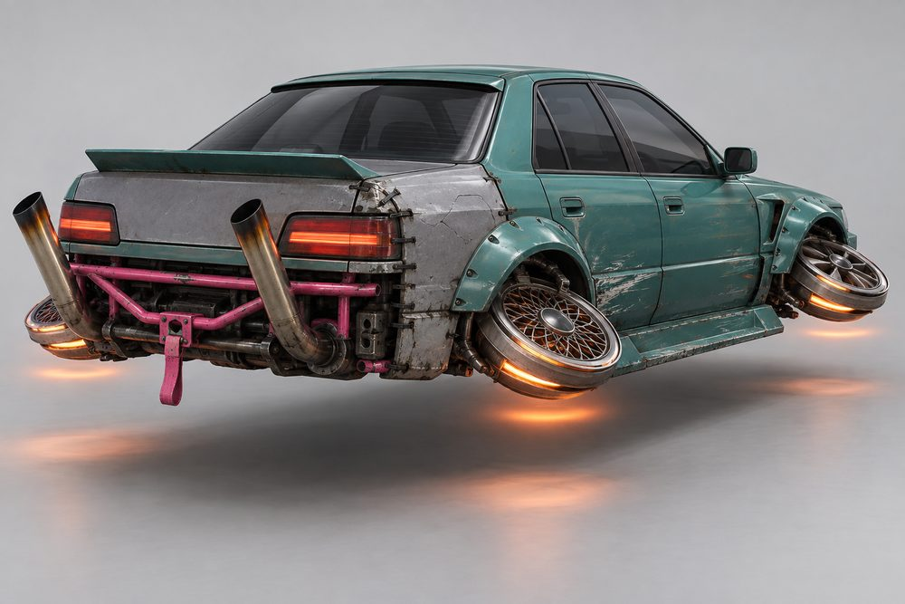
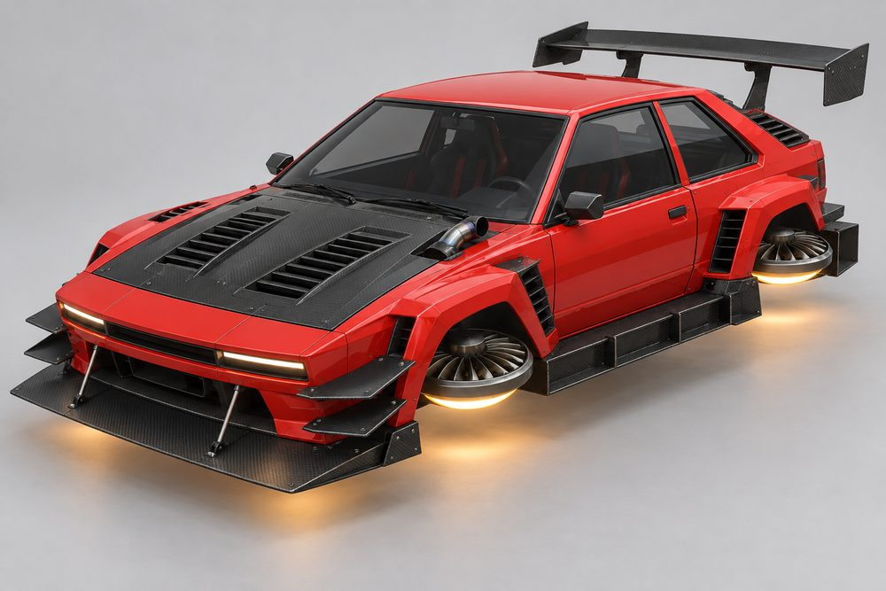
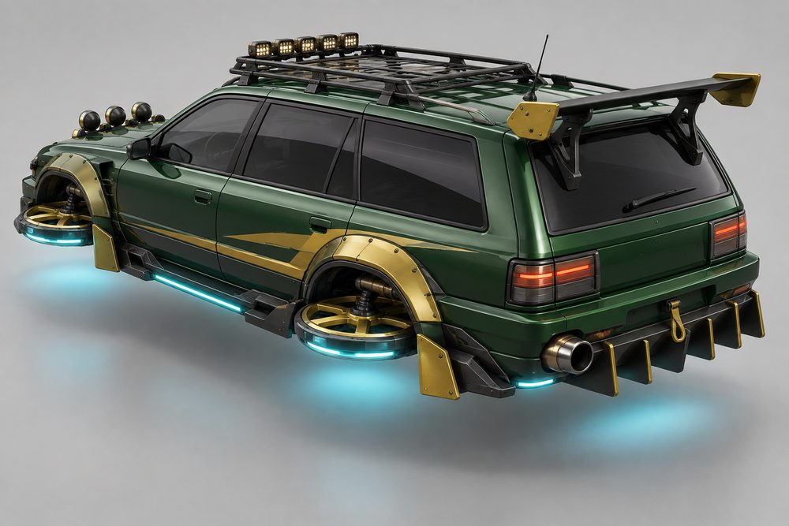

# Street: class sheet

Status: design exploration, 2026-10-01. Not approved, not game content. Brief: [exploration contract](../../../scripts/vehicle_blockouts/CONTRACT.md). Proposed `CategoryId`: `street`.

## Pitch

Tuner and import car culture turned into hover cars. Compact 90s-style coupés, hot hatches and sports saloons with bolt-on aero. Where each wheel was, a round hover rotor sits in the arch. It is a turbine disc styled like an alloy rim, tipped nearly flat and glowing underneath. The rotors are the "rims" of this class.

**Player fantasy:** "I built this in a lock-up, and it is mine." Street is the light, sharp drift class. It is cheap to start and deep to tune. One body can be a neon show car on Friday and a stripped loop racer on Saturday. Players read each other's taste from the kit, the rotors and the stance.

## Culture lines

- **Drift:** battle-scarred missile cars. Zip-tied bumpers, bash bars, mismatched panels, extreme rotor camber.
- **Time Attack:** every panel is aero. Huge splitter, stacked canards, swan-neck wing, bare carbon.
- **Underground:** 2000s neon street racing. Smooth widebody, tall wing, big cannon exhaust, underglow.
- **Touge:** clean mountain-pass cars. Subtle lip, ducktail, light rotors, nothing wasted.
- **Rally:** raised stance, light pods, mud flaps, roof scoop, bash bar.
- **Kanjo:** stripped loop racers. Bare front, window net, tow strap, one bold stripe.

## Cockpits

| Name | Culture | Silhouette | Tier |
|---|---|---|---|
| Kei | Underground | Tiny two-seat sports cabin, short roof | E |
| Pocket | Kanjo | Upright hot hatch, steep rear glass | D |
| Longroof | Rally | Long flat wagon roof, upright tailgate | C |
| Wedgeback | Time Attack | Boxy 80s liftback, long glass hatch | B |
| Syndicate | Drift | Four-door sports saloon, separate boot line | A |
| Touge | Touge | Low two-door 90s coupé, short deck | S |

## Slots and modules

Slot ids are the canonical ones. Labels are what the player sees. "(added)" marks a module that is not in the contract roster.

| Slot id | Label | Modules |
|---|---|---|
| `Engine1` | Front Clip | **Stock:** plain nose, slim rectangular lamps. **Widebody:** swollen arches, big intercooler mouth. **Pop-Up:** flat wedge nose, lamps flip up at night. **Shark:** blunt forward-leaning nose, slot lamps. **Rally:** tough nose with a pod of four round spot lamps. |
| `Engine2` | Rear Clip | **Stock:** plain tail, bar tail-lights. **Widebody:** flared rear arches, vented corners. **Hatch Bustle:** short stepped tail with a chunky bumper. **Time-Attack Tail:** long flat tail that extends behind the body. |
| `Stabilisers` | Hover Rotors | **Five-Spoke:** thick spokes, thin lip. **Deep Dish:** polished deep outer lip. **Turbofan:** flat cover with fine radial blades. **Mesh:** fine lattice face. **Stance:** any face, heavy camber so the discs lean out of the arches. |
| `SidePods` | Side Kit | **Skirts:** simple sill extensions. **Bolt-on Overfenders:** riveted arch flares, visible fasteners. **Side Splitters:** flat carbon blades with small fences. **Rally Flaps:** mud flaps behind each arch. |
| `Boost` | Exhaust | **Cannon:** one fat round tip at the corner. **Twin Tip:** two neat tips. **Bamboo Stacks:** two long angled pipes, scorched ends. **Screamer:** short pipe out of the bonnet side. |
| `FrontBumper` | Front Lip | **Lip:** thin chin strip. **Splitter and Canards:** flat blade on support rods, corner canards. **Intercooler Bumper:** open mouth, core on show. **Missile:** cracked bumper held on with zip ties. |
| `RearBumper` | Diffuser | **Street:** shallow valance. **Finned:** deep under-tray with tall fins. **Bash Bar:** bare tube bar, no bumper cover. |
| `RearSpoiler` | Wing | **Ducktail:** small upturned lip. **GT Wing:** tall wing on two uprights. **Swan Neck:** wide wing hung from above. **Roof Spoiler:** short visor over the rear glass. |
| `Hood` | Hood | **Vented:** two heat-extractor slots. **Carbon Bulge:** bare carbon with a raised centre. **Cut-out:** hole with plumbing poking through. **Louvred Carbon (added):** rows of slats across the whole bonnet. |
| `Roof` | Roof | **Roof Scoop:** small centre intake. **Rack:** tube rack, takes cargo props. **Light Pod Bar:** row of small lamps. |
| `Accessory` | Extras | **Mirrors:** aero mirrors on stalks. **Tow Strap:** bright fabric loop. **Antenna:** tall whip. **Window Net (added):** mesh in the side window. |

## Handling intent versus Piercer

Design intent only. Plus means higher than Piercer, minus means lower.

| Stat | Bias | Why |
|---|---|---|
| TopSpeed | - | Runs out of breath on long straights. |
| Acceleration | + | Light and eager out of corners. |
| Braking | + | Little mass to stop. Brake late. |
| BoostForce | - | A shove, not a launch. |
| BoostDuration | + | Long, soft boost that suits linking corners. |
| DriftControl | ++ | The class reason to exist. Easy to start and steer a slide. |
| DriftGrip | - | Slides freely and holds a wide angle. |
| LateralGrip | = | Neutral. Aero kits push it up, drift kits down. |
| SteeringResponse | ++ | Darts into gaps. |
| HoverStability | - | Twitchy over bumps and kerbs. |
| Downforce | - | Low as standard. Splitters and wings buy it back. |
| Drag | = | Neutral. Big aero adds a little. |
| Weight | -- | Loses contact fights with every heavier class. |

## Ideas that make Street fun to own

1. **Stance.** A cosmetic setting on the Hover Rotors slot: camber, poke and ride height. Flat and tucked, or leaning out of the arches. It is the first thing other players notice.
2. **Rotor trails.** There is no tyre smoke. In a drift each rotor draws a light trail in the Neon colour. Four curved lines on the road are the class signature.
3. **Full-kit titles.** Clip, lip, wing and exhaust from one culture earn a title: Missile (Drift), Lap Record (Time Attack), After Hours (Underground), Downhill Special (Touge), Stage Ready (Rally), Loop Runner (Kanjo).
4. **Exhaust voice.** Cannon pops a flame when you lift off. Bamboo Stacks crackle. Screamer shrieks on boost. Flame colour follows the thrust colour.
5. **Aired out.** When parked the car sinks and the rotors fold flat into the arches. On start-up they tilt, spin up and lift the car.
6. **Pop-up wink.** Pop-Up lamps rise at night. Tap the horn to wink one lamp at another player.
7. **Earned parts.** Drift score unlocks Stance and Bamboo Stacks. Time trial medals unlock Swan Neck and Time-Attack Tail. Night distance unlocks underglow patterns. Missile parts drop from near-miss streaks.
8. **Meet shots.** A row of Street cars with underglow in a multi-storey car park. Top-down view of four rotor discs. Rear three-quarter with exhaust flame in a tunnel.

## Gallery

*01 hero. Underground. Touge cockpit, Widebody front clip, Vented hood, Splitter and Canards, Bolt-on Overfenders with skirts, Deep Dish rotors, GT Wing, Cannon exhaust, Roof Scoop, Mirrors.*

*02 exploded. Underground. Every slot pulled off the Touge cabin: Front Clip, Hood, Front Lip, Side Kit, Rear Clip, Wing, Diffuser, Exhaust, Roof Scoop, Mirrors and four Hover Rotors.*

*03 one kit, three cockpits. The same Touge kit and paint (Stock clips, Lip, Skirts, Ducktail, Twin Tip) on Touge (left), Pocket (centre) and Syndicate (right). Only the cabin changes.*

*04 one cockpit, three kits. Pocket cockpit with Kanjo (left), Underground (centre) and Rally (right) kits. Front Clip, Front Lip, Side Kit, Wing, Hood, Roof and Hover Rotors all change.*

*05 Drift, rear. Syndicate cockpit, Bash Bar, Bamboo Stacks, Ducktail, Bolt-on Overfenders, Stance rotors (Mesh rear, Five-Spoke front), Tow Strap. One mismatched panel and zip ties.*

*06 Time Attack. Wedgeback cockpit, Shark front clip, Splitter and Canards, louvred carbon hood, Screamer exhaust, Side Splitters, Turbofan rotors, Swan Neck wing, Time-Attack Tail.*

*07 mixed. Longroof cockpit. Rally front clip, Rack with Light Pod Bar and Rally Flaps. Time Attack Finned diffuser and Swan Neck wing. Underground Overfenders, Cannon and underglow. Green and gold paint ties it together.*

*08 action. The hero Underground build drifting on a wet city expressway at night.*

## Risks and open points

- **Rotor readability.** A flat disc hides its face from the side. The rotors need some tilt so the "rim" design shows. That tilt must stay inside the Hover Rotors envelope and clear the Side Kit.
- **One slot, four rotors.** Hover Rotors is one slot, so one module sets all four corners. The staggered front and rear rotors in 05 would need their own module.
- **Who owns the arches.** The brief puts arches on the clips and flares on the Side Kit. Image 02 leaves the rear arches on the cabin and shows the front wings as loose pieces. The frame standard must pick one owner.
- **Cabin against rear clip.** A boot, a hatch and a wagon tailgate must all sit on the same Rear Clip. Keep the Rear Clip below the beltline and let the cabin own all rear glass.
- **Lamps are on the clip.** The Wedgeback is described with pop-up lamps, but lamps belong to the Front Clip. The cabin must read by roofline alone.
- **Kei scale.** The class has one body size. A Kei cabin on full-size clips may not read as tiny.
- **Overlap with Cruiser.** Both use four rotors and both list a Longroof. Rename one and keep Street short and upright.
- **Exhaust position.** Screamer exits at the bonnet. Decide whether boost flame follows it or stays at the rear.
- **Wear and mismatched panels.** The Drift look fights "paint unifies". Map the odd panel to Secondary and keep scuffs as fixed Detail parts.
- **Likeness.** The image model drifts towards familiar 90s coupé shapes (01, 02, 08) and an 80s liftback (06). Use the images for layout and mood only. Final models must be original.
- **Detail level.** The renders are far finer than a low-poly build under 160 parts. Rotor faces need a simple repeatable piece.
- **Image notes.** 06 was regenerated once; the first try came out as a mid-engined wedge exotic. In 03 the cars sit small in frame and the rotors read as turbofans, not five-spokes. In 04 the left car has a tiny blank round emblem on the grille. In 08 the hover height reads lower than half a metre.
- **Passengers and jobs.** Syndicate and Longroof have four doors and suit taxi jobs. Confirm seat counts for the two-door cabins.
