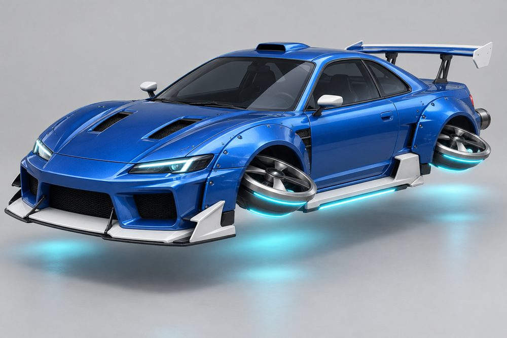
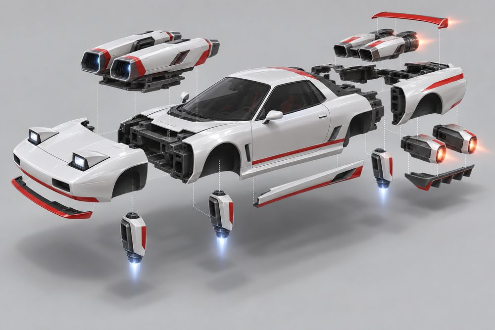
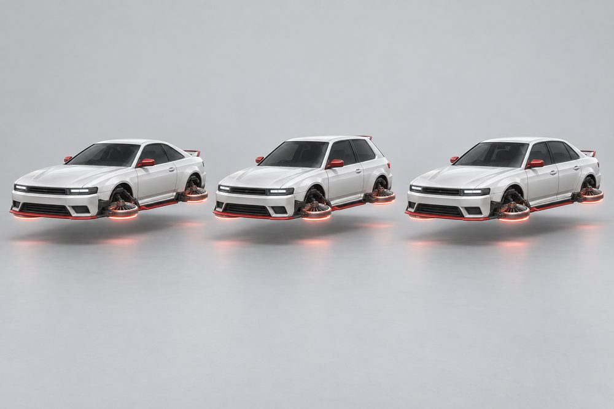
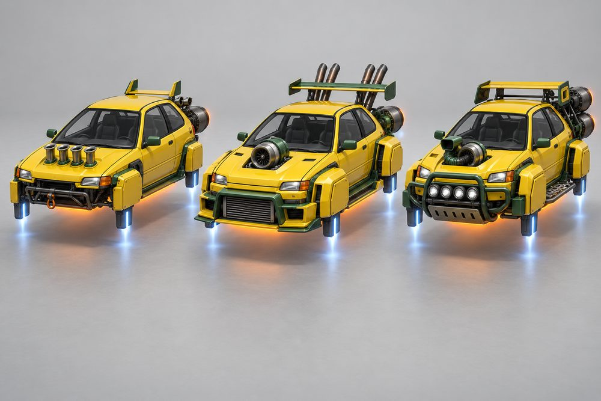
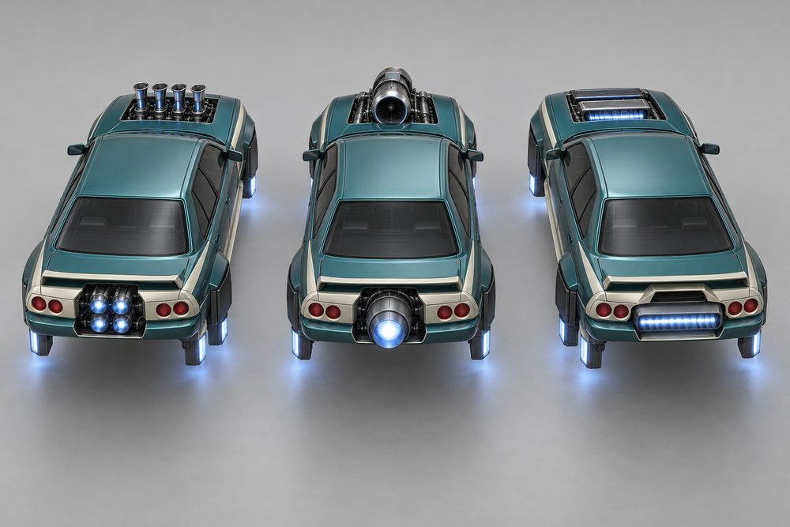
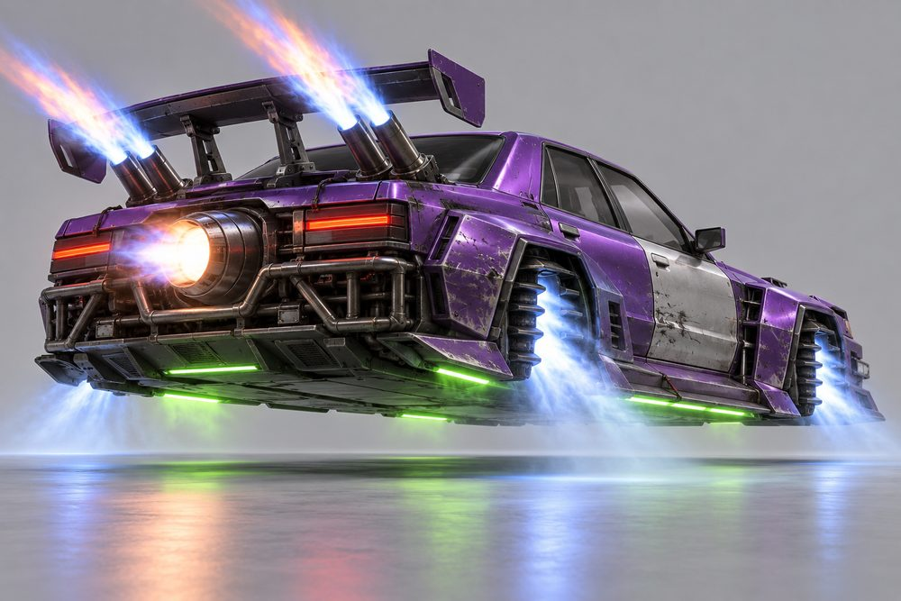
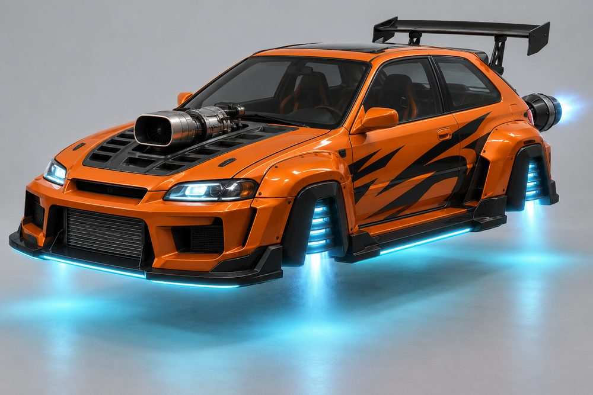
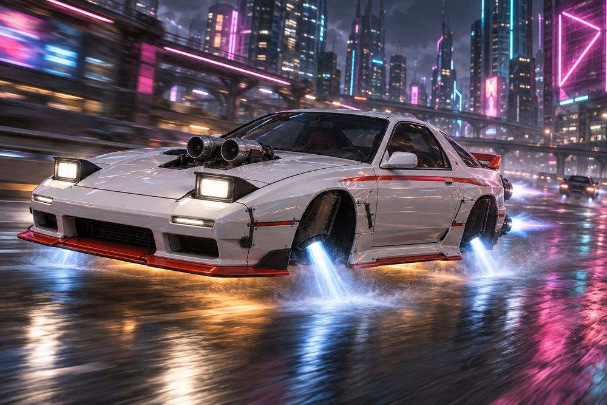

# Street: class sheet (round 2)

Status: design exploration, round 2, updated 2026-10-02 after the review pass. Not approved, not game content. Brief: [exploration contract](../../../scripts/vehicle_blockouts/CONTRACT.md). Blockout: [frame standard](street-frame.md) and `scripts/vehicle_blockouts/specs/street.json`. Proposed `CategoryId`: `street`. Round 1 art is kept in `output/vehicle-categories-2026-10-01/street/v1/`.

## What changed since round 1

- The round 1 hover rotors (flat discs styled as rims) are gone. No wheels, rims, discs or rings anywhere.
- Each blanked arch now holds a small vectoring lift jet. Nobody can mistake it for a wheel.
- Engines, stabilisers and boost are real jet hardware on every car: a turbine through the bonnet, a turbine in the tail, four arch jets and exhaust burners.
- The front and rear clips now have their own slots (`FrontBody`, `RearBody`). Round 1 had put them on the engine slots.
- Every cockpit has its own signature kit, and every kit fits every cockpit.
- Review pass: one cockpit and seven modules were renamed to match the blockout. The Roadster keeps the id `kei`. The new module names are Bonnet Letterbox, Tail Letterbox, Quad Row, Blade Ducts, Outrigger Pods, Quad Bank and Sill Fairings.
- The tail bay is now open on every cockpit. Long rooflines are carried back on buttresses or an open frame.
- Boost burners are square and flared, so they never read as the round engine nozzles.

## Pitch

Tuner and import car culture on jets. Compact 90s Japanese-style coupés, roadsters, hot hatches, saloons and wagons with bolt-on aero: widebody overfenders, splitters and canards, big wings, a vented bonnet with a turbine showing through it. The arches are blanked off and each holds a small lift jet. Jet nozzles replace the exhaust in the tail.

**Player fantasy:** "I built this in a lock-up, and it is mine." Street is the light, sharp drift class. It is cheap to start and deep to tune. One body can be a clean mountain-pass car on Friday and a scarred drift missile on Saturday. Players read each other's taste from the kit, the engines and the stance.

## Culture lines

- **Drift:** battle-scarred missile cars. Zip-tied bumper, bash bar, one mismatched panel, tall bamboo stacks.
- **Time Attack:** every panel is aero. Splitter, canards, flat letterbox burners, swan-neck wing.
- **Underground:** 2000s neon street racing. Wide body, tall wing, cannon exhaust, bright underglow.
- **Touge:** clean mountain-pass cars. Pop-up lamps, ducktail, nothing wasted.
- **Rally:** raised stance, snorkel, light pod, steps and mud flaps, box wing.
- **Kanjo:** stripped loop racers. Bobbed ends, trumpet intakes, tow bar, one bold stripe.

## Cockpits

| Name | Culture | Silhouette | Signature kit | Tier |
|---|---|---|---|---|
| Roadster | Time Attack | Open two-seat targa roadster | Time Attack | E |
| Pocket | Kanjo | Upright hot hatch, steep rear glass | Kanjo | D |
| Estate | Rally | Long flat roof, open-frame load bay | Rally | C |
| Syndicate | Drift | Four-door sports saloon, separate boot line | Drift | A |
| Touge | Touge | Low 90s two-door coupé, short deck | Touge | S |

The Roadster keeps the id `kei`. Tier B is open (see risks). Underground has no native cockpit or kit. It is a style built by mixing kits and neon.

## The fundamentals

Every build has all four. Each option shows an intake, a body and a glowing nozzle.

| Slot id | Player label | Where it sits | Options |
|---|---|---|---|
| `Engine1` | Bonnet Engine | Stands on a dark pad and sticks up through the bonnet. First thing seen from the front. | **Twin Cam:** two slim turbines side by side. **ITB Four:** four upright trumpet intakes in a row. **Big Single:** one fat turbine, big mouth. **Bonnet Letterbox:** wide flat ram mouth, slot jets at each side. **Snorkel:** offset turbine with a raised snorkel intake. |
| `Engine2` | Tail Engine | Open bay in the centre of the tail. Nozzles pass through the rear panel. | **Twin Turbine:** two turbines under twin deck scoops. **Quad Row:** four small jets in a row, tall airbox. **Missile Can:** one fat long can. **Tail Letterbox:** wide flat ram hood, slot nozzle. **Over-Under:** two turbines stacked, tall intake tower. |
| `Stabilisers` | Arch Jets | One in each blanked arch, four in all. | **Vector Pods:** one slim vectoring pod per arch. **Twin Downjets:** two upright nozzles per arch, ram scoop outboard. **Vane Cascade:** finned slot jet on a rail. **Blade Ducts:** canted slot duct, glowing rail on the end fence. **Outrigger Pods:** square pod, low and outboard. |
| `Boost` | Exhaust Burner | Square flared burners about 2 studs behind the tail face, outboard of the tail engine. Bamboo Stacks rise behind the wing. | **Twin Tips:** one square burner each side. **Cannon:** one big square burner, offset right. **Bamboo Stacks:** four tall pipes leaning back. **Slot Bar:** full-width glowing slot. **Quad Bank:** four square burners in one bank, offset left. |

## Body and cosmetic slots

| Slot id | Player label | Options |
|---|---|---|
| `FrontBody` | Front Clip | **Pop-Up Wedge:** low wedge, long beak, pop-up lamp pods. **Shorty:** bobbed, door width, bare beam. **Wide Nose:** very wide, tall box flares. **Arrow Nose:** needle between two fender towers. **Stage Nose:** blunt and tall, lamp pod, bull bar. |
| `RearBody` | Rear Clip | **Clean Tail:** smooth boat-tail. **Bob Tail:** door width, undercut, bare beam. **Wide Tail:** very wide, tall box haunches. **Tunnel Tail:** open channels, tall end-plate fins. **Stage Tail:** square, raised quarters, stacked lamps. |
| `SidePods` | Side Kit | **Slim Skirts:** neat sill strip. **Door Boards:** flat boards on the doors. **Deep Skirts:** tall sill blocks. **Sill Fairings:** flat sill blades with small fences. **Steps and Flaps:** step plates, mud flaps behind the arches. |
| `FrontBumper` | Front Lip | **Chin Lip:** thin chin strip. **Tow Bar:** bare bar with a hook. **Intercooler Bumper:** open mouth, core on show. **Splitter and Canards:** flat blade on rods, corner canards. **Skid Plate:** flat steel plate. |
| `RearBumper` | Diffuser | **Valance:** shallow valance. **Bare Beam:** bare tube beam. **Bash Bar:** tube bar, no bumper cover. **Finned Diffuser:** deep tray, tall fins. **Rear Guard:** tubular guard. |
| `RearSpoiler` | Wing | **Ducktail:** small upturned lip. **Twin Fins:** two small tail fins. **GT Wing:** tall wing on two uprights. **Swan Neck:** wide wing hung from above. **Box Wing:** boxy wing on short posts. |

`Hood`, `Roof` and `Accessory` are not used. The bonnet belongs to the Bonnet Engine and the cabin owns the roof. Round 1 extras (roof scoop, light pod bar, mirrors, tow strap, window net) could return later as `Accessory` options.

## Signature kits

| Kit | Culture | Native cockpit | What makes it look different |
|---|---|---|---|
| Touge | Touge | Touge | Low and clean. Pop-Up Wedge nose, twin turbines, slim skirts, ducktail. |
| Kanjo | Kanjo | Pocket | Short and stripped. Bobbed ends, four trumpet intakes, one cannon, tow bar. |
| Drift | Drift | Syndicate | Widest body. One fat turbine, bash bar, tall bamboo stacks, GT wing. |
| Time Attack | Time Attack | Roadster | Flat and sharp. Letterbox burners, blade ducts, arrow nose, swan-neck wing. |
| Rally | Rally | Estate | Tall and rough. Stage nose, snorkel, outrigger pods, box wing. |

An Underground build is Drift body parts plus the Kanjo Cannon and a bright Neon colour. See image 07.

## Handling intent versus Piercer

Design intent only. Plus means higher than Piercer, minus means lower.

| Stat | Bias | Why |
|---|---|---|
| TopSpeed | - | Small jets run out of breath on long straights. |
| Acceleration | + | Light and eager out of corners. |
| Braking | + | Little mass to stop. Brake late. |
| BoostForce | - | A shove, not a launch. |
| BoostDuration | + | Long, soft burn that links corners. |
| DriftControl | ++ | The class reason to exist. Easy to start and steer a slide. |
| DriftGrip | - | Slides freely and holds a wide angle. |
| LateralGrip | = | Neutral. Time Attack aero raises it, Drift kits lower it. |
| SteeringResponse | ++ | Darts into gaps. |
| HoverStability | - | Four small arch jets are twitchy over bumps and kerbs. |
| Downforce | - | Low as standard. Splitters and wings buy it back. |
| Drag | = | Neutral. Big aero adds a little. |
| Weight | -- | Loses contact fights with every heavier class. |

## Ideas that make Street fun to own

1. **Engine swap meets.** Bonnet and tail engines are separate slots. A Roadster with a Big Single and Bamboo Stacks is the sleeper everyone wants to race.
2. **Stance.** A cosmetic setting on Arch Jets: tucked and flat, or nozzles tilted out. It is the first thing other players notice.
3. **Jet trails.** There is no tyre smoke. In a drift each arch jet draws a light trail in the Neon colour. Four curved lines on the road are the class signature.
4. **Exhaust voice.** Twin Tips pop when you lift off. Bamboo Stacks crackle. Cannon bangs. Flame colour follows the thrust colour.
5. **Full-kit titles.** A full kit earns a title: Missile (Drift), Lap Record (Time Attack), Downhill Special (Touge), Stage Ready (Rally), Loop Runner (Kanjo). Underground widebody, Cannon and neon earns After Hours.
6. **Aired out.** Parked, the arch jets cut and the car settles down. On start-up they spool up and lift it.
7. **Pop-up wink.** Pop-Up Wedge lamps rise at night. Tap the horn to wink one lamp at another player.
8. **Earned parts and scars.** Drift score unlocks Bamboo Stacks and Bash Bar. Time trial medals unlock Swan Neck and Tail Letterbox. A Drift build slowly gains scuffs, scorch marks and one mismatched panel.

## Gallery

*01 hero. Touge cockpit with the Touge kit: Pop-Up Wedge, Clean Tail, Slim Skirts, Chin Lip, Valance, Ducktail, Twin Cam, Twin Turbine, Vector Pods, Twin Tips.*

*02 exploded. Touge cockpit and Touge kit. Front Clip, Front Lip, Bonnet Engine, Rear Clip, Tail Engine, Wing, Exhaust Burner, Diffuser, Side Kit and four Arch Jets pulled away.*

*03 one kit, three cockpits. The Time Attack kit and one paint on Roadster (left), Syndicate (centre) and Estate (right). Only the cabin changes. Each car shows the bonnet letterbox engine, arch lift jets and tail afterburner cans.*

*04 one cockpit, three kits. Pocket cockpit with the Kanjo (left), Drift (centre) and Rally (right) kits. Every slot changes. The arches are skirted and each holds a boxy lift-jet nozzle. The Rally mud flaps are left off this image.*

*05 engines. Syndicate cockpit, Touge body parts, seen from high behind so the bonnet engines sit clearly on the bonnet. Bonnet and tail engines: ITB Four with Quad Row (left), Big Single with Missile Can (centre), Bonnet Letterbox with Tail Letterbox (right).*

*06 stabilisers and boost. Syndicate cockpit, Drift kit: Vane Cascade arch jets working, Bamboo Stacks and Missile Can firing, Bash Bar, GT Wing, Wide Nose and Wide Tail.*

*07 Underground, mixed. Pocket cockpit with Drift body parts, Big Single, Vane Cascade, Intercooler Bumper, GT Wing and the Kanjo Cannon. Cyan underglow.*

*08 action. The hero Touge build at speed on a wet city expressway at night.*

## Risks and open points

- **Likeness.** The art leans on real 90s cars: Silvia and RX-7 coupés, Civic hatch, Evo saloon, Legacy wagon. Likeness is welcome, but final models must be original. No badges or text.
- **Roadster scale.** The blockout has one body length. A tiny car cannot read as tiny on it. With lips and burners builds are 24.1 to 24.8 long and about 12.2 wide. The brief asks for about 21 by 11.
- **Missing cockpits and kit.** Wedgeback and a native Underground kit are not built. Tier B is empty. Five cockpits cover E, D, C, A and S. A sixth cockpit needs a sixth full kit.
- **Clip look-alike.** Front and rear clip pairs score 0.09 and 0.13 on whole-outline distinctness against a target of 0.35. The shared collar, cowl and pads cause it. Without the shared parts both score 0.42. Fixing it would make the cabins look alike.
- **Tall cabins and the tail bay.** The solid roof stops at the tail bay on every cockpit. Pocket and Roadster carry the roofline back on buttresses. Estate uses an open frame, so its load bay has no roof skin or tailgate.
- **Arch jets from above.** Vector Pods, Blade Ducts and Outrigger Pods point their thrust down or back. Each still has a glowing part outboard of the fender, so some glow shows from above.
- **Burners on one side.** Cannon and Quad Bank sit on one side and cover part of that tail lamp.
- **Flat pads cost style.** Real meshes need curvature that still ends on the flat pad. Builds use 146 to 184 parts.
- **Mixed builds.** Cross-kit pairs are only checked for contact. Five mixed blockout builds are the only visual check.
- **Drift look against "paint unifies".** Map the odd panel to Secondary and keep scuffs as fixed Detail parts.
- **Image detail.** The renders are far finer than a low-poly build of 146 to 184 parts. Use them for layout and mood.
- **Image notes.** Reviewed after generation. 01, 02, 06, 07 and 08 passed. 03, 04 and 05 were regenerated. 03 first read as a hypercar with only glowing slots, and now shows tuner proportions with a bonnet turbine, arch lift jets and tail cans. 04 first had tyre-like dark shapes and mud flaps in the arches, and now has skirted arches with boxy lift jets. 05 first made the bonnet engines look roof-mounted, and is now shot from high behind. In 05 and 04 the lift jets are boxes, slimmer than the arch jets in the blockout. In 06 the vane cascades read as stacked fins, not as a spring or wheel. In 02 the arch jets are fat capsules, slimmer in the blockout.
