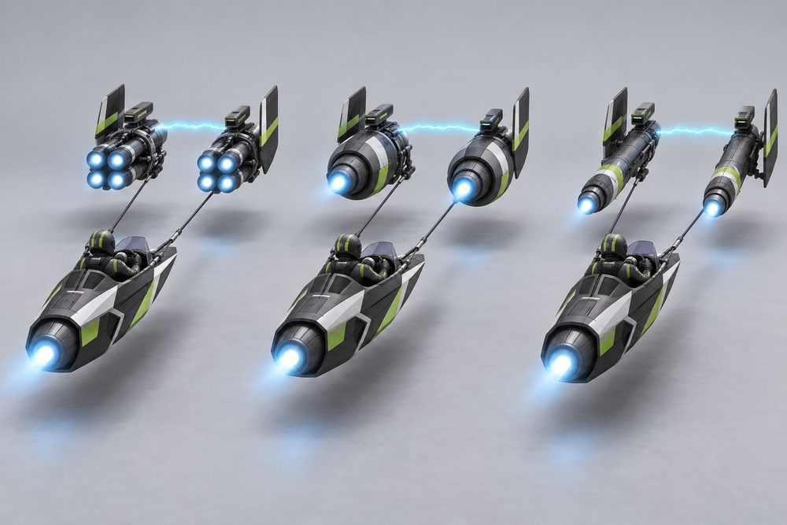
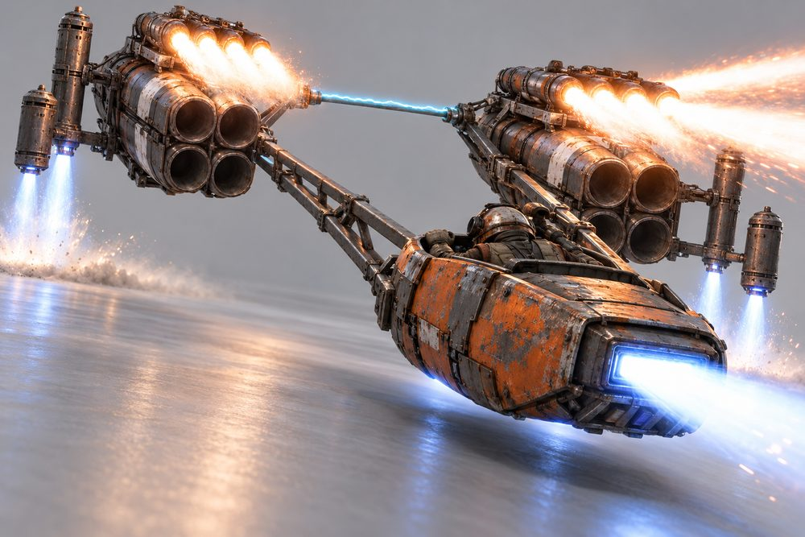

# Tether (frame class `tether`)

Status: design exploration, round 2, updated 2026-10-02 after the review pass. Nothing here is approved or game content.
Brief: [exploration contract](../../../scripts/vehicle_blockouts/CONTRACT.md). Envelopes, pads and seams: [tether-frame.md](tether-frame.md). Round 1 art: `output/vehicle-categories-2026-10-01/tether/v1/`.

## Pitch

A small open pod towed by two huge engines. The engines fly far ahead and wide apart. A glowing binder arc joins them. Cables or a rigid boom join them to the pod. Nothing touches the ground. About 19 W x 8 H x 37 L studs in the blockout.

**Player fantasy:** you are not driving a car. You are holding the reins of two rockets. You sit in the open at the back and watch your engines work ahead of you. It is the widest and fastest thing on the road. Getting it through traffic clean is the brag.

Round 2 changes: no wheels or ring parts anywhere. The engines are real jet modules, in a mirrored pair, and they now differ in shape, not just in trim. Stabilisers and afterburners ride on the engines. The pod has its own thruster.

## Culture lines

| Culture | One line |
|---|---|
| Scrapyard | Mismatched salvaged engines, bare metal, rust, hand-painted stripes, patched cables. |
| Works | Matched pristine engines, smooth shrouds, team colours, neat cabling. |
| Desert | Sand-blasted paint, cloth wraps, pleated filter sleeves, open petal flaps. |
| Showboat | Chrome, candy paint, neon strips, jewelled reins. Built to be looked at. |
| Harbour | Twin torpedo hulls, boat-like bows, hydrofoils and navy paint. Added by the blockout. |
| Atomic | Retro rockets: clear dome, stacked jets, upswept fins, pointed bullets. Added by the blockout. |

## Cockpits (pods)

| Name | Culture | Silhouette | Signature kit | Tier |
|---|---|---|---|---|
| Bucket | Scrapyard | Open scoop tub with a dark well | Scrapyard | E |
| Sled | Desert | Low arrowhead sled, upturned prow, raked screen | Desert | D |
| Skiff | Harbour | Narrow boat hull, long pointed bow, tall screen | Harbour | C |
| Bubble | Atomic | Clear dome at the nose, short tapering tail | Atomic | B |
| Chariot | Showboat | Tall curved shield on a flat open platform | Showboat | A |
| Capsule | Works | Sleek teardrop hull under a glass barrel canopy | Works | S |

The pilot is always visible. The avatar and helmet are part of the look. Each pod gives its own pose: Bucket crouches, Sled lies feet first, Skiff kneels, Bubble reclines, Chariot stands, Capsule sits.

## The fundamentals

Every build has all four. Each shows an intake, a body and a glowing nozzle.

| Slot | Player label | Where it sits | Options and look |
|---|---|---|---|
| `Engine1` | Tow Engines | A mirrored pair far ahead of the pod, wide apart | **Quad Cluster**: four slim staggered jets with clamp bands. **Fat Turbines**: one fat nacelle with flat flanks and an eyelid nozzle. **Long Barrels**: one long slim barrel with a bell, turbine and thin tailpipe. **Bell Jets**: slim chrome snout ending in a square four-petal horn. **Twin Hulls**: two torpedoes under a bridge deck. **Stack Jets**: an over-and-under pair of jets on a web. |
| `Engine2` | Pod Thruster | On the back of the pod | **Skid Jet**: box duct with a top scoop and a tall slot. **Twin Nacelles**: two small nacelles on a stub wing. **Mono Turbine**: one turbine with cheek intakes. **Organ Pipes**: four flared pipes in a row. **Outboard**: powerhead on a leg with a low torpedo jet. **Swallow Tail**: two splayed pipes. |
| `Stabilisers` | Engine Vanes | On the outer flank of each tow engine | **Outrigger Jets**: a beam with two upright lift barrels. **Petal Brakes**: splayed petal flaps round a lift jet. **Blade Vanes**: tall swept plate with a top jet and a vectoring jet. **Canard Jets**: thick canards with a lift jet and a jet pod on each tip. **Hydro Strakes**: drooped strake with a float jet and a lift slot. **Sky Fins**: upswept fin with a tip rocket and a lift jet. |
| `Boost` | Afterburners | Piggyback on top of each tow engine | **Bottle Rack**: three tilted rocket bottles. **Can Burner**: one fat can with saddle tanks. **Staged Burner**: three telescoping stages. **Twin Trumpets**: two long pipes with flared bells. **Slot Burner**: flat wide body with a slot nozzle and end plates. **Fin Rocket**: one pointed rocket. |

## Body and cosmetic slots

| Slot id | Player label | Options and look |
|---|---|---|
| `SidePods` | Binder and Cables | **Rigid Boom**: V-truss of struts, binder inside. **Twin Cable**: two tow cables with couplers. **Arc Binder**: single tether, forked bridle, thick arc. **Cross Reins**: crossed reins with a jewel, two binders. **Tow Wing**: centre boom into a swept cross-deck. **Spreader Rig**: one tether to a spreader bar, two straight tow lines, a chevron binder. |
| `FrontBumper` | Nose Pieces | **Ram Cage**: welded bar cage. **Sand Filter**: pleated filter sleeve. **Shock Spike**: single sharp cone. **Lances**: two-pronged fork. **Cutwater**: arrowhead bow blade. **Twin Bullets**: chrome bar with two pointed bullets. |
| `RearBumper` | Pod Tail | **Chute Pack**: drag chute pack with a hook. **Skid**: curved runner. **Rudder**: swept blade. **Glow Keel**: neon tube keel. **Hydrofoil**: strut-mounted foils. **Drop Tanks**: two pointed tanks on short pylons. |
| `RearSpoiler` | Pod Fins | **Plank Wing**: flat wing on a post with end plates. **Twin Fins**: two canted fins. **Tall Fin**: swept fin with a T-plane. **Swept Horns**: long raked horns with tip lights. **Dorsal Sail**: tall sail on a boom. **Tail Boom**: slim boom with a tailplane and three fins. |

Round 1 also had `Hood` (engine shrouds) and `Roof` (windscreen). The blockout drops them. Shroud and screen styles can come back as cosmetic slots.

## Signature kits

Each kit also has its own binder, nose piece, pod tail and pod fins. Any pod takes any kit.

| Kit | Culture | Native pod | What makes it look different |
|---|---|---|---|
| Scrapyard | Scrapyard | Bucket | Four-jet bundles, rocket rack, upright lift barrels, welded truss. Patched and mismatched. |
| Desert | Desert | Sled | Short fat engines, petal flaps, canvas filter sleeves, twin nacelles. Sand-blasted. |
| Works | Works | Capsule | Slim matched barrels, tall blade vanes, telescoping burners, one clean arc. |
| Showboat | Showboat | Chariot | Chrome bell snouts, lances, trumpet pipes, crossed jewelled reins, neon. |
| Harbour | Harbour | Skiff | Twin torpedo hulls, cutwater bows, flat slot burners, swept tow wing. |
| Atomic | Atomic | Bubble | Stacked jet pairs, swallow-tail pipes, upswept fins, one pointed rocket, bullet noses, drop tanks. |

## Handling intent versus Piercer

Design intent only. Plus means more than Piercer, minus means less.

| Stat | Bias | Why |
|---|---|---|
| TopSpeed | ++ | The reason to own one. |
| Acceleration | + | Two engines, but they spool. Strong mid-range, not launch. |
| Braking | -- | Long and loose. Petal Brakes are the fix. |
| BoostForce | ++ | Boost should feel like being yanked forward. |
| BoostDuration | - | Short, violent bursts. |
| DriftControl | - | The pod swings wide on its cables. |
| DriftGrip | - | Slides are long and need planning. |
| LateralGrip | -- | Turns are wide arcs, not corners. |
| SteeringResponse | - | Steering is differential thrust, so it lags a beat. |
| HoverStability | - | The pod bobs behind the engines. Rigid Boom and Outrigger Jets recover some. |
| Downforce | - | Little body to push down. |
| Drag | - | Small frontal area per engine. Lower drag helps top speed. |
| Weight | - | A light pod loses in contact. Do not trade paint. |

Binder choice is the main feel dial. Twin Cable is fastest and loosest. Rigid Boom is steadier and slower to swing. Arc Binder favours boost.

## What makes it fun to own

1. **Binder colour and style are yours.** The arc uses the Neon channel and the afterburners use thrust colour. A pink arc over green burners is a signature seen from a block away. The binder slot sets the arc look: thin, braided, truss, crossed, wing or chevron.
2. **Engines you can hear.** Each Engine1 option gets its own sound: Quad Cluster crackles, Fat Turbines thump, Long Barrels whine, Bell Jets scream, Twin Hulls throb, Stack Jets rasp. You know a rival by ear.
3. **Start-up ritual.** On spawn and in the garage: left engine lights, right engine lights, the arc strikes across, the cables snap taut, the pod lifts. Three seconds, skippable.
4. **Boost and brake show.** On boost the cables stretch so the pod drops back a stud. Bottle Rack fires its bottles one by one. Staged Burner telescopes out. On brake the petals flower open.
5. **Thread bonus.** Pass a lamp post, a gap or slow traffic between your engines and under the arc for a "Threaded" call-out. Only this class has a hole in the middle.
6. **Salvage unlocks.** Scrapyard parts come from world jobs as found parts. Works parts come from race results. Showboat chrome comes from top-speed and photo milestones. A full matched kit earns a kit name, for example "Full Works Rig".
7. **Frankenrig titles.** Mix parts from four cultures on one machine and earn a title. A Scrapyard pod with Showboat engines looks wrong in the best way.
8. **Wear and polish.** Scrapyard parts pick up scorch marks. Desert parts gather sand. Showboat chrome can be polished in the garage for a one-day shine.

## Gallery

*01 Hero. Works kit on the Capsule pod: Long Barrels, Mono Turbine, Blade Vanes, Staged Burner, Arc Binder (single tether, forked bridle, energy arc), Shock Spike, Rudder, Tall Fin.*

*02 Exploded. Desert kit on the Sled pod: Fat Turbines, Petal Brakes, Can Burner, Twin Cable, Sand Filter, Twin Nacelles, Skid, Twin Fins. Every module floats clear on its own axis.*

*03 One kit, three pods. Works kit (Long Barrels, Blade Vanes, Staged Burner, Shock Spike, Arc Binder energy arc) on Bucket (left), Chariot (centre) and Sled (right). Same white and orange paint.*

*04 One pod, three kits. Capsule pod each time. Left Scrapyard kit (Quad Cluster, Bottle Rack, Outrigger Jets, Rigid Boom). Centre Harbour kit (Twin Hulls, Slot Burner, Tow Wing). Right Showboat kit (Bell Jets, Lances, Twin Trumpets, Canard Jets, Cross Reins).*

*05 Three Tow Engine options. Skiff pod, rear three-quarter. Left Quad Cluster, centre Fat Turbines, right Long Barrels. Pod, Twin Cable, Blade Vanes and Staged Burner are the same on all three.*

*06 Boost and stabilisers working. Scrapyard kit on the Bucket pod, low rear three-quarter: Quad Cluster, Bottle Rack firing, Outrigger Jets blasting the floor, Rigid Boom, Skid Jet.*

*07 Showboat. Chariot pod with the full Showboat kit: Bell Jets, Lances, Twin Trumpets, Canard Jets, Cross Reins, Organ Pipes, Glow Keel, Swept Horns.*

*08 Action. The Works hero build (Capsule pod, Long Barrels, Blade Vanes, Staged Burner, Arc Binder) at speed in the night city. Cables taut, arc lighting the road.*

Prompts: `output/vehicle-categories-2026-10-01/tether/prompts.json`.

## Risks and open points

- **Width in traffic.** The blockout is about 19 studs wide and 37 long, close to the brief's 18 by 36. That is far wider than any road car. Check lanes, gates and alleys. Some routes may be closed to this class.
- **Harbour and Atomic are not in the brief.** They are the fifth and sixth cultures in the blockout. They exist so Skiff and Bubble have signature kits. Keep them or fold them into Works.
- **Bubble dome.** The preview tool drops the pole faces of every `ball`, so the blockout dome carries a second shell turned on its side. A real mesh needs one clean dome.
- **Collision shape.** One box round the whole vehicle is unfair. Three boxes let traffic through the cable gap. Decide which, and whether cables and binder collide.
- **Physics.** One rigid assembly with a faked pod swing is the safe option. Real cable physics is a High-Risk lane item and probably not worth it.
- **Cables at distance.** They are thin and may vanish. A Beam may suit them.
- **Camera.** The chase camera sits behind the pod and must pull back and up to keep both engines in frame. Engines can hide the road ahead. Test on mobile landscape.
- **Seat far from root.** The seat sits 8.5 to 12 studs behind the root origin. Check the drive rig, seat weld and garage turntable.
- **Binder slot never empty.** `Engine1` anchors to `SidePods`, so it needs a default binder.
- **Stat slots far from where parts are.** `SidePods` and `FrontBumper` are engine-side parts here. Labels cover it, but check the upgrade UI text.
- **Passengers and jobs.** The pod has one seat. Taxi jobs do not fit. Parcel jobs could hang cargo under the binder.
- **Garage, dealership and minimap.** Bays, turntable framing and the map icon assume a 17-stud-long car.
- **Originality.** Two engines towing a pod is a known genre shape, and image 01 sits close to it. Keep the final engine and pod shapes our own and review the models for likeness before release.
- **Fat engines.** Fat Turbines is the stubbiest engine, 4.4 wide by 12 long. Every engine must stay at least 2.2 times longer than wide so it never reads as a wheel. Break any round tail face with petals, vanes or flat eyelids.
- **Image notes.** In 01 the engines read fatter and shorter than the Long Barrels spec. In 02 the Sand Filter is a long cone, not the short blockout drum. In 03 and 05 only the pod or the engines change, as intended. In 06 the Skid Jet is drawn as a flat slot; the final spec is a box duct with a tall slot. The Quad Cluster tubes are seen from the front and show no thrust glow of their own, so the firing is carried by the Bottle Rack flames and the Outrigger Jets. In 08 the signs are abstract glyphs only. Round 1 images are in `v1/`.
