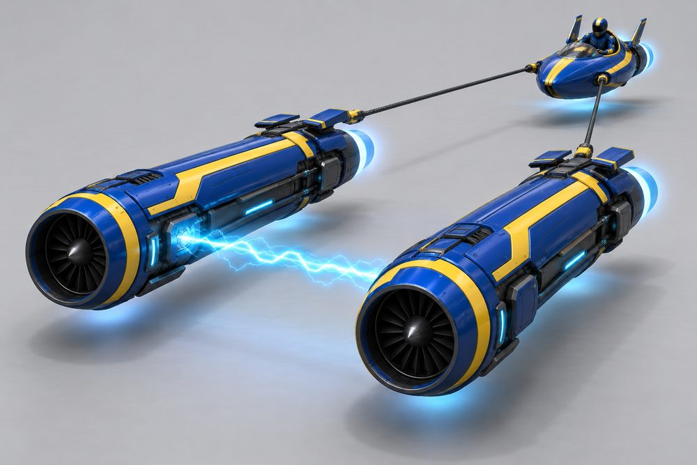
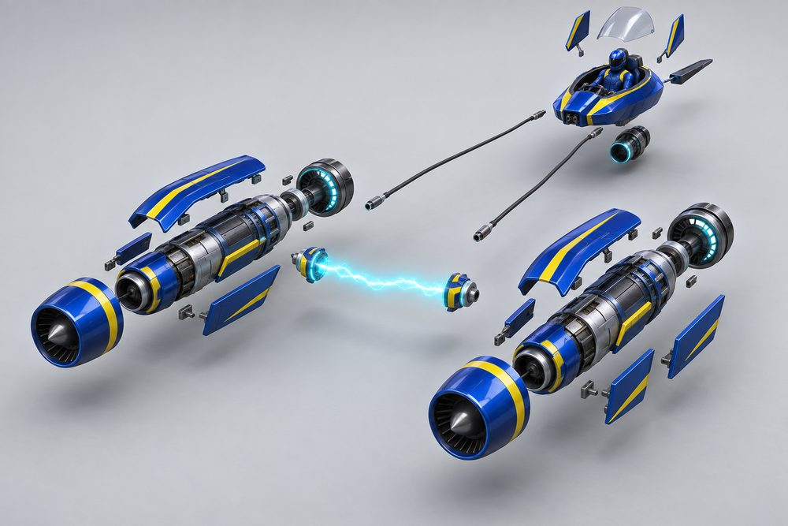
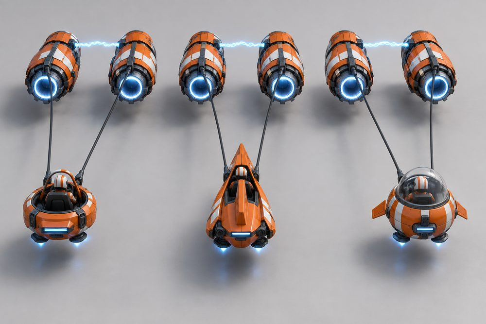
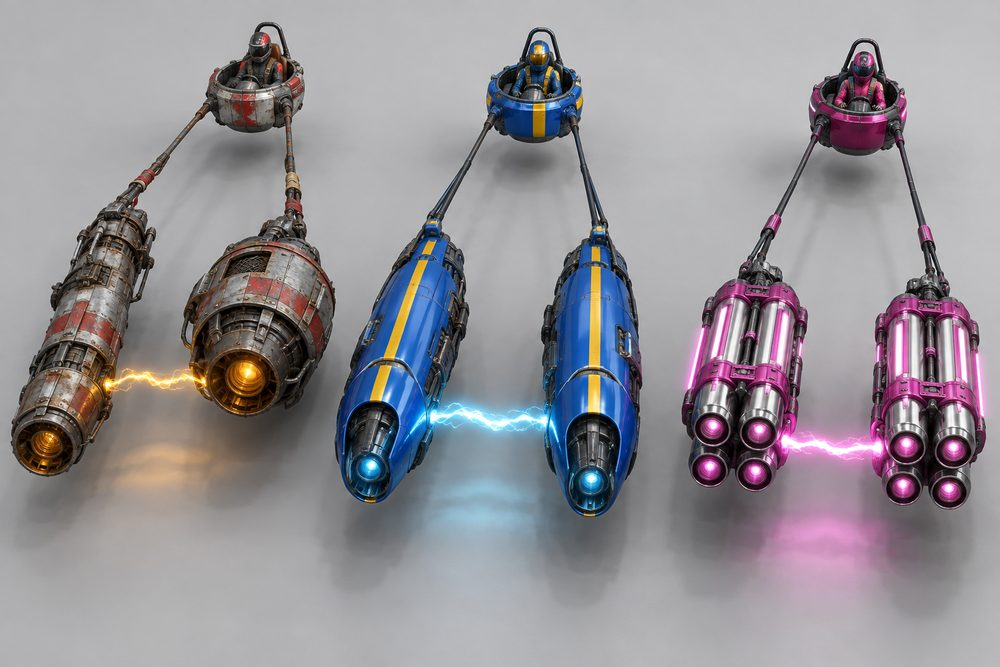
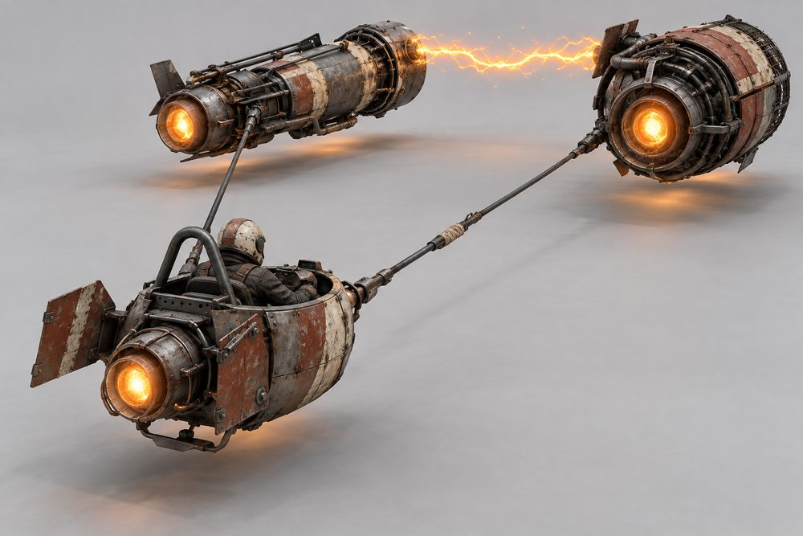
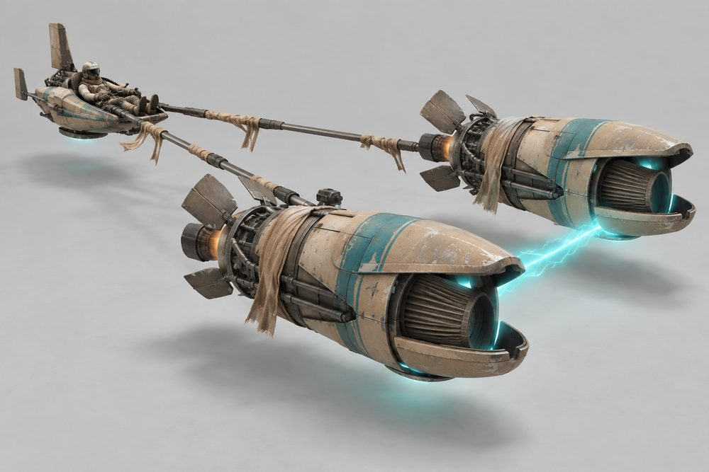
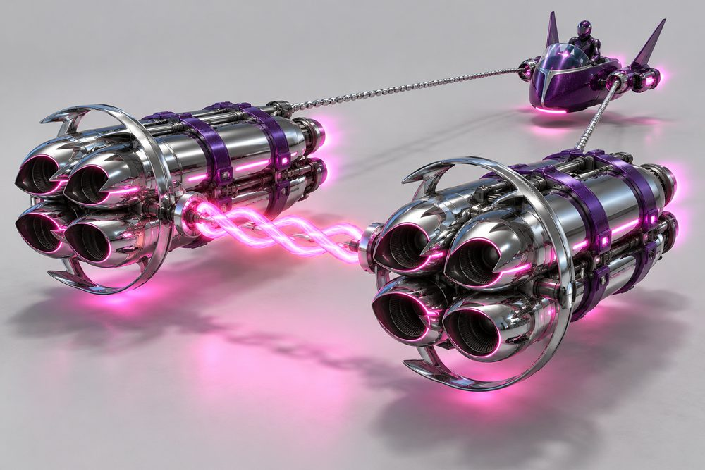
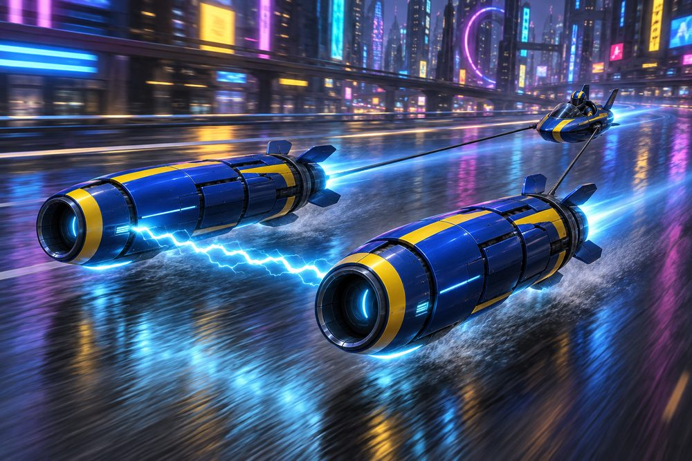

# Tether (frame class `tether`)

Status: design exploration, 2026-10-01. Nothing here is approved or game content.
Brief: [exploration contract](../../../scripts/vehicle_blockouts/CONTRACT.md). Envelopes and seams belong in `tether-frame.md` (blockout agent).

## Pitch

A small open pod towed by two huge engines. The engines fly far ahead and wide apart. A glowing binder arc joins them. Two cables or a rigid boom join them to the pod. Nothing touches the ground. About 18 W x 7 H x 36 L studs.

**Player fantasy:** you are not driving a car, you are holding the reins of two rockets. You sit in the open at the back and watch your engines work ahead of you. It is the fastest and widest thing on the road. Getting it through traffic clean is the brag.

## Culture lines

| Culture | One line |
|---|---|
| Scrapyard | Mismatched salvaged engines, bare metal, rust, hand-painted stripes, patched cables. |
| Works | Matched pristine engines, smooth shrouds, team colours, neat cabling. |
| Desert | Sand-blasted paint, cloth wraps, big pleated intake filters, open petal flaps. |
| Showboat | Chrome, candy paint, neon strips, braided binder. Built to be looked at. |

## Cockpits (pods)

| Name | Culture | Silhouette | Tier |
|---|---|---|---|
| Bucket | Scrapyard | Round open tub with a roll hoop | E |
| Sled | Desert | Low flat sled, pilot lying feet-forward | D |
| Skiff | Works | Narrow boat hull with pointed prow | C |
| Chariot | Showboat | Tall curved front shield, open back | B |
| Capsule | Works | Sleek open-top teardrop with low screen | A |
| Bubble | Showboat | Ball pod with glass dome on ring | S |

The pilot is always visible. The avatar and helmet are part of the look.

## Slots and modules

Slot ids are the canonical ones. Labels are what the player sees. Modules marked + are additions to the contract roster.

| Slot id | Player label | Modules |
|---|---|---|
| `Engine1` | Tow Engines | **Long Barrels**: slim cylinders, five times longer than wide. **Fat Turbines**: short wide barrels, big fan face. **Quad Cluster**: four tubes in a 2x2 bundle with clamp bands. **Split Scoops**: nose split into upper and lower jaws. **Odd Pair** +: one long barrel, one fat turbine. |
| `Engine2` | Pod Thruster | **Single**: one round nozzle under the seat back. **Twin**: two small nozzles side by side. **Skid Jet**: flat slot jet built into a belly skid. |
| `Stabilisers` | Engine Vanes | **Petal Flaps**: four air-brake petals that open like a flower. **Side Vanes**: flat fins on the outer flank. **Canard Rings**: hoop vanes around the engine nose. **Tail Feathers** +: long trailing blades behind the nozzle. |
| `SidePods` | Binder and Cables | **Twin Cable**: two braided lines, thin single arc. **Rigid Boom**: two straight struts in a V, steady arc. **Arc Binder**: thick braided three-strand arc, slim energy leads. **Chain Rig** +: heavy chain links, sparking arc. |
| `Boost` | Afterburners | **Ring**: one wide glowing ring nozzle. **Staged**: two nested nozzles that light in sequence. **Petal Nozzle** +: iris nozzle that opens on boost. |
| `FrontBumper` | Intake Cowls | **Round**: plain lip with spinner. **Shark Mouth**: slanted oval lip with a lower jaw. **Mesh**: flat grille over the fan. **Filter Drum** +: pleated cylinder filter standing proud. |
| `RearBumper` | Pod Tail | **Skid**: curved landing skid. **Rudder**: small vertical blade. **Chute Pack** +: square pack with two straps. |
| `RearSpoiler` | Pod Fins | **Twin**: two short swept fins. **Single Tall**: one tall blade. **Swept Pair** +: long raked fins like horns. |
| `Hood` | Engine Shrouds | **Bare**: no cover, ribs and pipes show. **Armoured**: smooth top panel with stripe. **Cloth Wrap** +: canvas strips with loose ends. **Chrome Sleeve** +: full mirror sleeve. |
| `Roof` | Windshield | **Low**: short flat screen. **Wrap**: curved wraparound screen. **None**: open air, pilot wears goggles. |

Every slot mount still sits at the pod root. Tethers anchor to the pod. Engines anchor to the tethers. Vanes, cowls, shrouds and afterburners anchor to the engines.

## Handling intent versus Piercer

Design intent only. Plus means more than Piercer, minus means less.

| Stat | Bias | Why |
|---|---|---|
| TopSpeed | ++ | The reason to own one. |
| Acceleration | + | Two engines, but they spool. Strong mid-range, not launch. |
| Braking | -- | Long and loose. Petal Flaps are the fix. |
| BoostForce | ++ | Boost should feel like being yanked forward. |
| BoostDuration | - | Short, violent bursts. |
| DriftControl | - | The pod swings wide on its cables. |
| DriftGrip | - | Slides are long and need planning. |
| LateralGrip | -- | Turns are wide arcs, not corners. |
| SteeringResponse | - | Steering is differential thrust, so it lags a beat. |
| HoverStability | - | Pod bobs behind the engines. Rigid Boom recovers some. |
| Downforce | - | Little body to push down. |
| Drag | - | Small frontal area. Lower drag helps top speed. |
| Weight | - | A light pod loses in contact. Do not trade paint. |

Binder choice is the main feel dial. Twin Cable is fastest and loosest. Rigid Boom is steadier and slower to swing. Arc Binder favours boost.

## What makes it fun to own

1. **Odd Pair engines.** A Scrapyard set with two different engines. Later, let the player pick left and right separately (see open points). No other class can be lopsided on purpose.
2. **Binder colour is yours.** The arc uses the Neon channel. Afterburners use thrust colour. A pink arc with green burners is a signature seen from a block away.
3. **Binder style.** The Binder slot also sets the arc look: thin and clean, braided, or crackling. It is the class's "rims".
4. **Start-up ritual.** On spawn and in the garage: left engine lights, right engine lights, the arc strikes across, the cables snap taut, the pod lifts. Three seconds, skippable.
5. **Boost and brake show.** On boost the petals close, the arc thickens and the cables stretch so the pod drops back a stud. On brake the petals flower open.
6. **Thread bonus.** Pass a lamp post, a gap or slow traffic between your engines and under the arc for a "Threaded" style call-out. Only this class has a hole in the middle.
7. **Salvage unlocks.** Scrapyard engines come from world jobs as found parts. Works sets come from race results. Showboat chrome comes from top-speed and photo milestones. A full matched kit earns a kit name, for example "Full Works Rig".
8. **Photo moments.** A "binder shot" preset: low between the engines, looking back through the arc at the pilot. A garage turntable that frames engines in front and pod behind. Night underglow on wet roads.

## Gallery

*01 Hero. Works. Capsule pod, Long Barrels, Twin Cable, Round cowls, Armoured shrouds, Ring afterburners, Twin fins, Wrap screen.*

*02 Exploded. Works. Shows every slot: Tow Engines, Intake Cowls, Engine Shrouds, Engine Vanes, Afterburners, Binder and Cables, Pod Thruster, Pod Tail, Pod Fins, Windshield.*

*03 One kit, three pods. Left Bucket, centre Skiff, right Bubble. Same Fat Turbines, Twin Cable, Ring afterburners and orange and white paint on all three.*

*04 One pod, three kits. Bucket pod each time. Left Scrapyard Odd Pair, centre Works Long Barrels, right Showboat Quad Cluster. Binder colour changes with each.*

*05 Scrapyard, three-quarter rear. Bucket pod, Odd Pair engines, Bare shrouds, patched Twin Cable, Skid Jet thruster, Skid tail, Twin fins.*

*06 Desert. Sled pod, Split Scoops, Filter Drum cowls, Petal Flaps open, Cloth Wrap shrouds, Rigid Boom, Single Tall fin, no windshield.*

*07 Showboat. Chariot pod, Quad Cluster, Shark Mouth cowls, Canard Rings, Chrome Sleeve, Arc Binder (braided), Swept Pair fins.*

*08 Action. The Works hero build at speed in the night city. Cables taut, arc lighting the road.*

Prompts: `output/vehicle-categories-2026-10-01/tether/prompts.json`.

## Risks and open points

- **Width in traffic.** 18 studs is more than two Piercers side by side. Check it against real lane and alley widths before the blockout is trusted. Some routes may be closed to this class.
- **Collision shape.** Three bodies with a gap. Decide whether traffic can pass through the gap, and whether the binder and cables collide or are visual only. A single 18 x 36 box would feel unfair.
- **Physics.** One rigid assembly with a faked pod swing is the safe option. Real cable physics is a High-Risk lane item and probably not worth it.
- **Camera.** The chase camera sits behind the pod and must pull back and up to keep both engines in frame. Engines can hide the road ahead. Test on mobile landscape.
- **Slot mounts far from root.** Engines sit about 25 studs ahead of the pod root. Modules stay in root space, but every Binder module must present the same engine seam, or engines float.
- **Odd Pair per side.** Picking left and right engines separately needs one slot to hold two modules. That changes saves and stats. Ship fixed Odd Pair modules first.
- **Stat slots are far from where the parts are.** `SidePods` and `FrontBumper` are engine-side parts here. Labels cover it, but upgrade UI text should be checked.
- **Passengers and jobs.** The pod has one seat. Taxi jobs do not fit. Parcel jobs could hang cargo under the binder.
- **Garage, dealership and minimap.** Bays, turntable framing and the map icon assume a 17-stud-long car.
- **Originality.** The layout is a known genre shape. Keep engine and pod shapes our own, and review final models for likeness before release.
- **Part count.** Quad Cluster with Canard Rings and Chrome Sleeve is the heaviest build. Keep it under the 160-part limit.
- **Image notes.** In 04 the engine noses glow like nozzles. In 07 the pilot sits rather than half-stands. In 08 distant signs show tiny unreadable glyphs.
